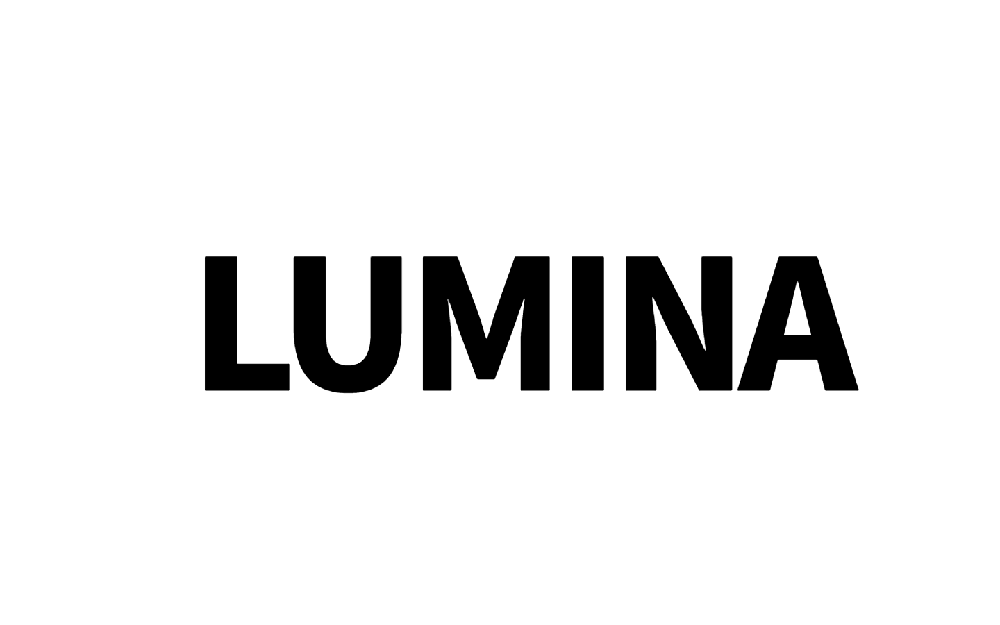

# Lumina - 30% Triggered Cinematic Portal

Lumina is a cinematic portal-style design system characterized by a dramatic scroll-triggered 'zoom-through' interaction. It features a high-contrast aesthetic with a deep charcoal (#050505) entry screen that reveals a vibrant, animated gradient background. Utilizing 'Cabinet Grotesk' for heavy display typography and 'Satoshi' for refined UI, the design emphasizes depth and motion. Ideal for luxury tech, creative agencies, immersive portfolios, and high-end landing pages, the layout uses glassmorphism, misty blur reveals, and a bento-style grid for internal content.



## Prompt

```text
{
  "summary": "An immersive digital portal design that uses scroll-based SVG masking to transition from a minimalist black title screen into a vibrant, glassmorphic hero section with smooth easing and misty blur reveals.",
  "style": {
    "description": "The style is 'Cinematic Minimalist' with a high-energy background. It uses a base of #050505 and white. Typography pairings include Cabinet Grotesk (Extra Bold/900) for punchy impact and Satoshi for clean readability. The primary visual driver is a multi-color gradient animation (#4f46e5, #7c3aed, #f59e0b, #db2777) that flows slowly. Interactions are governed by an ease-in-out cubic timing function for a 'heavy' cinematic feel.",
    "prompt": "Create a design with a background color of #050505. Typography: Titles in Cabinet Grotesk, 900 weight, -0.05em letter spacing; Body in Satoshi, 400-700 weight. Use a vibrant-bg class with a linear-gradient(135deg, #4f46e5, #7c3aed, #f59e0b, #db2777) set at 400% size, animating with a 15s ease-infinite loop. Content reveal must use a combination of opacity (0 to 1), scale (0.95 to 1), and a misty blur (40px to 0px). Buttons should be rounded-full with either solid white or 1px border white/30. Glassmorphism cards require background: white/10, backdrop-filter: blur(40px), and border: white/20."
  },
  "layout_and_structure": {
    "description": "A layered architecture: Layer 1 is the hidden internal page; Layer 2 is the 'Curtain' with an SVG mask; Layer 3 is the top-level progress indicator and intro UI.",
    "prompts": [
      {
        "part": "Portal Curtain",
        "prompt": "A full-screen SVG layer with a black (#050505) rect and a mask. The mask contains a large central text element (size: 15vw) using Cabinet Grotesk 900. On scroll, this text group (id='mask-group') scales from 1x to 220x using a cubic-bezier(0.77, 0, 0.175, 1) easing. The curtain itself should fade out once the scale reaches 85% completion."
      },
      {
        "part": "Intro UI",
        "prompt": "An centered overlay containing a mouse icon with a bounce-y animation (5px travel, 2s duration) and a micro-label (0.4em tracking, 10px font size) saying 'Scroll to unveil'. This UI should fade and translate upwards (-60px) as the user scrolls, disappearing completely by 20% scroll progress."
      },
      {
        "part": "Hero Content Section",
        "prompt": "A two-column grid (md:grid-cols-2) revealed through the portal. Left column: Large display text (text-6xl to 8xl) with leading-0.9 and a secondary line at 40% opacity; a description paragraph; and a flex-row of rounded-full buttons. Right column: A large glassmorphic card (aspect-square) with 32px padding, containing monospaced sub-labels, bold titles, and icon indicators. Add blurred ambient light circles behind the card (#yellow-400/20 and #pink-500/20)."
      },
      {
        "part": "Header and Nav",
        "prompt": "A minimalist top-bar with a circular logo container (white background, indigo icon) and uppercase navigation links at 80% opacity. Tracking should be tight for the logo and standard for links."
      },
      {
        "part": "Progress Indicator",
        "prompt": "A 4px height bar fixed to the bottom of the screen. Background: rgba(255,255,255,0.05). The active bar should be solid white, reflecting the 0% to 100% progress of the portal reveal."
      }
    ]
  },
  "special_ui_components": [
    {
      "component": "Zoom-Through SVG Mask",
      "description": "An SVG-based masking system that allows the background to 'show through' text or shapes.",
      "prompt": "Implement an SVG with <defs><mask id='m'><rect width='100%' height='100%' fill='white'/><g id='zoom-target'><text x='50%' y='50%' text-anchor='middle' fill='black'>LOGO</text></g></mask></defs>. Apply the mask to a black rect. Use JavaScript to scale the 'zoom-target' group exponentially on wheel events."
    },
    {
      "component": "Misty Reveal Card",
      "description": "A glassmorphism card that appears to emerge from a fog.",
      "prompt": "Style a div with background: white/10, backdrop-blur: 3xl, and border: 1px white/20. The reveal state is controlled by a CSS variable or JS property that transitions filter: blur(50px) to blur(0px) and scale(0.92) to scale(1.0) simultaneously."
    }
  ],
  "special_notes": "Must-do: Implement an 'auto-advance' trigger. When the user scrolls past 30% progress, the transition should automatically proceed to 100% over 3-4 seconds. Must-do: Use 'pointer-events-none' on the hidden content until the portal transition is 90% complete to prevent accidental clicks. Must-not: Use standard linear easing; the transition must feel weighted and cinematic using cubic functions."
}
```

**▶ Try it live → [https://superdesign.dev/library/lumina-30percent-triggered-cinematic-portal](https://superdesign.dev/library/lumina-30percent-triggered-cinematic-portal?utm_source=github&utm_medium=prompt-repo&utm_campaign=prompt-library)**

**Use it in your coding agent:** install the [Superdesign skill](https://github.com/superdesigndev/superdesign-skill), then:

```bash
superdesign get-prompts --slugs "lumina-30percent-triggered-cinematic-portal" --json
```

*158 copies · 2,298 tries · *
