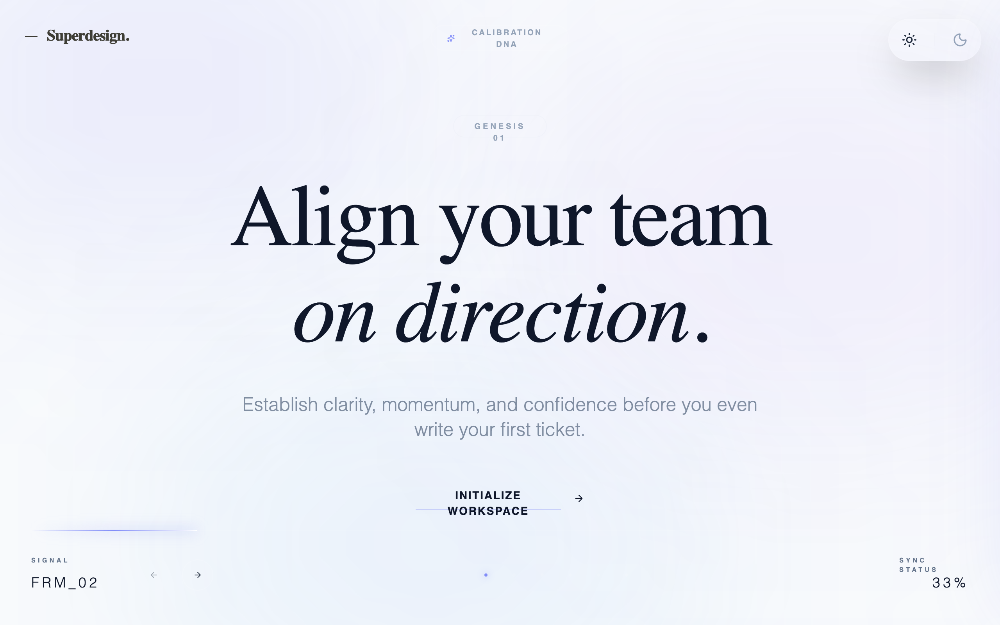

# Luminous Ethereal Glassmorphism Onboarding

Luminous Ethereal is a deep-space glassmorphism design system characterized by frosted translucent panels, slow-moving animated mesh gradients, and ultra-thin line iconography. It uses a sophisticated pairing of Manrope sans-serif and Libre Baskerville editorial serif to create an atmosphere of high-end precision and cosmic calm. This style is exceptionally suited for AI-driven platforms, fintech, high-tech SaaS onboarding, and creative agency portfolios that require a futuristic yet premium feel. Key elements include 'backlight' glow effects, 'laser' thread progress indicators, and interactive cards that respond with subtle chromatic shifts.



## Prompt

```text
{
  "summary": "A futuristic 'Luminous Ethereal' design system featuring deep indigo and violet mesh gradients, heavy backdrop blurs (24px), and ultra-thin typography. The UI focuses on horizontal momentum, using a laser-trail progress system and frosted glass panels with interactive backlight glows to guide users through complex workflows.",
  "style": {
    "description": "The style essence is 'Deep-Space Glassmorphism.' It utilizes a background of animated indigo (#4F46E5) and violet (#A78BFA) blurs (140px) at low opacities. Typography combines Manrope (weights 200-700) for UI elements and Libre Baskerville for editorial headings. Colors revolve around #0B0C10 (Dark Surface), #FFFFFF (Light Surface), and #818CF8 (Indigo Accent). Micro-interactions use cubic-bezier(0.4, 0, 0.2, 1) for fluid motion, while shadows are replaced by soft glows (box-shadow: 0 0 100px -20px rgba(99, 102, 241, 0.15)).",
    "prompt": "Create a design system with a 'Luminous Ethereal' aesthetic. Background: Animated mesh gradient using #4F46E5, #A78BFA, and #60A5FA at 10-20% opacity with 140px blur, moving via a floating animation (translate 20px, -20px over 10s). Surface: Glassmorphism panels with 'backdrop-filter: blur(24px)', 'background: rgba(15, 23, 42, 0.4)', and 'border: 1px solid rgba(255, 255, 255, 0.05)'. Typography: Headings in 'Libre Baskerville' (light weight, tracking-tight), UI labels in 'Manrope' (uppercase, 0.3em tracking, font-size 10px). Accents: Use 'indigo-400' (#818CF8) for highlights. Icons: Ultra-thin 0.5px stroke weight. Buttons: Ghost style with bottom-border hover effects or high-glow solid fills for primary actions."
  },
  "layout_and_structure": {
    "description": "A horizontal-scrolling 'Gallery' layout using snap-mandatory behavior (snap-x). The structure consists of a fixed global navigation (Theme toggles, Logo, Summary Panel trigger) and a persistent 'Horizon' footer for progress tracking.",
    "prompts": [
      {
        "part": "Navigation & Global Headers",
        "prompt": "Top-left: Minimal logo 'Superdesign.' in serif font with a horizontal line prefix. Top-center: 'Calibration DNA' pill-shaped toggle button (glass-panel, 10px uppercase bold). Top-right: Theme switcher using sun/moon icons in a rounded glass container. All elements fixed-position, z-index 50."
      },
      {
        "part": "Hero Entry Section",
        "prompt": "Full-screen centered layout. Elements: Small 'Genesis 01' pill at top. Heading: 7rem Libre Baskerville text 'Align your team on direction' with italic emphasis. Subtext: 2xl Manrope light. Call-to-action: 'Initialize Workspace' with a persistent underline and right-arrow icon that translates x+8px on hover."
      },
      {
        "part": "Interactive Selection Panels",
        "prompt": "Grid layout (1x2 or 1x3). Cards use 'glass-panel' style. On hover: border color shifts to #6366F1/50 and a 'backlight-glow' pseudo-element appears (linear-gradient(45deg, indigo-300 to transparent)). Content includes a title, hidden description that expands on active state, and a thin-line icon (compass/layers)."
      },
      {
        "part": "Calibration Dial Section",
        "prompt": "Centered glass container. Includes a custom range slider. Track: 2px height, #FFFFFF10 background. Thumb: 24px circle, indigo-400 with a 15px glow shadow. Below the slider, four text labels ('Observe', 'Assist', etc.) with 0.4em tracking that highlight when the thumb is near."
      },
      {
        "part": "Horizon Progress Footer",
        "prompt": "Fixed bottom bar. Top edge: 2px track with a 'Laser Thread' (width dynamic, background: linear-gradient to right, transparent to indigo-400 to white, drop-shadow: 0 0 8px #818CF8). Layout: Left side has 'FRM_XX' coordinate; Center has navigation dots; Right side has percentage completion."
      }
    ]
  },
  "special_ui_components": [
    {
      "component": "Echo Synthesis Panel",
      "description": "A sliding side drawer providing a summary of user selections.",
      "prompt": "Width: 450px. Right-aligned drawer. Style: Extreme blur glass (40px). Animation: translate-x-full to 0 via 700ms ease-in-out. Content: 'Operational Synthesis' header with a rotating refresh icon. Data points use large serif text (3xl) with an 'opacity: 20%' empty state that transforms to indigo-400 text when data is selected."
    },
    {
      "component": "Laser Thread Progress",
      "description": "A linear progress indicator that mimics a beam of light.",
      "prompt": "Height: 2px. Width: dynamic. Gradient: transparent at start, indigo-400 middle, white tip. Glow: filter: drop-shadow(0 0 8px rgba(129, 140, 248, 1)). Transition: 700ms ease-out. Located as a divider between the main content and footer."
    }
  ]
}
```

**▶ Try it live → [https://superdesign.dev/library/luminous-ethereal-glassmorphism-onboarding](https://superdesign.dev/library/luminous-ethereal-glassmorphism-onboarding?utm_source=github&utm_medium=prompt-repo&utm_campaign=prompt-library)**

**Use it in your coding agent:** install the [Superdesign skill](https://github.com/superdesigndev/superdesign-skill), then:

```bash
superdesign get-prompts --slugs "luminous-ethereal-glassmorphism-onboarding" --json
```

*12 copies · 2,316 tries · Onboarding · Finance & Crypto · onboarding, fintech, glassmorphic, sass*
