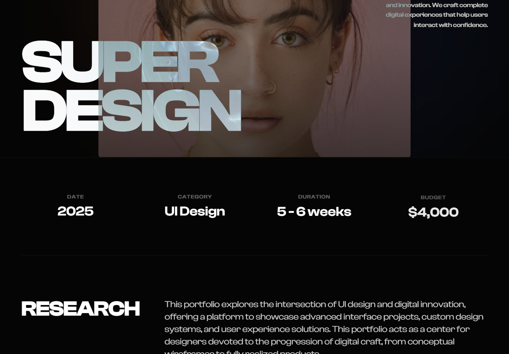

# Midnight Editorial Style

A high-contrast, midnight-themed editorial design system optimized for premium portfolios, fintech SaaS, and luxury brand storytelling. Characterized by oversized 'Clash Display' typography, a deep #050505 background, and sophisticated mix-blend-mode interactions. Features smooth reveal animations, subtle atmospheric glows, and a brutalist yet refined layout that prioritizes whitespace and typographic hierarchy.



## Prompt

```text
{
  "summary": "The 'Midnight Editorial' style blends brutalist typography with high-end fashion aesthetics. It utilizes a dark, monochromatic base punctuated by soft, blurred light leaks and sharp, uppercase display fonts to create a sense of 'digital luxury' and cognitive clarity.",
  "style": {
    "description": "The style is built on a high-contrast foundation: pure whites (#FFFFFF) against a near-black (#050505) canvas. Typography uses 'Clash Display' for bold, impactful headings and 'Inter' for clean, readable body text. Interactions are defined by 'reveal-up' entry animations and 'difference' blend modes for navigation elements that adapt to background changes.",
    "prompt": "### Midnight Editorial Visual Identity\n\n**Color Palette:**\n- Primary Background: `#050505` (Deep Black)\n- Secondary Background (Footer): `#0a0a0a` (Vantablack)\n- Foreground/Text: `#FFFFFF` (Pure White)\n- Muted Accents: `rgba(255, 255, 255, 0.4)` (Low-opacity white for metadata/labels)\n- Accent Glows: `orange-500/10` and `blue-900/10` with `blur(120px)` and `mix-blend-screen` for atmospheric depth.\n\n**Typography Specs:**\n- **Display Headings:** 'Clash Display', Sans-serif. Weights: 700 (Bold), 500 (Medium). Hero size: `15vw`. Section headings: `text-4xl` to `text-6xl`. Letter-spacing: `tracking-tighter` (-0.05em).\n- **Body Text:** 'Inter', Sans-serif. Weights: 300 (Light), 400 (Regular). Main narrative: `text-xl` or `text-2xl`, leading: `1.6`. \n- **Labels/Metadata:** 'Inter', Uppercase, Weight: 700, size: `10px`, spacing: `tracking-[0.2em]`.\n\n**Borders & Shapes:**\n- Border Color: `rgba(255, 255, 255, 0.05)` (Ultra-subtle thin lines).\n- Corner Radius: `2px` (Sharp, near-square aesthetic).\n\n**Animation & Motion:**\n- **Reveal-Up:** `cubic-bezier(0.22, 1, 0.36, 1)`, 1s duration, `translateY(40px)` to `0`, opacity `0` to `1`.\n- **Hover Scale:** Image containers should scale by `5-10%` over 2 seconds with an `ease-out` transition."
  },
  "layout_and_structure": {
    "description": "An editorial-style vertical scroll layout using a 12-column grid. Sections are strictly separated by thin horizontal borders. It features a hero section with massive typography overlapping a central image, followed by statistical grids and asymmetrical content blocks.",
    "prompts": [
      {
        "part": "Navigation",
        "prompt": "Fixed top navigation, transparent background. Height: ~100px. Content: Left-aligned bold brand mark (font-display), right-aligned uppercase links (spacing 10, text-sm). Use `mix-blend-mode: difference` so the white text turns black over white images. Contact button: Border-only pill shape (`border-white/20`), transitions to solid white background on hover."
      },
      {
        "part": "Hero Section",
        "prompt": "Full-height (`100vh`) flex container. Background: Subtle blurred light leaks in corners. Centerpiece: A large aspect-ratio image (e.g., 4:5 or 4:3) with `reveal-up` animation. Overlapping the bottom left of the image, place massive uppercase typography (`text-[15vw]`) in 'Clash Display'. Right side: A small floating text block (width 64) for a 1-2 sentence description, low opacity."
      },
      {
        "part": "Stats Grid",
        "prompt": "A horizontal band with `border-t border-white/5`. Grid: 4 columns on desktop, 2 on mobile. Each cell contains an uppercase small label (`10px`, muted) and a medium display value (`text-2xl`). Stagger the appearance of these cells using 0.1s delay increments."
      },
      {
        "part": "Content Block (Editorial)",
        "prompt": "Grid layout: 12 columns. Column 1-3: Large sticky heading (01, 02, etc.) in 'Clash Display'. Column 5-12: Narrative text area. Large font size (`text-xl+`), light weight. Use wide gutters (at least 80px). Include 'Explore' links with a bottom border and an arrow icon that translates on hover."
      },
      {
        "part": "Gallery & Visuals",
        "prompt": "Full-width parallax image sections with `aspect-[21/9]`. For smaller galleries, use side-by-side 4:3 containers with black overlays that vanish on hover. Caption text should appear at the bottom-left of images on hover only."
      },
      {
        "part": "Footer",
        "prompt": "Deep black background (`#0a0a0a`). Center-aligned. Primary CTA: Massive email address or brand name with a thin underline. Hover state: Fade opacity and increase underline thickness. Bottom: Social links in small uppercase metadata style. Background: One final massive ghost brand mark (opacity 0.1) partially cut off at the bottom."
      }
    ]
  },
  "special_ui_components": [
    {
      "component": "Mix-Blend Navigation",
      "description": "Navigation text that dynamically changes color based on what is behind it.",
      "prompt": "Implement navigation using `position: fixed` and `z-index: 50`. Apply `mix-blend-mode: difference` to the container. All text within should be `#FFFFFF`. When the nav passes over white images or sections, the text will visually invert to black automatically."
    },
    {
      "component": "Atmospheric Light Leaks",
      "description": "Subtle, non-distracting background glows to prevent a flat appearance.",
      "prompt": "Use absolute-positioned divs with `border-radius: 9999px`, `filter: blur(120px)`, and low opacity (5-10%). Colors: `#f97316` (Orange) and `#1e3a8a` (Blue). Place them in opposite corners of the hero and footer sections to create depth."
    }
  ],
  "special_notes": "MUST maintain the high-contrast ratio (White on Black). MUST use high-quality, high-contrast photography (grayscale or muted colors work best). MUST NOT use rounded corners greater than 4px; stay sharp and editorial. MUST NOT overcrowd the 'narrative' blocks; keep line-lengths comfortable (approx 60-80 chars)."
}
```

**▶ Try it live → [https://superdesign.dev/library/midnight-editorial-style](https://superdesign.dev/library/midnight-editorial-style)**

*559 copies · 1,934 tries · tags: style, landing page, page*
