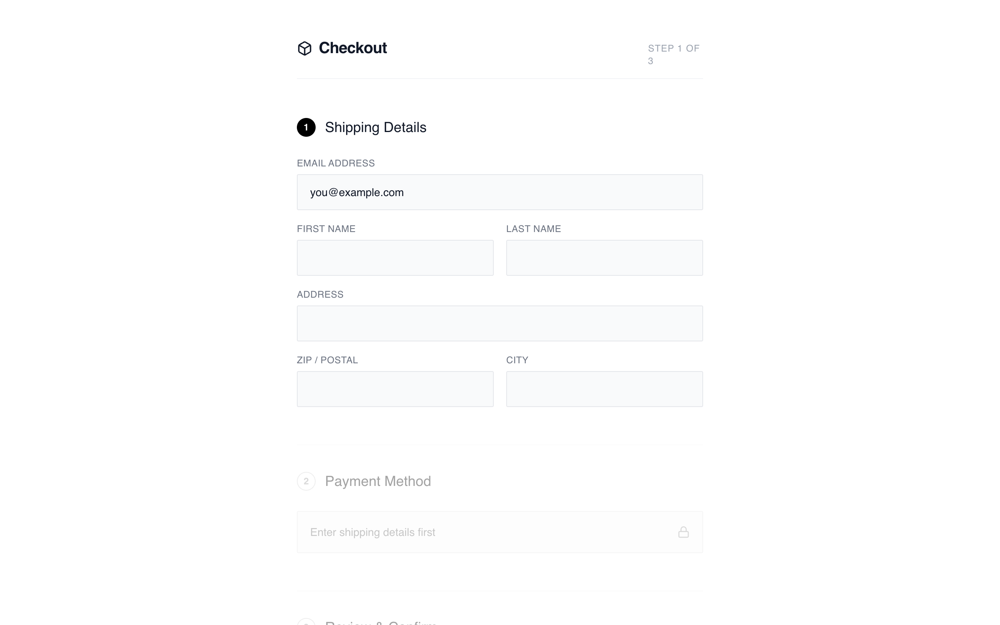

# Minimalist Checkout

A distraction-free, single-column checkout that removes visual competition and guides users step-by-step. Order summary is minimized or collapsible to keep attention on form completion.

Best suited for
Mobile-first stores, impulse purchases, low-priced items, audiences with short attention spans.



## Prompt

```text
{
  "summary": "A distraction-free, linear checkout experience focused on visual clarity and functional simplicity. It utilizes a centered 520px column, a step-based progression indicated by numbered badges, and a collapsible summary to keep the user focused on data entry.",
  "style": {
    "description": "Monochrome and minimalist aesthetic. Typography uses 'General Sans' for headings and 'Satoshi' for body text, creating a clean, modern look. The palette is restricted to #000000 (Black), #FFFFFF (White), and various shades of neutral gray for borders and backgrounds. Inputs are understated with #F9FAFB backgrounds and 1px borders. Animations are subtle, including smooth opacity shifts and a 0.99 scale transform on button clicks.",
    "prompt": "Create a design with a minimalist monochrome palette: Background #FFFFFF, Inputs #F9FAFB, Text #111827, and Accents #000000. Use 'General Sans' for headings (weights 500, 600) and 'Satoshi' for body. Headers should be 20px with tracking-tight. Form labels must be 12px, uppercase, tracking-wide, using #6B7280. Inputs should have a 1px border (#E5E7EB), a 2px border-radius, and 12px 16px padding. Active states use #000000 borders and rings. Inactive sections are styled with 40% opacity and grayscale filters. Buttons are solid black (#000000) with white text, 16px vertical padding, and a 0.99 scale transform on click."
  },
  "layout_and_structure": {
    "description": "Centered single-column layout (max-width 520px) with a vertical flow. The page starts with a clean header, followed by stacked sections for shipping, payment, and review. Inactive steps are visually dimmed to focus user attention. A collapsible order summary is positioned above the final CTA.",
    "prompts": [
      {
        "part": "Header",
        "prompt": "Create a header with a bottom border (#F3F4F6). Include a 20px font-weight 600 title with a 24px icon on the left. On the right, place a 'Step X of X' indicator in 10px uppercase tracking-wider text (#9CA3AF)."
      },
      {
        "part": "Step Sections",
        "prompt": "Each section starts with an 18px medium-weight title. Include a numbered circular badge (24x24px). If active, the badge is black with white text; if inactive, it is white with a gray border. Inactive sections must have 'opacity: 0.4', 'filter: grayscale(1)', and 'pointer-events: none'."
      },
      {
        "part": "Shipping Form",
        "prompt": "Two-column grid layout for name fields and ZIP/City, while email and address occupy full width. Gap between grid items is 16px. Labels are positioned above inputs with a 6px margin."
      },
      {
        "part": "Collapsible Order Summary",
        "prompt": "A 'details' element styling. The summary row has a top/bottom border (#F3F4F6), 14px font size, and a chevron icon that rotates 180 degrees when open. The expanded content shows 64x64px product thumbnails with light gray backgrounds (#F3F4F6), item titles in 14px medium, and sub-details in 12px gray text."
      },
      {
        "part": "Footer CTA",
        "prompt": "A full-width primary button (#000000) with white text and an arrow icon. Below the button, include a small 10px lock icon and 'Secured' text centered in #9CA3AF."
      }
    ]
  },
  "special_ui_components": [
    {
      "component": "Numbered Progress Badge",
      "description": "A 24px circular indicator used for step navigation.",
      "prompt": "Design a 24x24px circle. For active steps: background #000000, text #FFFFFF, font-size 12px, font-weight bold, flexbox centering. For inactive: background transparent, border 1px solid #D1D5DB, text #9CA3AF."
    },
    {
      "component": "Minimalist Input Field",
      "description": "Ultra-clean form input with top-aligned labels.",
      "prompt": "Label: 12px, uppercase, color #6B7280, tracking 0.05em. Input: background #F9FAFB, border 1px solid #E5E7EB, border-radius 2px, padding 12px 16px, font-size 14px. Focus state: border-color #000000, ring 1px #000000."
    }
  ],
  "special_notes": "Do not use vibrant colors; stick strictly to the monochrome scale. Ensure all interactive elements have a transition of at least 200ms for border-color and opacity changes. The layout must remain centered and narrow even on wide screens to maintain the focused 'wireframe' feel."
}
```

**▶ Try it live → [https://superdesign.dev/library/minimalist-checkout](https://superdesign.dev/library/minimalist-checkout?utm_source=github&utm_medium=prompt-repo&utm_campaign=prompt-library)**

**Use it in your coding agent:** install the [Superdesign skill](https://github.com/superdesigndev/superdesign-skill), then:

```bash
superdesign get-prompts --slugs "minimalist-checkout" --json
```

*1 copies · 2,370 tries · E-commerce · E-commerce & Retail · shopify, ecommerce, layout, checkout*
