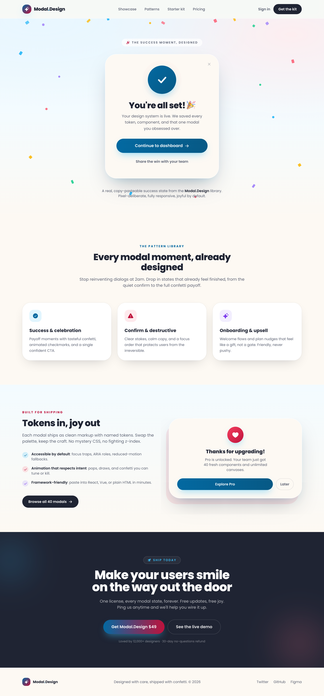

# Modal Design · success-celebration (pastel) — legibility fixed

A joyful pastel success-celebration modal as the live centerpiece of a light SaaS page: a cream rounded-5xl dialog with a pulsing-ring animated checkmark badge, a gradient 'Continue to dashboard' CTA and a ghost secondary, floating over a full-bleed confetti layer on a cream-to-sky radial field. Below it a 3-up pattern-library card band, a starter-kit split with a stacked mini upgrade modal, a dark-ink CTA band and a cream footer. Pastel sky + coral are decorative-only; all colored text uses darkened >=4.5:1 tokens (#0369a1 / #be123c) and every gradient button runs deep stops behind white — legibility fixed. Poppins throughout.



## Prompt

```text
{"summary": "A full success-celebration product page rendered in a soft pastel sky-and-coral light theme on a cream-to-sky radial field (#eaf6fd -> #f3fbff -> #fdf9f3): a sticky glass nav, a celebration hero where a rounded success modal sits as the live centerpiece over a full-bleed confetti layer, then a 3-up 'pattern library' band of white cards, a split 'starter kit' section with a benefits list + a stacked mini upgrade-modal preview, a full-bleed dark-ink CTA band, and a cream footer. The modal itself is the product: a rounded-5xl cream card with a layered dialog shadow, an animated pulsing-ring checkmark badge (sky-deep gradient + drawn-on tick + pop), a celebratory headline + body, a gradient primary CTA and a ghost secondary. Built on a deliberate light-mode contrast system (Poppins throughout) where decorative pastels (sky #38bdf8, coral #fb7185) are used ONLY for fills/confetti while all sky/coral TEXT is a darker, >=4.5:1 token (skyText/coralText #0369a1 / #be123c) and every gradient CTA uses deep stops behind white — the 'legibility fixed' angle. Depth comes from soft layered shadows, glass blur, and animated confetti rather than borders.", "style": {"description": "A joyful, premium pastel light aesthetic that reads like a polished SaaS celebration screen: a cream-and-sky radial field warmed by a coral wash, soft generous rounding (up to 2.75rem), and three layered shadow tokens (dialog/soft/pill) that lift every card off the page without a single hard border. The brand 'color' is a sky-blue + coral pastel pairing, but the system is split into a decorative layer and a text/CTA layer so it stays legible on light: pastel sky #38bdf8 and coral #fb7185 appear only as confetti, badge fills and tint backgrounds, while any sky- or coral-colored TEXT or icon on a light field uses a darkened token (skyText/coralText = #0369a1 / #be123c, >=4.5:1) and every gradient button runs deep-to-deep stops (skyDeep #0369a1 -> skyDeep2 #075985, or skyDeep -> coralDeep #be123c) so white text always clears contrast. Ink #1f2433 is the heading/text color and slate #5b6172 the muted body. Motion is the joy: a checkmark badge that pops + draws its tick, two staggered pulsing rings, falling confetti and a gentle all-over floating scatter. Poppins (400-800) carries everything, extra-bold for headlines.", "prompt": "Use a soft pastel light design system. Body base #eaf6fd; the hero is a .field gradient = radial-gradient(120% 80% at 12% 0%, #e9f7ff 0%, transparent 55%) + radial-gradient(120% 90% at 90% 8%, #fdeef0 0%, transparent 50%) + linear-gradient(180deg, #eaf6fd 0%, #f3fbff 45%, #fdf9f3 100%). Define a SPLIT color system so pastels stay legible on light: decorative-only fills cream #fdf9f3, sky #38bdf8, coral #fb7185; legible TEXT/icon tokens skyText #0369a1 and coralText #be123c (>=4.5:1 on light); CTA gradient stops skyDeep #0369a1, skyDeep2 #075985, coralDeep #be123c (always behind white text); plus ink #1f2433 (headings/text) and slate #5b6172 (muted body). NEVER use raw #38bdf8 or #fb7185 as text on a light field — use the darker token. One Google Font: Poppins (400/500/600/700/800) as font-sans, extra-bold (800) for headlines with tracking-tight. Custom radii borderRadius 4xl 2rem / 5xl 2.75rem; cards are rounded-4xl/5xl, buttons and chips rounded-full. Three shadow tokens: shadow-dialog '0 40px 90px -30px rgba(31,36,51,0.35), 0 18px 40px -24px rgba(56,189,248,0.35)' for the modal, shadow-soft '0 18px 50px -24px rgba(31,36,51,0.30)' for cards/nav, shadow-pill '0 14px 30px -10px rgba(56,189,248,0.55)' for the badge and primary CTAs. A .glass utility = background rgba(253,249,243,0.72) + backdrop-filter saturate(160%) blur(14px) for the sticky nav. Primary buttons are a left-to-right gradient bg-gradient-to-r from-skyDeep to-skyDeep2 (or from-skyDeep to-coralDeep on the dark band) with white text and shadow-pill, lifting -translate-y-0.5 on hover; the dark CTA band button is the only place coral enters a gradient. Icons are Phosphor via Iconify (ph:sparkle-fill, ph:confetti-fill, ph:x-bold, ph:arrow-right-bold, ph:check-circle-fill, ph:warning-fill, ph:check-bold, ph:heart-fill, ph:rocket-launch-fill), colored with the legible text tokens, never the pastel fills. Motion tokens: @keyframes pop (scale 0.4->1.08->1 + fade) on .badge-pop (0.7s cubic-bezier(0.22,1,0.36,1)); @keyframes draw (stroke-dashoffset 60->0) on .check-path (0.55s 0.35s ease-out) to draw the tick; @keyframes ring (scale 0.8->1.55, opacity 0.55->0) on two .ring-pulse halos (2.6s infinite, second .delay 1.3s); @keyframes fall for .confetti span (translateY(var(--drop)) + rotate(var(--spin)), per-span --dur/--del); @keyframes floaty for a gentle .float all-over scatter (translateY -12px + slight rotate)."}, "layout_and_structure": {"description": "A single scrolling product page on a centered max-w-6xl mx-auto px-6 container, anchored by a sticky top-0 z-50 glass nav, then five regions: (1) a min-h-[86vh] celebration hero (the .field gradient) with a full-bleed two-layer confetti background — a falling-confetti layer + a gently floating all-over scatter — behind a centered column holding an uppercase eyebrow chip, the success MODAL as the centerpiece, and a caption line; (2) a full-bleed cream 'pattern library' band with a centered intro + a 3-up grid of white pattern cards; (3) a sky-tinted 'starter kit' split (lg:grid-cols-2): a left benefits column (eyebrow + H2 + lead + a 3-item check list + a dark CTA) and a right stacked mini upgrade-modal preview offset by a coral tint card behind it; (4) a full-bleed dark-ink CTA band with two blurred color glows, an eyebrow chip, a big two-line headline, lead, two CTAs and a trust line; (5) a cream footer with a brand lockup, a copyright line and three text links. Everything reflows to a single column on mobile: the modal stays max-w-md and centered, the pattern grid goes 3 -> 1, the kit split stacks (the coral offset card hides below lg), the CTA buttons stack, the nav hides its center links + 'Sign in' below md/sm while the 'Get the kit' button persists, and the footer goes column.", "prompts": [{"part": "Sticky glass nav", "prompt": "A `<header class=\"sticky top-0 z-50\">` wrapping a .glass bar (rgba(253,249,243,0.72) + backdrop blur(14px)) with a `border-b border-white/60`, holding a `mx-auto flex max-w-6xl items-center justify-between px-6 py-4` row. Left: a brand lockup = a 36px (h-9 w-9) rounded-2xl tile with a bg-gradient-to-br from-skyDeep to-coralDeep + shadow-pill holding a white ph:sparkle-fill, beside an 18px font-extrabold 'Modal' + a skyText '.' + 'Design' wordmark. Center (hidden below md): four 14px font-medium slate links (Showcase, Patterns, Starter kit, Pricing) that hover to ink. Right: a ghost 'Sign in' slate link (hidden below sm) and the primary CTA — a rounded-full bg-ink px-5 py-2.5 'Get the kit' button in white with shadow-soft that lifts on hover."}, {"part": "Celebration hero + confetti layers", "prompt": "A `section id=showcase class=\"field relative overflow-hidden\"` (the cream-to-sky radial gradient). TWO full-bleed pointer-events-none aria-hidden layers behind the content: (a) a `.confetti absolute inset-0` layer of ~15 absolutely-positioned `<span>` shards (8-16px, mix of rounded-2px rectangles and rounded-full dots in #38bdf8/#fb7185/#fbbf24/#34d399/#a78bfa) each animated by @keyframes fall with per-span inline --drop (120-420px), --spin, --dur (5-8s) and --del; (b) a gently `.float`-ing all-over scatter of ~12 spans (same palette) animated by @keyframes floaty with per-span --r rotation and --fd duration. Foreground: a `relative mx-auto flex min-h-[86vh] max-w-6xl flex-col items-center justify-center px-6 py-20` column with, top, an uppercase tracking-[0.18em] eyebrow chip (rounded-full border-white/70 bg-white/70 px-4 py-1.5 shadow-soft, a coralText ph:confetti-fill + 'The success moment, designed'), then the MODAL (next part), then a `mt-10 max-w-lg text-center text-sm text-slate` caption naming the 'Modal.Design' library in ink."}, {"part": "The success modal (the centerpiece)", "prompt": "A `relative w-full max-w-md rounded-5xl bg-cream p-9 sm:p-11 text-center shadow-dialog ring-1 ring-white` dialog card. Top-right: an absolute right-5 top-5 close affordance — a 36px grid rounded-full text-slate/45 button (ph:x-bold) that hovers to bg-black/5 + text-ink. Centerpiece badge: a `relative mx-auto mb-7 grid h-28 w-28 place-items-center` block with two absolute `.ring-pulse` halos (bg-sky/25 and a delayed bg-coral/20, both rounded-full, the @keyframes ring expand-and-fade), over a `.badge-pop` 112px rounded-full bg-gradient-to-br from-skyDeep to-skyDeep2 + shadow-pill holding a 56px SVG whose `.check-path` (M14 27 L23 36 L39 18, white, 5.5 stroke, round caps) draws itself in. Below: an extra-bold ink H1 'You're all set! 🎉' (text-3xl sm:text-[2.1rem], tracking-tight), a `mt-3 max-w-xs text-[15px] leading-relaxed text-slate` body, a full-width gradient primary CTA (group rounded-full bg-gradient-to-r from-skyDeep to-skyDeep2 py-4 text-base font-semibold text-white shadow-pill, 'Continue to dashboard' + a ph:arrow-right-bold that nudges on hover), and a ghost secondary button (mt-3 w-full rounded-full py-3 text-sm font-semibold text-slate 'Share the win with your team')."}, {"part": "Pattern library band (3-up cards)", "prompt": "A `section id=patterns class=\"bg-cream py-24\"`, inner `mx-auto max-w-6xl px-6`. A centered `max-w-2xl` intro: a 12px uppercase tracking-[0.2em] skyText eyebrow 'The pattern library', an extra-bold ink H2 'Every modal moment, already designed' (text-3xl sm:text-4xl tracking-tight), and a slate lead. Then a `mt-14 grid items-stretch gap-6 sm:grid-cols-2 lg:grid-cols-3` of three white pattern cards: each a `group rounded-4xl bg-white p-7 shadow-soft ring-1 ring-black/5` that hovers -translate-y-1.5 + shadow-dialog, holding a 48px rounded-2xl tint icon tile (bg-sky/15 text-skyText ph:check-circle-fill / bg-coral/15 text-coralText ph:warning-fill / bg-[#a78bfa]/15 text-[#7c3aed] ph:sparkle-fill, scaling 110% on group-hover), a font-bold title (Success & celebration / Confirm & destructive / Onboarding & upsell) and a slate body."}, {"part": "Starter-kit split + mini upgrade modal", "prompt": "A `section id=kit class=\"bg-gradient-to-b from-[#f3fbff] to-cream py-24\"`, inner `mx-auto grid max-w-6xl items-center gap-14 px-6 lg:grid-cols-2`. LEFT column: a coralText uppercase tracking-[0.2em] 'Built for shipping' eyebrow, an extra-bold ink H2 'Tokens in, joy out', a slate lead, a `mt-7 space-y-4` check list of three items (each a 24px rounded-full tint dot — bg-sky/20 text-skyText / bg-coral/20 text-coralText / bg-[#a78bfa]/20 text-[#7c3aed] — holding a ph:check-bold, beside a slate line with an ink-bold lead phrase: Accessible by default / Animation that respects intent / Framework-friendly), and a dark CTA (rounded-full bg-ink px-6 py-3.5 text-white shadow-soft 'Browse all 40 modals' + ph:arrow-right-bold). RIGHT column: a `relative` stack — an absolute `-left-3 top-6 hidden lg:block h-full w-full rounded-5xl bg-coral/15` offset card behind, and in front a `relative rounded-5xl bg-cream p-8 text-center shadow-dialog ring-1 ring-white` mini upgrade modal: a 64px rounded-full bg-gradient-to-br from-[#f43f5e] to-coralDeep + shadow-pill ph:heart-fill badge, an extra-bold 'Thanks for upgrading!', a slate body, and a `mt-6 flex gap-3` row of a flex-1 gradient 'Explore Pro' (from-skyDeep to-skyDeep2 shadow-pill) + a bordered ghost 'Later' (border-slate/20 text-slate)."}, {"part": "Dark-ink CTA band", "prompt": "A `section id=start class=\"relative overflow-hidden bg-ink py-24 text-center text-white\"`. Two pointer-events-none aria-hidden blurred glows: an `-left-10 top-8 h-40 w-40 rounded-full bg-sky/20 blur-3xl` and a `right-0 bottom-0 h-48 w-48 rounded-full bg-coral/20 blur-3xl`. Foreground `relative mx-auto max-w-2xl px-6`: an eyebrow chip on dark (rounded-full border-white/15 bg-white/5 px-4 py-1.5 uppercase tracking-[0.18em] text-sky, ph:rocket-launch-fill + 'Ship today'), an extra-bold two-line H2 'Make your users smile / on the way out the door' (text-4xl sm:text-5xl, a hidden-sm:block <br>), a white/70 lead, a `mt-9 flex flex-col sm:flex-row gap-3` of two CTAs (a w-full sm:w-auto gradient 'Get Modal.Design $49' = bg-gradient-to-r from-skyDeep to-coralDeep + shadow-pill, and a bordered ghost 'See the live demo' = border-white/20 hover:bg-white/10), and a white/45 trust line 'Loved by 12,000+ designers · 30-day no-questions refund'. NOTE this dark band is the only place the pastel sky/coral may appear as text/fills, since contrast on ink is fine."}, {"part": "Cream footer", "prompt": "A `footer class=\"bg-cream py-10\"`, inner `mx-auto flex max-w-6xl flex-col items-center justify-between gap-4 px-6 text-sm text-slate sm:flex-row`. Left: a brand lockup = a 32px rounded-xl bg-gradient-to-br from-skyDeep to-coralDeep tile (white ph:sparkle-fill) beside a font-bold ink 'Modal' + skyText '.' + 'Design'. Center: a copyright line 'Designed with care, shipped with confetti. © 2026'. Right: three text links (Twitter, GitHub, Figma) that hover to ink."}]}, "special_ui_components": [{"name": "Animated success badge (pulsing-ring checkmark)", "prompt": "The signature payoff component: a `relative mx-auto grid h-28 w-28 place-items-center` block layering (1) two absolute rounded-full halos `.ring-pulse` (bg-sky/25 and a `.delay` bg-coral/20) driven by @keyframes ring (scale 0.8 -> 1.55, opacity 0.55 -> 0, 2.6s ease-out infinite, the second delayed 1.3s) so they breathe outward; over (2) a `.badge-pop` 112px rounded-full bg-gradient-to-br from-skyDeep #0369a1 to-skyDeep2 #075985 with shadow-pill, entering via @keyframes pop (scale 0.4 -> 1.08 -> 1 + fade, 0.7s cubic-bezier(0.22,1,0.36,1)); holding (3) a 56px SVG tick whose `.check-path` (d='M14 27 L23 36 L39 18', stroke white 5.5, round caps) uses stroke-dasharray/offset 60 + @keyframes draw (offset -> 0, 0.55s with a 0.35s delay) so the checkmark draws itself in after the badge pops. Reuse as any 'done / saved / success' confirmation mark."}, {"name": "Full-bleed confetti celebration layer", "prompt": "Two stacked pointer-events-none aria-hidden absolute inset-0 overflow-hidden layers that turn the hero into a party without touching the modal: (a) a `.confetti` layer of ~15 absolutely-positioned `<span>` shards (8-16px, a mix of border-radius:2px rectangles and 50% dots, fills #38bdf8 / #fb7185 / #fbbf24 / #34d399 / #a78bfa) each carrying inline CSS vars --drop (fall distance 120-420px), --spin (rotate amount), --dur (5-8s) and --del, animated by @keyframes fall (translateY(var(--drop)) + rotate(var(--spin)) + fade in/out, ease-in infinite); (b) a gently `.float`-ing all-over scatter of ~12 spans (same palette/shapes) animated by @keyframes floaty (translateY -12px + slight rotation, per-span --r and --fd 6-7.6s) so confetti is present even before/after the fall. Keep it behind the dialog and decorative-only."}, {"name": "Gradient primary CTA pill (legible on light)", "prompt": "A full-width or auto rounded-full primary button used in the modal, kit and dark band: `bg-gradient-to-r from-skyDeep to-skyDeep2` (deep #0369a1 -> #075985) on light fields, or `from-skyDeep to-coralDeep` on the dark band, ALWAYS with white font-semibold text and shadow-pill, lifting -translate-y-0.5 on hover; an optional trailing ph:arrow-right-bold nudges +0.5 on group-hover. The deep gradient stops (never the pastel #38bdf8/#fb7185) guarantee >=4.5:1 white-on-button contrast — this is the core 'legibility fixed' rule of the whole design."}, {"name": "White pattern card (lift on hover)", "prompt": "A reusable showcase card: a `group rounded-4xl bg-white p-7 shadow-soft ring-1 ring-black/5` that on hover does -translate-y-1.5 + shadow-dialog, leading with a 48px rounded-2xl tint icon tile (a pastel/15 fill + the matching LEGIBLE text token for the icon: bg-sky/15 text-skyText, bg-coral/15 text-coralText, or bg-[#a78bfa]/15 text-[#7c3aed]) that scales 110% on group-hover, over a font-bold ink title and a slate body. Pattern: pastel tint background, darkened token foreground."}, {"name": "Mini upgrade-modal preview (stacked card)", "prompt": "A smaller sibling of the hero dialog used to preview a second modal state: a `relative` stack where an absolute `-left-3 top-6 hidden lg:block h-full w-full rounded-5xl bg-coral/15` card sits behind a `relative rounded-5xl bg-cream p-8 text-center shadow-dialog ring-1 ring-white` front card, so it reads as a stack of dialogs. The front holds a 64px rounded-full bg-gradient-to-br from-[#f43f5e] to-coralDeep + shadow-pill ph:heart-fill badge, an extra-bold heading, a slate body, and a two-button row (a flex-1 gradient 'Explore Pro' + a border-slate/20 ghost 'Later')."}], "special_notes": "One Google Font: Poppins (weights 400/500/600/700/800) as font-sans for everything; extra-bold (800) headlines with tracking-tight. Icons are Phosphor via Iconify, colored only with the LEGIBLE text tokens or white, never the raw pastels (ph:sparkle-fill, ph:confetti-fill, ph:x-bold, ph:arrow-right-bold, ph:check-circle-fill, ph:warning-fill, ph:check-bold, ph:heart-fill, ph:rocket-launch-fill). THE LEGIBILITY RULE (the whole point of this variant): the pastel sky #38bdf8 and coral #fb7185 are DECORATIVE-ONLY (confetti, badge/tint fills, blurred glows); any sky/coral-colored TEXT or icon on a light field must use the darkened token skyText/coralText = #0369a1 / #be123c (>=4.5:1), and every gradient CTA runs deep stops behind white (skyDeep #0369a1 / skyDeep2 #075985 / coralDeep #be123c) — raw pastels never carry white text. The only place pastels appear as text/fills is the dark-ink band, where contrast is fine. Exact tokens — cream #fdf9f3, sky #38bdf8 (decor), skyText/skyDeep #0369a1, skyDeep2 #075985, coral #fb7185 (decor), coralText/coralDeep #be123c, ink #1f2433 (headings/text), slate #5b6172 (muted body); plus confetti accents amber #fbbf24, emerald #34d399, violet #a78bfa (with #7c3aed / #f43f5e used as the violet/rose text+gradient tokens). Body base #eaf6fd; the hero .field = radial(120% 80% at 12% 0%, #e9f7ff) + radial(120% 90% at 90% 8%, #fdeef0) + linear(180deg, #eaf6fd -> #f3fbff -> #fdf9f3). Custom radii 4xl 2rem / 5xl 2.75rem (cards rounded-4xl/5xl, buttons rounded-full). Three shadow tokens: dialog '0 40px 90px -30px rgba(31,36,51,0.35), 0 18px 40px -24px rgba(56,189,248,0.35)', soft '0 18px 50px -24px rgba(31,36,51,0.30)', pill '0 14px 30px -10px rgba(56,189,248,0.55)'. A .glass nav utility = bg rgba(253,249,243,0.72) + backdrop saturate(160%) blur(14px). Motion: @keyframes pop on .badge-pop, @keyframes draw on .check-path, @keyframes ring on two .ring-pulse halos (one .delay), @keyframes fall on .confetti spans, @keyframes floaty on a gentle .float scatter. The page is a sticky top-0 z-50 glass nav over five max-w-6xl regions (celebration hero, pattern band, kit split, dark CTA band, footer) and reflows to a single column on mobile: the modal stays max-w-md centered, the pattern grid goes 3 -> 1, the kit split stacks and the coral offset card hides below lg, the CTA buttons stack, the nav center links + 'Sign in' hide below md/sm while 'Get the kit' persists, the H2 line break shows only sm+, and the footer goes column."}
```

**▶ Try it live → [https://superdesign.dev/library/modal-design-success-celebration-pastel-legibility-fixed](https://superdesign.dev/library/modal-design-success-celebration-pastel-legibility-fixed?utm_source=github&utm_medium=prompt-repo&utm_campaign=prompt-library)**

**Use it in your coding agent:** install the [Superdesign skill](https://github.com/superdesigndev/superdesign-skill), then:

```bash
superdesign get-prompts --slugs "modal-design-success-celebration-pastel-legibility-fixed" --json
```

*0 copies · 2,221 tries · Onboarding · General · modal, success, celebration, confetti*
