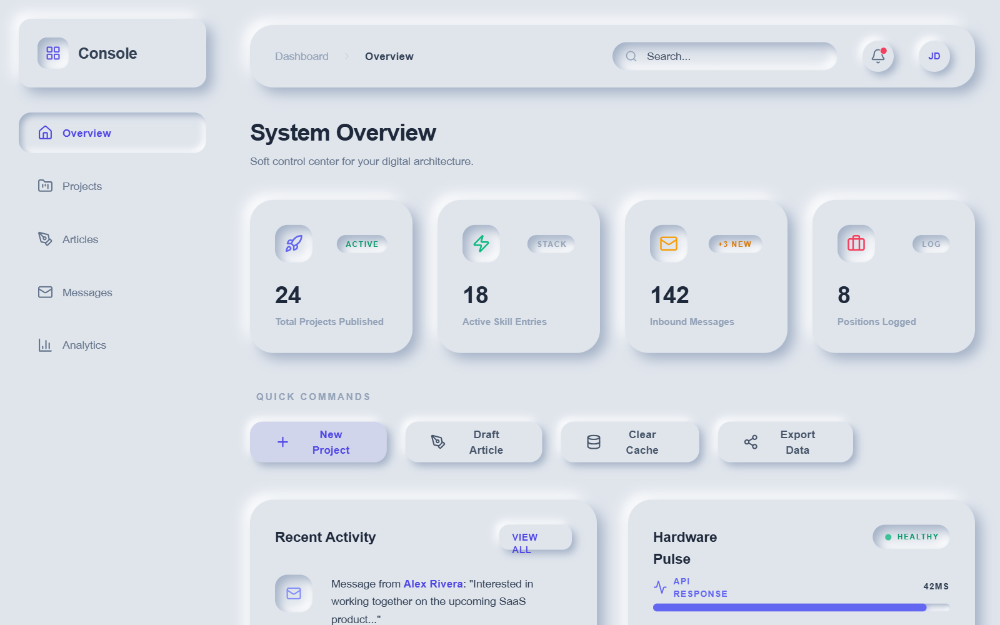

# Modern Neumorphic Dashboard — Dynamic Animations

A high-fidelity modern Neumorphic (Soft UI) dashboard featuring a dual-mode color palette (Light/Dark). The aesthetic is defined by subtle drop shadows and inner glows that create a 3D tactile feel, paired with vibrant indigo and emerald accents. It is optimized for SaaS, fintech, and administrative interfaces. Key features include animated stat counters, floating icons, shimmer-effect progress bars, and staggered entrance animations. The typography uses a mix of Satoshi and General Sans for a clean, professional editorial look.



## Prompt

```text
{
  "summary": "A sophisticated neumorphic administrative dashboard with a focus on tactile interactivity and dynamic, playful animations. It features a responsive layout with a persistent sidebar, a glass-like header, and a grid of interactive stat cards followed by detailed activity and status modules.",
  "style": {
    "description": "The style is 'Neumorphism 2.0' — using light and shadow to create depth. It uses Satoshi for body text and General Sans for headings. Colors are centered around a soft grey base (#e0e5ec) for light mode and a deep navy (#1e2030) for dark mode. Animations are pervasive, using cubic-bezier(0.34, 1.56, 0.64, 1) for a bouncy, premium feel.",
    "prompt": "Create a Neumorphic design system with the following specifications:\n\n### Colors\n- **Light Mode Base:** #e0e5ec (Background & Surface)\n- **Light Mode Shadows:** Light #ffffff, Shadow #a3b1c6\n- **Dark Mode Base:** #1e2030 (Background)\n- **Dark Mode Shadows:** Light #2a2d42, Shadow #14152a\n- **Accents:** Indigo (#6366f1), Emerald (#10b981), Rose (#f43f5e), Violet (#8b5cf6)\n\n### Neumorphic Effects\n- **Flat Surface:** box-shadow: 6px 6px 12px [shadow_var], -6px -6px 12px [light_var].\n- **Inset Surface:** box-shadow: inset 4px 4px 8px [shadow_var], inset -4px -4px 8px [light_var].\n- **Interactive Buttons:** Same as Flat but transitions to Inset on click. Hover: translateY(-2px) scale(1.04).\n\n### Typography\n- **Headings:** 'General Sans', semi-bold (600), tight tracking (-0.02em).\n- **Body:** 'Satoshi', medium (500), font-size: 14px.\n- **Mono:** 'JetBrains Mono' or similar for status logs, font-size: 11px.\n\n### Animations\n- **Timing:** Use cubic-bezier(0.34, 1.56, 0.64, 1) for all transitions.\n- **Stat Counters:** Numbers count up from 0 to target over 1.8s with a final scale pulse.\n- **Floating:** Icons should bob vertically (±5px) over 3s ease-in-out.\n- **Progress Bars:** Include an animated shimmer gradient (waveShimmer) and a constant glow (filter: drop-shadow)."
  },
  "layout_and_structure": {
    "description": "The layout uses a 72w sidebar on desktop, a fixed-height sticky header (72px), and a multi-column responsive grid for main content.",
    "prompts": [
      {
        "part": "Sidebar",
        "prompt": "Design a 288px (w-72) sidebar. Includes a top-aligned logo in a nm-flat card. Navigation links use a 'sidebar-link' style: transparent background by default, transitioning to nm-inset with indigo text (#6366f1) when active. On hover, links should slide 4px right with a subtle background gradient expansion."
      },
      {
        "part": "Header",
        "prompt": "Sticky header with 72px height and nm-flat styling. Contains breadcrumbs on the left, a rounded nm-inset search bar (288px wide) in the center-right, and a circular theme toggle and notification button. All buttons must be nm-button type (40px x 40px rounded-full)."
      },
      {
        "part": "Stat Cards Grid",
        "prompt": "A grid of 4 cards. Each card is nm-flat with nm-flat-hover effect. Features: Top-left floating icon in an nm-inset square; top-right status pill (inset); large bold counter (3xl); trending indicator (+X%) at the bottom. Staggered entrance animation with 100ms delay per card."
      },
      {
        "part": "Main Content Grid",
        "prompt": "Two-column grid for 'Recent Activity' and 'Hardware Pulse'. Activity items are separated by a gradient border (transparent-to-slate-300-to-transparent) and slide in from the left with a bounce. Hardware Pulse uses nm-track progress bars with animated gradient fills."
      },
      {
        "part": "Terminal Component",
        "prompt": "An nm-inset console at the bottom of the status column. Features colored window controls (rose, amber, emerald), monospaced text, and a cursor blink animation. Text lines should reveal sequentially with a 300ms stagger."
      }
    ]
  },
  "special_ui_components": [
    {
      "component": "Animated Progress Fills",
      "description": "Progress bars with moving gradient stripes and pulsing glow.",
      "prompt": "Implement a 'progress-track' using nm-inset. The 'progress-fill' should be a linear-gradient (e.g., #6366f1 to #a78bfa) with an overlay ::after element running a 'waveShimmer' animation (background-position shift). The fill should have a drop-shadow matching its primary color to simulate a glow."
    },
    {
      "component": "Ripple-Effect Button",
      "description": "A button that generates an expanding radial wave on click.",
      "prompt": "On click, inject a span with .ripple-effect class. Use a radial-gradient(circle, rgba(99,102,241,0.3) 0%, transparent 70%). Animate scale from 0 to 4 and opacity from 0.5 to 0 over 700ms using cubic-bezier(0.4, 0, 0.2, 1)."
    },
    {
      "component": "Floating Stat Icons",
      "description": "Continuous vertical bobbing for stat card visuals.",
      "prompt": "Apply a 'float-icon' class to card icons. Animation: translateY(0) to translateY(-5px) over 3s using cubic-bezier(0.45, 0.05, 0.55, 0.95) with infinite iteration and alternate direction."
    },
    {
      "component": "New Component",
      "description": "",
      "prompt": ""
    }
  ]
}
```

**▶ Try it live → [https://superdesign.dev/library/modern-neumorphic-dashboard-dynamic-animations](https://superdesign.dev/library/modern-neumorphic-dashboard-dynamic-animations?utm_source=github&utm_medium=prompt-repo&utm_campaign=prompt-library)**

**Use it in your coding agent:** install the [Superdesign skill](https://github.com/superdesigndev/superdesign-skill), then:

```bash
superdesign get-prompts --slugs "modern-neumorphic-dashboard-dynamic-animations" --json
```

*97 copies · 2,334 tries · *
