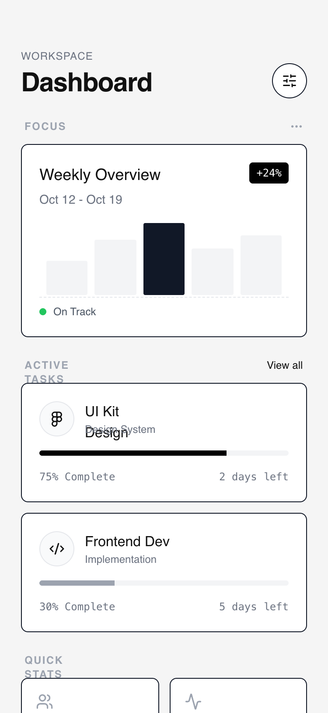

# Modular Card Dashboard

A high-contrast wireframe dashboard style featuring a modular card-based system. Characterized by a 'neubrutalism-lite' aesthetic with heavy black borders, hard shadows on hover, and a strict grayscale palette. It utilizes clean editorial typography (Switzer) and a minimalist approach to data visualization. Perfect for SaaS management tools, fintech mobile apps, developer dashboards, and productivity interfaces where structural clarity and modularity are prioritized over colorful decoration.



## Prompt

```text
{
  "summary": "A minimalist, grayscale mobile dashboard design featuring a flexible, modular layout with high-contrast card components, sticky headers with backdrop blurs, and interactive neubrutalist hover effects.",
  "style": {
    "description": "The style is built on a grayscale wireframe foundation. It uses thin but distinct #111111 borders, a light gray background (#F5F5F5) for contrast against white cards, and bold neubrutalist interactions. Typography relies on the Switzer sans-serif family for an editorial, modern feel. Micro-interactions include vertical translations and solid hard-shadow reveals that suggest tactile depth.",
    "prompt": "Apply a minimalist wireframe aesthetic. Background color: #F5F5F5. Card background: #FFFFFF. Primary text and borders: #111111. Secondary text: #6B7280. Borders: 1px solid #111111. Typography: Use 'Switzer' font family; Headings at font-weight 600, labels at font-weight 500 with letter-spacing 0.05em. Interactive states: When a card is hovered or focused, it should translate -2px on the Y-axis and gain a hard shadow: box-shadow: 4px 4px 0px 0px rgba(0,0,0,1). Use a 200ms ease-in-out transition for all state changes. Spacing: 24px (6 units) standard padding for sections, 20px (5 units) internal card padding."
  },
  "layout_and_structure": {
    "description": "A vertical mobile-first layout (max 375px) designed for infinite scroll. It follows a hierarchy of priority: Header -> Hero Card -> Repeating Stack -> Dense Grid -> Action Footer.",
    "prompts": [
      {
        "part": "Sticky Header",
        "prompt": "Create a sticky header with a background of #F5F5F5 at 90% opacity and a 4px backdrop-blur. Padding: top 56px, sides 24px, bottom 24px. Elements: a vertical stack of a tiny uppercase 'Workspace' label (#6B7280) and a 30px bold 'Dashboard' title. On the right, place a 40x40px circular button with a 1px #111111 border, containing a centered settings icon."
      },
      {
        "part": "Primary Hero Card",
        "prompt": "A 220px tall featured card. Structure: Header with title and date, a data visualization area, and a status footer. Data Viz: Five vertical bars of varying heights (40% to 85%), using #111111 for the active bar and #F3F4F6 for inactive bars. Footer: A 1px dashed top border separating a tiny status indicator with a 8px green dot."
      },
      {
        "part": "Secondary Stacked Cards",
        "prompt": "A list of cards with 12px vertical spacing between them. Each card contains: an icon in a 40x40px circular gray-bordered container, text metadata (title/subtitle), a thin 6px progress bar track (#F3F4F6) with a solid fill (#111111), and a bottom row of monospaced secondary text. Include a hidden-by-default grip icon (lucide:grip-vertical) that appears on hover at the right side."
      },
      {
        "part": "Tertiary Stats Grid",
        "prompt": "A 2-column grid with 12px gaps. Each card is 1:1 aspect ratio or slightly taller. Elements: a 20px icon at the top left, followed by a large 24px bold number and a 12px gray label at the bottom. No hard shadows here; use a subtle #F9FAFB background change on hover."
      },
      {
        "part": "Modular Action Footer",
        "prompt": "A full-width button (padding 16px) with a 2px dashed border (#D1D5DB). Text: 'Add Widget' in 14px medium weight with a leading plus icon. On hover, the border and text transition to #111111."
      }
    ]
  },
  "special_ui_components": [
    {
      "component": "Neubrutalist Interactive Card",
      "description": "A white container with a sharp black border and a solid black shadow that appears on interaction.",
      "prompt": "Component: div; Styles: bg-white, border [1px solid #111], rounded-lg [8px], transition [all 0.2s ease-in-out]; Hover: transform [translateY(-2px)], box-shadow [4px 4px 0px 0px #000000]; Active: transform [translateY(0px)], box-shadow [0px 0px 0px 0px #000000]; Cursor: grab; padding: 20px;"
    },
    {
      "component": "Wireframe Bar Chart",
      "description": "A minimalist data representation using simple geometric blocks.",
      "prompt": "A flex container with 'items-end' and 'justify-between'. Child elements: Divs with width: 100% and variable heights. Inactive state: bg-[#F3F4F6]. Active/Highlighted state: bg-[#111111]. Rounded corners: 2px (sm)."
    }
  ],
  "special_notes": "Must maintain strict grayscale; do not use accent colors except for specific status indicators (e.g., green for 'On Track'). Ensure all cards have the exact same 1px #111111 border to maintain the wireframe look. Use 'no-scrollbar' utility to keep the mobile UI clean. The hard-shadow on hover must not have a blur-radius (it should be a solid offset color)."
}
```

**▶ Try it live → [https://superdesign.dev/library/modular-card-dashboard](https://superdesign.dev/library/modular-card-dashboard?utm_source=github&utm_medium=prompt-repo&utm_campaign=prompt-library)**

**Use it in your coding agent:** install the [Superdesign skill](https://github.com/superdesigndev/superdesign-skill), then:

```bash
superdesign get-prompts --slugs "modular-card-dashboard" --json
```

*9 copies · 1,970 tries · Dashboards · General · mobile app, home, layout*
