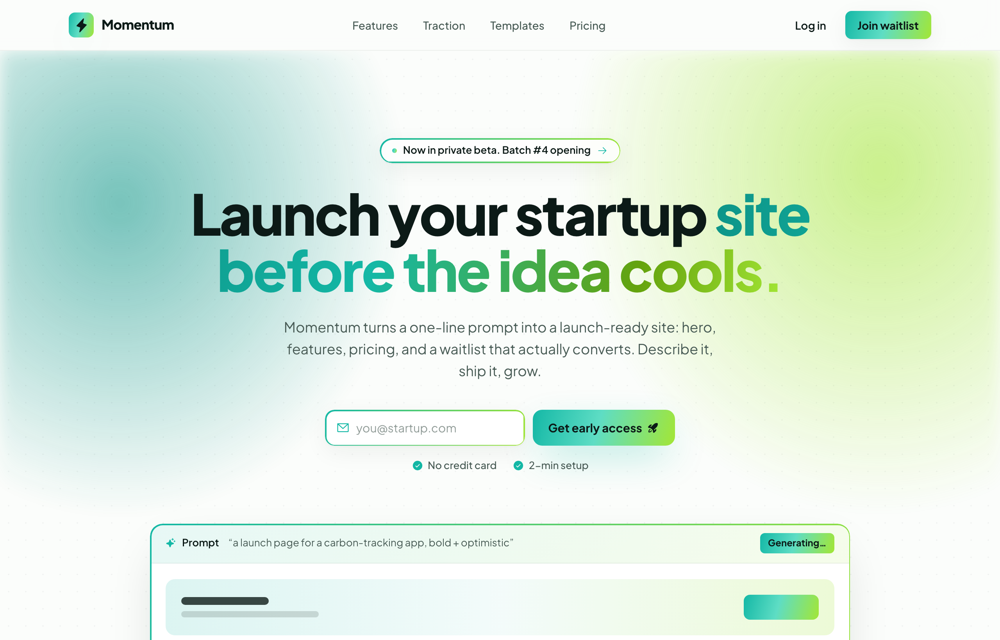

# Momentum — Ship Your Startup Launch Before the Idea Cools

Bold optimistic startup launch / waitlist landing page: teal-to-lime gradient brand on warm-white paper, sticky blurred nav, gradient-aura hero with an inline email-capture form and a frameless prompt-to-page preview, feature cards, a gradient traction band, launch-template cards, a dark ink CTA, and a 4-column footer.



## Prompt

```text
{"summary": "A bold, optimistic startup launch / waitlist landing page. Bright teal-to-lime gradient brand on a near-white paper canvas with near-black warm ink text, a sticky blurred nav, a full-bleed gradient-aura hero with a centered waitlist email-capture form and a frameless 'prompt-to-page' product-preview band, a feature-card grid (one wide white card + one solid gradient accent card, then a 3-up row), a full-bleed gradient traction/metrics band, a 3-up launch-template card strip, a dark ink CTA block with a second waitlist form, and a 4-column footer. Heavy use of a gradient text clip, a 1.5px gradient ring/border on cards and inputs, a radial dot-grid texture, and soft layered shadows including a teal 'glow'.", "style": {"description": "Bold optimistic SaaS gradient. Bright teal #14b8a6 to lime #a3e635 brand gradient (extended with deep teal #0d9488, mint #5eddc4, olive-green #65a30d) used for fills, text-clip headlines, 1.5px gradient rings, and a radial hero aura. Base is a soft warm-white 'paper' #fbfdfb; text is near-black warm ink #0c1a17 with muted slate #475a54 for secondary copy. Plus Jakarta Sans throughout (400-800, plus one italic 500), extrabold tight-tracked headlines. Generous whitespace, rounded geometry (rounded-lg/xl/2xl/3xl), soft layered shadows plus a signature teal glow shadow, a faint radial dot-grid texture, and frameless product mock bands rather than browser/device chrome.", "prompt": "Design in a bold, optimistic SaaS-gradient style. Palette: warm-white paper base #fbfdfb, near-black warm ink text #0c1a17, muted slate secondary text #475a54, brand teal #14b8a6 and lime #a3e635 with supporting deep-teal #0d9488, mint #5eddc4 and olive-green #65a30d. Build the brand gradient as linear-gradient(105deg, #14b8a6 0%, #5eddc4 46%, #a3e635 100%) for fills (call it grad-fill), and linear-gradient(100deg, #0d9488, #14b8a6 38%, #65a30d 78%, #a3e635 100%) clipped to text for headline accents (grad-text). Use Plus Jakarta Sans for everything (weights 400/500/600/700/800, one italic 500); headlines are extrabold with tight tracking (-0.02em to -0.03em) and leading ~1.04-1.1. Geometry is rounded (rounded-lg 0.5rem through rounded-3xl 1.5rem) and pill badges. Apply a 1.5px gradient ring/border on cards, inputs and badges via a ::before mask trick (linear-gradient(120deg,#14b8a6,#a3e635), padding 1.5px, mask-composite exclude) called ring-grad. Shadows: soft = 0 1px 2px rgba(12,26,23,.04), 0 8px 30px rgba(12,26,23,.06); lift = 0 24px 60px -18px rgba(12,26,23,.18); glow = 0 18px 50px -12px rgba(20,184,166,.45). Texture: a radial dot-grid (radial-gradient(rgba(12,26,23,.07) 1px, transparent 1px) at 22px) and a blurred multi-stop radial 'hero aura' of teal+lime+mint behind the hero and CTA. Hairline borders use rgba(12,26,23,.06). Mood: energetic, founder-friendly, fast-shipping, clean. Never dark, neon-cyberpunk, or corporate-stiff."}, "layout_and_structure": {"description": "Single-column long-form landing page in a centered max-w-6xl (72rem) container with px-6 gutters. Top-down order: sticky blurred header nav; full-bleed gradient-aura hero (centered eyebrow pill, gradient-clip headline, sub-paragraph, inline waitlist email form, reassurance row, frameless product-preview band, and a logo trust row); a features section (one wide white card + one solid gradient accent card, then a 3-up white-card row); a full-bleed gradient traction band (left copy + right 2x2/4-up stat cards); a templates strip (header row + 3-up template preview cards); a dark ink CTA block (rounded-3xl, gradient aura, second waitlist form); and a 4-column footer with a bottom bar. Responsive: nav links hide below md; the hero form stacks below sm; feature/template/stat grids collapse from 3/4 to 2 to 1; gradient auras are clipped by section overflow-hidden so they never cause horizontal scroll.", "prompts": [{"part": "Sticky nav", "prompt": "A sticky top header (z-50) with a translucent paper background (bg-paper/80) and backdrop blur-xl plus a hairline bottom border. Inside a max-w-6xl row, height 64px: left = a gradient-fill rounded-lg badge (h-8 w-8) holding a ph:lightning-fill icon in ink with a teal glow shadow, next to the 'Momentum' wordmark (extrabold, tight tracking); center = horizontal nav links (Features, Traction, Templates, Pricing) in slate that darken to ink on hover, hidden below md; right = a ghost 'Log in' text link (hidden below sm) and a gradient-fill rounded-lg 'Join waitlist' pill button in ink with a soft shadow that turns to a teal glow on hover."}, {"part": "Hero (gradient launch)", "prompt": "A full-bleed, centered hero with overflow-hidden and a hairline bottom border. Layer three backgrounds absolutely: a blurred multi-stop 'hero aura' (radial teal at top-left, lime at top-right, mint at bottom-center) at ~90% opacity, a radial dot-grid at 60% opacity, and a bottom fade gradient from paper up to transparent. Centered content in max-w-6xl, padding pt-20/pt-28 and pb-24: a gradient-ring rounded-full status pill on white/70 ('Now in private beta. Batch #4 opening') with a tiny gradient dot and a teal ph:arrow-right; a huge extrabold headline (text 44px up to 72px on md, leading 1.04, tracking -0.03em) reading 'Launch your startup' then a gradient-text clip span 'site before the idea cools.'; a slate sub-paragraph (max-w-xl); then an inline waitlist form (max-w-md, stacks on mobile, row on sm): a gradient-ring white input pill with a teal ph:envelope-simple icon and placeholder 'you@startup.com', plus a gradient-fill 'Get early access' button in ink with a ph:rocket-launch-fill icon and teal glow; below it a centered reassurance row with two teal ph:check-circle-fill items ('No credit card', '2-min setup'). Below the form, a frameless product-preview band (see component) and a trust logo row."}, {"part": "Product-preview band", "prompt": "A frameless (no browser/device chrome) product mock centered under the hero form, max-w-4xl, rounded-2xl white card with a gradient ring and a deep 'lift' shadow. Top strip on a soft brand-tint gradient with a hairline bottom border: a 'Prompt' label with a teal ph:sparkle-fill icon, a truncated example prompt in slate ('a launch page for a carbon-tracking app, bold + optimistic'), and a gradient-fill 'Generating...' chip pushed to the right. Body: a 3-col grid of skeleton blocks representing a generated page: a full-width hero row (col-span-3, brand-tint gradient) with two rounded bar placeholders and a gradient-fill button block, then three small bordered cards each with a gradient-fill rounded icon block and two bar placeholders. Use ink-opacity bars (bg-ink/80, /15, /10) as the skeleton copy."}, {"part": "Trust logo row", "prompt": "A centered trust row below the preview: an uppercase wide-tracked (0.18em) slate/70 label 'Trusted by builders shipping fast', then a flex-wrap row at ~70% opacity of five fake brand lockups, each an extrabold ink wordmark paired with a Phosphor icon (ph:orange-slice-fill Citrus, ph:planet-fill Orbit, ph:cube-fill Forma, ph:wave-triangle Hertz, ph:leaf-fill Sprout)."}, {"part": "Feature cards", "prompt": "A features section with a hairline bottom border, max-w-6xl, py-20/py-28. Centered header: a gradient-soft gradient-ring rounded-full eyebrow pill in teal ('Built to move'), an extrabold heading (34px up to 44px) with a gradient-text clip on the second phrase ('Everything a launch needs, nothing that slows it down.'), and a slate sub-paragraph. Then a first row on md:grid-cols-3: a wide white card (md:col-span-2) with a gradient ring, a blurred gradient blob in the top-right corner, a gradient-fill rounded-xl icon tile (ph:magic-wand-fill), an extrabold title 'Prompt-to-page in one shot', a slate paragraph, and a wrap of four ink/[.04] pill tags (Hero + CTA, Pricing tables, Waitlist forms, SEO meta); beside it a tall solid gradient-fill accent card in ink text with an inner dot-grid, a translucent ink/10 icon tile (ph:gauge-fill), title 'Live in under 5 minutes', an ink/80 paragraph, and an ink/10 pill ('avg. 4m 12s to publish' with ph:timer-fill). A second row of three equal white gradient-ring cards, each with a gradient-soft rounded-xl teal icon tile (ph:palette-fill / ph:chart-line-up-fill / ph:plugs-connected-fill), a bold title and slate body ('On-brand by default', 'Conversion built in', 'Plays with your stack'). Cards lift their shadow on hover."}, {"part": "Traction band", "prompt": "A full-bleed solid gradient-fill band (brand teal-to-lime) in ink text with a hairline bottom border, an inner dot-grid at 20% and a large blurred white/20 blob on the left. Inside max-w-6xl, py-16/py-20, a two-column grid (md:[1.1fr_1.4fr]): left = an ink/10 rounded-full uppercase eyebrow ('The numbers'), an extrabold heading (32px up to 40px, 'Momentum compounds for the teams who ship.'), and an ink/80 paragraph; right = a 2-col / up-to-4-col grid of stat cards, each white/85 rounded-2xl with backdrop blur and soft shadow, holding a big extrabold number (12k+ / 4m / +38% / 4.9 with a teal star) and a slate label beneath (sites launched, avg. time to live, waitlist conversion, founder rating)."}, {"part": "Templates strip", "prompt": "A templates section with a hairline bottom border, max-w-6xl, py-20/py-24. Header row (column on mobile, row on md aligned to the end): left = a gradient-soft gradient-ring teal eyebrow ('Start ahead') and an extrabold heading (30px up to 38px, 'Start from a launch template, or a single sentence.'); right = a teal bold text link 'Browse all templates' with a ph:arrow-right that widens its gap on hover. Then a 3-up card grid (1 / sm:2 / lg:3, the third spanning 2 on sm): each card is a gradient-ring white rounded-2xl article with an aspect-16/10 brand-tint-gradient preview header containing a dot-grid and abstract skeleton shapes (bar placeholders, a gradient-fill button block, a 3-up white/70 block row, or a 2x2 mixed block grid), and a footer row with a bold title + slate caption (SaaS Launch / Hero, features, pricing; Waitlist / Capture + share loop; Product Hunt / Built for launch day) and a teal ph:arrow-up-right that nudges right on group hover. Cards lift their shadow on hover."}, {"part": "CTA block", "prompt": "A pricing/CTA section with a hairline bottom border, max-w-6xl, py-20/py-28. A single rounded-3xl card on solid ink (#0c1a17) with paper text, a gradient ring, a blurred hero-aura overlay at 90% and an inner dot-grid at 20%, padded px-8/px-16 and py-14/py-20, centered: a white/10 backdrop-blur rounded-full eyebrow with a lime ph:rocket-launch-fill ('Free while in beta'); a huge extrabold headline (36px up to 52px) 'Your launch page is one [gradient-text 'prompt'] away.'; a paper/70 paragraph; a second waitlist form (max-w-md, stacks on mobile): a translucent white/10 input with a white/15 ring that focuses to teal and paper placeholder, plus a gradient-fill 'Claim my spot' ink button with a ph:arrow-right and teal glow; and a paper/50 reassurance line ('Joined by 3,400+ founders this month')."}, {"part": "Footer", "prompt": "A paper-background footer, max-w-6xl, py-16. A grid (md:[1.6fr_1fr_1fr_1fr]): first column = the gradient-fill lightning badge + 'Momentum' wordmark, a slate description ('From a one-line prompt to a live, converting launch page. Ship before the idea cools.'), and three bordered rounded-lg social icon buttons (ph:x-logo, ph:github-logo, ph:discord-logo) whose border and icon turn teal on hover; then three link columns (Product, Company, Resources) each with a bold uppercase wide-tracked ink heading and slate links that darken to ink on hover. A top-bordered bottom bar (column on mobile, row on sm) splits a slate copyright ('© 2026 Momentum Labs, Inc. All rights reserved.') from Privacy / Terms links and a status pill ('All systems go' with a small gradient-fill dot)."}]}, "special_ui_components": ["Brand gradient system: grad-fill (linear-gradient(105deg,#14b8a6,#5eddc4 46%,#a3e635)) for buttons/badges/icon tiles, and grad-text (linear-gradient(100deg,#0d9488,#14b8a6 38%,#65a30d 78%,#a3e635)) clipped to text for headline accents", "ring-grad: a 1.5px gradient border (linear-gradient(120deg,#14b8a6,#a3e635)) applied via a ::before padding + mask-composite:exclude trick on cards, inputs, badges and the product-preview band", "hero-aura: a blurred multi-stop radial-gradient wash (teal top-left, lime top-right, mint bottom-center) layered behind the hero and reused inside the dark CTA block", "dotgrid: a radial-dot texture (rgba(12,26,23,.07) 1px dots on a 22px grid) layered over the hero, gradient cards, traction band, template previews and CTA", "Signature 'glow' shadow: 0 18px 50px -12px rgba(20,184,166,.45) (teal) on the primary buttons and gradient icon tiles, alongside 'soft' and deep 'lift' shadows", "Frameless product-preview band: a chrome-less rounded-2xl mock with a 'Prompt' bar (sparkle + truncated example prompt + 'Generating...' chip) and a skeleton generated-page grid built from ink-opacity bars and gradient-fill blocks", "Inline waitlist email-capture forms (in both hero and CTA) with a leading ph:envelope-simple icon and a gradient-fill rocket/arrow submit button", "Phosphor (Iconify ph:*) icons throughout: lightning-fill, arrow-right, envelope-simple, rocket-launch-fill, check-circle-fill, sparkle-fill, magic-wand-fill, gauge-fill, timer-fill, palette-fill, chart-line-up-fill, plugs-connected-fill, arrow-up-right, x-logo, github-logo, discord-logo, plus fake-brand marks (orange-slice-fill, planet-fill, cube-fill, wave-triangle, leaf-fill)", "Abstract skeleton template previews: aspect-16/10 brand-tint gradient panels filled with rounded bar/block placeholders instead of real screenshots"], "special_notes": "Fonts: Plus Jakarta Sans only, loaded from Google Fonts (ital,wght 0,400;0,500;0,600;0,700;0,800;1,500). Built with Tailwind via the CDN (cdn.tailwindcss.com) using a custom theme: colors ink #0c1a17, slate #475a54, teal #14b8a6, lime #a3e635, paper #fbfdfb; custom boxShadow tokens soft / lift / glow; sans font-family mapped to Plus Jakarta Sans. Icons via iconify-icon web component (Phosphor 'ph:' set). html has scroll-behavior:smooth and all gradient-aura/blob sections use overflow-hidden so the blurred washes never cause horizontal scroll. No real product screenshots or photos are used: everything is rendered with CSS gradients, dot-grid texture and skeleton bar/block placeholders. Keep the mood bright, optimistic and fast-shipping; never dark-mode-default, neon-cyberpunk, or corporate-stiff. The only dark surface is the single ink CTA card."}
```

**▶ [Try it live →](https://p.superdesign.dev/draft/e423cafb-2ab1-40a1-85aa-7482ca362471)**

**Use it in your coding agent:** install the [Superdesign skill](https://github.com/superdesigndev/superdesign-skill), then:

```bash
superdesign get-prompts --slugs "momentum-ship-your-startup-launch-before-the-idea-cools" --json
```

*0 copies · 2,051 tries · Waitlist & Coming Soon · SaaS · startup-website, landing-page, waitlist, gradient*
