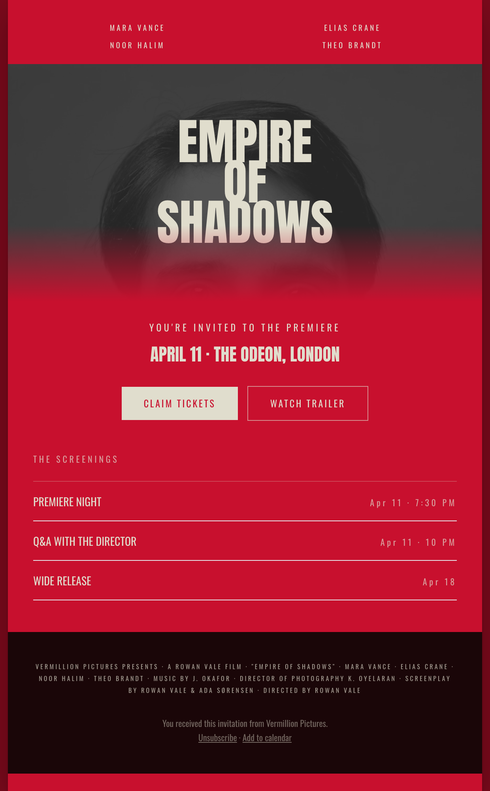

# Movie-Poster Film Premiere Invite Email

A dramatic film-premiere invitation email that acts as a digital movie poster, in a centered 600px column: a crimson-to-black field, a four-name cast row, a condensed Anton title ('EMPIRE OF SHADOWS') over a red-duotoned figure, the premiere date, two evenly-weighted CTAs (Claim tickets / Watch trailer), a line-separated 'Screenings' itinerary, and a dense movie-billing credit block. Reusable for premieres, VIP launches, and entertainment event invites.



## Prompt

```text
{"summary": "A dramatic film-premiere invitation email, built like a digital movie poster, in a centered ~600px column on a cinematic crimson field. A four-name cast row sits above the hero: a condensed Anton title ('Empire of Shadows') centered over a red-duotoned portrait with a crimson-to-black gradient. Below: a 'you're invited to the premiere' line + date/venue, two evenly-weighted CTA buttons (Claim tickets / Watch trailer), a line-separated 'Screenings' itinerary (event + right-aligned time), and a dark movie-billing credit block with unsubscribe.", "style": {"description": "Highly dramatic, thriller-poster energy. A crimson-to-black gradient field with a warm bone ink and a condensed heavyweight display face (Anton) for the title. The portrait is duotoned into the red so photo and field are one palette. Two-colour system (bone + crimson) plus a near-black billing footer; tracked-caps micro-copy; classic movie-poster 'furniture' (cast row + billing block) sells the genre.", "prompt": "Design a film-premiere invitation email in a centered max-width 600px column on a cinematic red field (#c8102e) over a deep-red body (#7c0a1c). Fonts: Anton (condensed heavyweight display) for the title, Oswald for everything else. Two-colour palette: warm bone #e0ddcd ink + crimson field, with a near-black (#1a0608) billing footer. The hero portrait is red-duotoned (grayscale image + a red multiply overlay + a faint bone lighten) so it blends into the field, with a crimson-to-black bottom gradient. Title in Anton ~62px UPPERCASE, tight leading, centered over the figure for depth. Micro-copy is tracked UPPERCASE bone. Two evenly-weighted CTAs: a solid-bone button (crimson label) + a bone-outline button. The billing block is 8px tracked-caps bone/70 on near-black, like a film one-sheet credit block. Email-safe: centered column, no sticky nav."}, "layout_and_structure": {"description": "Centered ~600px column: (1) four-name cast row, (2) title over a duotone hero with a gradient base, (3) 'you're invited' line + date/venue, (4) two side-by-side CTAs, (5) 'Screenings' hairline itinerary, (6) near-black billing block + unsubscribe. Reflows to one column at ~380px (cast row 2x2).", "prompts": [{"part": "Cast row", "prompt": "A 2-column (2x2) grid of four cast names in tracked-caps bone at ~9.5px, centered."}, {"part": "Title over duotone hero", "prompt": "A ~300px red-duotoned portrait; centered over it, a 3-line Anton title (~62px, e.g. 'Empire / of / Shadows') in bone; a crimson-to-transparent gradient rises from the bottom edge."}, {"part": "Premiere line + CTAs", "prompt": "Centered: a tracked-caps 'You're invited to the premiere', an Anton ~22px date/venue line, then two evenly-weighted buttons side by side, a solid-bone 'Claim tickets' (crimson label) + a bone-outline 'Watch trailer'."}, {"part": "Screenings", "prompt": "A tracked-caps 'The screenings' label over a hairline (bone/25) list; each row = an uppercase event name left + a tracked time right (Premiere night / Q&A / Wide release)."}, {"part": "Billing block + footer", "prompt": "A near-black band with an 8px tracked-caps bone/70 movie-billing paragraph (presents \u00b7 a film \u00b7 cast \u00b7 music by \u00b7 DoP \u00b7 screenplay \u00b7 directed by), then bone/45 fine print with Unsubscribe + Add to calendar links."}]}, "special_ui_components": "Four-name cast row; condensed Anton title centered over a red-duotoned portrait (title-behind-figure depth); two evenly-weighted invite CTAs; line-separated 'Screenings' itinerary; dense movie-billing credit block.", "special_notes": "Email layout: centered ~600px column, no sticky nav. Generic placeholder film ('Empire of Shadows', Vermillion Pictures) and stock duotoned portrait so the spec is reusable; swap the title, figure, cast, and dates. The reusable value is the movie-poster invitation system (duotone title hero + cast row + screenings itinerary + billing block) in a bone + crimson two-colour palette. Source system: reverse-engineered from a Canva vintage action-movie poster (measured Impact ~165pt, bone #e0ddcd + red #c8102e, red-duotone portrait, cast row + billing block)."}
```
