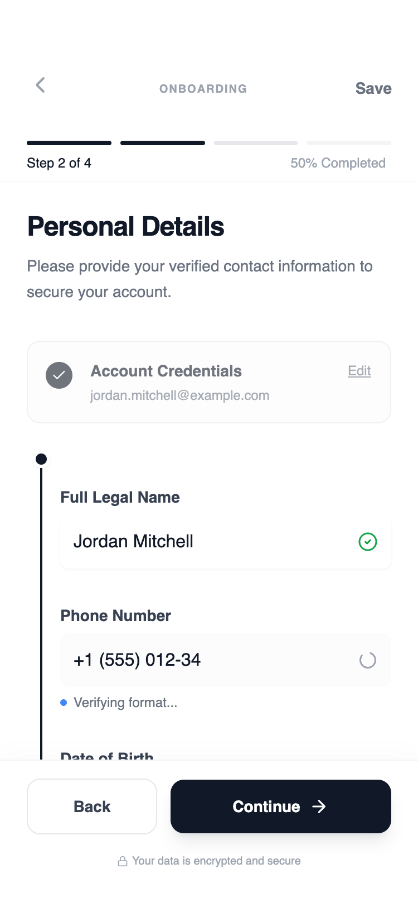

# Multi-step Form Flow

A modular, step-based mobile flow designed for creating or editing content with clarity and momentum, where each screen presents a single logical input group, guided by a top progress indicator and a bottom-anchored primary action. Users can move forward or backward without data loss, with progress automatically saved between steps, while the reusable layout system supports optional and conditional steps across different flows. Presented in a minimal wireframe style, visual progression is communicated through spacing and hierarchy rather than visual decoration, making this approach best for onboarding, multi-step setup, preference configuration, and any mobile experience where reducing cognitive load and maximizing completion rate are critical.



## Prompt

```text
Here is a reference implementation:

~~~html
<!DOCTYPE html>
<html lang="en">
<head>
    <meta charset="UTF-8">
    <meta name="viewport" content="width=device-width, initial-scale=1.0">
    <title>Mobile Multi-step Flow</title>
    <script src="https://cdn.tailwindcss.com"></script>
    <script src="https://code.iconify.design/iconify-icon/1.0.7/iconify-icon.min.js"></script>
    <link href="https://api.fontshare.com/v2/css?f[]=general-sans@700,600,500,400&display=swap" rel="stylesheet">
    <script>
        tailwind.config = {
            theme: {
                extend: {
                    fontFamily: {
                        sans: ['General Sans', 'sans-serif'],
                    },
                    colors: {
                        gray: {
                            50: '#f9fafb',
                            100: '#f3f4f6',
                            200: '#e5e7eb',
                            300: '#d1d5db',
                            400: '#9ca3af',
                            500: '#6b7280',
                            600: '#4b5563',
                            700: '#374151',
                            800: '#1f2937',
                            900: '#111827',
                        }
                    },
                    animation: {
                        'fade-in': 'fadeIn 0.3s ease-out forwards',
                        'slide-up': 'slideUp 0.4s cubic-bezier(0, 0, 0.2, 1) forwards',
                    },
                    keyframes: {
                        fadeIn: {
                            '0%': { opacity: '0' },
                            '100%': { opacity: '1' },
                        },
                        slideUp: {
                            '0%': { opacity: '0', transform: 'translateY(10px)' },
                            '100%': { opacity: '1', transform: 'translateY(0)' },
                        }
                    }
                }
            }
        }
    </script>
    <style>
        ::-webkit-scrollbar { width: 0px; background: transparent; }
        input:-webkit-autofill {
            -webkit-box-shadow: 0 0 0 30px #fff inset !important;
            -webkit-text-fill-color: #111827 !important;
        }
        .step-transition {
            transition: opacity 0.3s ease-in-out, transform 0.3s ease-in-out;
        }
    </style>
</head>
<body>
    <div id="app-root" class="w-full h-screen flex flex-col bg-white font-sans text-gray-900 overflow-hidden">
        
        <!-- Header Section -->
        <header class="shrink-0 pt-14 pb-2 px-6 bg-white/95 backdrop-blur-sm z-20 border-b border-gray-100/50">
            <div class="flex items-center justify-between mb-6">
                <button id="nav-back-btn" class="p-2 -ml-2 text-gray-400 hover:text-gray-900 transition-colors rounded-full hover:bg-gray-50">
                    <iconify-icon icon="lucide:chevron-left" width="24"></iconify-icon>
                </button>
                <div class="flex flex-col items-center">
                    <span class="text-[10px] font-bold uppercase tracking-widest text-gray-400">Onboarding</span>
                </div>
                <button id="nav-save-btn" class="p-2 -mr-2 text-sm font-semibold text-gray-500 hover:text-gray-900 transition-colors">
                    Save
                </button>
            </div>

            <!-- Progress Visualizer -->
            <div id="progress-bar-container" class="flex items-center justify-between gap-2">
                <div class="h-1 flex-1 bg-gray-200 rounded-full overflow-hidden"><div class="h-full w-0 bg-gray-900 transition-all duration-500"></div></div>
                <div class="h-1 flex-1 bg-gray-200 rounded-full overflow-hidden"><div class="h-full w-0 bg-gray-900 transition-all duration-500"></div></div>
                <div class="h-1 flex-1 bg-gray-200 rounded-full overflow-hidden"><div class="h-full w-0 bg-gray-900 transition-all duration-500"></div></div>
                <div class="h-1 flex-1 bg-gray-200 rounded-full overflow-hidden"><div class="h-full w-0 bg-gray-900 transition-all duration-500"></div></div>
            </div>
            <div class="flex justify-between mt-2">
                <span id="header-step-title" class="text-xs font-medium text-gray-900">Step 1: Security Setup</span>
                <span id="header-progress-text" class="text-xs text-gray-400">0% Completed</span>
            </div>
        </header>

        <!-- Main Content -->
        <main id="step-content-container" class="flex-1 overflow-y-auto bg-white">
            <!-- Dynamic Content Injected Here -->
        </main>

        <!-- Footer Section -->
        <footer class="shrink-0 bg-white border-t border-gray-100 px-6 pt-4 pb-[34px] shadow-[0_-4px_20px_rgba(0,0,0,0.02)] z-30">
            <div class="flex items-center gap-3">
                <button id="btn-prev" class="flex-1 py-3.5 px-4 rounded-xl border border-gray-200 bg-white text-gray-700 text-sm font-semibold hover:bg-gray-50 active:bg-gray-100 transition-all focus:outline-none focus:ring-2 focus:ring-gray-200 disabled:opacity-30 disabled:cursor-not-allowed">
                    Back
                </button>
                <button id="btn-next" class="flex-[2] py-3.5 px-4 rounded-xl bg-gray-900 text-white text-sm font-semibold shadow-lg shadow-gray-900/10 hover:bg-gray-800 active:scale-[0.98] transition-all flex items-center justify-center gap-2 focus:outline-none focus:ring-2 focus:ring-gray-900 focus:ring-offset-2">
                    <span id="btn-next-text">Continue</span>
                    <iconify-icon id="btn-next-icon" icon="lucide:arrow-right" width="18"></iconify-icon>
                </button>
            </div>
            <div class="mt-4 flex justify-center">
                 <p class="text-[10px] text-gray-400 flex items-center gap-1">
                    <iconify-icon icon="lucide:lock" width="10"></iconify-icon>
                    Your data is encrypted and secure
                 </p>
            </div>
        </footer>

    </div>

    <script>
        const steps = [
            {
                id: 1,
                title: "Security Setup",
                headerTitle: "Step 1: Security Setup",
                progress: "25%",
                content: `
                    <div class="flex flex-col min-h-full px-6 py-6 animate-slide-up">
                        <h1 class="text-2xl font-bold tracking-tight text-gray-900 mb-2">Create your account</h1>
                        <p class="text-gray-500 text-sm mb-8 leading-relaxed">Set up your secure credentials to get started with our professional network.</p>
                        <div class="space-y-6">
                            <div class="space-y-1.5">
                                <label class="block text-sm font-semibold text-gray-700">Email Address</label>
                                <input type="email" placeholder="name@company.com" class="block w-full rounded-lg border-gray-200 bg-white py-3 px-3 text-gray-900 focus:border-gray-900 focus:ring-1 focus:ring-gray-900 sm:text-sm shadow-sm">
                            </div>
                            <div class="space-y-1.5">
                                <label class="block text-sm font-semibold text-gray-700">Password</label>
                                <div class="relative">
                                    <input type="password" placeholder="Minimum 8 characters" class="block w-full rounded-lg border-gray-200 bg-white py-3 px-3 text-gray-900 focus:border-gray-900 focus:ring-1 focus:ring-gray-900 sm:text-sm shadow-sm">
                                    <iconify-icon icon="lucide:eye-off" class="absolute right-3 top-3.5 text-gray-400 cursor-pointer"></iconify-icon>
                                </div>
                            </div>
                        </div>
                    </div>
                `
            },
            {
                id: 2,
                title: "Identity Verification",
                headerTitle: "Step 2: Identity Verification",
                progress: "50%",
                content: `
                    <div class="flex flex-col min-h-full px-6 py-6 animate-slide-up">
                        <h1 class="text-2xl font-bold tracking-tight text-gray-900 mb-2">Verify your identity</h1>
                        <p class="text-gray-500 text-sm mb-8 leading-relaxed">Next, let's confirm who you are. We use these details to prevent unauthorized access.</p>
                        <div class="relative pl-4 border-l-2 border-gray-900 ml-3 space-y-8 pb-8">
                            <div class="absolute -left-[9px] top-0 w-4 h-4 rounded-full border-[3px] border-white bg-gray-900 shadow-sm"></div>
                            <div class="space-y-1.5">
                                <label class="block text-sm font-semibold text-gray-700">Full Legal Name<span class="block text-[10px] font-normal text-gray-400 mt-0.5">As shown on ID</span></label>
                                <div class="relative group">
                                    <input type="text" value="Jordan Mitchell" class="block w-full rounded-lg border-gray-200 bg-white py-3 pl-3 pr-10 text-gray-900 sm:text-sm shadow-sm">
                                    <div class="absolute inset-y-0 right-0 flex items-center pr-3"><iconify-icon icon="lucide:check-circle-2" class="text-green-600 text-lg"></iconify-icon></div>
                                </div>
                            </div>
                            <div class="space-y-1.5">
                                <label class="block text-sm font-semibold text-gray-700">Phone Number</label>
                                <div class="relative">
                                    <input type="tel" value="+1 (555) 012-34" class="block w-full rounded-lg border-gray-200 bg-gray-50/50 py-3 pl-3 pr-10 text-gray-900 sm:text-sm">
                                    <div class="absolute inset-y-0 right-0 flex items-center pr-3"><iconify-icon icon="lucide:loader-2" class="text-gray-400 text-lg animate-spin"></iconify-icon></div>
                                </div>
                            </div>
                            <div class="space-y-1.5">
                                <label class="block text-sm font-semibold text-gray-700">Date of Birth</label>
                                <input type="text" placeholder="MM/DD/YYYY" class="block w-full rounded-lg border-gray-200 bg-white py-3 px-3 text-gray-900 sm:text-sm shadow-sm">
                            </div>
                        </div>
                    </div>
                `
            },
            {
                id: 3,
                title: "Professional Profile",
                headerTitle: "Step 3: Professional Profile",
                progress: "75%",
                content: `
                    <div class="flex flex-col min-h-full px-6 py-6 animate-slide-up">
                        <h1 class="text-2xl font-bold tracking-tight text-gray-900 mb-2">Professional Experience</h1>
                        <p class="text-gray-500 text-sm mb-8 leading-relaxed">Help us tailor your experience by providing your professional background.</p>
                        <div class="space-y-6">
                            <div class="space-y-1.5">
                                <label class="block text-sm font-semibold text-gray-700">Primary Role</label>
                                <select class="block w-full rounded-lg border-gray-200 bg-white py-3 px-3 text-gray-900 sm:text-sm shadow-sm appearance-none">
                                    <option>Select an option</option>
                                    <option>Software Engineer</option>
                                    <option>Product Designer</option>
                                    <option>Marketing Manager</option>
                                </select>
                            </div>
                            <div class="space-y-1.5">
                                <label class="block text-sm font-semibold text-gray-700">Years of Experience</label>
                                <div class="grid grid-cols-3 gap-2">
                                    <button class="py-3 rounded-lg border border-gray-200 text-sm font-medium hover:bg-gray-50">1-3</button>
                                    <button class="py-3 rounded-lg border border-gray-900 bg-gray-900 text-white text-sm font-medium">4-7</button>
                                    <button class="py-3 rounded-lg border border-gray-200 text-sm font-medium hover:bg-gray-50">8+</button>
                                </div>
                            </div>
                            <div class="space-y-1.5">
                                <label class="block text-sm font-semibold text-gray-700">Portfolio Link (Optional)</label>
                                <input type="url" placeholder="https://..." class="block w-full rounded-lg border-gray-200 bg-white py-3 px-3 text-gray-900 sm:text-sm shadow-sm">
                            </div>
                        </div>
                    </div>
                `
            },
            {
                id: 4,
                title: "Final Review",
                headerTitle: "Step 4: Final Review",
                progress: "100%",
                content: `
                    <div class="flex flex-col min-h-full px-6 py-6 animate-slide-up">
                        <h1 class="text-2xl font-bold tracking-tight text-gray-900 mb-2">Review & Confirm</h1>
                        <p class="text-gray-500 text-sm mb-8 leading-relaxed">Please review your information before completing your registration.</p>
                        <div class="space-y-4">
                            <div class="p-4 rounded-xl bg-gray-50 border border-gray-100">
                                <div class="flex items-center justify-between mb-2">
                                    <h4 class="text-xs font-bold uppercase tracking-wider text-gray-400">Security</h4>
                                    <button class="text-xs font-semibold text-gray-900 underline">Edit</button>
                                </div>
                                <p class="text-sm text-gray-900 font-medium">jordan.m@example.com</p>
                                <p class="text-xs text-gray-500">Password set • MFA Enabled</p>
                            </div>
                            <div class="p-4 rounded-xl bg-gray-50 border border-gray-100">
                                <div class="flex items-center justify-between mb-2">
                                    <h4 class="text-xs font-bold uppercase tracking-wider text-gray-400">Identity</h4>
                                    <button class="text-xs font-semibold text-gray-900 underline">Edit</button>
                                </div>
                                <p class="text-sm text-gray-900 font-medium">Jordan Mitchell</p>
                                <p class="text-xs text-gray-500">Verified phone • +1 (555) 012-34</p>
                            </div>
                            <div class="p-4 rounded-xl bg-gray-50 border border-gray-100">
                                <div class="flex items-center justify-between mb-2">
                                    <h4 class="text-xs font-bold uppercase tracking-wider text-gray-400">Professional</h4>
                                    <button class="text-xs font-semibold text-gray-900 underline">Edit</button>
                                </div>
                                <p class="text-sm text-gray-900 font-medium">Product Designer</p>
                                <p class="text-xs text-gray-500">4-7 Years experience</p>
                            </div>
                        </div>
                    </div>
                `
            }
        ];

        let currentStepIndex = 0;

        const headerTitle = document.getElementById('header-step-title');
        const progressText = document.getElementById('header-progress-text');
        const contentContainer = document.getElementById('step-content-container');
        const btnPrev = document.getElementById('btn-prev');
        const btnNext = document.getElementById('btn-next');
        const btnNextText = document.getElementById('btn-next-text');
        const btnNextIcon = document.getElementById('btn-next-icon');
        const navBackBtn = document.getElementById('nav-back-btn');
        const progressSegments = document.querySelectorAll('#progress-bar-container > div > div');

        function updateUI() {
            const step = steps[currentStepIndex];
            
            // Update Header
            headerTitle.textContent = step.headerTitle;
            progressText.textContent = `${step.progress} Completed`;
            
            // Update Progress Bars
            progressSegments.forEach((bar, idx) => {
                if (idx < currentStepIndex) {
                    bar.style.width = '100%';
                } else if (idx === currentStepIndex) {
                    bar.style.width = '50%'; // Intermediate state showing progress
                    setTimeout(() => bar.style.width = '100%', 100); // Animate to full
                } else {
                    bar.style.width = '0%';
                }
            });

            // Update Content
            contentContainer.innerHTML = step.content;

            // Update Footer
            btnPrev.disabled = currentStepIndex === 0;
            if (currentStepIndex === steps.length - 1) {
                btnNextText.textContent = "Complete Registration";
                btnNextIcon.setAttribute('icon', 'lucide:check');
            } else {
                btnNextText.textContent = currentStepIndex === 1 ? "Verify and Continue" : "Continue";
                btnNextIcon.setAttribute('icon', 'lucide:arrow-right');
            }
        }

        btnNext.addEventListener('click', () => {
            if (currentStepIndex < steps.length - 1) {
                currentStepIndex++;
                updateUI();
                contentContainer.scrollTo({ top: 0, behavior: 'smooth' });
            } else {
                // Final step action
                btnNext.innerHTML = `<iconify-icon icon="lucide:loader-2" class="animate-spin" width="20"></iconify-icon>`;
                setTimeout(() => {
                    alert("Registration Complete!");
                    location.reload();
                }, 1500);
            }
        });

        btnPrev.addEventListener('click', () => {
            if (currentStepIndex > 0) {
                currentStepIndex--;
                updateUI();
            }
        });

        navBackBtn.addEventListener('click', () => {
            if (currentStepIndex > 0) {
                currentStepIndex--;
                updateUI();
            }
        });

        // Initialize
        updateUI();
    </script>
</body>
</html>
~~~
```

**▶ Try it live → [https://superdesign.dev/library/multi-step-form-flow](https://superdesign.dev/library/multi-step-form-flow?utm_source=github&utm_medium=prompt-repo&utm_campaign=prompt-library)**

**Use it in your coding agent:** install the [Superdesign skill](https://github.com/superdesigndev/superdesign-skill), then:

```bash
superdesign get-prompts --slugs "multi-step-form-flow" --json
```

*15 copies · 1,906 tries · Onboarding · General · mobile app, layout, page, onboarding*
