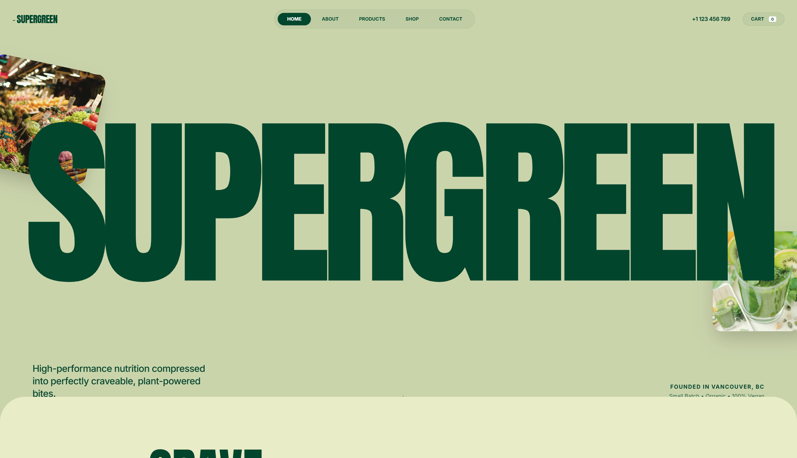

# Nature Inspired Style

A nature-inspired 'Organic Brutalist' design system perfect for wellness, sustainable CPG, eco-friendly lifestyle brands, or high-end nutrition. Characterized by a palette of deep forest greens and earthy sages, the style utilizes massive editorial typography (Anton) paired with functional sans-serifs (Inter). The layout features 'bento-adjacent' rounded grids, floating organic elements with parallax effects, and a subtle film grain noise overlay that gives the digital experience a tactile, premium paper-like feel. Key elements include oversized headings, ultra-rounded corners (up to 5rem), and fluid reveal animations.



## Prompt

```text
{
  "summary": "An earthy, high-end editorial style combining bold industrial typography with soft organic colors and fluid, scroll-triggered animations.",
  "style": {
    "description": "The style uses a high-contrast 'Forest and Sage' color story. Typography is a mix of heavy, condensed display faces (Anton) for impact and clean, tracked-out sans-serifs (Inter) for utility. Visuals are treated with a persistent SVG noise overlay (4% opacity) to add texture. Animations focus on vertical reveals using a custom cubic-bezier for a 'snappy yet smooth' high-end feel.",
    "prompt": "Create a design system using an earthy, organic palette: Forest (#01472e), Sage (#ccd5ae), Olive (#e9edc9), Cream (#fefae0), and Moss (#a3b18a). \n\n### Typography\n- **Display/Headings**: Use 'Anton' (sans-serif/impactful). Hero size: 23vw, leading: 0.75, letter-spacing: -0.05em. Section titles: 15vw.\n- **Body/Utility**: Use 'Inter'. Font weights: 400 (regular), 700 (bold). Use uppercase with letter-spacing 0.2em - 0.4em for all labels and buttons.\n\n### Texture & Effects\n- **Noise Overlay**: Apply a fixed SVG fractal noise overlay at 0.04 opacity across the entire viewport.\n- **Corners**: Use extreme rounding: `border-radius: 5rem` for large sections, `border-radius: 2.5rem` for cards/images.\n- **Shadows**: Soft, deep shadows for floating elements: `shadow-2xl` with a tint of the 'Forest' color (rgba(1, 71, 46, 0.2)).\n\n### Animation\n- **Reveal Logic**: Components should slide up from `translateY(100px)` with `opacity: 0` to `translateY(0)` with `opacity: 1` using `cubic-bezier(0.16, 1, 0.3, 1)` over 1.2s.\n- **Floating Parallax**: Foreground images should have a subtle float animation (`@keyframes float { 0%, 100% { transform: translateY(0) rotate(0deg); } 50% { transform: translateY(-20px) rotate(5deg); } }`)."
  },
  "layout_and_structure": {
    "description": "A vertically stacked layout with distinct color-blocked sections using ultra-rounded top corners to separate themes. Employs a fixed navigation bar and high-impact hero section.",
    "prompts": [
      {
        "part": "Header/Navigation",
        "prompt": "Fixed top navigation. Left: Logo in bold uppercase with a hyphen prefix. Center: Pill-shaped navigation bar with `backdrop-filter: blur(20px)` and semi-transparent background (#ffffff1a). Links should be uppercase, font-size: 10px, bold. Right: Cart button with a numeric counter badge in a white pill."
      },
      {
        "part": "Hero Section",
        "prompt": "Full viewport height. Background: #ccd5ae. Centerpiece: Massive 'Anton' text (23vw) with letters revealed via staggered animation (0.05s delay per letter). Surround the text with 2-3 floating organic images (e.g., ingredients) that have parallax scroll behavior and 3rem rounded corners. Bottom: Dual-column descriptive text and location/origin labels."
      },
      {
        "part": "Product/Feature Grid",
        "prompt": "Background: #e9edc9. Top-padding with 5rem rounded corner. Heading: Massive 'Anton' display text (15vw) paired with a large circular CTA button. Grid: 3-column layout. Each card features an aspect-ratio [4/5] image with 2.5rem radius. On hover, image scales 1.1x and a 'Quick Add' button reveals from the bottom with a blur overlay."
      },
      {
        "part": "Footer",
        "prompt": "Background: #01472e. Text color: #ccd5ae. Structure: 12-column grid. Left 6 cols: Large newsletter signup with an uppercase underline-only input field. Right 6 cols: Two columns of links using bold, tracked-out 11px uppercase text. Bottom: Copyright and legal links with 30% opacity."
      }
    ]
  },
  "special_ui_components": [
    {
      "component": "Floating Organic Cards",
      "description": "Images with extreme rounding and parallax rotation.",
      "prompt": "Implement images with `border-radius: 3rem`. Use a CSS animation named 'float' (translateY -20px and rotate 5deg) running infinitely. Apply a scroll-listener that adds additional translateY based on scroll depth (speed factor 0.05)."
    },
    {
      "component": "Blur-Reveal Button",
      "description": "Hover interaction for product cards.",
      "prompt": "Card overlay: `background: rgba(1, 71, 46, 0.3)`, `backdrop-filter: blur(2px)`. Inner button: White background, Forest text, uppercase, tracking-widest. Button should translate up 32px on hover while the overlay opacity fades from 0 to 1."
    }
  ],
  "special_notes": "MUST: Maintain the noise overlay for the 'analog' feel. MUST: Use the exact cubic-bezier (0.16, 1, 0.3, 1) for all transitions to ensure the 'premium' motion signature. DO NOT: Use standard sharp corners; everything must have at least a small radius, but primary containers must use the 5rem radius. DO NOT: Use standard black text; always use the Forest (#01472e) color for dark text."
}
```

**▶ [Try it live →](https://superdesign.dev/library/nature-inspired-style?utm_source=github&utm_medium=prompt-repo&utm_campaign=prompt-library)**

**Use it in your coding agent:** install the [Superdesign skill](https://github.com/superdesigndev/superdesign-skill), then:

```bash
superdesign get-prompts --slugs "nature-inspired-style" --json
```

*1,272 copies · 1,864 tries · Design Systems & Styles · General · landing page, page, style*
