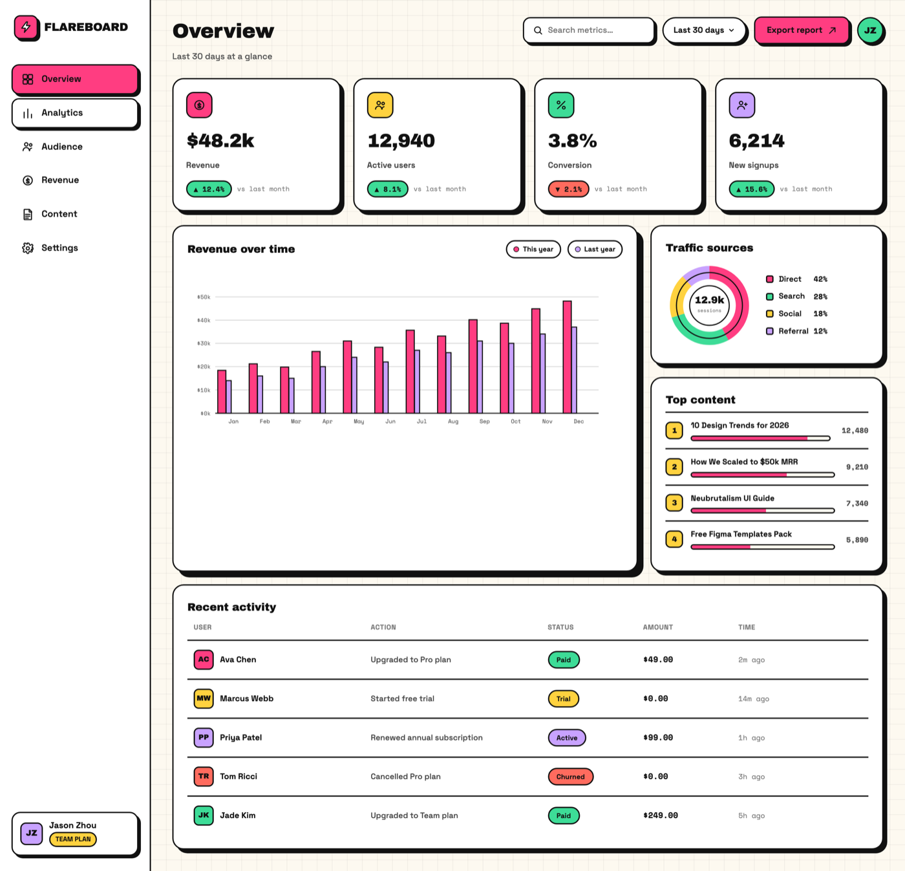

# Neubrutalism Dashboard: Bold Candy Analytics UI with Hard Shadows

A bold neubrutalism (neo-brutalist) SaaS analytics dashboard on an off-white canvas where every card, button, badge and chart bar carries a 2px black border and a hard, un-blurred offset drop shadow. A 240px sidebar (bolt logo, a hot-pink filled "Overview" nav pill, icon nav rows, a workspace card) sits beside a top bar with a bordered search field, a date-range pill, and a filled hot-pink "Export report" button. The body stacks a 4-card KPI row (Revenue $48.2k, Active users, Conversion, New signups, each with a colored icon tile and a mint/coral delta chip), a hero "Revenue over time" card holding a 12-month grouped inline-SVG bar chart (hot-pink "this year" + lilac "last year" bars with a real y-axis), a right column with a "Traffic sources" donut and a "Top content" list of ranked progress bars, and a full-width "Recent activity" table with monogram avatars, colored status pills, mono amounts and timestamps. Bold candy palette: off-white #fdf9f0, ink #111111, hot-pink #ff3d81, canary #ffd23f, mint #3ddc97, lilac #c8a2ff. Fonts: Archivo Black, Space Grotesk, Space Mono. Reusable for any SaaS, creator, or product analytics dashboard.



## Prompt

```text
{"summary": "A bold neubrutalism (neo-brutalist) SaaS analytics dashboard for a desktop web app, on an off-white #fdf9f0 canvas with a faint 24px grid. Every surface \u2014 cards, buttons, badges, icon tiles, nav items, chart bars, inputs \u2014 carries a 2px solid black (#111) border and a hard, un-blurred offset drop shadow toward the bottom-right, giving a tactile sticker feel. Layout: a 240px white left sidebar (a hot-pink bolt logo tile + 'FLAREBOARD' wordmark in Archivo Black, a hot-pink FILLED active 'Overview' nav pill above plain icon rows for Analytics/Audience/Revenue/Content/Settings, and a bordered workspace card at the bottom); a top bar with a big Archivo Black 'Overview' title + muted subtitle on the left and a bordered search field, a 'Last 30 days' date-range pill, a filled hot-pink 'Export report' button, and a circular avatar on the right; then the content: a 4-card KPI row (Revenue $48.2k +12.4%, Active users 12,940 +8.1%, Conversion 3.8% -2.1%, New signups 6,214 +15.6%) each with a colored icon tile and a mint (up) or coral (down) delta chip; a hero 'Revenue over time' card spanning ~2/3 width holding a 12-month grouped bar chart drawn as inline SVG (hot-pink 'this year' bars + thinner lilac 'last year' bars, a real $0k\u2013$50k y-axis with gridlines and Jan\u2013Dec x labels); a right column with a 'Traffic sources' donut (Direct 42% / Search 28% / Social 18% / Referral 12%, centered '12.9k sessions') and a 'Top content' card of 4 ranked rows with bold mini progress bars; and a full-width 'Recent activity' table (User + monogram avatar, Action, Status pill, Amount, Time). Display type is Archivo Black, body is Space Grotesk, numbers/meta are Space Mono. The whole thing is confident, bright, and legible \u2014 bold candy neubrutalism, not sterile.", "style": {"description": "Bold 'candy' neubrutalism: an off-white paper canvas, chunky 2px ink-black borders on absolutely everything, hard (non-blurred) offset drop shadows, generously rounded corners, and a bright accent palette led by hot magenta-pink with canary yellow, mint green and soft lilac supports. Black text always sits on the bright fills (never white on yellow) so contrast stays high. Confident and tactile \u2014 cards feel like physical stickers pressed onto the page \u2014 but organized and scannable, never cluttered. The dominant color is hot-pink; yellow/mint/lilac are accents for variety across KPI tiles, status pills, and chart series.", "prompt": "Build a bold candy neubrutalism visual style for a data dashboard. Canvas is off-white paper #fdf9f0 overlaid with a faint 24px square grid (lines rgba(17,17,17,0.05)). Surfaces are white #ffffff cards. Ink #111111 is used for ALL text and the 2px solid borders that outline every card, button, badge, icon tile, nav item, chart bar and input. Signature shadows are HARD and un-blurred, offset toward bottom-right in ink: small 4px 4px 0 #111, medium 6px 6px 0 #111, large 9px 9px 0 #111 (use large on the hero chart card, medium on KPI/table cards, small on buttons/badges/tiles). Corners: cards rounded ~18px, buttons/tiles smaller radius, badges/pills fully pill. Accent palette: HERO hot-pink #ff3d81 (active nav pill, primary button, dominant chart series, one KPI icon tile), canary yellow #ffd23f, mint green #3ddc97, soft lilac #c8a2ff \u2014 rotate these across the four KPI icon tiles and use them for status pills and chart legends. Delta chips: mint #3ddc97 fill for positive (up), coral #ff6b5e fill for negative (down), both with a 2px border and BLACK text plus a small mono 'vs last month' note. Never put white text on a bright fill \u2014 keep black text on pink/yellow/mint/lilac for contrast. Fonts: display/headlines/big-numbers = 'Archivo Black'; body/UI/labels = 'Space Grotesk'; numeric meta (deltas, amounts, axis, timestamps) = 'Space Mono'. All icons are inline SVG (no icon fonts). Avoid every AI-slop tell: no purple/indigo page gradient, no centered-everything, no Inter-only, no emoji headings, no lorem.", "colors": {"canvas": "#fdf9f0", "surface": "#ffffff", "ink": "#111111", "hot_pink": "#ff3d81", "canary": "#ffd23f", "mint": "#3ddc97", "lilac": "#c8a2ff", "coral": "#ff6b5e"}, "fonts": {"display": "Archivo Black", "body": "Space Grotesk", "mono": "Space Mono"}}, "layout_and_structure": {"description": "A full-bleed desktop web-app shell at ~1440px wide: a fixed 240px white left sidebar with a 2px black right border, then a fluid main column holding a top bar, a 4-up KPI stat row, a 2-column region (a ~2/3 hero chart card next to a ~1/3 right column of two stacked cards), and a full-width activity table at the bottom. Everything is bordered and hard-shadowed; the layout is a clean grid, generous gutters, nothing clipped.", "prompts": [{"part": "Left sidebar", "prompt": "A fixed 240px white sidebar with a 2px black right border. Top: a logo lockup = a bordered hot-pink #ff3d81 rounded icon tile (~40px, small hard shadow) holding a white bolt/asterisk glyph, next to a 'FLAREBOARD' wordmark in Archivo Black. Below: a vertical nav. The ACTIVE item 'Overview' is a FILLED hot-pink pill with a 2px border and a small hard shadow, black text, and a grid glyph. The other rows \u2014 Analytics, Audience, Revenue, Content, Settings \u2014 are plain rows with a leading inline-SVG icon and a Space Grotesk medium label, gaining a bordered background on hover. At the bottom, a bordered workspace card: a small lilac monogram avatar tile ('JZ'), a name, and a canary 'TEAM PLAN' pill badge."}, {"part": "Top bar", "prompt": "A top bar inside the main column. Left: a large Archivo Black page title 'Overview' with a small muted Space Grotesk subtitle beneath it ('Last 30 days at a glance'). Right, in a row: a bordered white search input with a small hard shadow and a leading magnifier glyph ('Search metrics...'); a bordered 'Last 30 days' date-range pill with a chevron; a FILLED hot-pink 'Export report' primary button (2px border, small hard shadow, black text, up-right arrow glyph); and a bordered circular avatar ('JZ' on a mint fill)."}, {"part": "KPI stat row", "prompt": "A row of four equal white stat cards (2px border, medium hard shadow, rounded ~18px). Each card: a ~40px bordered rounded icon tile whose fill rotates per card (pink dollar, canary users, mint percent, lilac user-plus) holding a black inline-SVG glyph; a big Archivo Black metric ($48.2k / 12,940 / 3.8% / 6,214); a Space Grotesk label (Revenue / Active users / Conversion / New signups); and a delta chip \u2014 mint fill with a black '\u25b2 12.4%' for up, coral fill with '\u25bc 2.1%' for down \u2014 followed by a small Space Mono 'vs last month' note. Three cards trend up (mint), one (Conversion) trends down (coral)."}, {"part": "Hero chart card", "prompt": "A white card spanning ~2/3 of the content width (2px border, LARGE 9px hard shadow, rounded ~18px). Header row: 'Revenue over time' in Space Grotesk bold, and a small legend of two bordered pills ('This year' with a hot-pink dot, 'Last year' with a lilac dot). Body: a grouped bar chart drawn as INLINE SVG with 12 month groups (Jan\u2013Dec). Each group has a taller hot-pink #ff3d81 bar ('this year') beside a thinner lilac #c8a2ff bar ('last year'), every bar with a 2px black outline, heights varied and trending upward toward December, all bars fully inside the plot area. A real y-axis on the left with 5 gridline labels in Space Mono ($0k / $10k / $20k / $30k / $40k / $50k) and month labels along the x-axis. Clean, legible, professional \u2014 just neubrutalist-styled."}, {"part": "Right column", "prompt": "A ~1/3-width column stacking two white bordered cards. TOP \u2014 'Traffic sources': a bordered donut/ring chart with a centered '12.9k sessions' label, its segments in the accent colors, beside a legend list (Direct 42% hot-pink, Search 28% mint, Social 18% canary, Referral 12% lilac), each legend row a colored dot + label + Space Mono percent. BOTTOM \u2014 'Top content': four bordered ranked rows, each with a small canary numbered rank tile (1\u20134), a content title ('10 Design Trends for 2026', 'How We Scaled to $50k MRR', 'Neubrutalism UI Guide', 'Free Figma Templates Pack'), a bold mini progress bar (hot-pink fill with a black outline, width by value), and a Space Mono view count on the right."}, {"part": "Recent activity table", "prompt": "A full-width white card (2px border, medium hard shadow) titled 'Recent activity' in Archivo Black. A header row (USER / ACTION / STATUS / AMOUNT / TIME in tracked Space Grotesk caps) over ~5 data rows separated by 2px black hairlines. Each row: a small bordered monogram avatar tile (rotating accent fill) + name; an action label ('Upgraded to Pro plan', 'Started free trial', 'Renewed annual subscription', 'Cancelled Pro plan', 'Upgraded to Team plan'); a STATUS pill (mint 'Paid', canary 'Trial', lilac 'Active', coral 'Churned' \u2014 bold fill, 2px border, black text); an amount in Space Mono ($49.00 / $0.00 / $99.00 / $0.00 / $249.00); and a Space Mono relative timestamp (2m ago, 14m ago, 1h ago, 3h ago, 5h ago). Columns aligned, scannable."}]}, "special_ui_components": [{"component": "Hard-shadow sticker surfaces", "description": "Every card, button, badge, tile, nav item and chart bar uses a 2px ink border plus a hard, un-blurred offset shadow so it reads like a physical sticker pressed onto the page.", "prompt": "Define three hard shadow tokens (4/4, 6/6, 9/9 px offsets, 0 blur, color #111111). Apply a 2px solid #111111 border plus the medium shadow to KPI and table cards, the large shadow to the hero chart card, and the small shadow to buttons, pills, badges and icon tiles. Keep every corner chunky-rounded. On hover, translateY -2 to -4px and swap to the next shadow size up for a tactile 'press out of the page' feel."}, {"component": "Rotating-accent KPI stat cards", "description": "Four bordered stat cards, each with a differently-colored bordered icon tile, a big Archivo Black number, a label, and a mint/coral delta chip with a mono comparison note.", "prompt": "Build four equal cards in a responsive grid. Give each a ~40px bordered rounded icon tile whose fill rotates through hot-pink, canary, mint, lilac, holding a black inline-SVG glyph. Stack: metric in Archivo Black (~2.5rem), Space Grotesk label, then a delta chip \u2014 mint #3ddc97 fill '\u25b2 x%' for positive or coral #ff6b5e fill '\u25bc x%' for negative, 2px border, BLACK text \u2014 trailed by a small Space Mono 'vs last month'."}, {"component": "Inline-SVG grouped bar chart", "description": "A dependency-free 12-month grouped bar chart where each month pairs a hot-pink 'this year' bar with a thinner lilac 'last year' bar, all outlined in black, over a real labelled y-axis.", "prompt": "Hand-plot the chart as inline SVG (no chart library, no JS required). For 12 months draw two bars per group: a taller hot-pink #ff3d81 bar and a thinner lilac #c8a2ff bar, each with a 2px #111 stroke, heights mapped from data and trending upward toward December, kept fully inside the plot rect. Draw horizontal gridlines with Space Mono y labels ($0k\u2013$50k) and month labels (Jan\u2013Dec) on the x-axis. Add a two-pill legend above the plot."}, {"component": "Bordered donut with legend", "description": "A ring chart for traffic sources with a centered session count and an accent-coded legend, drawn cleanly so a still frame renders it correctly.", "prompt": "Draw a bordered donut/ring as inline SVG with four segments in hot-pink / mint / canary / lilac and a centered '12.9k sessions' label in the hole. Beside it, a legend list: each row a colored dot + source name (Direct / Search / Social / Referral) + a Space Mono percent (42 / 28 / 18 / 12). Ensure segments render as clean arcs (no broken stroke) in a static screenshot."}, {"component": "Bold status pills", "description": "Data-table status labels rendered as bold bordered pills in the accent palette with black text, so state is scannable at a glance.", "prompt": "Render each activity status as a fully-pill badge with a 2px #111 border, a bright fill by state (mint 'Paid', canary 'Trial', lilac 'Active', coral 'Churned'), and BLACK Space Grotesk bold text. Keep them compact and vertically centered in the STATUS column so the table stays aligned and readable."}, {"component": "Filled active nav pill", "description": "The current sidebar route is a solid hot-pink hard-shadowed pill while the rest are plain icon rows, making the active location unmistakable.", "prompt": "Give the active nav item ('Overview') a solid hot-pink #ff3d81 fill, a 2px #111 border, a small hard shadow, black text, and a leading grid glyph. Render the other items as plain rows with an inline-SVG icon + Space Grotesk medium label that pick up a bordered white background on hover."}]}
```

**▶ [Try it live →](https://superdesign.dev/library/neubrutalism-dashboard-bold-candy-analytics-ui-with-hard-shadows?utm_source=github&utm_medium=prompt-repo&utm_campaign=prompt-library)**

**Use it in your coding agent:** install the [Superdesign skill](https://github.com/superdesigndev/superdesign-skill), then:

```bash
superdesign get-prompts --slugs "neubrutalism-dashboard-bold-candy-analytics-ui-with-hard-shadows" --json
```

*0 copies · 0 tries · Dashboards · SaaS · dashboard, analytics, saas, admin*
