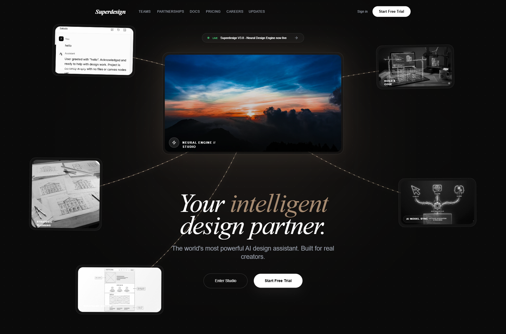

# Neural Noir Interface Style

The Neural Noir Interface Style is a high-end, futuristic aesthetic characterized by a 'tech-noir' atmosphere. It blends deep dark backgrounds (#0a0a0a) with sophisticated gold and bronze accents (#a78b71, #e8d5b7) and editorial typography. Key features include glassmorphism, neural network-inspired SVG connection lines, and a bento-grid layout. This style is optimized for premium AI platforms, creative design engines, high-end SaaS, and editorial-driven tech portfolios. It utilizes a combination of sleek sans-serif (Inter) for functional elements and elegant serif italics (Playfair Display) for headlines, creating a contrast between high-tech performance and classic sophistication.



## Prompt

```text
{
  "summary": "A sophisticated dark-mode interface featuring neural network connectivity, glassmorphism, and a luxury gold-on-black color palette designed for high-end AI and creative tools.",
  "style": {
    "description": "The design uses a monochromatic dark base (#0a0a0a) accented by a gradient of golds and bronzes. Typography pairings include 'Playfair Display' (Italic) for an editorial feel and 'Inter' for UI precision. Visual interest is driven by a 'bg-dots' radial pattern and blurred glassmorphism layers (rgba 255,255,255, 0.03) with high-radius corners (24px-48px).",
    "prompt": "Create a design system with a background of #0a0a0a and a radial dot grid overlay (32px spacing, white at 8% opacity). Use 'Playfair Display' (Italic) for headings and 'Inter' (300-700 weight) for body text. Accent color palette: Base Gold #a78b71, Light Gold #c9b8a0, and Hover Gold #e8d5b7. Implement 'glassmorphism' for all cards: background rgba(255,255,255, 0.03), backdrop-filter blur(10px), and border 1px solid rgba(255,255,255, 0.1). Animations should use 'cubic-bezier(0.4, 0, 0.2, 1)' for transitions and 'power4.out' for entrance reveals. Include a central glow effect using box-shadow: 0 0 100px rgba(167, 139, 113, 0.2)."
  },
  "layout_and_structure": {
    "description": "A vertically structured single-page layout that transitions from a complex, interactive hero section into clean, grid-based content blocks.",
    "prompts": [
      {
        "part": "Navigation",
        "prompt": "Fixed top navbar, 100% width, px-6 to px-12 padding. Features a text logo in 'Playfair Display' (Bold Italic), center-aligned links in 'Inter' (11px, uppercase, tracking-wide), and a 'Start Free Trial' pill button (white background, black text, rounded-full)."
      },
      {
        "part": "Hero Section",
        "prompt": "A central interactive node (16:9 aspect ratio glass card) surrounded by floating satellite cards connected via dynamic SVG bezier curves. The curves should have a 'pulsing-branch' animation. The headline uses 'Playfair Display Italic' at clamp(2.5rem, 8vw, 6rem) with specific words highlighted in #a78b71. Below the headline, a dual-button CTA group: one bordered and one solid white."
      },
      {
        "part": "Features Grid",
        "prompt": "A 4-column grid of glassmorphic cards. Each card has a 48px square icon container with a #a78b71/10 background. On hover, the icon scales 1.1x and the card border brightens. Titles are Inter Bold 20px, body is Inter 14px in gray-400."
      },
      {
        "part": "Pricing Section",
        "prompt": "Three-tiered layout. The center 'Pro' card is highlighted with a 1px border of #a78b71/40 and a top-centered 'Most Popular' badge. Prices are displayed in 48px bold font. Toggle between monthly/annual using a pill-shaped switch with a white active state."
      },
      {
        "part": "Team Section",
        "prompt": "Two-column layout featuring large cards with 4:5 aspect ratio images. Images are grayscale by default and transition to color on hover. Captions include large Serif names and ultra-thin, wide-tracked uppercase roles in gold."
      },
      {
        "part": "Footer",
        "prompt": "Multi-column layout (5 columns on desktop). Left column features the logo and social icons in circular bordered containers. Far right column includes a 'Join Digest' input field: a low-opacity search bar with a circular arrow-submit button."
      }
    ]
  },
  "special_ui_components": [
    {
      "component": "Neural Connection Lines",
      "description": "SVG paths that dynamically connect UI elements to a central point.",
      "prompt": "Render SVG paths with class 'node-line'. Apply stroke-width: 2.5 and a linear-gradient stroke from #c9b8a0 (90%) to #a78b71 (10%). Add a 'pulsing-branch' keyframe animation that varies opacity from 0.4 to 0.7. Overlap secondary dashed lines with stroke-dasharray: 5 15 for 'flow' effects."
    },
    {
      "component": "Satellite Media Cards",
      "description": "Floating preview cards that interact with the mouse and central node.",
      "prompt": "Glass cards (width 220px-340px) containing grayscale images with rounded-20px corners. On hover: scale(1.05), transition grayscale to color over 0.7s, and apply box-shadow: 0 0 60px rgba(167, 139, 113, 0.3)."
    },
    {
      "component": "Live Notification Pill",
      "description": "A floating status indicator with a breathing animation.",
      "prompt": "Pill-shaped glass card with a 1px border-white/10. Contains a 8px green-400 circle with 'animate-pulse'. Text follows: 'LIVE' (green, bold, 8px) then status text (white, 12px)."
    }
  ],
  "special_notes": "MUST: Maintain a high level of contrast between the #0a0a0a background and white/gold elements. MUST NOT: Use standard blue/purple gradients common in tech; stick strictly to the gold/bronze spectrum. MUST: Use heavy letter-spacing on small uppercase text (labels, roles) to maintain the premium feel. MUST: Apply backdrop-filter: blur(10px) to all overlapping layers to prevent visual clutter."
}
```

**▶ Try it live → [https://superdesign.dev/library/neural-noir-interface-style](https://superdesign.dev/library/neural-noir-interface-style?utm_source=github&utm_medium=prompt-repo&utm_campaign=prompt-library)**

**Use it in your coding agent:** install the [Superdesign skill](https://github.com/superdesigndev/superdesign-skill), then:

```bash
superdesign get-prompts --slugs "neural-noir-interface-style" --json
```

*1,280 copies · 2,501 tries · Design Systems & Styles · General · landing page, page, style*
