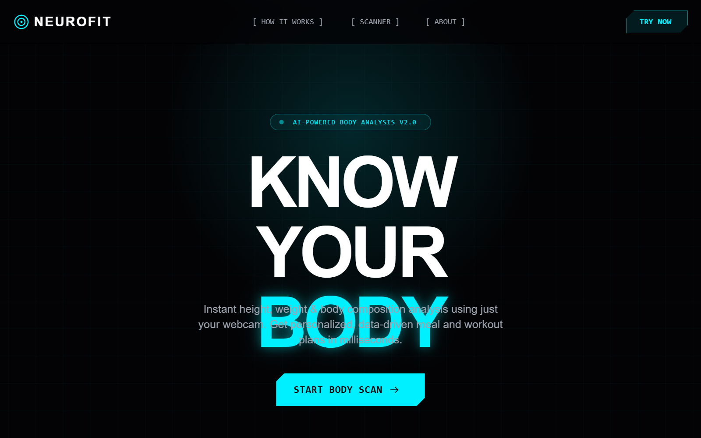

# NeuroFit | Quantum Teleporting UI

NeuroFit is a high-tech, sci-fi inspired design system featuring a 'Quantum Teleporting' aesthetic. It utilizes a deep dark mode palette (#030305) contrasted with vibrant neon cyan (#00F0FF) and sharp red accents (#FF2A2A). The style is defined by cyberpunk elements such as grid-pattern backgrounds, radial glows, and 'glitch' micro-interactions. It features a technical typography mix of Rajdhani for display, Inter for body, and JetBrains Mono for system-level data. The UI is ideal for AI-driven health platforms, fitness tech, biometric analytics, and high-performance SaaS dashboards requiring a futuristic, data-heavy feel.



## Prompt

```text
{
  "summary": "A futuristic 'Quantum' UI for biometric analysis, featuring dark mode, neon cyan glow effects, technical mono-spaced typography, and scroll-triggered glitch teleportation animations for floating UI elements.",
  "style": {
    "description": "The style is a 'Cyber-Technical' aesthetic. Typography uses Rajdhani (Bold/Display) for headings, Inter for body text, and JetBrains Mono for technical labels and numbers. The color palette is dominated by Dark #030305 (Background), Cyan-400 #00F0FF (Primary Glow), and Accent Red #FF2A2A (Alerts). Key visual traits include clip-path 'cyber' buttons, 50px grid background patterns, 0.15 opacity radial glows, and a consistent use of 'border-glow' transitions with cubic-bezier(0.25, 0.46, 0.45, 0.94).",
    "prompt": "Create a design with a deep black background (#030305) and a subtle cyan grid pattern (rgba(0, 240, 255, 0.03) with 50px spacing). Use Rajdhani for massive, uppercase headings with letter-spacing -0.05em. Use JetBrains Mono for all system labels in uppercase with 0.1em tracking. Primary accent color is #00F0FF with a text-shadow of 0 0 20px rgba(0, 240, 255, 0.4). Buttons must use a 'cyber' clip-path: polygon(15px 0, 100% 0, 100% calc(100% - 15px), calc(100% - 15px) 100%, 0 100%, 0 15px). Implement a 'border-glow' hover effect: transition 0.4s, box-shadow: 0 0 20px rgba(0, 240, 255, 0.3), border-color: rgba(0, 240, 255, 0.5). Animation easing should follow cubic-bezier(0.25, 0.46, 0.45, 0.94)."
  },
  "layout_and_structure": {
    "description": "The layout follows a modular structure with a fixed glassmorphism header, a high-impact hero section with floating icons, and a specialized scanner interface containing a live viewfinder and side control panel.",
    "prompts": [
      {
        "part": "Header",
        "prompt": "Fixed top header, 80px height. Background: #030305 at 80% opacity with backdrop-blur-md. Border-bottom: 1px solid rgba(255,255,255,0.05). Left: Logo with a rotating icon (carbon:navaid-military). Center: Nav links in JetBrains Mono, 14px, gray-400, wrapped in brackets like [ LINK ]. Right: Small cyber-cut button in cyan."
      },
      {
        "part": "Hero Section",
        "prompt": "Min-height 90vh, centered flex column. Top: Capsule badge with pulsing dot and 'v2.0' label. Heading: Rajdhani 120px, uppercase, two lines. Line 1: White. Line 2: Cyan with text-glow. Center: 6 floating icons (dumbbell, heart rate, brain, etc.) positioned absolutely around text at opacity 0.6. Icons use unique float animations (8px to 15px range, 2s to 3.5s duration). Bottom: Three-column stat strip with 48px bold mono numbers and 'glitch-hover' effects."
      },
      {
        "part": "Scanner Interface",
        "prompt": "Two-column grid (1fr to 400px). Left: Viewfinder mockup with 3:4 aspect ratio. Features: cyan corner crosshairs, a pulsing red guide box with 'Step into frame' text, and a horizontal cyan laser line (h-2px) that slides top-to-bottom every 3s. Right: Control panel with dark-800 cards. Includes custom range sliders (cyan thumb with 10px glow) and a primary action button group (START/STOP)."
      },
      {
        "part": "Process Section",
        "prompt": "4-column grid of cards. Each card: bg-dark-700/50, border-white/10, rounded-xl. Top-right: Large background number (01, 02, etc.) in Rajdhani at 5% opacity. Hover: Card border glows cyan, and the 48px icon box rotates 12 degrees."
      }
    ]
  },
  "special_ui_components": [
    {
      "component": "Quantum Teleport Icons",
      "description": "Floating icons that undergo a sci-fi glitch effect on scroll before disappearing.",
      "prompt": "When entering the 'How It Works' section, trigger 'glitch-teleport-out' on hero icons: scale(1.5), random translate(-20px to 20px), RGB channel separation (red/blue drop-shadows), and clip-path inset(20% 0 10% 0) for 8 frames at 0.1s. Icons then disappear. Reappear in the new section using 'landing-in' animation: slide down 60px, blur(15px) to clear, and scale(0 to 1) with cyan brightness boost."
    },
    {
      "component": "Cyber-Cut Button",
      "description": "A button with angular cuts instead of rounded corners.",
      "prompt": "Use clip-path: polygon(15px 0, 100% 0, 100% calc(100% - 15px), calc(100% - 15px) 100%, 0 100%, 0 15px). Background #00F0FF, text #030305. Include a ::before pseudo-element with a linear-gradient shine at 45 degrees that animates (translateX) on hover."
    }
  ]
}
```

**▶ Try it live → [https://superdesign.dev/library/neurofit-or-quantum-teleporting-ui](https://superdesign.dev/library/neurofit-or-quantum-teleporting-ui)**

*66 copies · 2,466 tries · tags: *
