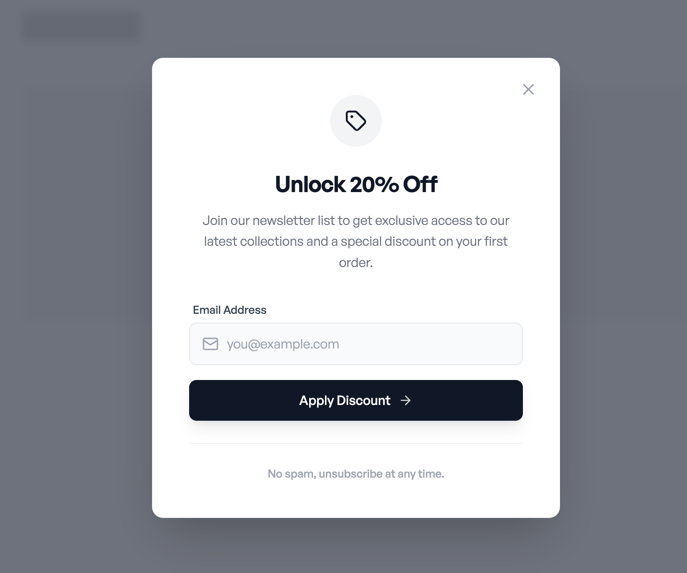

# Offer overlay- Centered Offer Modal

A centered overlay modal that blocks the page content and focuses attention on a single promotional message. Contains a clear headline, short explanatory text, one primary input or CTA, and a visible close action. Designed for maximum visibility and message clarity.

Best suited for
First-time visitor discounts, email capture offers, high-intent landing pages where interruption is acceptable.



## Prompt

```text
Create a wireframe for a discount offer modal with:

- Centered overlay on dark background
- Clear headline at top
- Short descriptive text
- Email input field with placeholder
- "Apply Discount" button at bottom
- Clean, minimal design with no decorative elements
- Simple typography hierarchy
- Functional layout focused on usability

Here is a reference implementation:

~~~html
<!DOCTYPE html>
<html lang="en">
<head>
    <meta charset="UTF-8">
    <meta name="viewport" content="width=device-width, initial-scale=1.0">
    <title>Wireframe Discount Modal</title>
    <script src="https://cdn.tailwindcss.com"></script>
    <script src="https://code.iconify.design/iconify-icon/1.0.7/iconify-icon.min.js"></script>
    <link href="https://api.fontshare.com/v2/css?f[]=general-sans@500,600,400&display=swap" rel="stylesheet">
    <style>
        body {
            font-family: 'General Sans', sans-serif;
        }
    </style>
</head>
<body>
    <div class="min-h-screen bg-gray-50 flex items-center justify-center p-4 relative overflow-hidden">
        <!-- Background Context (Simulated Page Content behind overlay) -->
        <div class="absolute inset-0 opacity-10 pointer-events-none" aria-hidden="true">
            <div class="container mx-auto px-6 py-8">
                <div class="h-8 w-32 bg-gray-900 mb-12"></div>
                <div class="grid grid-cols-1 md:grid-cols-3 gap-8">
                    <div class="h-64 bg-gray-300 rounded"></div>
                    <div class="h-64 bg-gray-300 rounded"></div>
                    <div class="h-64 bg-gray-300 rounded"></div>
                </div>
            </div>
        </div>

        <!-- Modal Overlay -->
        <div class="fixed inset-0 bg-gray-900/60 backdrop-blur-sm transition-opacity z-40"></div>

        <!-- Modal Content -->
        <div class="relative z-50 w-full max-w-[440px] bg-white rounded-xl shadow-2xl overflow-hidden transform transition-all">
            
            <!-- Close Button -->
            <button class="absolute top-5 right-5 text-gray-400 hover:text-gray-900 transition-colors p-1 rounded-full hover:bg-gray-100" aria-label="Close modal">
                <iconify-icon icon="lucide:x" class="text-xl block"></iconify-icon>
            </button>

            <!-- Modal Body -->
            <div class="p-8 sm:p-10 text-center">
                
                <!-- Visual Anchor -->
                <div class="inline-flex items-center justify-center w-14 h-14 rounded-full bg-gray-100 mb-6 text-gray-900">
                    <iconify-icon icon="lucide:tag" class="text-2xl"></iconify-icon>
                </div>

                <!-- Headlines -->
                <h2 class="text-2xl font-semibold text-gray-900 mb-3 tracking-tight">
                    Unlock 20% Off
                </h2>
                <p class="text-gray-500 text-sm leading-relaxed mb-8 px-2">
                    Join our newsletter list to get exclusive access to our latest collections and a special discount on your first order.
                </p>

                <!-- Form -->
                <form class="space-y-4 text-left" onsubmit="event.preventDefault()">
                    <div class="space-y-1.5">
                        <label for="email" class="block text-xs font-medium text-gray-700 ml-1">
                            Email Address
                        </label>
                        <div class="relative">
                            <div class="absolute inset-y-0 left-0 pl-3.5 flex items-center pointer-events-none">
                                <iconify-icon icon="lucide:mail" class="text-gray-400 text-lg"></iconify-icon>
                            </div>
                            <input 
                                type="email" 
                                id="email" 
                                name="email" 
                                placeholder="you@example.com" 
                                class="block w-full pl-10 pr-4 py-3 text-sm text-gray-900 bg-gray-50 border border-gray-200 rounded-lg focus:ring-1 focus:ring-gray-900 focus:border-gray-900 focus:bg-white outline-none transition-all placeholder:text-gray-400"
                                required
                            >
                        </div>
                    </div>

                    <button 
                        type="submit" 
                        class="w-full flex items-center justify-center gap-2 py-3 px-4 bg-gray-900 hover:bg-black text-white text-sm font-medium rounded-lg shadow-lg shadow-gray-900/10 transition-all active:scale-[0.98]"
                    >
                        <span>Apply Discount</span>
                        <iconify-icon icon="lucide:arrow-right" class="text-base opacity-80"></iconify-icon>
                    </button>
                </form>

                <!-- Footer / Disclaimer -->
                <div class="mt-6 pt-6 border-t border-gray-100">
                    <p class="text-xs text-gray-400 font-medium">
                        No spam, unsubscribe at any time.
                    </p>
                </div>
            </div>
        </div>
    </div>
</body>
</html>
~~~
```

**▶ Try it live → [https://superdesign.dev/library/offer-overlay-centered-offer-modal](https://superdesign.dev/library/offer-overlay-centered-offer-modal?utm_source=github&utm_medium=prompt-repo&utm_campaign=prompt-library)**

**Use it in your coding agent:** install the [Superdesign skill](https://github.com/superdesigndev/superdesign-skill), then:

```bash
superdesign get-prompts --slugs "offer-overlay-centered-offer-modal" --json
```

*2 copies · 2,320 tries · E-commerce · E-commerce & Retail · shopify, overlay, discount, layout*
