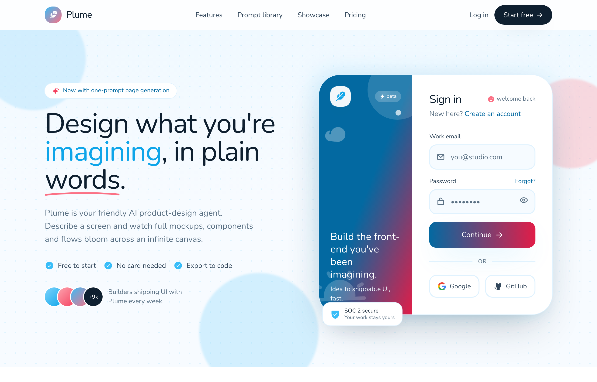

# Plume · Sign in to your design canvas

Warm, illustrated AI design-agent sign-in landing in sky-blue and coral: a sticky frosted nav over a two-panel side-panel login card (gradient illustration aside plus email, password and social auth), floating blobs, dot-grid texture and rounded-everything Nunito type.



## Prompt

```text
{"summary": "A warm, illustrated marketing-plus-sign-in landing page for a friendly AI product-design agent. A sticky frosted nav sits above a full-bleed sky-gradient hero that splits into a left-side product pitch and a right-side two-panel sign-in card: a coral-to-sky gradient illustration aside next to a clean email/password form with social login. Below the fold: a logo trust strip, a three-up feature grid, a full-bleed gradient prompt-library showcase band, a soft CTA card, and a dark footer. Rounded-everything, floating ambient blobs, a dot-grid texture and a playful hand-drawn underline give it an approachable, human feel.", "style": {"description": "Soft, rounded, friendly SaaS aesthetic in a sky-blue + coral palette on a near-white cloud background. Heavy use of large border radii (2rem / 2.75rem), layered soft shadows with sky-tinted glows, blurred floating blobs, a faint blue dot-grid, and a hand-drawn coral underline accent. Typography is the rounded Nunito family pushed to very heavy weights (800-900) for warmth and confidence.", "prompt": "Design a friendly, rounded SaaS landing-plus-auth page. Palette: cloud near-white background #f7fbff; primary sky blues sky-400 #38bdf8, sky-500 #0ea5e9, sky-600 #0284c7, sky-700 #0369a1, deep sky-900 #0c4a6e, light sky-50 #f0f9ff / sky-100 #e0f2fe / sky-200 #bae6fd / sky-300 #7dd3fc; coral accents coral-300 #fda4af, coral-400 #fb7185, coral-500 #f43f5e, coral-600 #e11d48; ink text ink-900 #0f2030 (headings), ink-700 #33485c (body strong), ink-500 #5b7184 (muted). Typography: Nunito (Google Font) for everything, weights 600-900, very heavy 900 for headings and buttons, tight tracking on large headings. Shapes: large rounded corners everywhere (rounded-2xl through rounded-5xl = 2rem/2.75rem), pill buttons, soft sky-tinted shadows (e.g. 0 24px 60px -22px rgba(56,189,248,0.45) for primary, 0 40px 90px -30px rgba(15,32,48,0.30) for cards). Texture: subtle radial dot-grid (sky dots at 22px spacing, ~20-60% opacity) and several large blurred pastel circles floating with slow ease-in-out animations. Accents: a hand-drawn coral SVG underline swoosh under a key hero word; feather/sparkle/check Phosphor icons. Mood: warm, optimistic, human, never corporate-stiff."}, "layout_and_structure": {"description": "Single vertical scroll, all sections centered in a max-width 72rem (max-w-6xl) container with px-5 / sm:px-8 gutters. Order top-to-bottom: sticky nav, full-bleed hero with two-column pitch + sign-in card, logo strip, three-up feature grid, full-bleed gradient showcase band, centered CTA card, dark footer. The hero uses an asymmetric 1.05fr / 1fr two-column grid on large screens and stacks to a single centered column on mobile.", "prompts": [{"part": "Sticky nav", "prompt": "A sticky top header (sticky top-0, z-50) with a translucent white backdrop-blur background (bg-white/75) and a thin sky-100 bottom border. Inside a max-w-6xl row, h-16: left = brand lockup (a 9x9 rounded-2xl gradient tile from sky-400 to coral-400 holding a white feather icon, plus the wordmark 'Plume' in font-900); center (hidden on mobile) = nav links Features / Prompt library / Showcase / Pricing in font-700 ink-700 with sky-500 hover; right = a 'Log in' text link and a black (ink-900) pill 'Start free' button with a right-arrow icon that turns sky-500 on hover."}, {"part": "Hero (left pitch column)", "prompt": "Left column of the hero: a small white pill badge with a coral sparkle icon reading 'Now with one-prompt page generation'; a huge font-900 headline 'Design what you're imagining, in plain words.' where 'imagining' is sky-500 and 'words' carries a hand-drawn coral underline SVG swoosh; a muted ink-500 subhead paragraph; a row of three check-circle feature ticks (Free to start / No card needed / Export to code) with sky-400 icons; and a social-proof row with four overlapping 40px gradient avatar circles (last one ink-900 reading '+9k') beside the line 'Builders shipping UI with Plume every week.' Left-aligned on desktop, centered on mobile."}, {"part": "Hero (right sign-in card)", "prompt": "Right column: a side-panel sign-in card. Wrap it in a soft blurred gradient halo (-inset-3, sky-200 to coral-200, blur). The card itself is white, rounded-5xl, big card shadow, ring-1 sky-100, and splits into two columns on >=sm (200px illustration aside + flexible form). Float a small white 'SOC 2 secure / Your work stays yours' chip with a sky shield-check icon at the bottom-left corner, overlapping the card."}, {"part": "Logo trust strip", "prompt": "A full-width white band with top+bottom sky-100 borders. Centered uppercase tracked label 'Loved by teams at', then a wrapped row of five fictional logo lockups (icon + wordmark in font-900, ink-500 at ~70% opacity): Orbit (planet), Stackly (cube), Boltline (lightning), Fernly (leaf), Prism (diamond)."}, {"part": "Feature grid", "prompt": "On the cloud background: a left-aligned section header with a sky-100 pill 'Why builders pick Plume', a two-line font-900 headline 'A design partner that actually keeps up.', and a muted subhead. Below, a three-column grid (stacks on mobile) of white rounded-4xl cards with soft shadow and ring-1 sky-100 that lift on hover: each has a 14x14 rounded-3xl tinted icon tile (sky or coral) that inverts to a filled accent on hover, a font-900 title, and a leading-relaxed ink-500 description. Cards: 'Prompt to mockup' (magic wand), 'Infinite canvas' (infinity), 'Export to code' (code)."}, {"part": "Showcase / prompt-library band", "prompt": "A full-bleed gradient band (sky-700 via sky-700 to coral-600) with white text, a faint dot-grid overlay and a floating white blob. Two columns: left = a translucent 'Prompt library' pill, a two-line font-900 headline 'Start from something worth sharing.', a paragraph, and a white pill CTA 'Explore the library' with an up-right arrow; right = a 2x2 staggered grid of white rounded-3xl mini prompt cards (each: tinted rounded-2xl icon tile, bold title, '### remixes' caption) for Analytics dashboard / Friendly login / Checkout flow / Onboarding chat, with alternating top offsets and slow float animations."}, {"part": "CTA card", "prompt": "A centered max-w-5xl section: one big white rounded-5xl card (ring-1 sky-100, card shadow) with two blurred pastel blobs inside. Centered content: a gradient feather icon tile, a font-900 headline 'Your next screen is one sentence away.', a muted subhead 'Start free, no card...', and two pill buttons: primary gradient 'Create your canvas' (sky-700 to coral-600) and a white ring-bordered 'See how it works'."}, {"part": "Footer", "prompt": "A full-bleed dark footer (bg ink-900 #0f2030, sky-50 text). Four columns: brand blurb + three social icon tiles (X, GitHub, Discord) that turn sky-400 on hover; Product links; Company links; and a 'Stay in the loop' newsletter mini-form (rounded email input on translucent white + a sky-400 send button). A top-bordered bottom bar holds the copyright 'c 2026 Plume Labs. Made with care, not em-dashes.' and Privacy / Terms / Status links."}]}, "special_ui_components": [{"component": "Two-panel side-panel sign-in card", "prompt": "The signature element. A white rounded-5xl card splitting at >=sm into a 200px-wide gradient illustration aside (bg gradient sky-700 via sky-700 to coral-600) and a flexible white form panel. Aside: decorative layered shapes (a half-clipped white/15 circle top-right, tiny white dots, a faint sun-horizon and cloud Phosphor icon), a top row with a white rounded-2xl feather logo tile and a translucent 'beta' lightning pill, and bottom marketing copy 'Build the front-end you've been imagining. / Idea to shippable UI, fast.' in white. Form panel (p-7 to p-9): header row 'Sign in' (font-900) + a muted 'welcome back' with a coral smiley; a 'New here? Create an account' line (sky-700 link); then the form."}, {"component": "Auth form fields", "prompt": "Two labeled inputs with leading Phosphor icons inside rounded-2xl pills: 'Work email' (envelope icon, placeholder you@studio.com) and 'Password' (lock icon, dots placeholder, trailing eye toggle button). Inputs: border-2 sky-100, light sky-50/60 fill, font-700 ink-900 text. On focus the border turns sky-400 #38bdf8 with a 4px rgba(56,189,248,0.18) ring (no default outline). The Password row pairs its label with a small sky-700 'Forgot?' link."}, {"component": "Primary submit + social auth", "prompt": "A full-width gradient 'Continue' button (rounded-2xl, gradient sky-700 to coral-600, white font-900, soft shadow, right-arrow icon that nudges right on hover, slight active scale-down). Below it an 'or' divider (two sky-100 hairlines around uppercase tracked 'or'), then a two-column grid of outlined white social buttons 'Google' (colored Google logo) and 'GitHub' (Phosphor github icon), both border-2 sky-100 with sky hover."}, {"component": "Floating ambient decoration", "prompt": "Several large blurred pastel circle blobs (sky-200/coral-300/sky-300 at low opacity, blur-2px via a .ghost-blob class) positioned absolutely around the hero and CTA, each animated with slow 6-9s ease-in-out float keyframes (subtle translateY + slight rotate). Plus a recurring radial dot-grid texture (.dotgrid) layered behind hero, showcase band and inside cards. Small floating UI chips (the SOC 2 chip, the prompt cards) reuse the same gentle float."}], "special_notes": "Fonts: Nunito only (Google Fonts, weights 400-900 + italic 700). Built with Tailwind (CDN) using a custom theme: sky/coral/ink/cloud color scales (exact hex above), borderRadius 4xl=2rem & 5xl=2.75rem, and three named shadows soft/card/lift. Icons are Phosphor via iconify-icon (ph:feather-fill, ph:sparkle-fill, ph:arrow-right-bold, ph:envelope-simple-bold, ph:lock-simple-bold, ph:eye-bold, ph:shield-check-fill, etc.) plus logos:google-icon. No em-dashes anywhere in the copy (it's even a footer joke). Voice is warm and human. Animations are pure CSS keyframes; respect the playful-but-restrained motion. Fully responsive: hero collapses from a 1.05fr/1fr grid to a single centered column, the card's two panels stack below sm, and the feature/showcase grids reflow to one column on mobile."}
```

**▶ Try it live → [https://superdesign.dev/library/plume-sign-in-to-your-design-canvas](https://superdesign.dev/library/plume-sign-in-to-your-design-canvas?utm_source=github&utm_medium=prompt-repo&utm_campaign=prompt-library)**

**Use it in your coding agent:** install the [Superdesign skill](https://github.com/superdesigndev/superdesign-skill), then:

```bash
superdesign get-prompts --slugs "plume-sign-in-to-your-design-canvas" --json
```

*0 copies · 2,144 tries · Auth & Login · SaaS · login, sign-in, auth, landing-page*
