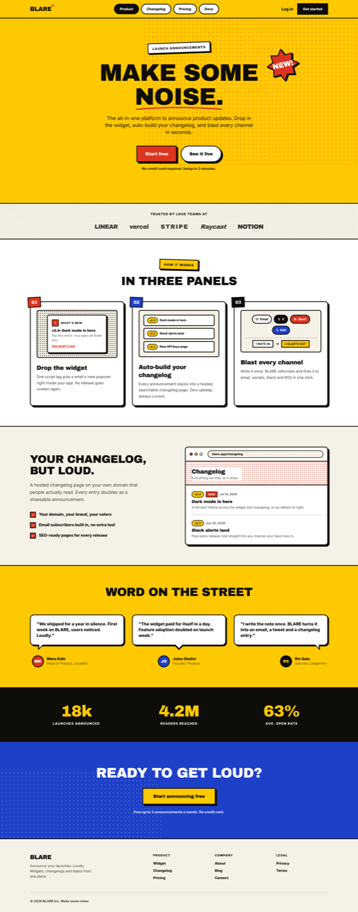

# Pop Art Landing Page (Comic Halftone Product Site, Yellow + Red)

A bold pop art landing page for a SaaS product, done as a comic-print website: ben-day halftone dot fields, thick ink outlines with hard offset shadows, a rotated NEW! starburst badge, numbered comic panels for the how-it-works section, and speech-bubble testimonials. A sun-yellow canvas with signal-red and process-blue accents, Archivo Black display type and Inter body. The full landing skeleton is here: pill nav, oversized hero with CTA pair, logo strip, three feature panels, a browser-mock changelog preview, testimonials, a stat band, a blue closing CTA and footer. Copy it for any product launch site, developer tool, or brand that wants loud retro-print personality without losing conversion structure.



## Prompt

```text
{
  "summary": "A complete, responsive pop-art comic-print marketing landing page for a fictional SaaS ('BLARE', a product-launch announcement tool), frameless and fully responsive. Eight bands in a deliberate color rhythm: (1) a sticky sun-yellow top bar with an Archivo Black wordmark carrying a tiny red starburst, a center row of pill nav links where one is a solid-ink pill, and a Log in link plus a solid-ink Get started button with a hard yellow offset shadow; (2) a yellow hero with a red ben-day dot field fading in from the top-right, a rotated white eyebrow chip reading LAUNCH ANNOUNCEMENTS, a huge Archivo Black headline 'MAKE SOME NOISE.' with a thick red SVG marker stroke under NOISE and a rotated red 16-point SVG starburst NEW! badge at its corner, a two-line subhead, a red Start free button and a white pill See it live button (both 3px ink border + hard shadow), and a reassurance microline; (3) a newsprint social-proof strip between 3px rules with five text-only wordmarks; (4) a white HOW IT WORKS section titled IN THREE PANELS: three white comic panels with 3px ink borders, hard 6px offset shadows and rotated numbered corner chips (01 red, 02 blue, 03 ink), each holding a mini product mock (an in-app what's-new popover on a dot-screen backdrop; a stacked mini changelog list with yellow version pills; a channel-chip cluster with a '1 note in -> 4 blasts out' fan-out row); (5) a newsprint split section: left a YOUR CHANGELOG, BUT LOUD. headline with body copy and a three-item checklist with red check squares, right a browser-chrome mock (outlined traffic-light dots + URL pill) showing a changelog page whose masthead sits on a red halftone screen, with version pills, a red NEW tag, dates and entries; (6) a yellow WORD ON THE STREET testimonial band: three ink-outlined white speech bubbles with true triangular tails (left, center, right), each above a flat two-tone initial avatar with name and role; (7) an ink stat band with three giant yellow Archivo Black numerals (18k launches announced, 4.2M readers reached, 63% avg. open rate); (8) a process-blue CTA band with sparse white dots, a white READY TO GET LOUD? headline and a yellow square CTA, then a newsprint footer with a 3px ink top rule, wordmark, tagline, three link columns and a legal line.",
  "style": {
    "description": "1960s pop art / comic print applied as a disciplined web style. A saturated sun-yellow canvas (#ffc900) with near-black ink (#0f0d0a), signal red (#dc341e) and process blue (#1e40c9) accents, white panels and a warm newsprint (#f6f1e6) alternating band. Everything is drawn with 3px ink outlines and HARD zero-blur offset shadows (6px 6px 0), never soft shadows or gradients. Ben-day halftone dot fields (CSS radial-gradient at 8px and 16px screen scales) texture the hero, the logo strip, the changelog masthead and the CTA band like real print screens. Type is Archivo Black for display (poster-grade, no novelty comic fonts) and Inter for UI/body, with hierarchy from size. Comic motifs are structural, not stickers: numbered panel corner chips, a rotated SVG starburst badge, speech-bubble testimonials with real tails, and a red marker underline in the headline. Whitespace inside panels stays generous, so the page reads loud but never cluttered.",
    "prompt": "Use a saturated sun-yellow page canvas (#ffc900) with near-black ink (#0f0d0a), signal red (#dc341e), process blue (#1e40c9), white panels, and a warm newsprint (#f6f1e6) alternating band. Draw every card, chip and button with a 3px solid ink border and a HARD offset shadow (box-shadow: 6px 6px 0 ink, zero blur); never use soft shadows, gradients, or any purple. Add ben-day halftone dot fields with CSS radial-gradient (circle, color 1.5-2px, transparent) at 8px and 16px background-size, in red, ink and white, as backdrop screens on the hero corner, band edges and mock mastheads. Set display type in Archivo Black only (all-caps, tight tracking, hero at clamp(44px, 8vw, 96px)) and body/UI in Inter 400/600/800; do not use novelty comic fonts. Express the comic register through structure: rotated numbered corner chips on panels, a rotated 16-point SVG starburst badge, ink-outlined speech bubbles with CSS-triangle tails, a thick red SVG marker underline under one headline word, and interactive states that translate 2px into their shadow. Keep whitespace inside panels generous and copy short so the page stays a product landing, not a collage."
  },
  "layout_and_structure": {
    "description": "A vertical scroll of eight full-width bands with a deliberate background rhythm (yellow, newsprint, white, newsprint, yellow, ink, blue, newsprint): sticky pill-nav top bar; centered hero with dot field, eyebrow chip, display headline + starburst, subhead, CTA pair, microline; logo strip between rules; three-panel how-it-works grid; two-column product preview (copy + checklist beside a browser-chrome changelog mock); three-column speech-bubble testimonial band; three-column stat band; centered CTA band; four-column footer. All grids collapse to one column at mobile with the type clamped down; zero horizontal overflow at 390px and 1440px.",
    "prompts": [
      {
        "part": "Top bar",
        "prompt": "A sticky top bar on the yellow canvas with a 3px ink bottom border. Left: an Archivo Black wordmark with a tiny red SVG starburst at its top-right corner. Center (desktop): four pill nav links with 3px ink borders, the first a solid-ink pill with white text, the rest white pills. Right: a plain bold Log in link and a solid-ink Get started button with a hard yellow offset shadow that translates into its shadow on hover."
      },
      {
        "part": "Hero",
        "prompt": "A centered hero on yellow with a red ben-day dot field (radial-gradient dots, 16px screen, ~40% opacity, rounded bottom-left corner) covering the top-right area. Stack: a slightly rotated white eyebrow chip with 3px ink border and tracked-caps label; an Archivo Black headline at clamp(44px, 8vw, 96px) with the last word underlined by a thick red SVG marker stroke and a rotated red 16-point SVG starburst badge with white NEW! text overlapping the headline corner (scale the badge down on mobile so it never covers text); a two-line medium subhead; a CTA row of a red square-cornered primary button and a white pill secondary button, both with 3px ink borders and hard ink shadows; a small bold reassurance line."
      },
      {
        "part": "Social proof strip",
        "prompt": "A full-width newsprint (#f6f1e6) strip with 3px ink rules top and bottom and a faint ink dot screen. A centered tracked-caps label (TRUSTED BY LOUD TEAMS AT) over a wrapping row of five text-only brand wordmarks set in the display face with varied tracking and case."
      },
      {
        "part": "Feature panels",
        "prompt": "A white section with a rotated yellow eyebrow chip (HOW IT WORKS) and a big display title (IN THREE PANELS). Below, a 3-column grid (stacking on mobile) of white comic panels: 3px ink borders, 12px radius, hard 6px shadows, and a rotated numbered corner chip hanging off the top-left (01 red, 02 blue, 03 ink, white display numerals). Each panel holds a mini mock in a newsprint inset (an in-app what's-new popover card on a dot screen; a stacked mini changelog list with yellow version pills; a cluster of channel chips with a dashed divider and a '1 note in -> 4 blasts out' chip row), then a display panel title and a short body paragraph."
      },
      {
        "part": "Product preview",
        "prompt": "A newsprint two-column section (stacking on mobile): left, a display headline (YOUR CHANGELOG, BUT LOUD.), a lead paragraph, and a three-item checklist where each item has a red square check tile with 3px ink border; right, a browser-chrome mock card (3px ink border, hard shadow): a chrome bar with three outlined traffic-light dots and a pill URL field, a masthead sitting on a red halftone screen with the page title on a white backing block, and two changelog entries with yellow version pills, a red NEW tag, dates, entry titles and one-line descriptions, separated by a dashed rule."
      },
      {
        "part": "Testimonials",
        "prompt": "A yellow band with a centered display title (WORD ON THE STREET) and a 3-column grid (stacking on mobile). Each column: a white speech bubble with 3px ink border, 16px radius and a hard shadow, plus a REAL triangular tail built from stacked CSS border triangles (ink outline + white fill) pointing down-left, down-center and down-right respectively; below the tail, a flat two-tone circular initial avatar (red, blue, ink fills) with 3px ink border beside a bold name and a muted role line."
      },
      {
        "part": "Stat band",
        "prompt": "A full-width near-black ink band with a 3-column centered grid: giant yellow Archivo Black numerals (clamp 40-64px) over white tracked-caps labels (LAUNCHES ANNOUNCED, READERS REACHED, AVG. OPEN RATE)."
      },
      {
        "part": "CTA band + footer",
        "prompt": "A process-blue full-bleed band with a sparse white dot screen rising from one corner, a centered white display headline (READY TO GET LOUD?), a yellow square CTA button with ink text, 3px ink border and hard ink shadow, and a small white reassurance line. Then a newsprint footer with a 3px ink top rule: wordmark and two-line tagline on the left, three tracked-caps link columns (Product, Company, Legal) of bold ink links with red underline hovers, and a muted legal line under a soft top rule."
      }
    ]
  },
  "special_ui_components": [
    {
      "component": "Ben-day halftone dot fields",
      "description": "Print-style dot screens as pure-CSS backdrops at varied scales.",
      "prompt": "Create halftone utilities with background-image: radial-gradient(circle, <color> 1.5px to 2px, transparent) and background-size 8px or 16px. Use a red 16px screen at ~40% opacity as the hero backdrop (rounded inner corner), a faint ink 8px screen on the logo strip, a red 8px screen behind the changelog masthead, and a white 16px screen at ~25% opacity rising from a corner of the blue CTA band."
    },
    {
      "component": "Hard-shadow comic panel with numbered corner chip",
      "description": "The how-it-works cards drawn as numbered comic frames.",
      "prompt": "Give each panel a white fill, 3px solid ink border, 12px radius and box-shadow: 6px 6px 0 ink (zero blur). Hang a slightly rotated chip off the top-left corner (absolute, negative offsets): a colored fill (red, blue or ink), 3px ink border, white Archivo Black numeral (01 / 02 / 03)."
    },
    {
      "component": "Speech-bubble testimonial with true tail",
      "description": "Quote cards that read as comic speech bubbles, not styled rectangles.",
      "prompt": "Build each bubble as a relative white card (3px ink border, 16px radius, hard 4px shadow) with two stacked CSS border-triangles as the tail: an ink triangle (border-width ~22px) at bottom offset -22px and a white triangle (border-width ~14px) at -14px layered above it, so the tail reads outlined. Vary tail anchor per column (left 30px, centered, right 30px) and point each tail toward its avatar below."
    },
    {
      "component": "Rotated SVG starburst NEW! badge",
      "description": "The classic pop-art price-sticker burst, anchored to the headline.",
      "prompt": "Draw a 16-point star polygon in an SVG (fill signal red, 3px ink stroke, round joins), rotate the wrapper about -8deg, add a hard drop shadow, and center white Archivo Black NEW! text rotated -5deg inside. Absolutely position it overlapping the headline's top-right corner; shrink it (about w-16) and raise it on mobile so it never covers the headline text."
    },
    {
      "component": "Red marker underline",
      "description": "A thick hand-drawn-feeling stroke under the key headline word.",
      "prompt": "Wrap the last headline word in a relative inline-block span and place an absolute SVG beneath the baseline (full width, ~20px tall, preserveAspectRatio none, z-index behind the text) containing a gently curved filled path in signal red, so it reads as one confident marker stroke."
    },
    {
      "component": "Browser-chrome changelog mock",
      "description": "A believable product preview inside a comic-outlined browser frame.",
      "prompt": "Compose a card with a 3px ink border, 12px radius and hard shadow: a chrome bar of three small circles (red fill, yellow fill, white fill, each 2px ink border) plus a pill URL field; a masthead area carrying a red 8px halftone screen where the page title sits on a solid white backing block so it stays legible; then entries with yellow version pills (2px ink border, full radius), an uppercase red NEW tag chip, muted dates, bold entry titles and one-line descriptions, divided by a dashed ink rule at 30% opacity."
    },
    {
      "component": "Press-down interactive states",
      "description": "Buttons that physically press into their hard shadows.",
      "prompt": "On hover, translate buttons 2px right and down while shrinking the hard shadow to 4px 4px 0; on active, translate the full 6px and remove the shadow entirely, so every button presses flat like a printed sticker. Apply the same treatment to nav pills and both hero CTAs."
    }
  ]
}
```
