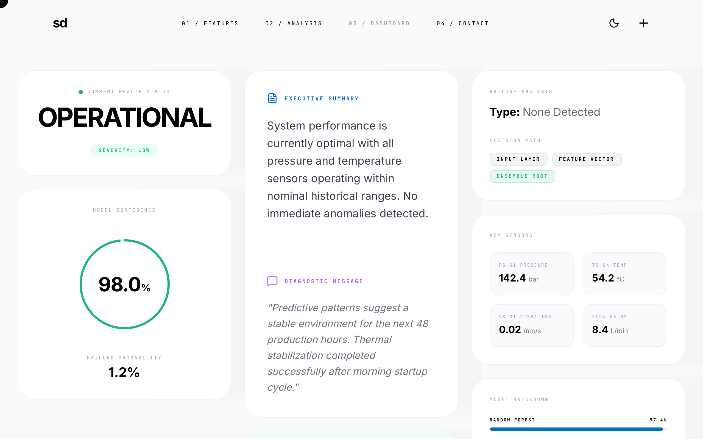

# PredictAI - Results Analysis Dashboard

Bold editorial dashboard style featuring extreme typographic contrast, high-tech minimalism, and a sophisticated dark/light mode execution. Ideal for SaaS analytics, fintech, manufacturing AI monitoring, and data-intensive performance tracking. Key features include a custom blending-mode cursor, monospaced metadata, and a three-column bento-grid layout with staggered reveal animations and precise 1px borders.



## Prompt

```text
{
  "summary": "A high-contrast, editorial-style results dashboard designed for clarity and technical sophistication. It utilizes a clean grid system, heavy geometric sans-serif headlines paired with monospaced technical labels, and a distinct emerald-green accent for health indicators. The interface features a custom interactive cursor and smooth staggered entry animations.",
  "style": {
    "description": "The design follows a 'Bold Editorial' aesthetic with a focus on information hierarchy and micro-interactions. It pairs 'Inter' for body and display text with 'JetBrains Mono' for technical data. The color palette is strictly monochrome (Black #000000, White #FFFFFF, Dark #0A0A0A) with functional accents: Emerald #1DB584 (Success), Blue #0070C0 (Informational), and Purple (Secondary Analysis). Animations are characterized by a precise cubic-bezier(0.16, 1, 0.3, 1) curve for 'reveal-up' effects and theme transitions.",
    "prompt": "Implement a design system using 'Inter' for general UI (Weight 400/700, letter-spacing -0.02em to -0.05em) and 'JetBrains Mono' for metadata (Weight 400, 11px, uppercase, letter-spacing 0.2em). Use a base background of #FFFFFF (Light) and #0A0A0A (Dark). Primary accent is #1DB584 for health states, and #0070C0 for secondary data. All cards should have 32px border-radius, 1px borders at 5-10% opacity, and subtle shadow (0 4px 30px rgba(0,0,0,0.02)). Implement a custom cursor: 32px circle, 1px border, mix-blend-mode: difference, scaling 2.5x on hover over interactive elements. Transitions must use cubic-bezier(0.16, 1, 0.3, 1) with 500ms duration for theme switching and 1000ms for staggered entry animations."
  },
  "layout_and_structure": {
    "description": "A responsive 12-column grid layout that organizes content into three primary vertical streams on desktop. Top-level navigation is fixed with high-contrast interactions.",
    "prompts": [
      {
        "part": "Navigation",
        "prompt": "Fixed header with mix-blend-mode: difference. Left-aligned bold lowercase logo. Center-aligned horizontal list of monospaced links formatted as '01 / Text'. Right-aligned theme toggle (Moon/Sun icon) and 'Plus' icon menu. Horizontal padding: 24px (Mobile) / 96px (Desktop). Vertical padding: 24px."
      },
      {
        "part": "Hero Status Section",
        "prompt": "Top-left card (4-column width on desktop). Displays health status. Includes a small pulsing green dot (#1DB584), a monospaced 'Current Health Status' label, a massive 'OPERATIONAL' bold uppercase headline, and a pill-shaped badge indicating severity level with 10% opacity emerald background."
      },
      {
        "part": "Metric Column (Left)",
        "prompt": "Secondary card below status. Features a large SVG circular progress ring (Stroke width: 4px, Color: #1DB584, Radius: 80). Center the percentage in 4xl bold text. Below the ring, show a monospaced label and a secondary large metric (e.g., probability percentage) in 2xl font weight."
      },
      {
        "part": "Analysis Column (Center)",
        "prompt": "Large vertical card (4-column width). Features an 'Executive Summary' section with 20px leading-relaxed text. A horizontal divider (1px border-top, 5% opacity) separates the summary from a 'Diagnostic Message' section featuring italicized font-size 18px text. Bottom section includes a 'Recommendation' card with a 48px square rounded icon container (Emerald #1DB584 bg) and a large checkmark icon."
      },
      {
        "part": "Technical Column (Right)",
        "prompt": "Stack of three cards. 1. Decision Path: horizontal flex container of monospaced badges with 1px borders. 2. Key Sensors Grid: 2x2 grid of small cards displaying technical values with units in 50% opacity text. 3. Model Breakdown: Three horizontal progress bars (1.5px height) using Blue (#0070C0), Purple, and Emerald colors, each with top-aligned labels and percentage values."
      }
    ]
  },
  "special_ui_components": [
    {
      "component": "Interactive Blending Cursor",
      "description": "A floating circle that follows the mouse with a lag effect and changes visual state over hoverable items.",
      "prompt": "CSS: Set 'cursor: none' on body. Create a 32px circle div with 'pointer-events: none', 'mix-blend-mode: difference', and 'position: fixed'. Use JS 'requestAnimationFrame' to follow the cursor position with a 0.15 easing factor. On mouseenter of 'a, button, card', apply 'transform: scale(2.5)' and increase border thickness."
    },
    {
      "component": "Animated Circular Progress",
      "description": "A SVG stroke-based ring that animates on page load.",
      "prompt": "SVG element with two circles (background ring at 5% opacity, foreground ring in #1DB584). Use 'stroke-dasharray' (502.65 for radius 80) and 'stroke-dashoffset'. Animate the dashoffset from total circumference to the value representing the percentage using the system easing curve over 1.5s."
    },
    {
      "component": "Monospaced Metadata Badges",
      "description": "Highly structured labels for technical data points.",
      "prompt": "Small text (9px-11px), font: 'JetBrains Mono', uppercase, letter-spacing: 0.2em. Background: rgba(255,255,255, 0.05) or rgba(0,0,0,0.05). Border: 1px solid 10% opacity. Rounded corners: 6px."
    }
  ]
}
```

**▶ Try it live → [https://superdesign.dev/library/predictai-results-analysis-dashboard](https://superdesign.dev/library/predictai-results-analysis-dashboard)**

*14 copies · 2,492 tries · tags: *
