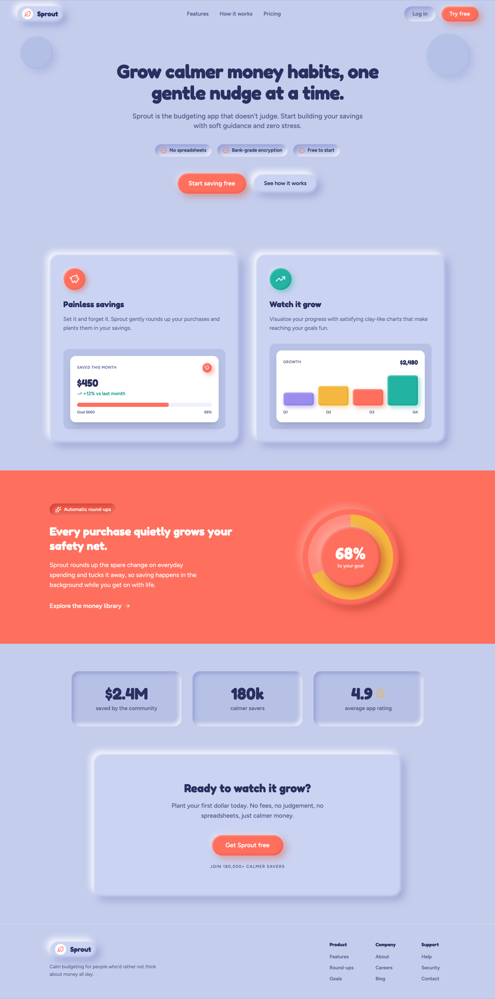

# Puffy Cornflower + Coral Budgeting App Landing Page

A puffy claymorphism landing page for a calm budgeting and savings app on a cool cornflower ground with one warm coral accent: an airy nav, a big rounded hero with trust bullets and dual CTAs, two feature cards with white app-widget mockups (a savings card and a colored-bar growth chart), a full-bleed coral band with a soft savings ring, a stat strip, a closing CTA and a footer. Reusable for any friendly, high-contrast soft-UI / neumorphism marketing site that must not wash out.



## Prompt

```text
{
  "summary": "A full desktop SaaS marketing LANDING PAGE whose entire personality is CLAYMORPHISM: soft, puffy, extruded surfaces built purely from layered CSS box-shadows (raised panels, recessed inset wells, pressed pills) on a cool cornflower/periwinkle clay ground #c4cdec with deep-indigo ink #2a3160 and ONE warm coral accent #ff6f5e. Fredoka (700/600) carries a big rounded H1 (~56px, clamp) and section headings; Figtree carries the lead and body. Structure top to bottom: an AIRY STICKY NAV (a raised clay logo chip holding a coral leaf glyph + a 'Sprout' wordmark on the left, center ghost text links Features / How it works / Pricing, and on the right a recessed clay 'Log in' pill + a filled coral clay 'Try free' pill). A CENTERED HERO: a bold indigo H1 ('Grow calmer money habits, one gentle nudge at a time.'), a muted 18px lead, a single ROW OF THREE recessed clay trust-bullet chips each with a small coral check glyph ('No spreadsheets', 'Bank-grade encryption', 'Free to start'), then a CTA ROW of a filled coral clay pill ('Start saving free') + a raised ghost clay pill ('See how it works'), with two very soft clay orbs as faint corner ambiance. TWO SIDE-BY-SIDE RAISED CLAY FEATURE CARDS: each has a jewel clay icon well (card 1 coral piggy-bank, card 2 teal trend arrow), a 24px heading, a body line, and a WHITE app-widget mockup for value contrast (card 1: a 'Saved this month' card with an ink $450, a teal '+12% vs last month' delta, a coral progress bar and a 'Goal $660 / 68%' legend; card 2: a 'Growth $2,480' chart of four colored clay bars - lilac, marigold, coral, teal - over Q1-Q4). A FULL-BLEED SATURATED CORAL BAND (#ff6f5e, white type) with an 'Automatic round-ups' pill, a heading, a lead, a white text link, and a big extruded clay SAVINGS RING (a conic-gradient marigold arc at 68% inside stacked coral clay discs with a white '68% to your goal' center). A THREE-UP RECESSED CLAY STAT STRIP with big ink numerals ($2.4M saved / 180k savers / 4.9 rating). A CLOSING CTA on one large raised clay panel ('Ready to watch it grow?' + a coral 'Get Sprout free' pill + a tiny uppercase social-proof caption). A CLAY FOOTER (logo chip + tagline + Product/Company/Support columns). Everything rounded and puffy, generous spacing, no flat borders, no hard corners. CRITICAL: keep the headline, the primary CTAs, and the key numbers the highest-contrast elements so the clay never washes to one tonal value. Fully responsive - fluid widths, clamped headline, nav collapses, the hero cards and coral band stack, no horizontal overflow at 390px or 1440px.",
  "style": {
    "description": "Claymorphism / soft-UI marketing register - a calm, friendly, confident landing where every surface is a puffy extruded piece of clay. Ground is a cool cornflower/periwinkle #c4cdec; raised clay panels are a touch lighter #cad3f1, recessed wells a touch darker #b7c1e6. Primary text is deep-indigo #2a3160 (the value anchor), muted text #5b628f. ONE warm coral accent #ff6f5e is reserved for primary CTAs and one full-bleed feature band; supporting jewel accents (teal #22b3a3, marigold #f4b73f, lilac #9b8cf0) appear ONLY as feature-card icon wells and the growth-chart bars. ONE rounded display face (Fredoka 700/600) carries the H1 and section headings; ONE body face (Figtree 400/500/600) carries the lead and body, with hierarchy from size and weight. Everything is rounded - cards ~26px, pills fully rounded (999px), icon wells circular. The clay material is pure CSS: a raised surface uses an outer light top-left highlight + an outer dark bottom-right shadow + a light inset top-left + a dark inset bottom-right; a recessed well inverts that with two inset shadows only; the coral CTA is a raised coral with a warm coral-deep shadow and a white inner gloss. HARD anti-washout rule: because clay collapses onto one tonal value when it goes monochrome, the load-bearing elements (headline, primary CTA, key numbers, product-demo widgets) must be the STRONGEST, highest-contrast things on screen - the demos sit on true-white cards so their ink numerals and colored fills read instantly. Calm and playful, never toy-ish or dated; no JavaScript is needed for the visible frame.",
    "prompt": "Design a full desktop SaaS landing page whose entire personality is CLAYMORPHISM built purely from layered CSS box-shadows, no JavaScript. Use a cool cornflower/periwinkle clay ground #c4cdec, raised clay panels #cad3f1, recessed wells #b7c1e6, deep-indigo ink #2a3160 and muted #5b628f. Reserve ONE warm coral accent #ff6f5e for primary CTAs and one full-bleed band; use jewel accents (teal #22b3a3, marigold #f4b73f, lilac #9b8cf0) ONLY for feature-card icon wells and chart bars. Set the H1 (~56px, clamp) and section headings in Fredoka 700/600 and the lead/body in Figtree; build hierarchy from size and weight. Round everything: cards ~26px, buttons as fully-rounded pills, icon wells circular. Make the clay material as reusable CSS classes: raised = box-shadow of an outer light top-left highlight + an outer dark bottom-right shadow + a light inset top-left + a dark inset bottom-right; inset = two inset shadows only; a coral CTA = a raised coral with a coral-deep shadow and a white inner gloss. ENFORCE value contrast so the clay never washes out: the headline, the primary CTAs, and every key number must be the highest-contrast things on screen, and put product-demo widgets on TRUE-WHITE cards with ink numerals and colored fills. Calm, friendly, confident, playful but not toy-ish; no default indigo/violet gradient, no flat borders, no hard corners."
  },
  "layout_and_structure": {
    "description": "A vertical marketing page anchored on a real measured landing's furniture. Top: an airy STICKY NAV (raised clay logo chip + wordmark left, center ghost links, a recessed 'Log in' pill + a coral 'Try free' pill right). HERO (centered): a big bold indigo H1, a muted lead, a single ROW of three recessed clay trust-bullet chips with coral checks, then a CTA row (filled coral pill + raised ghost pill), with two very soft clay orbs as faint corner ambiance. TWO SIDE-BY-SIDE RAISED CLAY FEATURE CARDS, each: a jewel clay icon well, a heading, a body line, and a WHITE app-widget mockup (a savings card with a progress bar; a growth chart of colored clay bars). A FULL-BLEED SATURATED CORAL BAND: left a pill + heading + lead + white text link, right a big extruded clay savings RING (conic-gradient arc inside stacked coral clay discs). A THREE-UP RECESSED CLAY STAT STRIP with big ink numerals. A CLOSING CTA on one large raised clay panel (heading + coral pill + tiny social-proof caption). A CLAY FOOTER (logo + tagline + three link columns). On a narrow viewport the nav collapses to a compact bar (center links hide), the two hero cards stack full-width, the coral band stacks the ring above the copy, and the headline steps down via clamp.",
    "prompts": [
      {
        "part": "Sticky nav",
        "prompt": "Build an airy, borderless STICKY top nav on the cornflower ground. Left: a raised clay logo CHIP (a puffy rounded-pill container) holding a small white circular disc with a coral leaf glyph + a Fredoka 700 'Sprout' wordmark. Center (hidden below md): ghost text links Features / How it works / Pricing in Figtree 600 muted #5b628f that darken to ink on hover. Right: a recessed clay 'Log in' pill (inset shadow, muted label) + a filled CORAL clay 'Try free' pill (white 700 label). Keep it light and floating, no bottom border."
      },
      {
        "part": "Hero headline + trust bullets + CTAs",
        "prompt": "Center a big bold H1 in Fredoka 700 at clamp(2.5rem,5vw,3.5rem), line-height 1.1, -1px tracking, deep-indigo #2a3160 (e.g. 'Grow calmer money habits, one gentle nudge at a time.'). Under it an 18px/500 muted lead. Then a single centered ROW of THREE recessed clay trust-bullet CHIPS (inset shadow, each with a small coral check-circle glyph + a 14px/600 ink label: 'No spreadsheets', 'Bank-grade encryption', 'Free to start'), wrapping on narrow. Then a CTA row: a filled CORAL clay pill ('Start saving free') + a raised ghost clay pill ('See how it works'). Place two very soft, low-opacity clay orbs in the top corners as faint ambiance only (never competing with the CTA)."
      },
      {
        "part": "Two feature cards",
        "prompt": "A responsive grid of TWO large side-by-side RAISED clay cards (stacking on narrow), generous padding. Each card: a circular JEWEL clay icon well (card 1 coral with a white piggy-bank glyph, card 2 teal with a white trend-up glyph), a Fredoka 700 ~24px heading, a muted body line, and - pinned to the card bottom - a WHITE app-widget mockup on a recessed clay tray for real value contrast. Card 1 widget: a white card, an uppercase muted 'Saved this month' label + a small coral piggy chip, a Fredoka 700 ink '$450', a teal '+12% vs last month' delta, a coral progress bar on a pale track, and a 'Goal $660 / 68%' legend. Card 2 widget: a white card, a 'Growth' label + an ink '$2,480', a row of FOUR colored clay bars (lilac 40%, marigold 60%, coral 50%, teal 92%) with Q1-Q4 labels."
      },
      {
        "part": "Full-bleed coral feature band + savings ring",
        "prompt": "A full-bleed SATURATED coral #ff6f5e band, white type. Left column: a recessed coral 'Automatic round-ups' pill, a Fredoka 700 white heading ('Every purchase quietly grows your safety net.'), an 18px lead, and a white text link with a right-arrow ('Explore the money library'). Right column: a big extruded clay SAVINGS RING - an outer coral clay disc, a conic-gradient ring (marigold #f4b73f filling 68%, a translucent white track for the rest), and an inner coral clay disc holding a Fredoka 700 white '68%' + a small 'to your goal' caption. Tune the clay shadows warm (white highlight + a darker coral shadow) so the puffy surfaces still read on the coral. On narrow, stack the ring above the copy."
      },
      {
        "part": "Stat strip + closing CTA + footer",
        "prompt": "A THREE-UP grid of RECESSED clay stat WELLS on the cornflower ground, each a big Fredoka 700 INK numeral ($2.4M / 180k / 4.9 with a small marigold star) + a muted caption ('saved by the community', 'calmer savers', 'average app rating'); numerals stay ink for contrast. Then a CLOSING CTA on one large RAISED clay panel, centered: a Fredoka 700 ink heading ('Ready to watch it grow?'), a muted lead, one big CORAL clay pill ('Get Sprout free'), and a tiny uppercase muted social-proof caption. Close on a clay FOOTER: the raised logo chip + wordmark, a short tagline, and three link columns (Product / Company / Support) in muted labels."
      }
    ]
  },
  "special_ui_components": [
    {
      "component": "Pure-CSS clay material system",
      "description": "The whole aesthetic is three reusable box-shadow recipes, so it needs no images and reproduces faithfully from a static template. Raised = puffy panels/buttons; inset = recessed wells, pressed pills and inputs; a coral variant for the primary CTA.",
      "prompt": "Define three CSS classes. .clay-raised { border-radius:26px; background:#cad3f1; box-shadow: -9px -9px 18px rgba(255,255,255,0.85), 10px 10px 22px rgba(120,131,196,0.50), inset 2px 2px 3px rgba(255,255,255,0.55), inset -3px -3px 6px rgba(120,131,196,0.35); }. .clay-inset { border-radius:22px; background:#b7c1e6; box-shadow: inset 6px 6px 12px rgba(120,131,196,0.55), inset -6px -6px 12px rgba(255,255,255,0.80); }. .clay-cta { background:#ff6f5e; color:#fff; border-radius:999px; box-shadow: -6px -6px 14px rgba(255,255,255,0.30), 9px 9px 20px rgba(226,84,63,0.45), inset 2px 2px 3px rgba(255,255,255,0.45), inset -3px -3px 6px rgba(226,84,63,0.55); } with a pressed :active state that flips to inset shadows. Reuse these everywhere; tint the jewel icon wells by swapping the shadow hue."
    },
    {
      "component": "Clay savings ring (conic-gradient progress)",
      "description": "A copy-worthy circular progress gauge that reads as extruded clay on the coral band, built with a CSS conic-gradient and no SVG (so no viewBox/seam risk).",
      "prompt": "Nest three elements: an outer coral clay disc (a .clay-on-coral circle with padding), a middle ring layer with background: conic-gradient(#f4b73f 0% 68%, rgba(255,255,255,0.20) 68% 100%) filling it, and an inner coral clay disc that covers the center and leaves the ring visible, holding a Fredoka 700 white '68%' and a small 'to your goal' caption. Give .clay-on-coral warm shadows (a soft white top-left highlight + a darker coral bottom-right shadow + matching insets) so the puffiness survives on the saturated coral."
    },
    {
      "component": "White app-widget demos on clay cards (anti-washout)",
      "description": "The two feature-card mockups deliberately break out of the periwinkle tonal band onto true-white cards so the product proof is the most readable thing on the card - the fix that keeps a clay page from washing to one value.",
      "prompt": "Inside each raised feature card, place a recessed clay tray holding a WHITE rounded card. Widget A (savings): an uppercase muted 'Saved this month' label, a small coral piggy chip, a Fredoka 700 ink '$450', a teal '+12% vs last month' delta with a trend glyph, a coral progress bar (68%) on a pale #eef1fb track, and a muted 'Goal $660 / 68%' legend. Widget B (growth): a muted 'Growth' label + an ink '$2,480', and four end-aligned rounded clay bars tinted lilac / marigold / coral / teal at 40 / 60 / 50 / 92 percent height, with Q1-Q4 labels. Keep all numerals ink and all fills saturated for contrast."
    }
  ]
}
```
