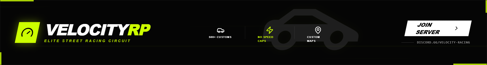

# PULSE X RP - Maximum Intensity Cinematic Racing Banner

High-intensity cinematic racing banner design featuring a dark mode aesthetic with aggressive neon red (#ff0040) accents. The style combines brutalist typography, glitch effects, and motion-blur animations. Ideal for gaming communities, GTA RP servers, automotive sports, and high-energy e-sports branding. Characterized by skewed elements, lightning-strike flash effects, and motion streaks that simulate speed.



## Prompt

```text
{
  "summary": "An ultra-wide, high-octane racing banner with a black background, vibrant neon red highlights, and aggressive italicized typography. The design uses layered animations including motion streaks, glitch overlays, and lightning flashes to create a sense of extreme speed and chaos.",
  "style": {
    "description": "Brutal/Cinematic Racing style using a high-contrast palette of Black (#030303), Neon Red (#ff0040), and White. Typography features heavy weights (900) and italicized headers for speed. Visual effects include 15-degree skews, motion streaks, fire-flicker glows, and digital glitch distortion.",
    "prompt": "Create a design system with a 'Cinematic Underground' theme. Primary Color: Neon Red (#ff0040) with a glow intensity of 20px-50px. Background: Deep Black (#030303) with grayscale, high-contrast photographic textures (200% contrast, 0.2 brightness). Typography: Headers use 'Tanker' or similar heavy-impact sans-serif, italicized, with tight tracking. Body text uses 'Satoshi' or 'Inter' at 900 weight with wide letter spacing (0.4em to 0.6em). Animations: Implement lightning strikes using opacity shifts (95% white flash, 96% neon red flash), and motion streaks using skewed white and red lines (#ff0040) traveling horizontally at 0.6s linear loops. Borders should be sharp, with occasional 4px accent frames on corners."
  },
  "layout_and_structure": {
    "description": "A horizontal wide-aspect layout divided into three main zones: Branding (Left), Feature/Impact (Center), and Action/Socials (Right).",
    "prompts": [
      {
        "part": "Background & Atmospheric Layers",
        "prompt": "Apply a grayscale, high-contrast image of a vehicle or urban environment as the base. Overlay a horizontal gradient (Black -> Transparent -> Black). Add 'Motion Streaks': absolute-positioned lines (h: 1px to 2px, w: 250px+) that animate from right to left with a -45deg skew. Include a 'Fire Layer' at the bottom using blurred (#ff0040) radial gradients with a 0.2s flicker animation."
      },
      {
        "part": "Left: Branding & Identity",
        "prompt": "Position a brand title section. Top element: A 1.5px high horizontal bar in Neon Red (#ff0040) with a pulse animation, followed by sub-header text with 0.6em tracking. Main Title: Huge 8xl font size, black weight, italicized, featuring the primary brand name. Use text-shadow (0 0 50px) to give the text a neon glow."
      },
      {
        "part": "Center: Impact Messaging",
        "prompt": "Place an 'Explosive Title' in the center. Use a bouncing animation on a 6xl italicized font. Background the text with a blurred red glow (#ff0040/20). Below the title, place two icon-text pairs (e.g., speedometers or fire icons) using animated icons that spin or pulse."
      },
      {
        "part": "Right: CTA & Navigation",
        "prompt": "Align elements to the right. Include a 'Sys-Ready' mono-spaced tag at the top. The primary CTA button is a large rectangle skewed at -12deg, filled with Neon Red (#ff0040), featuring a white 4px border-right. Upon hover, the button should transition to white background with black text. Add a social handle (e.g., Discord link) below with a high-tracking font and pulse animation."
      }
    ]
  },
  "special_ui_components": [
    {
      "component": "Skewed Impact Button",
      "description": "A high-intensity action button with motion-skew and sliding hover effect.",
      "prompt": "Shape: Rectangle with transform: skewX(-12deg). Color: #ff0040 background. Shadow: 0 0 60px rgba(255, 0, 64, 0.6). Hover Effect: A white overlay (#FFFFFF/30) slides from left-to-right on hover while the main background transitions to solid white. Typography inside must be heavy weight, all-caps, and italicized."
    },
    {
      "component": "Glitch Overlay",
      "description": "Full-screen or container-level noise and shake effect.",
      "prompt": "A fixed or absolute overlay with a 10px border in 10% opacity Neon Red. Apply a 'glitch-shake' animation using translate transformations (-5px to 5px) every 0.1s. Use 'mix-blend-mode: color-dodge' to make it react with underlying imagery."
    }
  ],
  "special_notes": "MUST maintain the -12 to -15 degree skew on all interactive elements to preserve the sense of forward motion. DO NOT use rounded corners; keep all edges sharp and industrial. MUST use lightning-strike flashes sparingly to avoid visual fatigue, but consistently enough to maintain energy. NOT suitable for light-mode applications."
}
```

**▶ Try it live → [https://superdesign.dev/library/pulse-x-rp-maximum-intensity-cinematic-racing-banner](https://superdesign.dev/library/pulse-x-rp-maximum-intensity-cinematic-racing-banner)**

*13 copies · 2,499 tries · tags: *
