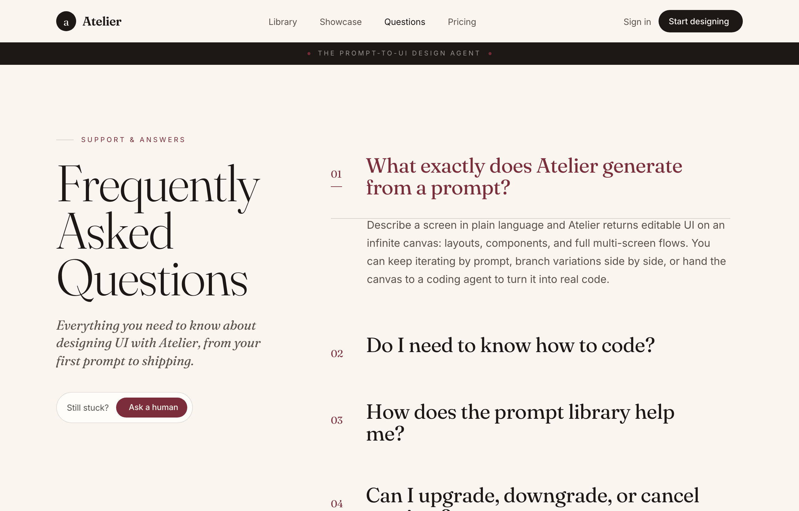

# Questions, Set in Serif — An Editorial FAQ

Editorial magazine-style FAQ page on a warm cream canvas: an oversized sticky Fraunces serif 'Frequently Asked Questions' title beside a hairline-ruled column of serif Q/A rows (numbered, rotating plus-to-x, one pre-opened in wine), an ink context band and footer, with a 'Question not here?' contact card.



## Prompt

```text
{"summary": "A warm, editorial magazine-style FAQ page. A near-full-height sticky oversized serif title block ('Frequently Asked Questions') sits in a left column beside a right reading column of hairline-ruled serif question/answer rows: each row is a tabular question number, a large Fraunces question, and a plus icon that rotates to an x and tints the open question wine. One row ships pre-opened. A full-bleed ink context band sits under the sticky nav, and a full-bleed ink footer plus an inline 'Question not here?' contact card close the page.", "style": {"description": "Refined editorial / print aesthetic on a warm paper palette. The page background is a cream #faf6ef with slightly lighter paper #fffdf9 cards; ink #1c1815 is the near-black text and the inverted nav-band/footer fill; inksoft #5a534c is the muted body grey; a single wine #7b2d3b accent (deepening to winedeep #5e2029 on hover) carries every highlight: question numbers, the open question color, list icons, the 'Ask a human' / 'Talk to us' pills and link underlines. Hairlines are a 13-16% ink rgba rule that reads as a fine engraved rule. Type pairs Fraunces (variable optical-size serif, used display/light for the giant title and questions, italic for lead/footer lines) with Inter (300-600) for body, UI and the 0.26em-tracked uppercase 'micro' eyebrows. Generous editorial whitespace, tabular-nums numerals, smooth cubic-bezier accordion easing, and a small wine ornament dot motif.", "prompt": "Design a warm editorial / print magazine aesthetic. Background cream #faf6ef; card surfaces paper #fffdf9; text ink #1c1815 with muted body inksoft #5a534c; one wine accent #7b2d3b deepening to winedeep #5e2029 on hover. Hairline rules use rgba(28,24,21,0.13-0.16). Set body, UI and uppercase eyebrows in Inter (weights 300/400/500/600); set the display title, every question and the italic lead/footer lines in Fraunces (a variable optical-size serif: light ~300-400 weight, font-optical-sizing auto, tight tracking ~-0.02em). Eyebrows are a 'micro' style: 10.5-11px, uppercase, letter-spacing 0.26em. Use tabular-nums for all numerals. Wine is the only accent: question numbers, the open-question text color, list bullet icons, the rounded-full 'Ask a human'/'Talk to us' buttons, link underlines and a small radial-dot ornament. Keep it airy with large vertical rhythm; transitions ease on cubic-bezier(0.16,1,0.3,1). Lucide icons via Iconify. text selection swaps to wine bg / cream text."}, "layout_and_structure": {"description": "A sticky cream nav, a full-bleed ink eyebrow context band, then a centered max-w-[1180px] two-column grid: a left sticky column with an oversized serif title + italic lead + a 'Still stuck?' pill, and a right max-w-[640px] reading column of hairline-ruled <details> Q/A rows ending in an inline contact card. A full-bleed ink footer closes the page.", "prompts": [{"part": "Sticky nav", "prompt": "A sticky top-0 z-50 header with a cream/88 translucent fill, a 2px blur backdrop and a 1px ink/10 bottom shadow. Inside, a max-w-[1180px] mx-auto px-6 md:px-10 row, 68px tall, items centered, space-between. Left: a brand lockup = a 32px ink-filled circle holding a lowercase cream serif 'a', next to a 20px Fraunces 600 'Atelier' wordmark. Center (hidden below md): nav links 'Library / Showcase / Questions / Pricing' in 14px inksoft, with the active 'Questions' link in ink. Right: a 14px 'Sign in' ghost link (hidden on small) and a solid ink rounded-full 'Start designing' pill with a lucide:arrow-up-right icon, hovering to wine."}, {"part": "Context band (full-bleed)", "prompt": "A full-width ink #1c1815 band directly under the nav, with cream/80 text. Centered inside a max-w-[1180px] row, py-2.5: a small wine radial-dot ornament, the 'micro' uppercase eyebrow 'THE PROMPT-TO-UI DESIGN AGENT' (10.5px, cream/55, 0.26em tracking), and a second matching ornament dot."}, {"part": "Left sticky title column", "prompt": "In a two-column grid (lg:grid-cols-[minmax(280px,360px)_1fr], gap-y-12 lg:gap-x-20) the left aside is lg:sticky lg:top-[112px]. It holds: a 'micro' wine eyebrow 'Support & Answers' preceded by a short 7-wide hairline rule; an oversized Fraunces light h1 reading 'Frequently / Asked / Questions' on three lines, leading 0.92, tracking -0.02em, font-size clamp(46px,7vw,82px); an italic Fraunces inksoft lead (~19-21px, max-w-[34ch]) 'Everything you need to know about designing UI with Atelier, from your first prompt to shipping.'; and a paper rounded-full pill (border ink/13) holding 'Still stuck?' text plus a small wine rounded-full 'Ask a human' button with a lucide:message-circle icon."}, {"part": "Q/A row (closed)", "prompt": "In the right max-w-[640px] column, each FAQ entry is a native <details class='group'>. A thin top hairline rule precedes the summary. The summary is a flex items-start row, gap-5 md:gap-7, py-7 md:py-8, list-marker hidden: a wine Fraunces tabular question number ('01'..'06', 15-16px, fixed 7-wide column); a flex-1 Fraunces normal-weight question (26px / md:33px, leading 1.06, tracking -0.015em); and a right lucide:plus icon (24-26px, ink). On hover the question text turns wine. The answer panel is collapsed via a grid-template-rows 0fr -> 1fr transition with opacity, so it is hidden when closed."}, {"part": "Q/A row (open / active)", "prompt": "Ship the first row (item 01, 'What exactly does Atelier generate from a prompt?') pre-opened. When open: the plus icon rotates 45deg into an x, the question text turns wine, and a tiny 18px wine underline dash appears beneath the question number. The answer panel expands (grid-rows 1fr, opacity 1) revealing an inksoft 16-17px answer paragraph indented to align under the question (pl-12 md:pl-[3.6rem], leading 1.72, max-w-[58ch]). Some answers use a serif lower-roman ordered list (i. / ii.) or a wine-icon bulleted list (lucide:arrow-up-right / arrow-down-right / x) with bold ink lead-ins."}, {"part": "Inline contact card + footer", "prompt": "After the last row and a closing hairline rule, an inline paper rounded-2xl card (border ink/13, px-7 py-8) flexes column on mobile / row on sm: a Fraunces 23-26px 'Question not here?' heading + an inksoft sub-line 'Real people read every message. We usually reply within a few hours.', and a wine rounded-full 'Talk to us' pill with a lucide:send icon. Below everything, a full-bleed ink #1c1815 footer (cream/70) with the brand lockup (cream circle 'a' + 'Atelier'), an italic Fraunces tagline, a row of footer links (Library / Pricing / Questions / Status), a top cream/12 hairline, a copyright line and a 'micro' tagline."}]}, "special_ui_components": ["Oversized sticky serif title column (Fraunces light, clamp(46px,7vw,82px), three stacked lines) paired with a separate scrolling Q/A reading column", "Hairline-ruled native <details>/<summary> accordion rows (no JS) with a grid-template-rows 0fr->1fr open transition and opacity fade", "Plus-to-x toggle: a lucide:plus icon that rotates 45deg on open, with the open question text turning wine and a small wine underline dash under its number", "Full-bleed ink context band under the nav with a 'micro' uppercase eyebrow flanked by two wine radial-dot ornaments", "Mixed answer bodies: plain serif-indented paragraphs, a lower-roman serif ordered list (i./ii.), and a wine-icon bulleted list with bold ink lead-ins", "Warm-paper rounded-full pill buttons ('Ask a human' / 'Talk to us') and an inline paper 'Question not here?' contact card, plus a full-bleed inverted ink footer"], "special_notes": "Centered max-w-[1180px] container throughout; the FAQ uses a left sticky title column + a right max-w-[640px] reading column. Palette is fixed: cream #faf6ef base, paper #fffdf9 cards, ink #1c1815 text + inverted bands, inksoft #5a534c body, a single wine #7b2d3b accent (winedeep #5e2029 on hover). Fonts are Fraunces (display/serif, variable optical size) + Inter (body/UI). Icons are Lucide via Iconify. Exactly one row ships pre-expanded. Responsive: nav center links hide below md, the two columns stack on small screens, the title scales via clamp, and the contact card stacks to a column. No em-dashes in copy; voice is warm and human ('Still stuck?', 'ping us and we will sort it together', 'Real people read every message')."}
```

**▶ Try it live → [https://superdesign.dev/library/questions-set-in-serif-an-editorial-faq](https://p.superdesign.dev/draft/f68d678c-01ec-47a6-8217-61cea30dc224)**

**Use it in your coding agent:** install the [Superdesign skill](https://github.com/superdesigndev/superdesign-skill), then:

```bash
superdesign get-prompts --slugs "questions-set-in-serif-an-editorial-faq" --json
```

*0 copies · 2,102 tries · Blog & Editorial · General · faq, help-center, accordion, editorial*
