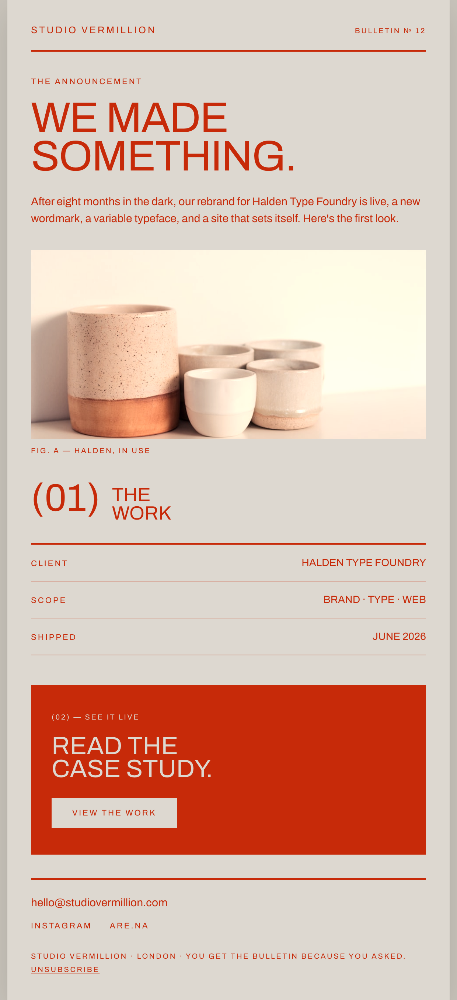

# Red-on-Cream Editorial Announcement Email

A bold, design-forward announcement email in a centered 600px column: a warm cream (#ddd8d0) surface with ONE ink colour, vermillion (#c72a09), applied to every element. A giant Archivo headline ('WE MADE SOMETHING.'), a short dek, an object photo, a parenthetical (01) section index with hairline label/value metadata rows (Client / Scope / Shipped), and a massive solid-vermillion CTA band ('READ THE CASE STUDY') anchoring the design. Reusable for design agencies, type foundries, and studios announcing a case study or launch.



## Prompt

```text
{"summary": "A bold editorial announcement email in a centered ~600px column on warm cream, using a single ink colour, vermillion, for every element. A tracked-caps masthead over a huge Archivo headline ('We made something.') and a short dek announce the news. Below: an object photo with a caption, a parenthetical section index '(01) The Work' with hairline label-left / value-right metadata rows (Client / Scope / Shipped), then a full-bleed solid-vermillion CTA band ('Read the case study.') with a cream button, and a footer with contact + unsubscribe.", "style": {"description": "Modern, earthy, slightly brutalist. Warm cream/putty background with ONE vibrant rust-vermillion ink used for ALL text, rules, and fills, no second colour except the object photo. Extreme type-scale contrast in a single grotesque (Archivo): a massive black headline against small tracked-out caps labels. Structured hairline rules build metadata tables; the design is anchored by a solid-colour CTA band.", "prompt": "Design a bold editorial announcement email in a centered max-width 600px column on a warm cream surface (#ddd8d0) over a putty body (#c9c4bb). Typeface: Archivo only (weights 400-900). ONE ink colour: vermillion #c72a09, applied to ALL text, hairlines, and the CTA fill; the only other 'colour' is a single object photograph. Extreme scale contrast: a ~58px font-900 UPPERCASE headline (tracking-[-0.02em], leading .9) vs 10-11px tracked-caps (letter-spacing .18em) labels. Structure with 2px vermillion top borders + hairline vermillion/35 row dividers. Include an oversized parenthetical section number '(01)' in font-800. The anchoring CTA is a full-bleed solid-vermillion band with cream text and a cream button. Email-safe: centered column, no sticky nav."}, "layout_and_structure": {"description": "Centered ~600px column: (1) masthead (wordmark + bulletin no, 2px underline), (2) announcement headline + dek, (3) object photo + caption, (4) parenthetical '(01) The Work' + hairline label/value rows, (5) full-bleed vermillion CTA band, (6) footer with email + socials + unsubscribe. Reflows to one column at ~380px.", "prompts": [{"part": "Masthead", "prompt": "A row with a tracked-caps wordmark left and a tracked-caps 'Bulletin No 12' right, closed by a 2px vermillion bottom border."}, {"part": "Announcement", "prompt": "A tracked-caps kicker ('The announcement'), a ~58px font-900 uppercase headline in two lines ('We made / something.'), and a ~15px font-500 dek."}, {"part": "Object photo", "prompt": "A ~256px object/product photograph (warm-toned to sit in the cream palette) with a tracked-caps 'Fig. A' caption."}, {"part": "Section index + metadata", "prompt": "An oversized parenthetical '(01)' in font-800 beside a two-line uppercase section title ('The Work'); then a 2px-topped table of hairline rows, each a tracked-caps label left + an uppercase value right (Client / Scope / Shipped)."}, {"part": "CTA band", "prompt": "A full-bleed solid-vermillion band with cream text: a tracked-caps '(02) \u2014 See it live', a ~34px font-900 uppercase headline ('Read the / case study.'), and a solid-cream button with vermillion tracked-caps label."}, {"part": "Footer", "prompt": "A 2px-topped footer: a lowercase contact email + tracked-caps social links, then tracked-caps fine print with an Unsubscribe link."}]}, "special_ui_components": "Oversized parenthetical section index '(01)'; hairline label-left / value-right metadata table; extreme headline-to-label scale contrast in one grotesque; full-bleed solid-vermillion CTA band with a cream button.", "special_notes": "Email layout: centered ~600px column, no sticky nav. Generic placeholder studio ('Studio Vermillion') and sample project so the spec is reusable; swap the wordmark, photo, and metadata. The reusable value is the one-ink-on-cream editorial announcement system (extreme scale + hairline metadata + anchoring CTA band). Source system: reverse-engineered from a Canva 'Creative Brief' presentation (measured mono #c72a09 on cream, Aileron grotesque)."}
```
