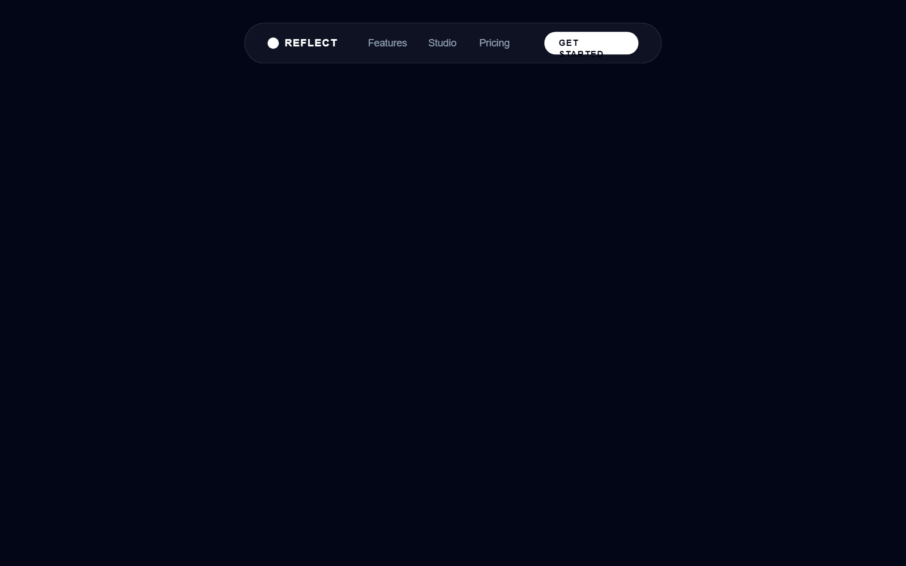

# Reflect Cinematic Landing Page

A high-end cinematic dark-mode landing page designed for premium creative tools and SaaS dashboards. Featuring a 'midnight' color palette (#020617), metallic text gradients, and futuristic glassmorphism. The aesthetic leverages 'Cabinet Grotesk' for bold editorial headers and 'Satoshi' for clean body text. Key elements include a 3D parallax dashboard card, a radial 'black hole' portal background effect, infinite scrolling marquees, and a sophisticated bento grid layout. Ideal for design-centric products, AI platforms, or high-performance creative software requiring a professional yet immersive visual experience.



## Prompt

```text
{
  "summary": "A futuristic, cinematic dark-mode design titled 'Reflect' that utilizes deep space aesthetics, high-contrast typography, and smooth 3D micro-interactions to create a sense of mastery and focus.",
  "style": {
    "description": "The style is 'Cosmic Minimalist' or 'Cinematic SaaS'. It features a deep midnight background (#020617), slate-toned secondary text (#94a3b8), and pure white accents. Typography pairings use 'Cabinet Grotesk' (Heavy weight) for headers and 'Satoshi' for utility text. Visual depth is achieved through white-on-white gradients (metallic text), ultra-subtle borders (1px white/10%), and glassmorphic layers with high-blur (backdrop-blur-3xl). Animations are defined by smooth, high-tension cubic-beziers for a premium feel.",
    "prompt": "Create a design system using a background of #020617 and primary text in #FFFFFF. \n- **Typography**: Headers use 'Cabinet Grotesk' (Extra Bold/800, tracking-tight). Body text uses 'Satoshi' (Regular/500, leading-relaxed). \n- **Metallic Gradient**: Apply a text gradient from #FFFFFF to #94A3B8 on primary headlines.\n- **Borders & Shadows**: Use 1px solid rgba(255,255,255,0.1) for card borders. No heavy shadows; use rgba(0,0,0,0.5) for depth or white glows for focus.\n- **Gradients**: Use radial-gradients like `radial-gradient(circle at center, rgba(30, 41, 59, 0.4) 0%, rgba(2, 6, 23, 1) 70%)` for background depth.\n- **Animations**: Implement a 'reveal' effect on scroll with `cubic-bezier(0.34, 1.56, 0.64, 1)` for a snappy yet organic entry. \n- **Buttons**: Pill-shaped buttons in solid #FFFFFF with #020617 text for high-priority CTA, and glassmorphic pill buttons for navigation."
  },
  "layout_and_structure": {
    "description": "A structured long-form landing page beginning with a floating navigation, a deep-focus hero section, followed by trust indicators, feature grids, and informational sections.",
    "prompts": [
      {
        "part": "Floating Navigation",
        "prompt": "Design a floating navigation pill. Center-aligned at the top. Styles: bg-white/5, backdrop-blur-xl, border border-white/10, rounded-full. Elements: Logo (dot + uppercase text), link items in slate-400 (hover: white), and a small high-contrast CTA button."
      },
      {
        "part": "Hero Section with Portal Effect",
        "prompt": "Layout a hero section with a centered H1 (metallic gradient, text-8xl) and a max-width 2xl paragraph. Behind the text, place a 'Black Hole' portal: a 1200px radial gradient pulse (portal-pulse animation) with two rotating SVG rings (stroke-dasharray: 1,10 and 4,20) spinning at 20s intervals."
      },
      {
        "part": "3D Dashboard Mockup",
        "prompt": "A 1200px wide, 3-column glassmorphic card (3D Parallax). Left (3 units): Search bar and 'Recent Collections' list. Center (6 units): Large play button (white, glowing) and session title. Right (3 units): Minimalist calendar widget with current date highlighting and upcoming tasks list. Apply `perspective: 2000px` to the container for hover tilt effects."
      },
      {
        "part": "Infinite Logo Marquee",
        "prompt": "Create a full-width section with a horizontal marquee. Text/Icons should be in Slate-700, 2xl font size, and uppercase. Animation: linear translate loop over 40s. Logos should include Adobe, Figma, Notion, and OpenAI to establish industry authority."
      },
      {
        "part": "Mastery Bento Grid",
        "prompt": "A grid of 4 cards. Card 1 (Span 2): Feature with large icon and 'Universal Core' text. Card 2 (Span 1): 'Encrypted Workspace' with shield icon. Card 3 (Span 1): 'Spatial Audio' with sparkles. Card 4 (Span 2): Horizontal layout featuring an aspect-video placeholder with a cloud icon gradient."
      },
      {
        "part": "FAQ Accordion",
        "prompt": "Centered 4xl heading followed by an 800px wide list of items. Style: bg-white/2, border border-white/10, rounded-3xl. On click: expand content height and rotate the '+' icon 180 degrees using a 0.4s cubic-bezier transition."
      },
      {
        "part": "Modular Footer",
        "prompt": "Three-column link structure (Product, Company, Legal) with uppercase tracking-widest headers. Left side includes a logo and value prop. Bottom bar includes 'All Rights Reserved' in 10px font and social icons (Twitter, Instagram, Dribbble) in slate-600 (hover: white)."
      }
    ]
  },
  "special_ui_components": [
    {
      "component": "3D Parallax Card",
      "description": "A high-depth glassmorphic card that reacts to mouse position.",
      "prompt": "The component uses `transform-style: preserve-3d`. On `mousemove`, calculate the distance from the center of the card to the mouse cursor. Map the X movement to a `rotateY` (-10deg to 10deg) and Y movement to a `rotateX` (10deg to -10deg). The card has a `backdrop-filter: blur(40px)` and a thin border of `rgba(255,255,255,0.1)`."
    },
    {
      "component": "Portal Pulse Background",
      "description": "A background ambient animation creating depth.",
      "prompt": "Combine a `radial-gradient(circle, rgba(255,255,255,0.05) 0%, transparent 50%)` with a CSS animation that scales from 1 to 1.15 and changes opacity from 0.5 to 0.8 over an 8s loop. Place SVG rings behind it with dashed strokes that rotate slowly to simulate a cosmic gateway."
    },
    {
      "component": "Metallic Headline Text",
      "description": "Premium text effect for primary headers.",
      "prompt": "Apply `background: linear-gradient(to bottom, #ffffff 0%, #94a3b8 100%)` to the text element. Use `-webkit-background-clip: text` and `-webkit-text-fill-color: transparent` to make the text appear like brushed aluminum or silver."
    }
  ],
  "special_notes": "MUST maintain the high-contrast ratio between the background (#020617) and the slate/white text to ensure cinematic clarity. MUST NOT use vibrant or pastel colors for backgrounds; stick strictly to the dark navy and slate palette. DO use large, editorial typography for headlines (64px to 128px range) with negative letter-spacing for a modern feel."
}
```

**▶ Try it live → [https://superdesign.dev/library/reflect-cinematic-landing-page](https://superdesign.dev/library/reflect-cinematic-landing-page)**

*110 copies · 2,342 tries · tags: *
