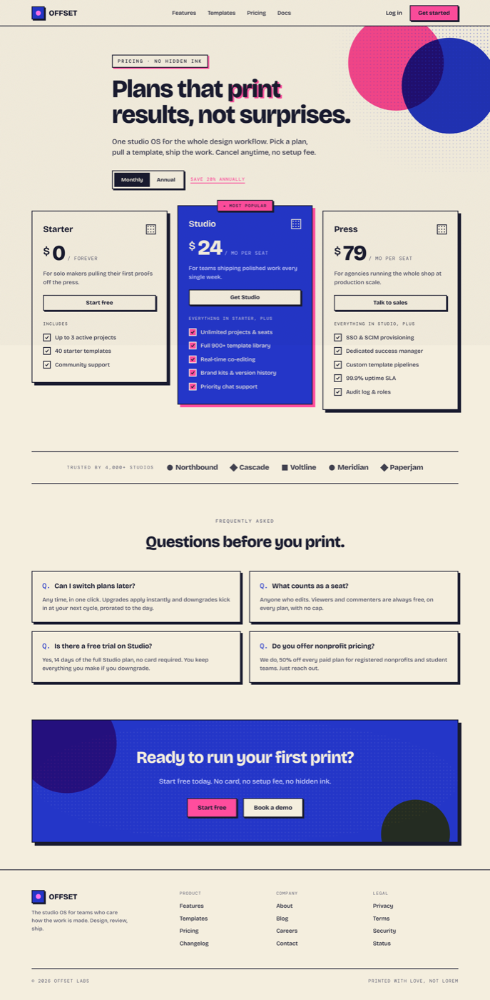

# Risograph Pricing Page: Bold Spot-Ink SaaS Plans

A bold risograph SaaS pricing page: warm cream paper with federal-blue and fluoro-pink spot inks, halftone dot fields, overprint that multiplies to purple, deliberate mis-registration, grain, and hard flat offset "print" shadows on the cards. Three clear tiers (Starter / Studio featured / Press) with a big bold price on each, a monthly/annual segmented-pill toggle with a "Save 20%" tag, a "Most popular" badge on the ink-inverted featured plan, per-tier CTAs and checked feature lists, a monochrome "Trusted by" logo strip, a 4-card FAQ, a solid-blue CTA band, and a footer. Bricolage Grotesque display + DM Mono labels. Recognizable as a pricing page while carrying a real print-shop point of view. Reusable for any indie, creative-tool, or studio SaaS that wants pricing with personality.



## Prompt

```text
{"summary": "A single desktop SaaS PRICING PAGE for a fictional studio OS (generic brand 'OFFSET') in a RISOGRAPH print aesthetic. Everything sits on warm cream paper (#f4eede) with a deep blue-black ink (#191b2f) and a strictly limited spot-ink palette: federal blue #2436c8 (primary / the featured plan), fluoro pink #ff4d9d (accent / most-popular), and a whisper of yellow #ffcf33; where pink and blue overlap they multiply to purple. A sticky cream nav (2px ink underline) carries a halftone-dot logo tile + 'OFFSET' wordmark, center links (Features / Templates / Pricing / Docs), a plain 'Log in' link and a solid pink 'Get started' pill. The hero is left-aligned over an overprinted pink+blue circle cluster and a halftone field: a DM Mono eyebrow 'PRICING - NO HIDDEN INK' in a pink-shadowed tag, a font-800 Bricolage Grotesque H1 'Plans that print / results, not surprises.' with a deliberate fluoro-pink mis-registration ghost on the word 'print', a one-line sub, then a billing row with a segmented monthly/annual pill toggle (Monthly active) beside a pink 'Save 20% annually' underline tag. THE PRICING: three tier cards side by side, each a flat card with a 2.5px ink border and a hard offset solid-ink shadow (print registration, no blur). Starter ($0 / forever, outline 'Start free' CTA, 3 features); Studio ($24 / mo per seat, the ONE FEATURED plan: ink-inverted to a solid blue fill with paper text, a fluoro-pink 'Most popular' tab, a PINK offset shadow, raised up, a solid paper 'Get Studio' CTA, 5 features); Press ($79 / mo per seat, outline 'Talk to sales' CTA, 5 features). Each card stacks: plan name + a small halftone chip, a big 800 price figure with a '$' and a DM Mono '/ mo per seat' suffix, a 1-line description, a full-width CTA, a DM Mono feature-group label, then a checked feature list where each row is a small spot-ink tick + a 15px label. Below the cards: a monochrome 'Trusted by 4,000+ studios' logo strip between two ink hairlines; a 4-card FAQ grid (each a bordered offset-shadow card with a DM Mono 'Q.' marker + question + answer); a solid-blue CTA band with an overprinted pink circle + a halftone field + a yellow overprint spark ('Ready to run your first print?' + Start free / Book a demo buttons); and a 4-column footer (brand + Product / Company / Legal columns) closing on a DM Mono bar '(c) 2026 Offset Labs' + 'Printed with love, not lorem'. A subtle grain overlay (SVG feTurbulence, multiply) sits over the whole page. Bricolage Grotesque for display + body, DM Mono for eyebrows / labels / price suffixes. Flat throughout: no soft blur shadows and no gradients-for-depth; depth is hard offset ink shadows, thick borders, halftone, overprint, and grain.", "style": {"description": "Risograph print aesthetic on warm cream paper. A strictly limited spot-ink palette is the whole personality: cream paper (#f4eede), a deep blue-black ink (#191b2f) for text + borders + shadows, federal blue (#2436c8) as the primary / featured ink, fluoro pink (#ff4d9d) as the accent / most-popular ink, and a whisper of yellow (#ffcf33) for tiny sparks; overprints where pink and blue overlap multiply to purple. Everything is FLAT like a print: NO soft blur shadows, NO gradients-for-depth. Depth and texture come instead from hard OFFSET solid-ink shadows (a card casts a 7px hard ink block, the featured card a pink one), thick 2.5px ink borders, halftone dot fields (radial-gradient dots in a spot ink), overprinted circles (mix-blend-mode: multiply), a deliberate mis-registration ghost on the hero word, and a grain overlay (SVG feTurbulence at low opacity, multiply) over the entire page. Type is Bricolage Grotesque (a characterful modern grotesque) for display + body at 700/800 for headings and prices, and DM Mono for eyebrows, small labels and the '/ mo' price suffix (uppercase, letter-spacing ~0.18em). Hierarchy is built from size + weight, not a second color. Corners are square-ish (flat print), buttons and cards are hard-edged with visible ink borders. The mood: bold, warm, tactile, print-shop, editorial, a little playful, unmistakably crafted.", "prompt": "Design a SaaS pricing page as a RISOGRAPH print. Canvas is warm cream paper #f4eede; text, borders and shadows are a deep blue-black ink #191b2f. Use a STRICTLY limited spot-ink palette: federal blue #2436c8 (primary + the featured plan fill), fluoro pink #ff4d9d (accent + most-popular + mis-registration ghost), and a whisper of yellow #ffcf33 for tiny sparks only; let overlapping pink and blue overprint to purple via mix-blend-mode: multiply. Keep EVERYTHING FLAT like a print run: NO soft blur box-shadows and NO gradients used for depth. Get depth + texture from print devices instead: (1) hard OFFSET solid-ink shadows, e.g. box-shadow: 7px 7px 0 #191b2f on cards, 3px 3px 0 on buttons, and a PINK 7px offset on the featured card; (2) thick 2.5px ink borders; (3) halftone dot fields via radial-gradient (a spot-ink dot on a ~9px grid); (4) overprinted circles (absolute, border-radius:50%, mix-blend-mode:multiply) so pink over blue reads purple; (5) a deliberate MIS-REGISTRATION on one hero word (a fluoro-pink duplicate offset ~4px behind the ink word via a ::before with content:attr()); (6) a grain overlay over the whole page (a fixed SVG feTurbulence fractalNoise rect at ~0.16 opacity, mix-blend-mode:multiply). Type: Bricolage Grotesque for display + body (700/800 for the hero, prices and section headers), DM Mono for eyebrows, small labels and the '/ mo per seat' suffix (uppercase, letter-spacing ~0.18em). Build hierarchy from size + weight, never a second accent color beyond the spot inks. Square-ish hard-edged corners, visible ink borders, no rounded softness. Do NOT use blur shadows, gradients-for-depth, purple/indigo gradient fills, Inter, emoji, or centered-everything layout."}, "layout_and_structure": {"description": "A vertical scroll on a max-w-[1180px] container: (1) a sticky cream nav with a halftone logo tile + wordmark, center links, and a solid-pink 'Get started' pill; (2) a left-aligned hero over overprint circles + a halftone field: a DM Mono eyebrow tag, a mis-registered 800 H1, a one-line sub, and a segmented monthly/annual pill toggle + a pink 'Save 20% annually' tag; (3) THE PRICING: three tier cards (Starter / Studio featured / Press), each with a hard offset ink shadow, the featured one ink-inverted to blue with a pink offset shadow + 'Most popular' tab + raised; (4) a monochrome 'Trusted by 4,000+ studios' logo strip between ink hairlines; (5) a 4-card FAQ grid; (6) a solid-blue CTA band with overprint + halftone; (7) a 4-column footer. All flat; grain over everything. Reflows on mobile: the three cards stack (max-w-[440px], featured un-raised), the FAQ and footer collapse to fewer columns, nav links hide.", "prompts": [{"part": "Sticky nav", "prompt": "A sticky top nav on cream #f4eede with a 2px ink #191b2f bottom border and a slight backdrop blur, ~66px tall inside a max-w-[1180px] px-8 container. Left: a brand lockup = a 34px square logo tile (2px ink border, blue #2436c8 fill, a 3px hard ink offset shadow, holding a small pink dot) next to an 800 'OFFSET' wordmark. Center: text links Features / Templates / Pricing / Docs (15px, weight 500, blue hover). Right: a plain 'Log in' text link and a solid fluoro-pink 'Get started' pill button (2px ink border, ink text, 3px hard ink offset shadow, lifts on hover)."}, {"part": "Hero", "prompt": "A left-aligned hero (max-w-[760px]) sitting over decoration: two overlapping absolute circles top-right (a pink one and a blue one, each mix-blend-mode:multiply so the overlap prints purple) plus a soft-masked blue halftone dot field. Content: a DM Mono eyebrow 'PRICING - NO HIDDEN INK' (12px, uppercase, letter-spacing .2em) inside a cream tag with a 2px ink border and a 3px PINK offset shadow; then an H1 in Bricolage Grotesque ~66px / weight 800 / line-height 1.02 / letter-spacing -.028em reading 'Plans that print' (line 1) 'results, not surprises.' (line 2), where the word 'print' carries a deliberate MIS-REGISTRATION: a fluoro-pink duplicate of the word offset ~4px down-right behind the ink word (mix-blend-multiply). IMPORTANT: scope the H1 font-size to a CLASS with !important sizing, not a bare h1 tag, so a host stylesheet cannot shrink it. Then a 19px sub line. Then a billing row: a segmented pill toggle (2px ink border, 3px ink offset shadow, cream track) with two segments 'Monthly' (active = solid ink fill, cream text) and 'Annual' (inactive ink text), beside a fluoro-pink 'Save 20% annually' DM Mono tag with a 2px pink underline."}, {"part": "Three tier pricing cards", "prompt": "A 3-column grid (gap ~26px, align-items:start). Each card is FLAT on cream with a 2.5px ink border and a hard 7px offset solid-ink shadow (box-shadow: 7px 7px 0 #191b2f), no blur. Each card stacks: a header row with the plan name (Bricolage 23px / 700) and a small 26px halftone-dot chip (2px border); a price row = a 28px '$', a big 800 figure (~56px, letter-spacing -.03em), and a DM Mono suffix ('/ forever' or '/ mo per seat', 13px, muted); a 1-line description (15px, muted); a full-width CTA button; a DM Mono feature-group label ('Includes' / 'Everything in Starter, plus' / 'Everything in Studio, plus'); then a checked feature list (each row = a 20px square spot-ink tick with an ink check + a 15px label). PLANS: Starter $0 / forever (outline 'Start free' CTA, 3 features); Studio $24 / mo per seat as THE ONE FEATURED plan; Press $79 / mo per seat (outline 'Talk to sales' CTA, 5 features)."}, {"part": "Featured Studio card (the emphasis)", "prompt": "Make the middle 'Studio' card the ONE emphasis: INK-INVERTED to a solid federal-blue #2436c8 fill with paper #f4eede text, a PINK 7px offset shadow (instead of ink), and RAISED (translateY -14px). Pin a fluoro-pink 'Most popular' tab across its top edge (a small ink-bordered pill with a 3px ink offset shadow, a leading star, DM Mono uppercase). Its price, description and feature labels invert to paper/light-blue tones; its ticks are fluoro-pink squares with an ink check; its CTA is a solid PAPER button with ink text and a hard ink offset shadow (the single loudest button on the page). On mobile it un-raises and stacks with the others."}, {"part": "Trusted-by strip", "prompt": "A full-width band between a top and bottom 2px ink hairline (~26px vertical padding). Centered on one row: a DM Mono 'Trusted by 4,000+ studios' label (12px, letter-spacing .16em, muted) followed by a row of MONOCHROME (all-ink) wordmark lockups, each a tiny ink shape (circle / diamond / square) + an 800 name: Northbound, Cascade, Voltline, Meridian, Paperjam. Reflows to wrap on mobile."}, {"part": "FAQ grid", "prompt": "A centered DM Mono eyebrow 'FREQUENTLY ASKED' over a centered 800 Bricolage H2 'Questions before you print.', then a 2-column grid of four bordered cards (2.5px ink border, cream, 5px hard ink offset shadow). Each card: an H3 question prefixed by a blue DM Mono 'Q.' marker, then a 15px muted answer. Cover: switching plans, what counts as a seat, the Studio free trial, and nonprofit pricing. Collapses to one column on mobile."}, {"part": "CTA band", "prompt": "A full-width panel with a 2.5px ink border and an 8px hard ink offset shadow, filled solid federal-blue #2436c8 with paper text, centered content. Layer print decoration inside: a faint paper halftone field, a large pink circle top-left (multiply -> deep overprint), and a yellow circle bottom-right (multiply -> a dark-green overprint spark). Content: an 800 H2 'Ready to run your first print?', a light-blue sub 'Start free today. No card, no setup fee, no hidden ink.', and a button row of a solid-pink 'Start free' and a solid-paper 'Book a demo' (both ink-bordered with hard ink offset shadows)."}, {"part": "Footer", "prompt": "A footer on cream with a 2px ink top border: a 4-column grid (a wider brand column = the logo tile + 'OFFSET' + a muted tagline; then Product / Company / Legal link columns with DM Mono uppercase headings and 15px links, blue hover). A bottom bar (2px ink top border) in DM Mono uppercase: '(c) 2026 Offset Labs' left and 'Printed with love, not lorem' right."}]}, "special_ui_components": [{"component": "Mis-registration hero headline", "description": "A print off-register effect faked in CSS: one hero word carries a spot-ink ghost offset behind the ink word.", "prompt": "On one hero word, add a ::before with content:attr(data-t) positioned absolutely ~4px down and right, colored fluoro pink #ff4d9d, z-index:-1, mix-blend-mode:multiply, so the ink word appears slightly off-register like a risograph mis-print. Scope the headline size to a CLASS with !important (not a bare h1) so a host stylesheet cannot shrink it."}, {"component": "Hard offset print shadow", "description": "Flat solid-ink offset shadows that replace all soft blur, giving the print-registration look.", "prompt": "Replace every soft/blur box-shadow with a HARD offset solid shadow: cards get box-shadow: 7px 7px 0 #191b2f, buttons 3px 3px 0 #191b2f, and the featured card a PINK 7px 7px 0 #ff4d9d. On hover, nudge the element -1px/-1px and grow the offset slightly. Never use blur radius."}, {"component": "Overprint circles", "description": "Overlapping spot-ink circles that multiply to a third color where they stack.", "prompt": "Place absolute circles (border-radius:50%) in the hero and CTA band with mix-blend-mode:multiply so a pink circle over a blue circle prints a purple overlap, and a yellow circle over blue prints a dark overprint. Keep them as flat solid fills (no gradient), bleeding off edges."}, {"component": "Halftone dot field", "description": "A print halftone texture drawn from a radial-gradient dot grid in a spot ink.", "prompt": "Create halftone fields with background-image: radial-gradient(<ink> 1.5px, transparent 1.7px); background-size: 9px 9px. Use a blue field behind the hero (soft-masked to fade), paper dots inside the blue CTA band, and ink dots inside the small plan 'chip' squares."}, {"component": "Ink-inverted featured plan card", "description": "The one recommended tier flipped to a solid spot-ink fill so it dominates without a second accent.", "prompt": "Invert the featured (middle) plan card to a solid federal-blue #2436c8 fill with paper #f4eede text, a PINK offset shadow, and a raised translateY(-14px). Pin a fluoro-pink 'Most popular' tab across its top edge, invert its price/description/labels to light tones, make its feature ticks pink, and give it the single solid-PAPER CTA (the loudest button). This makes the recommended plan the clear focus using only the spot inks."}, {"component": "Segmented monthly/annual pill toggle", "description": "A flat print-styled billing toggle where the active segment is a solid ink pill.", "prompt": "Build a segmented pill toggle: a cream track with a 2px ink border and a 3px hard ink offset shadow holding two segments, 'Monthly' and 'Annual'. The active segment is a solid ink #191b2f fill with cream text; the inactive is plain ink text. Pair it inline with a fluoro-pink DM Mono 'Save 20% annually' tag carrying a 2px pink underline."}, {"component": "Spot-ink feature tick", "description": "A small square print tick that swaps ink color per plan context.", "prompt": "Render each feature-list check as a 20px square with a 2px ink border holding a bold ink check SVG. On paper cards alternate a paper-fill tick and (for the featured/emphasis rows) a fluoro-pink-fill tick; inside the inverted blue card, ticks become pink squares with an ink check so they stay legible on blue."}, {"component": "Grain overlay", "description": "A page-wide risograph paper grain that ties every section into one print.", "prompt": "Overlay the whole page with a fixed pseudo-element using an inline SVG feTurbulence fractalNoise as a data-URI background, at ~0.16 opacity and mix-blend-mode:multiply, pointer-events:none, above content but below nav. This adds the tactile paper-grain that reads as a real risograph print."}]}
```

**▶ [Try it live →](https://superdesign.dev/library/risograph-pricing-page-bold-spot-ink-saas-plans?utm_source=github&utm_medium=prompt-repo&utm_campaign=prompt-library)**

**Use it in your coding agent:** install the [Superdesign skill](https://github.com/superdesigndev/superdesign-skill), then:

```bash
superdesign get-prompts --slugs "risograph-pricing-page-bold-spot-ink-saas-plans" --json
```

*0 copies · 0 tries · Pricing Pages · SaaS · pricing, pricing-page, pricing-table, saas*
