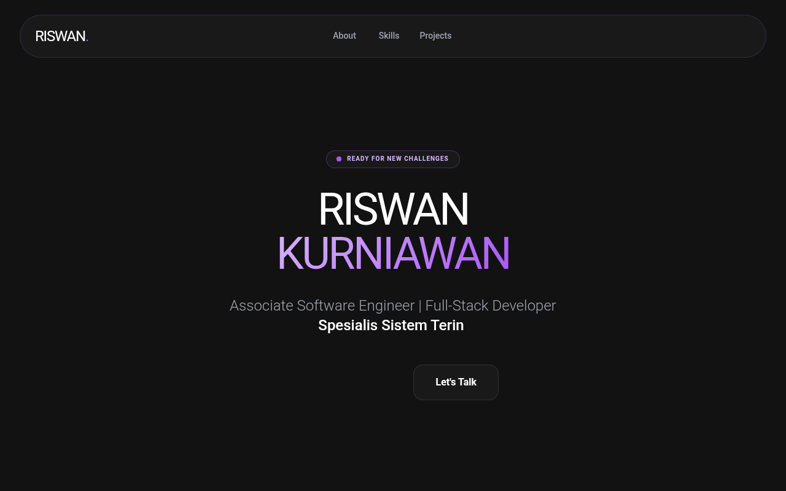

# Riswan Portfolio - Anime & GSAP Enhanced

A high-end 'Anime-Tech' portfolio design featuring a dark-mode glassmorphism aesthetic, vibrant purple gradients (#A855F7), and extensive GSAP-powered animations. Suitable for software engineers, creative developers, or tech-focused agencies. Key elements include 3D-interactive cards, a custom anime mascot illustration, parallax background spheres, and a typewriter-effect hero section. Optimized for a 'Premium Professional meets Otaku' vibe.



## Prompt

```text
{
  "summary": "A sophisticated dark-themed portfolio system that balances clean software engineering professionalism with playful anime-style illustrations. It uses a purple-centric color palette, glassmorphism UI components, and advanced GSAP interactions like 3D tilt effects, staggered reveals, and parallax scrolling.",
  "style": {
    "description": "The style is 'Dark Glassmorphism' with an 'Anime Aesthetic' twist. Typography pairs the bold, geometric Montserrat for headers with the clean, legible Poppins for body text. The color palette is anchored in #121212 (Background) and #A855F7 (Primary Purple), utilizing gradients from #D8B4FE to #A855F7. Visuals feature soft glow effects (blur-2xl), thin borders (1px solid rgba(168, 85, 247, 0.2)), and high-radius corners (up to 3rem).",
    "prompt": "Use a deep dark background (#121212). Typography: Headers in 'Montserrat' (Weight 900, uppercase, tight tracking), Body in 'Poppins' (Weights 300, 400, 600). Color Palette: Primary #A855F7, Secondary #D8B4FE, Support #1E1B4B (Deep Blue). Glassmorphism: Cards must have `backdrop-filter: blur(12px)`, `background: rgba(255, 255, 255, 0.03)`, and a subtle `1px` border of `rgba(168, 85, 247, 0.2)`. Animations: Use GSAP for 3D interactions. For hover effects, apply a dynamic 3D tilt logic (rotationX/Y between -20 and 20 degrees based on mouse position) with an elastic return (`ease: 'elastic.out(1, 0.3)'`). Floating background spheres should use `radial-gradient(circle at 30% 30%, #D8B4FE, #A855F7)` with high blur (up to 64px) and varying parallax depths (0.1 to 0.4)."
  },
  "layout_and_structure": {
    "description": "A single-page scrolling layout with distinct sections for Hero, About, Skills, Projects, and Contact. The layout prioritizes whitespace and large-scale typography for readability.",
    "prompts": [
      {
        "part": "Navigation",
        "prompt": "Fixed top bar positioned at `top-6`, width 95%, max-width 7xl. Use a pill-shaped glassmorphism container with `rounded-full`. Left: Bold logo with a purple period. Center: Horizontal links in gray-400 (hover to white). Right: High-contrast purple CTA button."
      },
      {
        "part": "Hero Section",
        "prompt": "Centered layout. Top: Small status pill with a pulsing green/purple dot ('Ready for New Challenges'). Title: Massive split-line header in Montserrat, tracking-tighter, with second name in a purple gradient. Subtitle: Typing animation with a blinking cursor. Bottom: Dual-button action group (Primary white/black button, secondary glass card button)."
      },
      {
        "part": "About Section",
        "prompt": "Two-column grid. Left: A large square glass card with `rounded-[3rem]`. Inside, place a floating anime mascot illustration (chubby style). Add a small overlapping badge at the bottom-right for 'Years in Tech'. Right: Content section with a section-label (horizontal line + text), a bold 5xl heading, and descriptive text followed by two 3D-tilting info-cards."
      },
      {
        "part": "Skills Section",
        "prompt": "Three-column grid of vertical glass cards. Each card contains: a 16x16 icon container (10% purple opacity), a Montserrat 2xl title, and a list of skills with distinct branding icons (e.g., VSCode, Logos). Implement a staggered GSAP 'reveal-up' animation as the user scrolls."
      },
      {
        "part": "Project Showcase",
        "prompt": "Grid layout with varying card widths (some 1-column, some 2-column spans). Cards feature: Top visual area with a tech-stack badge overlay; Bottom info area with a Montserrat title, descriptive text, and an 'Impact' badge. Cards must have the 'gs-hover-3d' property for interactive tilting."
      },
      {
        "part": "Footer / Contact",
        "prompt": "Large, centered glass card (p-16, rounded-3xl) acting as a CTA section. Background should include two large, low-opacity purple blurred glows. Main feature is a large email button with a scale-up hover effect. Social links are displayed as a row of icons with labels below a 5% white border."
      }
    ]
  },
  "special_ui_components": [
    {
      "component": "3D Interactive Card",
      "description": "Cards that tilt towards the user's mouse cursor in 3D space.",
      "prompt": "Implement using GSAP. On mousemove, calculate the relative X/Y position to set `rotationY` and `rotationX` to a max of 20deg. Apply `transformPerspective: 1000`. On mousedown, scale to 0.95. On mouseleave, reset rotations with an elastic ease for a bouncy feel."
    },
    {
      "component": "Anime Mascot Illustration",
      "description": "Floating cute mascot used for brand personality.",
      "prompt": "SVG-based illustration of a chubby anime character. Apply a constant floating animation: `translateY(-20px)` and `rotate(3deg)` over a 6s duration with `ease-in-out` infinite loop. Add a 'Kon'nichiwa!' speech bubble that appears only on hover."
    },
    {
      "component": "Typing Text Effect",
      "description": "Self-typing roles/titles in the hero section.",
      "prompt": "Array-driven typewriter. Speed: 80ms per char. Backspace: 40ms per char. 2000ms pause when complete. Color: white, weight: medium. Accompanied by a blinking cursor (`typing-cursor`) using a `::after` element with a 1s step-end animation."
    }
  ]
}
```

**▶ Try it live → [https://superdesign.dev/library/riswan-portfolio-anime-and-gsap-enhanced](https://superdesign.dev/library/riswan-portfolio-anime-and-gsap-enhanced?utm_source=github&utm_medium=prompt-repo&utm_campaign=prompt-library)**

**Use it in your coding agent:** install the [Superdesign skill](https://github.com/superdesigndev/superdesign-skill), then:

```bash
superdesign get-prompts --slugs "riswan-portfolio-anime-and-gsap-enhanced" --json
```

*59 copies · 2,425 tries · *
