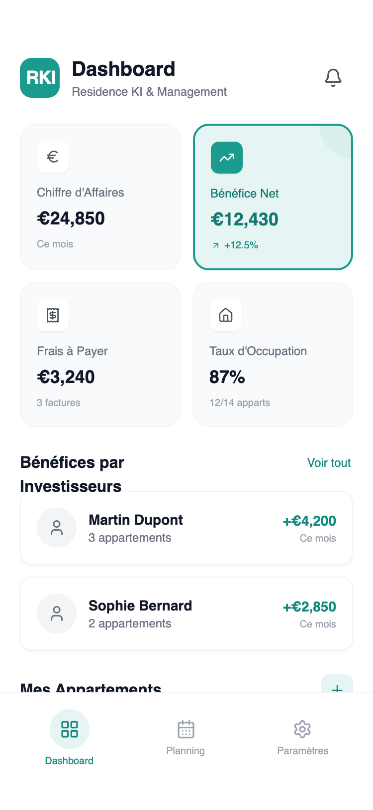

# RKI Dashboard Mobile

A modern mobile Android dashboard design for property management and fintech applications. It features a clean, professional aesthetic using a white and teal color palette with Plus Jakarta Sans typography. The layout employs a 2x2 metrics grid, detailed list views for investors and assets, and a persistent bottom navigation bar. Ideal for real estate SaaS, financial tracking, or business management apps requiring high legibility and a minimal, flat design language without gradients or heavy shadows.



## Prompt

```text
{
  "summary": "RKI Dashboard Mobile: A minimalist apartment management dashboard for Android. It uses a structured white background, a functional teal accent (#1a9b8e), and clear information hierarchy through a grid-and-list hybrid layout. The design emphasizes 'at-a-glance' data consumption for property owners and managers.",
  "style": {
    "description": "Professional and minimalist style using 'Plus Jakarta Sans'. The palette is dominated by pure white (#FFFFFF), light grays (#F9FAFB), and a vibrant teal (#1a9b8e) for primary actions and highlights. The theme avoids gradients in favor of flat fills, subtle borders, and soft backgrounds. Animations focus on state transitions and hover interactions using standard easing.",
    "prompt": "Create a design system with the following specs: \n- **Typography**: Primary font 'Plus Jakarta Sans'. Headings in Bold/Semi-bold (weight 700/600), body text in Medium (500) or Regular (400). Scale: H1 (20px), Body-Semibold (14px), Body-Regular (12px), Micro-labels (10px).\n- **Color Palette**: \n  - Primary Teal: #1a9b8e\n  - Secondary Teal: #e6f5f3 (50), #ccebe7 (100)\n  - Grayscale: #111827 (900), #6B7280 (500), #9CA3AF (400), #F3F4F6 (100), #F9FAFB (50)\n  - Status: Green-50/700 for 'Occupied', Orange-50/700 for 'Available'\n- **Effects**: Borders: 1px solid #F3F4F6; Radius: 16px (2xl) for cards, 12px (xl) for list items, 8px (lg) for smaller icons. Shadows: Very subtle inner or soft 2px blur drop shadows for list items.\n- **Animation**: Cubic-bezier(0.4, 0, 0.2, 1) for button hover states and icon color transitions."
  },
  "layout_and_structure": {
    "description": "The mobile layout is vertically stacked with a sticky header and a persistent bottom navigation bar. Content sections include a 2-column metrics grid followed by single-column lists.",
    "prompts": [
      {
        "part": "Sticky Header",
        "prompt": "Top-aligned header with 56px height (excluding safe area). Left side contains an app icon (teal square #1a9b8e, 40x40px, 12px radius) with white brand text, followed by a vertical stack: 'Dashboard' (H1, 20px Bold) and a gray subtitle (12px). Right side features a 40px circular notification bell button with a light hover state."
      },
      {
        "part": "Metrics 2x2 Grid",
        "prompt": "A grid with two columns and 12px (gap-3) spacing. Cards have a 16px radius. Standard cards use a gray-50 background and 1px gray-100 border. Each card contains: an 8px radius white square for the icon (base 32x32px), title text (12px gray-500), bold value (18px gray-900), and a footer label (10px gray-400). One 'Featured' card (e.g., Net Profit) must have a teal-50 background, 2px solid teal-500 border, and teal text (#127a70)."
      },
      {
        "part": "Investors List",
        "prompt": "A vertical list section titled 'Bénéfices par Investisseurs' (16px Semi-bold). Items are 12px-radius cards with white background and gray-100 border. Layout: Horizontal flex with a 40px circular gray avatar, two lines of text (Name/Property Count), and a right-aligned currency value in Bold Teal (#1a9b8e)."
      },
      {
        "part": "Apartment Detailed List",
        "prompt": "Single-column list of asset cards. Header includes Title (14px Semi-bold) and a right-aligned pill badge (e.g., green-50 bg for 'Rented'). Body includes subtitle metadata (address/area). Footer is separated by a 1px gray-50 top border, showing horizontal icons and text (rent value/expiry date) with 16px spacing between groups."
      },
      {
        "part": "Bottom Navigation",
        "prompt": "A fixed footer with 34px bottom padding for modern OS indicators. Features 3 equally spaced buttons. The active button has a 40px teal-50 circular background and a teal icon/label. Inactive buttons use gray-400 icons and labels (10px font size)."
      }
    ]
  },
  "special_ui_components": [
    {
      "component": "Featured Metric Card",
      "description": "High-visibility metric card for primary KPIs.",
      "prompt": "Card container with background #e6f5f3 and a 2px solid #1a9b8e border. Inside, top-right features a decorative semi-transparent circle (teal-100 at 50% opacity, -32px offset). The icon background is solid teal-500 with a white icon. All text is themed in teal-700 to ensure contrast and visual distinction from standard metrics."
    },
    {
      "component": "Status Pill Badge",
      "description": "Compact status indicator for list items.",
      "prompt": "A small pill-shaped container (height 20px) with horizontal padding (8px). Uses a subtle background (e.g., Green-50 #f0fdf4) and matching bold text (Green-700 #15803d) at 10px font size. Radius is 9999px (full round)."
    }
  ]
}
```

**▶ Try it live → [https://superdesign.dev/library/rki-dashboard-mobile](https://superdesign.dev/library/rki-dashboard-mobile?utm_source=github&utm_medium=prompt-repo&utm_campaign=prompt-library)**

**Use it in your coding agent:** install the [Superdesign skill](https://github.com/superdesigndev/superdesign-skill), then:

```bash
superdesign get-prompts --slugs "rki-dashboard-mobile" --json
```

*19 copies · 2,490 tries · *
