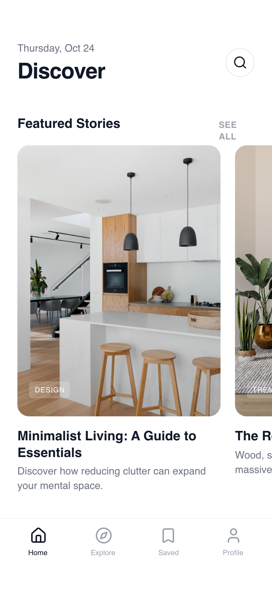

# Sectioned Index Page

Features a mixed-media layout including horizontal snap-scrolling cards, vertical activity feeds, and a bento-style recommendation grid. Ideal for content aggregators, interior design apps, portfolio indexes, or minimalist fintech dashboards.



## Prompt

```text
{
  "summary": "A clean, whitespace-driven mobile index page that organizes content through a modular vertical stack. It uses a hierarchy established by spacing and font weights rather than color, featuring a persistent bottom navigation bar, a date-stamped header, and three distinct content display patterns: horizontal carousels, vertical list items, and a 2-column grid.",
  "style": {
    "description": "The style is 'Minimalist Editorial' using a strict monochrome color palette (#FFFFFF to #111827). Typography centers on 'General Sans' with variable weights to denote importance. Animations are subtle: image scaling (1.05x) on hover and a slight compression (0.99x) on active tap states to simulate physical feedback. Rounded corners are generous (16px to 24px) to soften the layout.",
    "prompt": "### Visual Identity System\n- **Typography**: Primary font is 'General Sans'. Weights: 700 for H1 (30px), 700 for H2 (18px), 600 for H3/H4 (14px-18px), 400 for body text (14px). Use `tracking-tight` on headings and `tracking-wide` with uppercase for labels.\n- **Color Palette**:\n  - Background: Primary White (#FFFFFF)\n  - Primary Text: Gray-900 (#111827)\n  - Secondary Text: Gray-500 (#6B7280)\n  - Muted Text/Labels: Gray-400 (#9CA3AF)\n  - Surface/Fills: Gray-50/50 (#F9FAFB with 50% opacity)\n  - Borders: Gray-100 (#F3F4F6)\n- **Elevation & Corners**:\n  - Large Cards: `border-radius: 1rem` (16px)\n  - Full Gallery Cards: `border-radius: 1.5rem` (24px)\n  - Shadows: None (flat design with borders) or extremely subtle soft-diffused shadows (#000000 at 0.05 opacity).\n- **Animations**:\n  - Image Transitions: `duration: 500ms`, `cubic-bezier(0.4, 0, 0.2, 1)`\n  - Hover State: `scale(1.05)` for images\n  - Active Tap State: `scale(0.99)` with `transition-transform duration-100`."
  },
  "layout_and_structure": {
    "description": "A vertically scrollable stack of content modules. Each section begins with a header row (Heading + 'See All' button) followed by specialized content blocks: Gallery (Horizontal), Activity (Vertical), and Recommendations (Grid).",
    "prompts": [
      {
        "part": "Sticky Header",
        "prompt": "Positioned at the top with `padding-top: 56px` (iPhone status bar clearance). Left side: Date in `text-sm text-gray-500` above a 30px Bold Heading. Right side: A 40px circular button with a 1px border (#E5E7EB) containing a centered search icon."
      },
      {
        "part": "Section: Featured Gallery",
        "prompt": "Horizontal scrolling section with `overflow-x: auto` and `scroll-snap-type: x mandatory`. Cards are 280px wide with a 3:4 aspect ratio. Each card features a full-bleed image with a 24px corner radius. Bottom-left of image contains a pill-style tag (`bg-white/20 backdrop-blur-sm`). Text below the image: H3 bold title followed by a 2-line truncated description."
      },
      {
        "part": "Section: Recent Activity",
        "prompt": "Vertical list layout with `gap: 16px`. Each item is a container with `background: #F9FAFB`, `border: 1px solid #F3F4F6`, and `padding: 16px`. Content structure: 40px circular icon placeholder on the left, multi-line text (Title, Description, Timestamp) on the right."
      },
      {
        "part": "Section: Recommendation Grid",
        "prompt": "A 2-column CSS grid with `gap: 16px`. Grid items consist of a 1:1 aspect ratio image container with 12px corner radius. Below the image: A tiny uppercase label in Gray-400 followed by a bold 14px title."
      },
      {
        "part": "Tab Bar Navigation",
        "prompt": "Fixed bottom bar with `height: 64px` plus safe-area padding (34px). Border-top: 1px solid #F3F4F6. Icons are 24px. Active state is Gray-900; inactive is Gray-400. Includes a 10px font-size label below each icon."
      }
    ]
  },
  "special_ui_components": [
    {
      "component": "Interactive List Card",
      "description": "A list item designed for tactile mobile interaction.",
      "prompt": "Apply `transition-transform duration-100 active:scale-[0.99]` to the entire container. Use `bg-gray-50/50` for the background and a subtle `border-gray-100`. The left-hand icon should be nested in a 40px white circle with its own 1px border to create a layered effect."
    },
    {
      "component": "Micro-Tag (Glassmorphism)",
      "description": "Overlay tag used on top of imagery.",
      "prompt": "Background: `rgba(255, 255, 255, 0.2)`, Backdrop-filter: `blur(4px)`, Border-radius: `4px`, Font: `uppercase 10px Bold`, Color: `White`."
    }
  ]
}
```

**▶ [Try it live →](https://superdesign.dev/library/sectioned-index-page?utm_source=github&utm_medium=prompt-repo&utm_campaign=prompt-library)**

**Use it in your coding agent:** install the [Superdesign skill](https://github.com/superdesigndev/superdesign-skill), then:

```bash
superdesign get-prompts --slugs "sectioned-index-page" --json
```

*13 copies · 2,426 tries · Mobile Apps · General · mobile app, index, browse, layout*
