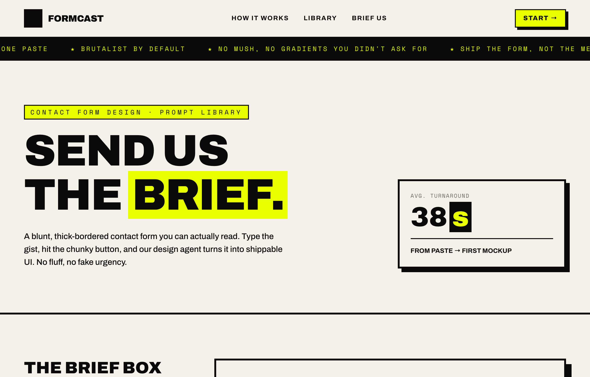

# Send Us the Brief — Brutalist Contact Form

Loud neo-brutalist contact page for a design-tool brand (Formcast), built around a blunt two-field 'brief box'. A paper-and-ink base (paper #f4f1ea canvas, ink #0a0a0a text/borders) with exactly one high-voltage acid-yellow accent (#e8ff00), thick 2px/4px ink borders, hard offset drop shadows (zero blur, e.g. 8px 8px 0 0 #0a0a0a), depress-on-press chunky buttons, and an acid focus shadow on the fields, in a heavy Archivo (up to 900) + Space Mono pairing. A sticky paper nav (an ink+acid logo tile + a FORMCAST wordmark, How it works/Library/Brief us hover-fill links and an acid 'Start' button) sits over a scrolling ink marquee strip and a hero (an acid eyebrow pill, a giant uppercase 'SEND US THE BRIEF.' headline with 'brief.' highlighted in acid, and a '38s' avg-turnaround stat card). The centerpiece is a contact section split into a left rail of three numbered instruction tiles and a big bordered FORM CARD with an oversized E-Mail input + Message textarea, a Brutalist/Editorial/Minimal/Surprise-me style-chip row, and a chunky Cancel + acid 'Send' button row. A 'Three blunt steps' card row and a dark ink footer with an acid CTA close the page. The reusable signature is the neo-brutalist contact form: thick ink borders + hard offset shadows + one acid accent + a heavy Archivo/Space Mono voice.



## Prompt

```text
{"summary": "A loud, neo-brutalist contact page for a design-tool brand (Formcast), built around a deliberately blunt two-field 'brief box'. The whole page runs on a paper-and-ink base (paper #f4f1ea canvas, near-black ink #0a0a0a) with a single high-voltage acid-yellow accent (#e8ff00), thick 2px/4px ink borders, hard offset drop shadows (no blur, e.g. box-shadow 8px 8px 0 0 #0a0a0a), and a brutalist type pairing of Archivo (a heavy grotesk, weights up to 900) for display + Space Mono for mono labels. It opens with a sticky paper nav (an ink logo tile holding an acid icon + a 'FORMCAST' wordmark, How it works / Library / Brief us links and an acid 'Start ->' button), an ink marquee strip scrolling acid-yellow slogans, a hero (an acid eyebrow pill, a giant uppercase 'SEND US THE BRIEF.' headline with 'brief.' highlighted in acid, and an avg-turnaround stat card '38s'), then the centerpiece: a contact section split into a left rail of three numbered instruction tiles and a big bordered FORM CARD with two oversized fields (E-Mail + Message), a style-chip row (Brutalist / Editorial / Minimal / Surprise me) and a chunky Cancel + acid Send button row. A 'Three blunt steps' card row and a dark ink footer with an acid CTA close the page. The reusable signature is the neo-brutalist contact form: thick ink borders + hard offset shadows + one acid-yellow accent + a heavy Archivo/Space Mono pairing, with fields that punch out an acid focus shadow. The mood is loud, confident, blunt, anti-corporate and a little playful.", "style": {"description": "Neo-brutalist / brutalist aesthetic on a warm off-white 'paper' canvas (paper #f4f1ea) with near-black 'ink' text and borders (ink #0a0a0a) and exactly ONE high-voltage accent: acid yellow (acid #e8ff00). The defining moves are (1) thick flat ink borders everywhere (border-2 = 2px on small chips/inputs-in-nav, border-4 = 4px on cards, fields, buttons and section dividers), (2) HARD OFFSET DROP SHADOWS with zero blur and zero spread, rendered as solid ink rectangles via custom utilities: .shadow-hard = box-shadow 8px 8px 0 0 #0a0a0a, .shadow-hard-sm = 5px 5px 0 0 #0a0a0a, .shadow-hard-lg = 12px 12px 0 0 #0a0a0a (the dark footer CTA inverts this to a paper shadow, shadow-[8px_8px_0_0_#f4f1ea]), (3) a tactile button-press interaction .btn-press that on :active translates the element translate(4px,4px) and shrinks its shadow to 2px 2px 0 0 #0a0a0a, so chunky buttons physically depress into their shadow, and (4) an acid focus signal on form fields .field:focus = box-shadow 8px 8px 0 0 #e8ff00, 0 0 0 4px #0a0a0a (an acid hard shadow plus a 4px ink ring) with no default outline. Type is a brutalist pairing: Archivo (Google Fonts, weights 400/500/600/700/800/900) as the grotesk display/body face, almost always UPPERCASE and tracking-tight at the heaviest weight (font-900) for headlines, labels and buttons; and Space Mono (Google Fonts, weights 400/700) as the mono face for eyebrows, kickers, the marquee and micro-labels, set uppercase with wide letter-spacing (tracking-[0.2em] / [0.3em]). The hero headline is enormous (text-[15vw] -> sm:text-7xl -> lg:text-8xl, leading-[0.86]) with selected words wrapped in an acid highlight (bg-acid box-decoration-clone). Surfaces are hard-edged (no border-radius anywhere) and high-contrast: paper cards on a paper page outlined in ink with hard shadows, an inverted ink+acid logo tile and marquee, acid-filled accent chips and the primary button. Inputs sit on a pure-white fill (bg-white) inside their 4px ink border. ::selection is acid-on-ink. Mood: loud, blunt, confident, anti-mush, structural, a little playful, never soft or corporate.", "prompt": "Design a loud neo-brutalist contact page for a design-tool brand on a warm off-white 'paper' canvas (paper #f4f1ea) with near-black 'ink' text and borders (ink #0a0a0a) and exactly ONE accent: high-voltage acid yellow (acid #e8ff00). Register these as Tailwind theme colors (paper #f4f1ea, ink #0a0a0a, acid #e8ff00) and use Archivo (weights 400-900) as the grotesk display/body face plus Space Mono (400/700) as the mono face. Make the brutalist hardware the centerpiece: put thick flat ink borders on everything (2px on small chips, 4px on cards/fields/buttons/section dividers) with NO border-radius anywhere, and give cards and buttons HARD OFFSET DROP SHADOWS with zero blur rendered as solid ink rectangles via utilities .shadow-hard = box-shadow 8px 8px 0 0 #0a0a0a, .shadow-hard-sm = 5px 5px 0 0 #0a0a0a, .shadow-hard-lg = 12px 12px 0 0 #0a0a0a (invert to a paper shadow shadow-[8px_8px_0_0_#f4f1ea] on dark surfaces). Add a tactile press interaction .btn-press that on :active does transform translate(4px,4px) and shrinks the shadow to 2px 2px 0 0 #0a0a0a so chunky buttons depress into their own shadow. Give form fields an acid focus signal .field:focus = box-shadow 8px 8px 0 0 #e8ff00, 0 0 0 4px #0a0a0a with outline:none and ink/35 placeholders. Set display type in Archivo at the heaviest weight (font-900), UPPERCASE, tracking-tight: a giant hero headline text-[15vw]->sm:text-7xl->lg:text-8xl leading-[0.86] with selected words wrapped in an acid highlight (bg-acid, box-decoration-clone). Set eyebrows, kickers, the marquee and micro-labels in Space Mono uppercase with wide tracking ([0.2em]/[0.3em]). Use an inverted ink+acid logo tile and a black marquee strip with acid-yellow text, acid-filled accent chips and an acid primary button, paper cards outlined in ink with hard shadows, white-fill inputs inside 4px ink borders, and ::selection set to acid-on-ink. Mood: loud, blunt, confident, anti-mush, structural, a little playful, never soft or corporate.", "fonts": "Archivo (Google Fonts, weights 400/500/600/700/800/900) as the grotesk display + body face, used almost entirely UPPERCASE: the hero H1 is font-900, tracking-tight, text-[15vw] -> sm:text-7xl -> lg:text-8xl with leading-[0.86]; section H2s are font-900 uppercase text-3xl -> text-5xl/6xl; the FORMCAST wordmark, field labels (E-Mail / Message), buttons (Send / Cancel) and 'Three blunt steps' card titles are font-900 uppercase; nav links are font-700 uppercase tracking-widest; instruction copy and intro paragraphs are font-500/600. Space Mono (Google Fonts, weights 400/700) is the mono face for the hero eyebrow pill, the scrolling marquee, the 'AVG. TURNAROUND' kicker, the 'Style' label and the footer credit line, set uppercase with wide letter-spacing (tracking-[0.2em] / [0.3em]). Mapped as Tailwind fontFamily.grotesk = Archivo and fontFamily.mono = Space Mono.", "palette": "paper #f4f1ea (the warm off-white page canvas + most card fills), ink #0a0a0a (near-black text, all borders, all hard shadows, the logo tile fill, the marquee fill, the footer background), acid #e8ff00 (the single high-voltage accent: the eyebrow pill, the highlighted hero word, the logo icon, the marquee text, the 'Start' / 'Send' buttons, the active style chip, the 'We cast it' step card, the footer headline accent + CTA, and the focus shadow), and white #ffffff (the input/textarea fill only, sitting inside the 4px ink border). Hard offset shadows are solid ink: .shadow-hard 8px 8px 0 0 #0a0a0a, .shadow-hard-sm 5px 5px 0 0 #0a0a0a, .shadow-hard-lg 12px 12px 0 0 #0a0a0a; the dark footer CTA inverts to a paper shadow shadow-[8px_8px_0_0_#f4f1ea]; form fields focus to an acid hard shadow plus an ink ring box-shadow 8px 8px 0 0 #e8ff00, 0 0 0 4px #0a0a0a. ::selection is acid #e8ff00 background on ink #0a0a0a text. No gradients, no border-radius, exactly one accent hue."}, "layout_and_structure": {"description": "A full-bleed neo-brutalist one-page contact site on a paper canvas, all sections separated by full-width 4px ink borders (border-b-4 border-ink) and laid out inside a centered max-w-[1240px] mx-auto px-5 (md:px-8) container: (1) a sticky paper nav, (2) a scrolling ink marquee strip, (3) a hero with a 12-col grid (an 8-col headline block + a 4-col turnaround stat card, items-end), (4) THE FORM section as a 12-col grid (a 4-col left instruction rail beside an 8-col bordered form card; on mobile the card comes first via order), (5) a 'Three blunt steps' 3-card row, and (6) a dark ink footer with an acid CTA. The defining structural moves are the thick ink section dividers, the asymmetric 4/8 form split (a numbered instruction rail beside an oversized two-field form card), the label-left field rows (a 160px label column beside a 1fr input), the hard-offset-shadow cards, and the chunky depress-on-press buttons. Everything reflows to a single column below lg/md with no horizontal overflow at 390px.", "prompts": [{"part": "Sticky nav + marquee strip", "prompt": "A sticky top-0 z-50 nav with a bg-paper fill and a border-b-4 border-ink bottom border. Inner row mx-auto max-w-[1240px] px-5 (md:px-8), h-16 (md:h-20), flex items-center justify-between. LEFT: a logo link = a 36-40px (w-9 h-9 md:w-10 md:h-10) bg-ink tile with a border-2 border-ink holding an acid-yellow Iconify icon (mdi:vector-square, text-xl md:text-2xl), beside a font-900 tracking-tight uppercase text-lg (md:text-xl) wordmark 'FORMCAST'. CENTER (md+ only, hidden below): three nav links 'How it works' / 'Library' / 'Brief us' in text-sm font-700 uppercase tracking-widest, each with a hover that fills the link bg-acid and adds hover:px-1 (transition-all). RIGHT: a 'Start ->' CTA = a bg-acid text-ink border-2 border-ink px-4 py-2 text-xs (md:text-sm) font-800 uppercase tracking-widest button with a .shadow-hard-sm (5px 5px 0 0 #0a0a0a) and a .btn-press depress. Directly below the nav, a full-width MARQUEE strip: a bg-ink text-acid block with a border-b-4 border-ink, overflow-hidden whitespace-nowrap py-2.5, containing a .marquee animated inline row (animation: marquee 22s linear infinite; @keyframes from translateX(0) to translateX(-50%)) of Space Mono text-xs (md:text-sm) uppercase tracking-[0.2em] slogans separated by acid stars, e.g. '* Prompt -> UI in one paste   * Brutalist by default   * No mush, no gradients you didn't ask for   * Ship the form, not the meeting' (duplicated once for a seamless loop)."}, {"part": "Hero (headline + turnaround stat card)", "prompt": "A <header id='top'> with a border-b-4 border-ink bottom border. Inner mx-auto max-w-[1240px] px-5 (md:px-8) py-14 (md:py-24), a grid lg:grid-cols-12 gap-10 items-end. LEFT (lg:col-span-8): a Space Mono text-xs (md:text-sm) uppercase tracking-[0.3em] EYEBROW PILL reading 'Contact form design . prompt library', shown inline-block on a bg-acid fill with a border-2 border-ink and px-3 py-1; then a giant font-900 uppercase tracking-tight leading-[0.86] H1 at text-[15vw] -> sm:text-7xl -> lg:text-8xl reading 'Send us' (line break) 'the brief.' with the word 'brief.' wrapped in an acid highlight (a span with bg-acid px-2 box-decoration-clone); then a mt-7 max-w-xl text-base (md:text-lg) font-500 leading-relaxed intro paragraph: 'A blunt, thick-bordered contact form you can actually read. Type the gist, hit the chunky button, and our design agent turns it into shippable UI. No fluff, no fake urgency.' RIGHT (lg:col-span-4): a TURNAROUND STAT CARD = a border-4 border-ink bg-paper p-6 block with a .shadow-hard (8px 8px 0 0 #0a0a0a), containing a Space Mono text-xs uppercase tracking-widest text-ink/60 'Avg. turnaround' kicker, a huge font-900 text-6xl leading-none stat '38' followed by an acid-on-ink unit 's' (a span with text-acid bg-ink px-1.5 ml-1), and a mt-4 border-t-2 border-ink pt-4 font-700 text-sm uppercase caption 'from paste -> first mockup'."}, {"part": "The form section (instruction rail + form card)", "prompt": "A <main id='form'> with a border-b-4 border-ink bottom border. Inner mx-auto max-w-[1240px] px-5 (md:px-8) py-14 (md:py-24), a grid lg:grid-cols-12 gap-12 (lg:gap-16). LEFT RAIL (aside, lg:col-span-4, order-2 lg:order-1): a font-900 uppercase text-3xl (md:text-4xl) leading-none 'The brief box' H2, a font-500 text-base leading-relaxed blurb ('Two fields. That's the whole intake. We don't need your life story, just where to reply and what you want built.'), then a space-y-4 list of THREE numbered instruction tiles, each a flex items-start gap-3 border-2 border-ink p-3 with a .shadow-hard-sm and an Iconify numeric box icon (mdi:numeric-1-box / numeric-2-box / numeric-3-box, text-2xl), alternating fill paper / acid / paper, holding a font-600 text-sm line ('Drop the email so we can ping you back.' / 'Describe the UI in plain words. Be as messy as you like.' / 'Hit Send. First mockup lands in under a minute.'). RIGHT (form, lg:col-span-8, order-1 lg:order-2): the FORM CARD = a border-4 border-ink bg-paper p-6 (md:p-10) panel with a .shadow-hard-lg (12px 12px 0 0 #0a0a0a). Inside, two label-left field rows, each a grid md:grid-cols-[160px_1fr] gap-3 (md:gap-6) items-start mb-8: (a) an 'E-Mail' label (font-900 uppercase text-2xl md:text-3xl leading-none md:pt-3) beside a .field email input (w-full bg-white border-4 border-ink px-5 py-4 text-lg font-600 .shadow-hard-sm, placeholder 'you@studio.com'); (b) a 'Message' label beside a .field textarea (rows=11, resize-y, same styling, placeholder 'A contact form, brutalist, thick borders, one acid-yellow accent, big chunky send button...'). Every .field focuses to box-shadow 8px 8px 0 0 #e8ff00, 0 0 0 4px #0a0a0a with ink/35 placeholders. Then a STYLE chip row (a grid md:grid-cols-[160px_1fr] items-center, a Space Mono text-xs uppercase tracking-widest text-ink/50 md:text-right 'Style' label beside a flex flex-wrap gap-3 of four border-2 border-ink px-3 py-1.5 text-xs font-800 uppercase tracking-widest chips: 'Brutalist' filled bg-acid (active) + 'Editorial' / 'Minimal' / 'Surprise me' on paper). Close with a BUTTON ROW: a -mx-6 (md:-mx-10) px-6 (md:px-10) pt-6 border-t-4 border-ink flex flex-col-reverse sm:flex-row sm:justify-end gap-4 row holding a 'Cancel' reset button (border-4 border-ink bg-paper px-8 py-4 text-xl font-900 uppercase tracking-wide .shadow-hard-sm .btn-press) and a 'Send ->' submit button (border-4 border-ink bg-acid px-10 py-4 text-xl font-900 uppercase tracking-wide .shadow-hard .btn-press inline-flex items-center gap-2 with a trailing mdi:arrow-right-thick icon)."}, {"part": "Three blunt steps", "prompt": "A <section id='how'> with a border-b-4 border-ink bottom border. Inner mx-auto max-w-[1240px] px-5 (md:px-8) py-14 (md:py-20): a font-900 uppercase text-4xl (md:text-5xl) leading-none 'Three blunt steps' H2, then a grid md:grid-cols-3 gap-6 of three STEP CARDS, each a border-4 border-ink p-6 block with a .shadow-hard, an Iconify icon (text-4xl), a font-900 uppercase text-2xl mt-4 title and a font-500 mt-2 text-sm leading-relaxed line. Middle card filled bg-acid, the outer two bg-paper. Card 1: mdi:keyboard-outline / 'Type it' / 'Plain words in the message box. No spec template, no jargon required.' Card 2: mdi:auto-fix / 'We cast it' / 'The agent renders real UI on an infinite canvas, on-brief, every time.' Card 3: mdi:export-variant / 'Ship it' / 'Export clean components straight into your codebase. Done by lunch.'"}, {"part": "Dark footer with acid CTA", "prompt": "A <footer id='library'> = a bg-ink text-paper block (the inverted dark surface). Inner mx-auto max-w-[1240px] px-5 (md:px-8) py-14 (md:py-16), a grid md:grid-cols-12 gap-8 items-end. LEFT (md:col-span-8): a font-900 uppercase text-4xl (md:text-6xl) leading-[0.9] headline 'Got a form to build?' (line break) with 'Send the brief.' set in text-acid. RIGHT (md:col-span-4, md:text-right): a 'Start now ->' CTA = an inline-block bg-acid text-ink border-4 border-acid px-8 py-4 text-lg font-900 uppercase tracking-wide button with a .btn-press and an INVERTED hard shadow shadow-[8px_8px_0_0_#f4f1ea] (a paper-colored offset shadow so it reads on the dark ink ground); below it a Space Mono text-xs uppercase tracking-widest mt-6 text-paper/60 credit line 'Formcast . contact form design . 2026'."}]}, "special_ui_components": ["Hard offset drop-shadow utilities (the brutalist signature): .shadow-hard = box-shadow 8px 8px 0 0 #0a0a0a, .shadow-hard-sm = 5px 5px 0 0 #0a0a0a, .shadow-hard-lg = 12px 12px 0 0 #0a0a0a; solid ink rectangles with zero blur/zero spread on every card, field and button. The dark footer CTA inverts it to a paper shadow shadow-[8px_8px_0_0_#f4f1ea].", "Depress-on-press buttons (.btn-press): a transition on transform + box-shadow that on :active does transform translate(4px,4px) and shrinks the shadow to 2px 2px 0 0 #0a0a0a, so chunky buttons (Start / Send / Cancel / Start now) physically push into their own offset shadow.", "Acid focus signal on form fields (.field:focus): outline:none plus box-shadow 8px 8px 0 0 #e8ff00, 0 0 0 4px #0a0a0a (a high-voltage acid hard shadow behind a 4px ink ring); .field::placeholder is ink at opacity .35.", "Oversized two-field 'brief box' form card: a border-4 border-ink bg-paper .shadow-hard-lg panel with label-left rows (a grid md:grid-cols-[160px_1fr], a font-900 uppercase text-2xl/3xl label beside a white-fill 4px-ink-border input/textarea), an E-Mail input + an 11-row resize-y Message textarea, a style-chip row and a border-t-4 button row.", "Scrolling marquee strip: a bg-ink text-acid border-b-4 border-ink overflow-hidden whitespace-nowrap py-2.5 band whose inner .marquee runs animation marquee 22s linear infinite (@keyframes from translateX(0) to translateX(-50%)) over a duplicated Space Mono uppercase tracking-[0.2em] slogan row with acid-star separators.", "Acid eyebrow pill + acid-highlighted headline word: a Space Mono uppercase tracking-[0.3em] eyebrow on a bg-acid border-2 border-ink px-3 py-1 pill, and a hero word wrapped in bg-acid px-2 box-decoration-clone so the acid highlight wraps cleanly across lines.", "Inverted ink+acid logo tile + acid-on-ink stat unit: a bg-ink border-2 border-ink tile holding an acid Iconify mdi:vector-square icon for the FORMCAST mark, and a stat '38s' where the 's' is set text-acid on a bg-ink px-1.5 chip.", "Numbered instruction tiles: a space-y-4 list of border-2 border-ink p-3 .shadow-hard-sm tiles alternating paper/acid/paper, each led by an Iconify mdi:numeric-N-box icon beside a font-600 text-sm instruction line.", "Hover-fill nav links: text-sm font-700 uppercase tracking-widest links that on hover fill bg-acid and add hover:px-1 (transition-all), so the acid highlight slides in behind the label.", "Style-chip selector: a flex flex-wrap gap-3 of border-2 border-ink px-3 py-1.5 text-xs font-800 uppercase tracking-widest chips with the active one ('Brutalist') filled bg-acid and the rest on paper."], "special_notes": "Keep the neo-brutalist system intact, it is the whole point: a warm off-white 'paper' canvas (paper #f4f1ea) with near-black 'ink' text/borders (ink #0a0a0a) and EXACTLY ONE accent, high-voltage acid yellow (acid #e8ff00). Register these three as Tailwind theme colors and never introduce a second accent, a gradient, or any border-radius (every corner is hard). The brutalist hardware must stay: thick flat ink borders (border-2 on small chips/nav-icons, border-4 on cards/fields/buttons/section dividers), full-width border-b-4 border-ink section dividers, and HARD OFFSET DROP SHADOWS with zero blur rendered as solid ink rectangles via .shadow-hard (8px 8px 0 0 #0a0a0a) / .shadow-hard-sm (5px 5px) / .shadow-hard-lg (12px 12px), inverted to a paper shadow shadow-[8px_8px_0_0_#f4f1ea] on the dark footer CTA. Keep the tactile .btn-press depress (on :active transform translate(4px,4px) + shadow shrinks to 2px 2px 0 0 #0a0a0a) and the acid .field:focus signal (box-shadow 8px 8px 0 0 #e8ff00, 0 0 0 4px #0a0a0a, outline:none, ink/35 placeholders). Type is a brutalist pairing: Archivo (Google Fonts, 400-900) as the grotesk display/body face used almost entirely UPPERCASE at font-900 tracking-tight for headlines/labels/buttons (the hero H1 is text-[15vw]->sm:text-7xl->lg:text-8xl leading-[0.86] with the word 'brief.' wrapped in a bg-acid box-decoration-clone highlight), and Space Mono (400/700) as the mono face for the eyebrow pill, marquee, kickers, the 'Style' label and the footer credit, set uppercase with wide tracking ([0.2em]/[0.3em]). The structure is a one-page contact site inside a max-w-[1240px] container: a sticky bg-paper nav (an ink+acid logo tile + a FORMCAST wordmark, How it works/Library/Brief us hover-fill links, an acid 'Start ->' button) over an ink marquee strip (acid slogans, 22s loop), a hero (an acid eyebrow pill, a giant 'SEND US THE BRIEF.' headline with 'brief.' highlighted acid, a '38s' avg-turnaround stat card), THE FORM section (a grid lg:grid-cols-12: a lg:col-span-4 left rail of three numbered instruction tiles beside a lg:col-span-8 border-4 bg-paper .shadow-hard-lg FORM CARD with an E-Mail input + an 11-row Message textarea in label-left grid md:grid-cols-[160px_1fr] rows, a Brutalist/Editorial/Minimal/Surprise-me style-chip row, and a border-t-4 Cancel + acid 'Send ->' button row; on mobile the form card comes first via order), a 'Three blunt steps' grid md:grid-cols-3 of border-4 .shadow-hard cards (the middle one acid-filled), and a bg-ink text-paper footer ('Got a form to build? / Send the brief.' with 'Send the brief.' in acid + an acid 'Start now ->' CTA with the inverted paper shadow). Everything must reflow cleanly: the hero 12-col grid stacks below lg, the form 12-col grid stacks below lg (and the form card jumps above the instruction rail on mobile via order-1/order-2), the label-left field rows collapse to single-column below md, the step cards go single-column below md, the button row goes flex-col-reverse below sm (Send on top), the nav center links hide below md, and there is no horizontal overflow at 390px. Use Iconify MDI icons (mdi:vector-square, mdi:numeric-1-box, mdi:numeric-2-box, mdi:numeric-3-box, mdi:arrow-right-thick, mdi:keyboard-outline, mdi:auto-fix, mdi:export-variant). Copy is blunt, confident and human with zero em-dashes ('Send us the brief.', 'No fluff, no fake urgency.', 'Ship the form, not the meeting.', 'Done by lunch.'). Set ::selection to acid #e8ff00 background on ink #0a0a0a text."}
```

**▶ Try it live → [https://superdesign.dev/library/send-us-the-brief-brutalist-contact-form](https://superdesign.dev/library/send-us-the-brief-brutalist-contact-form?utm_source=github&utm_medium=prompt-repo&utm_campaign=prompt-library)**

**Use it in your coding agent:** install the [Superdesign skill](https://github.com/superdesigndev/superdesign-skill), then:

```bash
superdesign get-prompts --slugs "send-us-the-brief-brutalist-contact-form" --json
```

*0 copies · 2,424 tries · Forms & Contact · General · contact-form, contact, brutalist, neo-brutalist*
