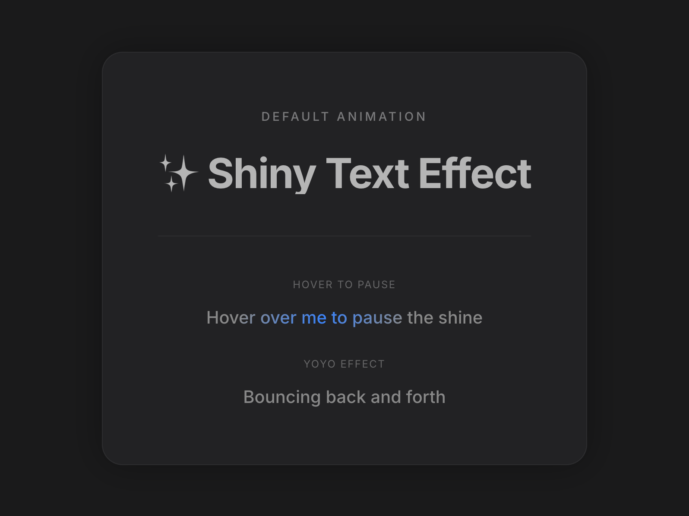

# Shiny Text

A text component with a customizable shining gradient animation effect that sweeps across the text.



## Prompt

```text
You are given a task to integrate an existing React component in the codebase

~~~/README.md
# ShinyText

A text component with a customizable shining gradient animation effect that sweeps across the text.

## Props

| Prop | Type | Default | Description |
|------|------|---------|-------------|
| `text` | string | - | The text to display and animate |
| `disabled` | boolean | false | Whether to disable the animation |
| `speed` | number | 2 | Duration of the animation in seconds |
| `className` | string | '' | Additional CSS classes for styling |
| `color` | string | '#b5b5b5' | The base color of the text |
| `shineColor` | string | '#ffffff' | The color of the shine effect |
| `spread` | number | 120 | The spread angle of the gradient in degrees |
| `yoyo` | boolean | false | Whether the animation should bounce back and forth |
| `pauseOnHover` | boolean | false | Whether to pause the animation on hover |
| `direction` | 'left' \| 'right' | 'left' | The direction of the shine movement |
| `delay` | number | 0 | Delay before animation starts (in seconds) |

## Usage

```tsx
import ShinyText from '@/sd-components/2f78ed51-fbb9-4da5-8537-b528a39fe26f';

// Basic usage
<ShinyText text="Just some shiny text!" />

// Custom speed and colors
<ShinyText 
  text="Shiny Text" 
  disabled={false}
  speed={3} 
  className="custom-class" 
  color="#888888"
  shineColor="#3b82f6" 
/>

// Interactive usage
<ShinyText 
  text="Hover to pause" 
  pauseOnHover={true}
  speed={1.5}
/>
```
~~~

~~~/src/App.tsx
import React from 'react';
import ShinyText from './ShinyText';

export default function App() {
  return (
    <div className="min-h-screen w-full flex items-center justify-center bg-[#1A1A1B] p-8 font-sans">
      <div className="relative group rounded-3xl bg-[#222224] p-16 shadow-[0_0_40px_rgba(0,0,0,0.3)] transition-all hover:shadow-[0_0_60px_rgba(0,0,0,0.5)] border border-white/5">
        <div className="text-center space-y-12">
            <div>
              <h2 className="text-sm font-medium text-white/40 mb-8 uppercase tracking-[0.2em]">Default Animation</h2>
              <div className="text-4xl md:text-5xl font-bold tracking-tight">
                  <ShinyText 
                      text="✨ Shiny Text Effect" 
                      disabled={false}
                      speed={3} 
                      className="custom-class" 
                  />
              </div>
            </div>
            
             <div className="pt-12 border-t border-white/5 grid gap-8 justify-items-center">
                <div>
                  <p className="text-xs text-white/30 mb-4 uppercase tracking-widest">Hover to Pause</p>
                  <ShinyText 
                      text="Hover over me to pause the shine" 
                      speed={2} 
                      color="#888888"
                      shineColor="#3b82f6" // Electric blue
                      className="text-xl font-medium"
                      pauseOnHover={true}
                  />
                </div>
                
                <div>
                  <p className="text-xs text-white/30 mb-4 uppercase tracking-widest">Yoyo Effect</p>
                   <ShinyText 
                      text="Bouncing back and forth" 
                      speed={1.5} 
                      color="#888888"
                      shineColor="#ec4899" // Pink
                      className="text-xl font-medium"
                      yoyo={true}
                  />
                </div>
            </div>
        </div>
      </div>
    </div>
  );
}
~~~

~~~/package.json
{
  "name": "shiny-text-component",
  "version": "1.0.0",
  "description": "A shiny text animation component using Motion",
  "main": "src/ShinyText.tsx",
  "dependencies": {
    "react": "^18.2.0",
    "react-dom": "^18.2.0",
    "motion": "^12.0.0",
    "lucide-react": "^0.344.0"
  }
}
~~~

~~~/src/ShinyText.tsx
import React, { useState, useCallback, useEffect, useRef } from 'react';
import { motion, useMotionValue, useAnimationFrame, useTransform } from 'motion/react';

interface ShinyTextProps {
  text: string;
  disabled?: boolean;
  speed?: number;
  className?: string;
  color?: string;
  shineColor?: string;
  spread?: number;
  yoyo?: boolean;
  pauseOnHover?: boolean;
  direction?: 'left' | 'right';
  delay?: number;
}

const ShinyText: React.FC<ShinyTextProps> = ({
  text,
  disabled = false,
  speed = 2,
  className = '',
  color = '#b5b5b5',
  shineColor = '#ffffff',
  spread = 120,
  yoyo = false,
  pauseOnHover = false,
  direction = 'left',
  delay = 0
}) => {
  const [isPaused, setIsPaused] = useState(false);
  const progress = useMotionValue(0);
  const elapsedRef = useRef(0);
  const lastTimeRef = useRef<number | null>(null);
  const directionRef = useRef(direction === 'left' ? 1 : -1);

  const animationDuration = speed * 1000;
  const delayDuration = delay * 1000;

  useAnimationFrame(time => {
    if (disabled || isPaused) {
      lastTimeRef.current = null;
      return;
    }

    if (lastTimeRef.current === null) {
      lastTimeRef.current = time;
      return;
    }

    const deltaTime = time - lastTimeRef.current;
    lastTimeRef.current = time;
    elapsedRef.current += deltaTime;

    // Animation goes from 0 to 100
    if (yoyo) {
      const cycleDuration = animationDuration + delayDuration;
      const fullCycle = cycleDuration * 2;
      const cycleTime = elapsedRef.current % fullCycle;

      if (cycleTime < animationDuration) {
        // Forward animation: 0 -> 100
        const p = (cycleTime / animationDuration) * 100;
        progress.set(directionRef.current === 1 ? p : 100 - p);
      } else if (cycleTime < cycleDuration) {
        // Delay at end
        progress.set(directionRef.current === 1 ? 100 : 0);
      } else if (cycleTime < cycleDuration + animationDuration) {
        // Reverse animation: 100 -> 0
        const reverseTime = cycleTime - cycleDuration;
        const p = 100 - (reverseTime / animationDuration) * 100;
        progress.set(directionRef.current === 1 ? p : 100 - p);
      } else {
        // Delay at start
        progress.set(directionRef.current === 1 ? 0 : 100);
      }
    } else {
      const cycleDuration = animationDuration + delayDuration;
      const cycleTime = elapsedRef.current % cycleDuration;

      if (cycleTime < animationDuration) {
        // Animation phase: 0 -> 100
        const p = (cycleTime / animationDuration) * 100;
        progress.set(directionRef.current === 1 ? p : 100 - p);
      } else {
        // Delay phase - hold at end (shine off-screen)
        progress.set(directionRef.current === 1 ? 100 : 0);
      }
    }
  });

  useEffect(() => {
    directionRef.current = direction === 'left' ? 1 : -1;
    elapsedRef.current = 0;
    progress.set(0);
    // eslint-disable-next-line react-hooks/exhaustive-deps
  }, [direction]);

  // Transform: p=0 -> 150% (shine off right), p=100 -> -50% (shine off left)
  const backgroundPosition = useTransform(progress, p => `${150 - p * 2}% center`);

  const handleMouseEnter = useCallback(() => {
    if (pauseOnHover) setIsPaused(true);
  }, [pauseOnHover]);

  const handleMouseLeave = useCallback(() => {
    if (pauseOnHover) setIsPaused(false);
  }, [pauseOnHover]);

  const gradientStyle: React.CSSProperties = {
    backgroundImage: `linear-gradient(${spread}deg, ${color} 0%, ${color} 35%, ${shineColor} 50%, ${color} 65%, ${color} 100%)`,
    backgroundSize: '200% auto',
    WebkitBackgroundClip: 'text',
    backgroundClip: 'text',
    WebkitTextFillColor: 'transparent'
  };

  return (
    <motion.span
      className={`inline-block ${className}`}
      style={{ ...gradientStyle, backgroundPosition }}
      onMouseEnter={handleMouseEnter}
      onMouseLeave={handleMouseLeave}
    >
      {text}
    </motion.span>
  );
};

export default ShinyText;
~~~

Implementation Guidelines

1. Analyze the component structure, styling, animation implementations
2. Review the component's arguments and state
3. Think through what is the best place to adopt this component/style into the design we are doing
4. Then adopt the component/design to our current system

Help me integrate this into my design
```

**▶ Try it live → [https://superdesign.dev/library/shiny-text](https://superdesign.dev/library/shiny-text?utm_source=github&utm_medium=prompt-repo&utm_campaign=prompt-library)**

**Use it in your coding agent:** install the [Superdesign skill](https://github.com/superdesigndev/superdesign-skill), then:

```bash
superdesign get-prompts --slugs "shiny-text" --json
```

*182 copies · 2,480 tries · Components · General · animation, text animation*
