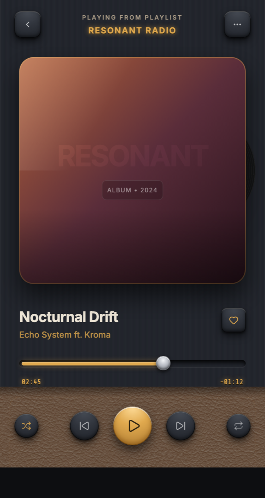

# Skeuomorphism Music Player: Tactile Leather and Brass Now Playing UI

A dark, tactile skeuomorphism mobile now-playing music player ("RESONANT"). A brushed graphite and gunmetal chassis frames an inset screen: an embossed metal back and options chip flank a brass "NOW PLAYING" label; a glossy dusk-gradient album panel (copper to oxblood) has a real diagonal sheen, a thin brass frame, and a vinyl disc peeking from the edge; the track title sits in warm off-white over a muted artist and a brass-lit heart chip. A debossed dark scrubber carries a brass fill and a knurled metal thumb between amber LED-style elapsed and remaining digits. The transport row lives on a cognac-leather panel with a dashed brass stitch: embossed metal shuffle, previous, next, and repeat buttons around a large raised brass play knob. Everything is top-lit with real drop and inset shadows, subtle grain, and machined bevels: unmistakably skeuomorphic, and deliberately not flat, not pastel, not glassmorphism, not neumorphism. Reusable for any tactile player (music, podcast, audiobook, radio).



## Prompt

```text
{
  "summary": "A polished DARK SKEUOMORPHISM mobile now-playing music player ('RESONANT') built entirely from realistic physical materials and depth, the opposite of flat design. Real ~400px phone proportions: a brushed graphite/gunmetal chassis (radius 34px, one top light source, big ambient shadow) frames an inset dark screen. Top bar = an embossed brushed-metal back chevron chip and an options (three-dot) chip flanking a centered tracked-caps 'NOW PLAYING' label in warm brass over a small muted subtitle. A glossy album-art panel shows a warm dusk gradient (copper -> oxblood -> near-black) with a thin brass frame, a real diagonal white sheen, a bottom reflection fade, a faint vinyl disc peeking from the right edge, and an embossed album name. Below: the track title in warm off-white (Inter 700), a muted artist line, and a brass-lit heart favorite chip. The scrubber is a debossed dark channel with a brass fill (inset highlight + amber glow) and a raised knurled metal thumb, with elapsed time (left) and remaining time (right) as amber LED-style monospace digits that glow. The transport row sits on a cognac/oxblood LEATHER panel (grain, inset top highlight, dashed brass stitch border): shuffle and repeat as small embossed metal buttons (brass-lit when active), previous and next as medium brushed-metal circles with engraved glyphs, and a large RAISED BRASS play knob in the center that clearly looks pressable. A physical volume control is a routed debossed metal channel with a brass fill and a knurled metal thumb between speaker-down and brass speaker-up icons. A tactile dark-metal bottom bar carries AirPlay, Lyrics, Queue (active, brass-lit), and Devices as embossed chips. Everything is top-lit with real drop + inset shadows, subtle grain, and machined bevels. Deliberately NOT flat, NOT light pastel, NOT glassmorphism, NOT neumorphism.",
  "style": {
    "description": "Dark, tactile skeuomorphism / real-material UI. A graphite-and-gunmetal brushed-metal chassis, a cognac/oxblood leather transport panel, embossed (raised) and debossed (pressed) surfaces, a warm brass/amber accent, and legible warm off-white text. One top light source drives every highlight and shade so pixels read as machined physical objects: brushed metal, dark leather, glossy album art, knurled thumbs, LED digits. Never flat, never pastel, never glass.",
    "prompt": "Design a DARK skeuomorphism mobile screen where every surface is a realistic physical material, top-lit by a single light source. Chassis / screen ground: graphite gradient #262a31 -> #1b1e24 -> #111318, radius 34px, with faint vertical brushed-metal striations (a 1px repeating-linear-gradient at ~4% white) and a big ambient outer shadow plus a thin inset rim light. Palette: gunmetal #2b2f38 / graphite #20232a for metal, cognac leather #4a2c1e -> #351d14 -> #23110b for the transport panel (with a #c99a5b brass stitch), brass accent #e0a94e with #ffdd9a highlight and #a9772f deep, warm off-white text #efe7d8 with muted #a89a86. Fonts: Inter (700 titles, 600 tracked caps for labels, 500 meta); Share Tech Mono in brass for LED time digits. THE CORE recipes: (1) RAISED embossed metal button = radial-gradient(120% 120% at 50% 0%, #464b54, #30343c 46%, #1c1f25) + box-shadow: 0 6px 12px rgba(0,0,0,.55), inset 0 1.5px 0 rgba(255,255,255,.22) (top bevel), inset 0 -3px 6px rgba(0,0,0,.55) (bottom inner shade), inset 0 0 0 1px rgba(0,0,0,.6) (machined edge). (2) BRASS raised knob = radial-gradient(#ffe6ad, #e5ad50 42%, #a9772f) + inset 0 2px 0 rgba(255,255,255,.65), inset 0 -5px 9px rgba(120,70,10,.6), plus an outer brass glow. (3) DEBOSSED well (scrubber/volume channel) = linear-gradient(180deg,#0f1015,#20232a) + inset 0 3px 6px rgba(0,0,0,.75), inset 0 -1px 0 rgba(255,255,255,.06). (4) KNURLED metal thumb = radial-gradient(circle at 50% 30%, #f4f6f9, #c2c6cd 45%, #6c7078) + inset 0 1px 0 rgba(255,255,255,.95) with a tiny vertical-line knurl. (5) LEATHER panel = radial-gradient(140% 130% at 50% -10%, #4d2f20, #361e14 55%, #22110b) + feTurbulence grain at ~6% + inset top highlight + a dashed brass stitch border. Engrave glyphs with text-shadow: 0 1px 0 rgba(255,255,255,.15), 0 -1px 1px rgba(0,0,0,.6). Everything legible (functional text/icons ~4.5:1). Deliberately NOT flat, NOT pastel, NOT glassmorphism, NOT neumorphism.",
    "prompts": []
  },
  "layout_and_structure": {
    "description": "A single vertical mobile now-playing screen inside a dark brushed-metal chassis: top bar (back / NOW PLAYING / options), glossy album art, track meta + heart, debossed scrubber with LED times, a leather transport row, a physical volume slider, and a tactile bottom bar. Real ~400px phone width, ~18px screen padding, top-lit throughout.",
    "prompts": [
      {
        "part": "Chassis + top bar",
        "prompt": "Wrap everything in a dark graphite brushed-metal chassis (radius 34px, ambient outer shadow, thin inset rim light) around an inset darker screen. Top bar: an embossed brushed-metal back-chevron chip (left) and an options three-dot chip (right), each convex with a top bevel highlight + bottom inner shade + machined edge ring, flanking a centered tracked-caps 'NOW PLAYING' label in warm brass over a small muted all-caps subtitle."
      },
      {
        "part": "Album art",
        "prompt": "A glossy square-ish album panel in a raised metal mat: a warm dusk gradient (copper #c8703f -> oxblood #8f3f42 -> near-black #20101c), a thin brass frame (inset 0 0 0 1px rgba(224,169,78,.45)), a real diagonal white sheen highlight, a bottom reflection fade, a faint concentric vinyl disc peeking from the right edge, and the album name embossed bottom-left over it."
      },
      {
        "part": "Track meta",
        "prompt": "The song title in warm off-white (Inter 700, ~21px) over a muted artist line, with an embossed brushed-metal heart favorite chip on the right whose heart glyph is brass-lit with a soft amber glow."
      },
      {
        "part": "Scrubber",
        "prompt": "A debossed (pressed-in) dark pill channel with inset top shadow. A brass fill (linear #ffdd9a -> #e0a94e -> #b7863a, inset highlight + amber glow) runs ~38% across to a raised knurled metal thumb (light convex disc with a vertical-line knurl). Below: elapsed time on the left in glowing amber LED-style monospace, remaining time on the right in a dimmer engraved mono."
      },
      {
        "part": "Transport row (leather)",
        "prompt": "A cognac/oxblood leather panel (grain/noise texture, inset top highlight, a dashed brass stitch border) holds the transport row: small embossed metal shuffle (brass-lit, active) and repeat buttons at the ends, medium brushed-metal previous and next circles with engraved glyphs, and a large RAISED BRASS play knob in the center (convex, glossy top highlight, brass glow) that clearly looks pressable."
      },
      {
        "part": "Volume + bottom bar",
        "prompt": "A physical volume control: a speaker-down icon, a routed debossed metal channel with a brass fill and a knurled metal thumb, and a brass speaker-up icon. Then a tactile dark-metal bottom bar with AirPlay, Lyrics, Queue (active, brass-lit), and Devices rendered as embossed chips with tiny caps labels."
      }
    ]
  },
  "special_ui_components": [
    {
      "component": "Embossed metal transport button",
      "description": "The raised, pressable brushed-metal control used for back/options/prev/next/shuffle/repeat.",
      "prompt": "A convex circular (or 12px-radius) brushed-metal button: radial-gradient(120% 120% at 50% 0%, #4a4f58, #31353d 46%, #1b1e24) with box-shadow 0 6px 12px rgba(0,0,0,.55), inset 0 1.5px 0 rgba(255,255,255,.24) (top bevel), inset 0 -3px 6px rgba(0,0,0,.55) (bottom shade), inset 0 0 0 1px rgba(0,0,0,.6) (machined edge), faint vertical brushed striations, and an engraved glyph (text-shadow 0 1px 0 rgba(255,255,255,.18), 0 -1px 1px rgba(0,0,0,.65)). Active state (shuffle/repeat) turns the glyph brass #e0a94e with a soft amber glow."
    },
    {
      "component": "Raised brass play knob",
      "description": "The large central play/pause button, a glossy machined brass disc.",
      "prompt": "A large circular brass knob: radial-gradient(120% 120% at 50% 0%, #ffe6ad, #e5ad50 42%, #a9772f) with box-shadow 0 10px 20px rgba(0,0,0,.55), inset 0 2px 0 rgba(255,255,255,.65) (glossy top), inset 0 -5px 9px rgba(120,70,10,.6) (bottom shade), inset 0 0 0 1px rgba(90,55,10,.75) (edge), plus an outer amber glow 0 0 22px rgba(224,169,78,.28). A dark engraved play triangle sits centered and optically balanced."
    },
    {
      "component": "Debossed brass scrubber with knurled metal thumb",
      "description": "The pressed-in progress channel, brass fill, and a real metal slider thumb.",
      "prompt": "A debossed pill channel: linear-gradient(180deg,#0f1015,#20232a) with inset 0 3px 6px rgba(0,0,0,.75) and inset 0 -1px 0 rgba(255,255,255,.06). A brass fill (linear #ffdd9a -> #e0a94e -> #b7863a, inset highlight + 0 0 8px amber glow) runs from the left to a raised knurled metal thumb = radial-gradient(circle at 50% 30%, #f4f6f9, #c2c6cd 45%, #6c7078) with inset 0 1px 0 rgba(255,255,255,.95) and a fine vertical-line knurl. Same recipe reused for the physical volume slider."
    },
    {
      "component": "Stitched leather transport panel",
      "description": "The cognac leather surround the transport controls sit on.",
      "prompt": "A rounded leather panel: radial-gradient(140% 130% at 50% -10%, #4d2f20, #361e14 55%, #22110b), an SVG feTurbulence grain overlay at ~6% opacity, box-shadow inset 0 1px 0 rgba(255,222,180,.14) (top highlight) + inset 0 -10px 22px rgba(0,0,0,.5) (bottom shade) + inset 0 0 0 1px rgba(0,0,0,.55), and a 1.5px dashed brass (#c99a5b) stitch border inset ~9px with a subtle emboss shadow."
    },
    {
      "component": "Amber LED time digits",
      "description": "The elapsed/remaining readout, lit like an LED segment display.",
      "prompt": "Elapsed and remaining times in Share Tech Mono, letter-spaced ~.05em. Elapsed = brass #e0a94e with text-shadow 0 0 6px rgba(224,169,78,.55), 0 1px 0 #000 (lit/glowing). Remaining = dimmer #8f8674 with a 0 1px 0 #000 engrave. Sits directly under the debossed scrubber, left and right aligned."
    }
  ]
}
```

**▶ [Try it live →](https://superdesign.dev/library/skeuomorphism-music-player-tactile-leather-and-brass-now-playing-ui?utm_source=github&utm_medium=prompt-repo&utm_campaign=prompt-library)**

**Use it in your coding agent:** install the [Superdesign skill](https://github.com/superdesigndev/superdesign-skill), then:

```bash
superdesign get-prompts --slugs "skeuomorphism-music-player-tactile-leather-and-brass-now-playing-ui" --json
```

*0 copies · 0 tries · Mobile Apps · General · skeuomorphism, skeuomorphic, neo-skeuomorphism, music-player*
