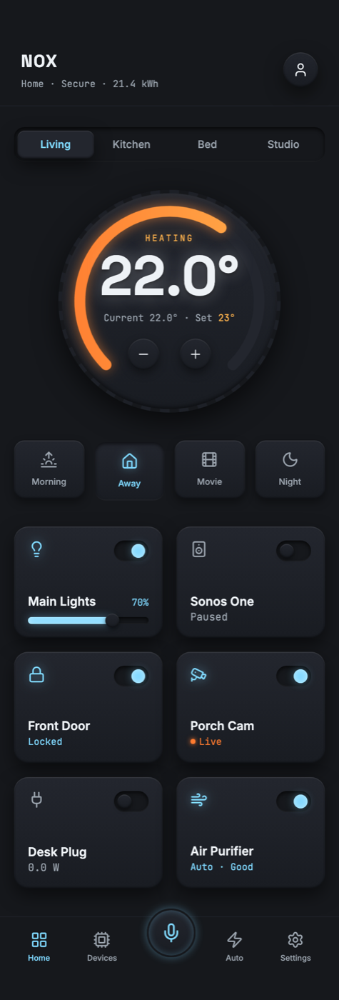

# Skeuomorphism Smart Home App: Dark Brushed-Metal Control Panel

A dark tactile skeuomorphism mobile app home screen for smart-home / IoT control. On a brushed-graphite wall, every control is a raised, top-lit dark-metal plate: a large brushed-metal thermostat dial with a knurled rim, a glowing amber heat arc and a big bright temperature readout; a pressed-metal room switch; a row of 3D pushable scene buttons; and a six-card device grid with real rocker toggles that light ice-blue when a device is on, plus a dimmer slider. A metal tab bar carries a raised center voice button. Two accents only, a cool ice-blue powered-on glow and one warm amber heat arc, on a dark ground so every control keeps real value contrast and nothing washes out. Reusable for any smart-home, IoT, or connected-device app.



## Prompt

```text
{
  "summary": "A dark tactile-skeuomorphism smart-home control app for mobile called NOX. A brushed-graphite wall holds every control as a raised, top-lit dark-metal plate. The centerpiece is a large brushed-metal thermostat dial with a glowing amber heat arc and a big bright temperature readout; below it sit a pressed-metal room switch, a row of 3D pushable scene buttons, and a grid of device cards with real rocker toggles and a dimmer, then a metal tab bar with a raised center voice button. Two accents only: a cool ice-blue that reads as a device powered on, and one warm amber heat arc that is the brightest thing on the page. Because the ground is dark, every material and every lit control has real value contrast.",
  "style": "Dark tactile skeuomorphism (neo-skeuomorphism), NOT flat, NOT neumorphism-on-light. Ground is dark cool brushed graphite: base #16181c, control plates a linear-gradient #23262e to #191c22, hairline top-light #3a3f49. Ink is bright off-white #eef2f6 for load-bearing numerals and labels, muted #9aa3ad for secondary. Exactly two accents: a cool ice-blue #7fd8ff powered-on glow (active toggles, active devices, dimmer fill), and a warm heat arc amber #ffb24d to orange #ff7a2f used ONLY on the thermostat. Type: Space Grotesk for display and numerals, Inter for body, JetBrains Mono for small setpoint / energy / status readouts. Every surface uses a consistent shadow language so the metal reads as real: RAISED plate = inset 1px top highlight rgba(255,255,255,0.10) + inset bottom shadow rgba(0,0,0,0.55) + outer drop shadow 0 8px 20px rgba(0,0,0,0.5); DEBOSSED track / well = the reverse (inset dark top, faint light bottom); a brushed-metal sheen is a very low-opacity repeating-linear-gradient overlay; a lit control adds a colored box-shadow bloom plus a brighter inner face so ON reads as actual light. All effects are pure CSS and SVG, no JavaScript needed for the visible frame, so every state is frozen and the render is faithful.",
  "layout_and_structure": "Single column, max-w-[440px], centered on the dark wall, fully responsive down to 390px with fluid widths and no fixed-px containers; the page grows to natural height (no h-screen or overflow clipping on the root). Top to bottom: (1) a sticky top bar with the home name NOX, a mono status line 'Home - Secure - 21.4 kWh', and a round metal avatar plate; (2) a pressed-metal SEGMENTED room switch with Living active and lit ice-blue, then Kitchen / Bed / Studio muted; (3) the HERO thermostat, a large circular brushed-metal dial (repeating-conic knurled rim, gradient face, inset depth) with an SVG track arc plus an amber-to-orange value arc sweeping about two thirds of a 270-degree gauge, a HEATING label, a very large bright temperature numeral like 22.0 degrees that is the strongest element on screen, a mono 'Current 22.0 - Set 23' readout, and two round tactile minus / plus buttons; (4) a four-up row of 3D pushable scene buttons (Morning / Away / Movie / Night) each with a small icon, with Away shown pressed and lit; (5) a two-column device grid of six metal cards, each with a device icon, a real rocker toggle (raised thumb in a debossed track, thumb pushed right and glowing ice-blue when ON, left and dark when OFF), a device name and a mono status; mix ON and OFF states so the glow contrast reads, and give the Lights card a debossed ice-blue dimmer slider at about 70 percent; (6) an absolute-bottom dark-metal tab bar with Home / Devices / a raised center voice FAB / Automations / Settings.",
  "special_ui_components": [
    {
      "component": "Brushed-metal thermostat dial (hero)",
      "description": "The load-bearing focal control: a large circular metal dial with a knurled rim, an SVG heat gauge, and a bright temperature numeral that dominates the screen.",
      "prompt": "Build a circular dial about 256px. Outer ring: a repeating-conic-gradient knurl (from 0deg, #1d2027 0-5deg, #16181c 5-10deg) with a soft outer drop shadow, 4px padding. Inner face: a linear-gradient #23262e to #191c22 with an inset top highlight and inset bottom shadow so it reads recessed. Overlay a full-size SVG (viewBox 0 0 240 240): a track circle r=100 stroke #23262e stroke-width 12 round caps, dasharray '471.2 628.3', transform rotate(135 120 120) so the gap sits at the bottom; then a value circle same geometry, stroke a linear-gradient #ffb24d to #ff7a2f, dasharray '297 628.3' with a warm drop-shadow glow. Center a HEATING mono label in amber, a very large bright #eef2f6 Space Grotesk numeral (about 64px) with a soft white text-shadow so it lifts off the surface, a mono 'Current ... Set ...' line, and two round tactile minus / plus buttons using the raised-plate shadow recipe."
    },
    {
      "component": "Rocker toggle (raised thumb in a debossed track)",
      "description": "The repeated on/off control across the device grid; the single clearest signal of value contrast.",
      "prompt": "A pill track (about 40x24) with a DEBOSSED recipe: background #16181c, inset shadow dark on top and a faint light line on the bottom. Inside, a round thumb (about 16px) using the RAISED recipe (gradient face, top highlight, drop shadow) sitting at the left when OFF. For the ON state, translate the thumb to the right edge, fill it ice-blue #7fd8ff, and add a colored bloom box-shadow so it looks lit. Keep the travel exact so the thumb never clips the track edge."
    },
    {
      "component": "Debossed dimmer slider",
      "description": "A tactile brightness control on the Lights card that shows a filled ice-blue level.",
      "prompt": "A thin rounded track (height about 8px) with the DEBOSSED well recipe (dark inset). Fill it from the left to about 70 percent with an ice-blue #7fd8ff bar that carries a soft glow, and place a small round raised metal handle at the fill end. Show a mono percentage label near the device name."
    },
    {
      "component": "3D pushable scene buttons",
      "description": "A row of tactile preset buttons where one is shown physically pressed and lit.",
      "prompt": "Four rounded metal buttons in a row (Morning / Away / Movie / Night), each with a small icon and a tiny label. Default state uses the raised-plate recipe with a subtle bottom edge. For the active/pressed one, translate it down about 2px and swap to the pressed/inset shadow recipe, and tint its icon and label ice-blue with a soft glow so it reads as selected and lit."
    },
    {
      "component": "Metal tab bar with raised center voice FAB",
      "description": "The bottom navigation, pinned to the bottom of the page, anchored by a glowing center microphone button.",
      "prompt": "A dark-metal bar pinned with absolute bottom-0 across the 440px column, with a subtle top border and safe-area bottom padding. Five slots: Home / Devices / center FAB / Automations / Settings, labels tiny. The center slot is a round raised metal plate lifted above the bar (negative top margin) with an ice-blue microphone icon and an ice-blue glow ring, so voice control reads as the primary action."
    }
  ]
}
```

**▶ [Try it live →](https://superdesign.dev/library/skeuomorphism-smart-home-app-ui-dark-brushed-metal-control-panel-with-thermostat-dial?utm_source=github&utm_medium=prompt-repo&utm_campaign=prompt-library)**

**Use it in your coding agent:** install the [Superdesign skill](https://github.com/superdesigndev/superdesign-skill), then:

```bash
superdesign get-prompts --slugs "skeuomorphism-smart-home-app-ui-dark-brushed-metal-control-panel-with-thermostat-dial" --json
```

*0 copies · 0 tries · Mobile Apps · Smart Home · skeuomorphism, skeuomorphic, neo-skeuomorphism, mobile-app-design*
