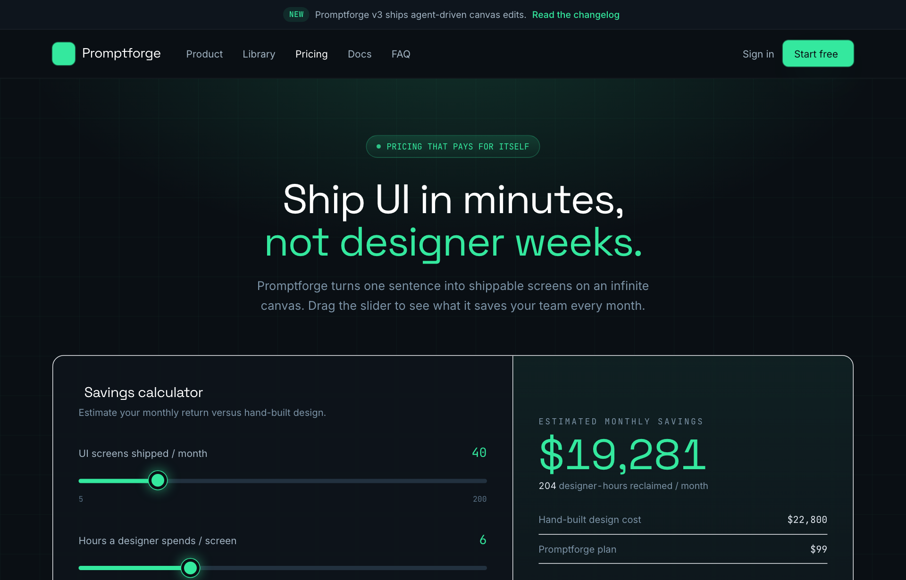

# Slate ROI-Calculator Pricing

A frameless dark SaaS pricing page in inky slate with one electric mint accent: an interactive ROI savings calculator, a 4-tier plan grid with a highlighted Pro card and monthly/annual toggle, a comparison table, and an accordion FAQ.



## Prompt

```text
{"summary": "A frameless, single-page dark pricing page for a developer-facing AI design SaaS, anchored by an interactive ROI savings calculator at the top, a 4-tier plan grid with a highlighted 'Most Popular' card and a monthly/annual toggle, a feature comparison table, an accordion FAQ, and a grid-textured CTA. The whole page rides an inky near-black slate palette lit by a single electric mint-green signal accent.", "style": {"description": "Electric-mint-on-inky-slate dev-tool aesthetic: a deep near-black background system with a single saturated mint-green accent used for emphasis, CTAs, and data highlights. Geometric display type for headlines, a clean grotesque for body, and a monospace for labels/numbers. Subtle faint-green grid texture and a soft radial glow behind hero/CTA sections give it a 'terminal lit from above' feel. Glows and 1px tinted borders stand in for heavy shadows.", "prompt": "Build a dark, high-contrast developer-tool style. Background palette is a custom near-black 'slate' ramp: slate-950 #0a0f14 (page bg / nav), slate-925 #0c1219, slate-900 #0e151d (cards / surfaces), slate-850 #121b25 (highlighted card), slate-800 #16202c, slate-750 #1b2734, slate-700 #22313f (slider tracks / borders), slate-600 #33485b, slate-500 #5a7287, slate-400 #7c93a6 (muted text), slate-300 #a3b5c4 (body text). The single accent is 'signal' mint-green: DEFAULT #34e89e, bright #4dffb0 (hover), dim #1faf78, deep #0d3a2c. Pure white #ffffff for primary headings; white/5\u2013white/12 translucent overlays for hairline borders and subtle hover fills. Typography: display font 'Space Grotesk' (weights 400\u2013700) for headlines and prices; body font 'Inter' (400/450/500/600/700); monospace 'JetBrains Mono' (400\u2013600) for eyebrow labels, numbers (with tabular-nums), and badges. Texture: a faint mint grid (linear-gradient lines at rgba(52,232,158,0.045), 56px cells) plus a top radial glow radial-gradient(ellipse 80% 55% at 50% -8%, rgba(52,232,158,0.16)) behind hero and CTA. Treat shadows as glows: card-pop = 0 24px 60px -20px rgba(52,232,158,0.22) + 1px mint ring; glow = 1px mint ring + 0 18px 48px -16px rgba(52,232,158,0.28). Rounded-2xl cards, rounded-lg buttons, rounded-full pills. Mint buttons have slate-950 text; secondary buttons are ghost (white text, white/12 border)."}, "layout_and_structure": {"description": "Frameless responsive single-column page, max content width ~1180px centered with px-6 gutters. Reading order top to bottom: announcement bar, sticky translucent nav, hero headline + ROI calculator, billing toggle + 4 plan cards, comparison table, FAQ accordion, glowing CTA band, multi-column footer. The pricing system itself spans three coordinated pieces: an interactive ROI calculator, the tiered plan grid with a billing toggle, and a feature comparison table. Cards reflow 4-col -> 2-col -> 1-col; nav is sticky with backdrop blur.", "prompts": [{"part": "Announcement bar (top)", "prompt": "A thin full-width bar on slate-900 with a bottom white/5 border, 13px. Centered row: a small mint 'NEW' pill (bg signal/10, mono uppercase), a short product-update line in slate-300, and a mint 'Read the changelog ->' link with an arrow icon that hides on narrow screens."}, {"part": "Sticky nav", "prompt": "Sticky top-0 z-50 header, slate-950 at 80% opacity with backdrop-blur-xl and a white/5 bottom border, 68px tall. Left: a square mint logo tile (rounded-lg, command icon, slate-950 glyph, glow) next to the 'Promptforge' wordmark in Space Grotesk 700; then a horizontal nav (Product, Library, Pricing [active=white], Docs, FAQ) that hides below lg. Right: a ghost 'Sign in' link plus a mint 'Start free' button with an up-right arrow and glow."}, {"part": "Hero headline", "prompt": "Centered hero over the grid texture + radial glow. A mint pill eyebrow with a pulsing dot reading 'PRICING THAT PAYS FOR ITSELF' (mono). Big two-line Space Grotesk 700 headline ~44px mobile / 58px desktop, tight leading, second line in mint ('not designer weeks.'). Below, a ~560px muted slate-400 subhead inviting the reader to drag the slider."}, {"part": "ROI savings calculator (signature component)", "prompt": "A wide rounded-2xl card (slate-900 at 70% + backdrop blur, white/8 border) split into a two-column grid (1.15fr inputs / 0.85fr output) that stacks vertically on small screens with the divider switching from a right border to a bottom border. Left pane: a calculator-icon heading 'Savings calculator' and three labeled mint range sliders (UI screens shipped/month 5\u2013200; Hours per screen 1\u201320; Blended design rate/hour $40\u2013$250), each with a large mono mint live value and min/max captions. Right pane: a faint top-down mint gradient panel showing a mono uppercase eyebrow 'ESTIMATED MONTHLY SAVINGS', a giant ~60px mint dollar figure, a 'designer-hours reclaimed' line, then a 3-row mini ledger (Hand-built design cost / Promptforge plan / Net ROI as a mint pill like 219x) and a full-width mint 'Claim these savings' CTA. Numbers recompute live from the slider inputs."}, {"part": "Billing toggle + plan grid (the pricing layout)", "prompt": "Section heading 'Plans that scale with you' centered with a muted subhead, then a pill-shaped Monthly/Annual segmented toggle (rounded-full, white/10 border on slate-900; active segment is mint with slate-950 text; Annual shows a mono '-20%'). Below, a 4-column plan grid (md:2, lg:4, gap-5, items-stretch): Free $0/forever, Starter $23\u2013$29/mo, Pro $79\u2013$99/mo, Enterprise Custom. Each card is a flex column: mono uppercase tier label, Space Grotesk 700 price with a muted '/mo', a one-line min-height description, a CTA button, then a checklist of features (mint check icons). The Pro card is visually elevated: solid slate-850 fill, card-pop glow, slight scale/negative margins, a mint label, a mint primary CTA, and an absolute mint 'MOST POPULAR' badge with a zap icon notched over its top edge. Toggling billing rewrites the price numbers in place. A centered fine-print line follows ('All plans include unlimited prompt-library browsing. No credit card required.')."}, {"part": "Comparison table", "prompt": "A rounded-2xl bordered container (slate-900 at 50%) with a header strip ('Compare the essentials' + subhead). Inside, a horizontally-scrollable table (min-width 640px) with a mono uppercase header row (Feature, Free, Starter, Pro [mint], Enterprise); feature rows separated by white/6 top borders, the Pro column tinted mint, cells using mono tabular numbers for counts, mint check icons for included and muted minus icons for excluded, and an infinity glyph for unlimited."}, {"part": "FAQ accordion", "prompt": "Narrower ~820px centered section, heading 'Questions, answered' with a 'Ping us' mint link subhead. A vertical stack of native <details> accordion items: each a rounded-xl slate-900/60 card with a white/8 border, a 15px white question summary, and a chevron-down icon that rotates 180deg when open; first item open by default revealing muted slate-400 answer copy."}, {"part": "CTA band", "prompt": "Full-bleed section reusing the grid texture + radial glow with top/bottom white/6 borders. Centered Space Grotesk 700 headline ('Your next screen is one prompt away.'), a short muted subhead, and a button row: a primary mint 'Create a free account' (with arrow, glow) beside a ghost 'Talk to sales' button; buttons go full-width and stack on mobile."}, {"part": "Footer", "prompt": "slate-950 footer, max ~1180px. A responsive column grid (1.4fr brand / 1fr / 1fr / 1fr): brand column with logo tile + wordmark, a short product blurb, and three square social icon tiles (github, twitter, message-circle) that turn mint on hover; plus three link columns (Product, Resources, Company) each under a mono uppercase slate-500 heading. A top white/6 hairline divides a bottom bar with a copyright line and Privacy / Terms / Status links."}]}, "special_ui_components": [{"component": "Interactive ROI / savings calculator", "description": "The page's hero centerpiece: three range sliders whose live values drive a big animated monthly-savings figure, an hours-reclaimed stat, a 3-line cost ledger, and a Net ROI multiplier pill.", "prompt": "Build an interactive ROI calculator in a split two-pane card. Left: three custom-styled <input type=range> sliders (screens/month, hours/screen, blended $/hour) with mint thumbs (26px circle, #34e89e, 4px slate-950 ring, mint glow) and a fill-on-track effect via a JS-painted linear-gradient (mint up to the value %, slate-700 after). Each slider has a live mono mint readout. Right: derive manualCost = screens x hours x rate, apply an 85% time-reduction, subtract a fixed $99 plan cost, and render a giant mint savings number, an hours-saved line, a ledger (Hand-built design cost / Promptforge plan / Net ROI), and a Net-ROI multiplier pill (e.g. '219x') in a mint chip. Recompute on every input event; format with toLocaleString and tabular-nums."}, {"component": "Monthly / Annual billing toggle", "description": "A segmented rounded-full pill switch that swaps every plan price between monthly and annual values, with the active segment filled mint and Annual showing a '-20%' savings tag.", "prompt": "A two-button segmented control inside a rounded-full white/10-bordered pill on slate-900. Each plan price <span class='price'> carries data-monthly and data-annual attributes; clicking a segment rewrites all prices to the matching dataset value and toggles which button gets the mint-on-slate-950 active styling. Default to Annual selected. Include a mono '-20%' tag on the Annual button."}, {"component": "Highlighted 'Most Popular' Pro card", "description": "The recommended tier, lifted out of the row with a solid fill, mint accents, a mint glow shadow, and a notched badge.", "prompt": "Make one plan card stand out: solid slate-850 fill (vs the translucent siblings), card-pop mint glow shadow, a slight scale-up and negative top/bottom margins so it rises above the row, mint tier label, mint primary CTA, brighter slate-200 feature text, and an absolutely-positioned mint 'MOST POPULAR' pill (mono 700, zap icon, mint glow) centered and notched over the card's top edge."}, {"component": "Custom mint range slider", "description": "Reusable dark slider styling: thin rounded track that fills mint up to the current value, with a glowing mint thumb.", "prompt": "Style range inputs cross-browser: 6px rounded track, no native appearance; thumb is a 26px mint circle with a 4px slate-950 border, a 1px mint ring and an 18px mint glow (-webkit-slider-thumb and -moz-range-thumb). Paint the filled portion with a JS linear-gradient (#34e89e to value%, then #22313f), updated on input."}, {"component": "Feature comparison table with Pro column highlight", "description": "Horizontally scrollable plan-vs-feature matrix using mint checks, muted minus marks, an infinity glyph, and a tinted Pro column.", "prompt": "A responsive table (min-width 640px, horizontal scroll on overflow) with a mono uppercase header, hairline white/6 row dividers, mono tabular-nums for counts, lucide check (mint) for included features, lucide minus (muted slate-600) for excluded, and an infinity symbol for unlimited; tint the Pro column header and Pro cell values mint."}], "special_notes": "Frameless, fully responsive single page (no app chrome / window frame): content is centered in a ~1180px max-width container; the plan grid reflows 4 -> 2 -> 1 column, the calculator's two panes stack and flip their divider, the comparison table switches to horizontal scroll, and nav/buttons collapse on mobile. The nav is sticky with backdrop blur. Three Google fonts (Space Grotesk, Inter, JetBrains Mono) and Iconify lucide icons. Two small bits of vanilla JS power the experience: the live ROI calculator and the billing toggle (no framework). The mint 'signal' green is the only accent; everything else is the inky slate ramp, so it should stay restrained and used for emphasis only."}
```

**▶ Try it live → [https://superdesign.dev/library/slate-roi-calculator-pricing](https://superdesign.dev/library/slate-roi-calculator-pricing?utm_source=github&utm_medium=prompt-repo&utm_campaign=prompt-library)**

**Use it in your coding agent:** install the [Superdesign skill](https://github.com/superdesigndev/superdesign-skill), then:

```bash
superdesign get-prompts --slugs "slate-roi-calculator-pricing" --json
```

*0 copies · 2,481 tries · pricing page, saas, dark, dev-tool, electric-green*
