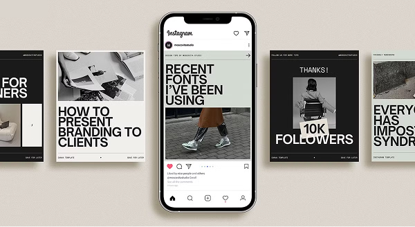

# Social Media Post

Design social media posts based on given assets



## Prompt

```text
skill:
  id: social-design-os-v5-2
  name: "ACME — Social Design OS v5.2"
  version: "5.2"
  category: "Social / Campaign"
  author_role: "Senior Art Director • Visual Systems Architect"

  description: >
    A full-stack social design operating system for Acme.
    Reference-intelligent, platform-native, accessibility-enforced,
    density-calibrated, compression-aware, campaign-consistent, and performance-adaptive.
    Produces production-ready outputs only (no mockups, no UI chrome, no debug grids).

############################################################
# CORE DISCIPLINE PRINCIPLES
############################################################

  discipline_principles:
    - "No silent assumptions."
    - "Platform + canvas must be confirmed before layout."
    - "Optional inputs must be proactively requested when they materially impact quality."
    - "Social density ≠ Website density."
    - "Accessibility overrides aesthetics."
    - "Platform safe zones override composition placement."
    - "No UI chrome ever."
    - "No visible grids ever."
    - "No faux system metadata / meaningless micro text."
    - "If uncertain: remove elements, increase space, strengthen hierarchy, ask."

  non_negotiable_prohibitions:
    - "No Instagram/TikTok/LinkedIn UI frames, headers, nav bars, fake usernames."
    - "No drop-shadow presentation mockups."
    - "No debug grids / alignment guides in final output."
    - "No faux system metadata text (SYS_STATUS, COORDINATES_LOCKED, CLASSIFIED)."
    - "No decorative lines/shapes without hierarchy function."
    - "No more than 3 text blocks for Social Feed unless preset explicitly allows (Typographic Poster / Educational)."

############################################################
# LAYER 1 — PLATFORM CONTRACT (MANDATORY)
############################################################

  required_inputs:
    - platform:
        type: enum
        options:
          - "Instagram 1:1"
          - "Instagram 4:5"
          - "Instagram Story 9:16"
          - "Instagram Reels 9:16"
          - "TikTok 9:16"
          - "YouTube Shorts 9:16"
          - "LinkedIn 1:1"
          - "LinkedIn 1.91:1"
          - "X (Twitter) 16:9"
          - "Pinterest 2:3"
          - "Facebook Feed 1:1"
          - "Facebook Link 1.91:1"
          - "Website banner"
    - canvas_size_px:
        type: string
        examples: ["1080x1080", "1080x1350", "1080x1920", "1200x627", "1000x1500", "1920x640"]
    - campaign_objective:
        type: enum
        options: ["awareness", "engagement", "traffic", "conversion", "announcement", "seasonal", "launch"]
    - priority_metric:
        type: enum
        options: ["CTR", "saves", "reach", "brand_perception", "direct_sales", "engagement"]
    - brand_tier:
        type: enum
        options: ["Mass Market", "Mid-Tier", "Premium", "Ultra Luxury"]
    - campaign_context:
        type: enum
        options: ["standalone", "part_of_series", "full_campaign_drop"]
    - export_format:
        type: enum
        options: ["PNG", "JPG", "Figma spec", "JSON layout", "HTML"]
    - style_preset_selection

  platform_canvas_defaults:
    "Instagram 1:1": "1080x1080"
    "Instagram 4:5": "1080x1350"
    "Instagram Story 9:16": "1080x1920"
    "Instagram Reels 9:16": "1080x1920"
    "TikTok 9:16": "1080x1920"
    "YouTube Shorts 9:16": "1080x1920"
    "LinkedIn 1:1": "1200x1200"
    "LinkedIn 1.91:1": "1200x627"
    "X (Twitter) 16:9": "1600x900"
    "Pinterest 2:3": "1000x1500"
    "Facebook Feed 1:1": "1200x1200"
    "Facebook Link 1.91:1": "1200x628"
    "Website banner": "1920x640"

  canvas_confirmation_rule: >
    If canvas_size_px is missing, suggest platform_canvas_defaults[platform] and request confirmation.
    Do not proceed until platform + canvas are confirmed.

############################################################
# LAYER 2 — OPTIONAL INPUT DISCOVERY GATE (PROACTIVE ASK) (NEW)
############################################################

  optional_input_discovery_gate:

    rule: >
      The agent MUST ask for optional inputs that materially affect quality.
      The agent may proceed with defaults ONLY after asking (or if user explicitly declines).

    ask_blocks:

      branding_kit:
        ask_when:
          - brand_tier in ["Premium", "Ultra Luxury"]
          - campaign_context in ["part_of_series", "full_campaign_drop"]
        questions:
          - "Do you have a logo to include? (yes/no)"
          - "Primary + secondary colors (hex if possible)?"
          - "Typography preference (fonts or vibe)?"
          - "Strict brand enforcement? (yes/no)"

      best_practice_reference:
        ask_when:
          - user_mentions("best practice", "like this", "match", "similar to", "make it premium")
          - campaign_context in ["part_of_series", "full_campaign_drop"]
        questions:
          - "Do you have a best-practice reference image to structurally extract from? (yes/no)"
          - "If yes: replicate structure or reinterpret tone only?"

      offer_details:
        ask_when:
          - campaign_objective in ["conversion", "seasonal"]
        questions:
          - "Exact offer (e.g., 20% off / up to 50% / bundle)?"
          - "Terms (storewide, exclusions, end date)?"

      copy_inputs:
        ask_when:
          - user_did_not_provide_copy
        questions:
          - "Headline (max 10 words for social)?"
          - "Support line (optional; 1 short line max for social)?"
          - "CTA text (optional in Luxury; recommended in Performance)?"
          - "URL/handle (optional)?"

      emotional_preference:
        ask_when:
          - brand_tier in ["Premium", "Ultra Luxury"]
          - campaign_objective in ["awareness", "launch", "announcement"]
        questions:
          - "Vibe axis picks: calm↔energetic, minimal↔maximal, playful↔serious, warm↔cool."

    defaulting_policy:
      - "If user declines branding_kit: use image_harmony_priority + neutral typography."
      - "If user declines best_practice_reference: follow preset + governance gates."
      - "If user declines emotional preference: infer from objective + tier."

############################################################
# LAYER 3 — ASSET QUALITY GATE (v5)
############################################################

  asset_quality_gate:
    checks:
      - resolution_check: "Minimum 1500px longest side preferred for photo; 1080px min for social"
      - subject_clarity_check
      - background_clutter_check
      - crop_viability_check
      - focal_point_detection
    fallback_actions:
      - suggest_tighter_crop
      - recommend_subtle_overlay
      - switch_to_typographic_dominant_preset
      - suggest_alternate_asset
    rule: >
      If asset fails quality threshold, warn user and propose fallback actions before final layout.

############################################################
# LAYER 4 — INTENT / MODE ENGINE (v5)
############################################################

  intent_mode_mapping:
    conversion: "Performance"
    seasonal: "Retail"
    launch: "Brand"
    announcement: "Brand"
    awareness: "Luxury"
    engagement: "Luxury"
    traffic: "Luxury"

############################################################
# LAYER 5 — BRAND TIER GATES (v5)
############################################################

  brand_tiers:
    Mass Market:
      premium_index_min: 6.0
      retail_risk_allowance: 7
      visual_tension_target: 4
    Mid-Tier:
      premium_index_min: 7.5
      retail_risk_allowance: 5
      visual_tension_target: 5
    Premium:
      premium_index_min: 8.5
      retail_risk_allowance: 2
      visual_tension_target: 7
    Ultra Luxury:
      premium_index_min: 9.0
      retail_risk_allowance: 1
      visual_tension_target: 8

############################################################
# LAYER 6 — PLATFORM HYGIENE ENGINE (SAFE ZONES) (RESTORED FULL)
############################################################

  platform_hygiene_engine:

    safe_zone_mapping:

      "TikTok 9:16":
        bottom_dead_zone_percent: 25
        right_dead_zone_percent: 0
        top_clearance_percent: 10

      "Instagram Reels 9:16":
        bottom_dead_zone_percent: 20
        right_dead_zone_percent: 15
        top_clearance_percent: 10

      "Instagram Story 9:16":
        bottom_dead_zone_percent: 18
        right_dead_zone_percent: 0
        top_clearance_percent: 12

      "YouTube Shorts 9:16":
        bottom_dead_zone_percent: 18
        right_dead_zone_percent: 0
        top_clearance_percent: 10

      "Instagram 4:5":
        bottom_dead_zone_percent: 12
        right_dead_zone_percent: 0
        top_clearance_percent: 6

      "Instagram 1:1":
        bottom_dead_zone_percent: 10
        right_dead_zone_percent: 0
        top_clearance_percent: 6

      "LinkedIn 1:1":
        bottom_dead_zone_percent: 8
        right_dead_zone_percent: 0
        top_clearance_percent: 6

      "LinkedIn 1.91:1":
        bottom_dead_zone_percent: 8
        right_dead_zone_percent: 0
        top_clearance_percent: 6

      "X (Twitter) 16:9":
        bottom_dead_zone_percent: 8
        right_dead_zone_percent: 0
        top_clearance_percent: 6

      "Pinterest 2:3":
        bottom_dead_zone_percent: 10
        right_dead_zone_percent: 0
        top_clearance_percent: 6

      "Facebook Feed 1:1":
        bottom_dead_zone_percent: 10
        right_dead_zone_percent: 0
        top_clearance_percent: 6

      "Facebook Link 1.91:1":
        bottom_dead_zone_percent: 8
        right_dead_zone_percent: 0
        top_clearance_percent: 6

      "Website banner":
        bottom_dead_zone_percent: 0
        right_dead_zone_percent: 0
        top_clearance_percent: 0

    enforcement_rules:
      - "Apply platform safe zones before placing headline/CTA/logo."
      - "Zero tolerance: headline/CTA cannot overlap dead zones."
      - "Reserve header clearance for status bars / UI overlays."
      - "Anchor hero focal point away from avatar/handle zones (for 9:16 platforms)."

############################################################
# LAYER 7 — ACCESSIBILITY GATE (HARD FAIL) (v5)
############################################################

  accessibility_gate:
    contrast_ratio_rules:
      small_text_minimum: "4.5:1"
      large_text_minimum: "3:1"
    minimum_point_sizes:
      body_text_min_px: 24
      micro_caption_min_px: 18
      headline_min_px: 42
    tap_target_rules:
      minimum_cta_height_px: 48
      minimum_cta_padding_px: 12
      clearance_around_cta_px: 16
    rule: >
      If any accessibility requirement fails, auto refine.
      Accessibility cannot be bypassed.

############################################################
# LAYER 8 — DENSITY ENGINE (SOCIAL VS WEBSITE) (v5 + refined)
############################################################

  density_engine:

    context_profiles:
      social_feed:
        max_text_blocks: 3
        paragraph_allowed: false
        micro_text_allowed: false
      short_form_vertical:
        max_text_blocks: 2
        paragraph_allowed: false
        micro_text_allowed: false
      website_banner:
        max_text_blocks: 4
        paragraph_allowed: true
        micro_text_allowed: true

    brand_tier_modifiers:
      "Ultra Luxury":
        reduce_max_text_blocks_by: 1
        micro_text_allowed_override: false
      "Premium":
        reduce_max_text_blocks_by: 0
        micro_text_allowed_override: false
      "Mid-Tier":
        reduce_max_text_blocks_by: 0
      "Mass Market":
        increase_max_text_blocks_by: 1

    classification_rules:
      - "If platform in [Instagram 1:1, Instagram 4:5, LinkedIn 1:1, Pinterest 2:3, Facebook Feed 1:1, X (Twitter) 16:9] => social_feed"
      - "If platform in [Instagram Story 9:16, Instagram Reels 9:16, TikTok 9:16, YouTube Shorts 9:16] => short_form_vertical"
      - "If platform == Website banner => website_banner"

    hard_rule: >
      If paragraph_allowed is false, any body paragraph must be removed or compressed into a single short support line.

############################################################
# LAYER 9 — EMOTIONAL VECTOR CALIBRATION (v5)
############################################################

  emotional_vector:
    axes:
      calm_to_energetic: ["calm", "balanced", "energetic"]
      minimal_to_maximal: ["minimal", "balanced", "maximal"]
      playful_to_serious: ["playful", "balanced", "serious"]
      warm_to_cool: ["warm", "neutral", "cool"]
    application:
      - affects_color_contrast
      - affects_spacing_rhythm
      - affects_scale_contrast
      - affects_motion_pacing
    rule: >
      Emotional tone must align with campaign_objective and brand_tier.

############################################################
# LAYER 10 — HOOK ENGINE (1.5s rule) (v5)
############################################################

  hook_engine:
    one_point_five_second_rule:
      rule: "Primary visual/headline must be decodable within 1.5 seconds."
    pattern_interruption:
      condition: "mode == Performance"
      allow_one_visual_disruption: true
      max_disruption_elements: 1

############################################################
# LAYER 11 — REFERENCE SYSTEM (v5)
############################################################

  reference_discovery_gate:
    trigger_conditions:
      - best_practice_reference provided
      - user indicates structural similarity intent
    required_questions:
      - "Replicate structure or reinterpret tone only?"
      - "Preserve overlay geometry / angle logic? (yes/no)"
      - "Preserve hierarchy scale dominance? (yes/no)"
      - "Preserve image-to-text dominance ratio? (yes/no)"
    blocking_rule: >
      If triggered and unanswered → stop generation and ask.

  reference_extraction_engine:
    trigger_condition: "best_practice_reference confirmed"
    steps:
      - detect_composition_type
      - detect_image_crop_ratio
      - detect_angle_logic
      - detect_overlay_geometry
      - detect_text_alignment_pattern
      - detect_scale_hierarchy
      - detect_text_to_image_dominance_ratio
      - detect_whitespace_ratio
      - detect_tension_level
      - detect_decorative_density

  structural_adherence_score:
    only_when_reference_present: true
    criteria:
      - angle_preserved
      - overlay_geometry_preserved
      - hierarchy_weight_preserved
      - image_dominance_preserved
      - tension_level_preserved
    threshold_minimum: 3
    rule: "If score < 3 → redesign."

############################################################
# LAYER 12 — ANTI-AI ARTIFACT FILTERS (v5)
############################################################

  decorative_noise_filter:
    auto_fail_elements:
      - faux_system_metadata
      - visible_grid_lines
      - meaningless_micro_text
      - random_barcode_strips
    purpose_test: >
      Each element must improve clarity, hierarchy, or controlled tension.
      If not: remove.

  mass_retail_blocker:
    scoring_scale: "0–2 each"
    criteria:
      - floating_discount_badge
      - symmetrical_stacking_formula
      - generic_font_pairing
      - loud_metallic_blocks_without_brand_reason
      - default_rounded_cta
      - decorative_lines_without_function
      - drop_shadow_fake_premium
      - template_predictability
      - visible_grid_artifacts
      - faux_system_metadata
    rule: >
      If total_score > brand_tiers[brand_tier].retail_risk_allowance → redesign.

############################################################
# LAYER 13 — VISUAL TENSION + PREMIUM INDEX (v5)
############################################################

  visual_tension_engine:
    scoring_scale: "0–10"
    components:
      - asymmetry
      - cropping_intent
      - negative_space_quality
      - hierarchy_contrast
      - alignment_rhythm
    rule: >
      Must meet brand_tiers[brand_tier].visual_tension_target.

  premium_index_engine:
    normalized_to: "/10"
    criteria:
      - typography_sophistication
      - color_harmony
      - spatial_discipline
      - hierarchy_clarity_30_percent
      - restraint
      - brand_integrity
      - anti_ai_aesthetic_pass
      - accessibility_pass
      - density_pass
      - platform_safe_zone_pass
    gate: "brand_tiers[brand_tier].premium_index_min"
    rule: >
      If below gate: refine and rescore before output.

############################################################
# LAYER 14 — COMPRESSION, MEMORY, LEARNING, MOTION (v5)
############################################################

  compression_simulation_gate:
    simulate:
      - "jpeg_85"
      - "reduced_sharpness_preview"
    check:
      - "small_text_legibility"
      - "contrast_shift"
      - "edge_blur"
    rule: >
      If legibility degrades, increase font size, simplify, or add subtle contrast support.

  campaign_memory_layer:
    stores:
      - typography_family
      - margin_logic
      - cta_style
      - accent_color_usage
      - hook_pattern
      - tension_target
    rule: >
      If campaign_context != standalone, enforce continuity from stored memory.

  adaptive_learning_layer:
    inputs:
      - engagement_rate
      - ctr
      - saves
      - watch_time
    adaptation_rules:
      - increase_hook_strength_if_low_ctr
      - reduce_density_if_low_readability
      - increase_scale_contrast_if_low_scroll_stop
      - reduce_disruption_if_brand_score_drops

  motion_logic_presets:
    Luxury:
      entrance: "Opacity fade-in 0.8s, 1.02x subtle scale."
      emphasis: "Slow mask reveal or soft underline."
      exit: "Fade-out 0.6s."
      pacing: "6–8s loop."
    Performance:
      entrance: "Hard cut or 0.3s slide-in."
      emphasis: "Kinetic typography or 1.05x scale pulse."
      exit: "Sharp cut."
      pacing: "3–4s loop."
    Brand:
      entrance: "Axis-based slide, clean mask."
      emphasis: "Opacity shift."
      exit: "Fade."
      pacing: "4–6s loop."

############################################################
# GENERATION PIPELINE (FULL)
############################################################

  generation_pipeline:
    - validate_required_inputs
    - confirm_canvas_size_or_suggest_default_and_wait
    - run_optional_input_discovery_gate
    - run_asset_quality_gate
    - determine_mode_from_intent_mode_mapping
    - apply_brand_tier_gates
    - apply_platform_hygiene_engine_safe_zones
    - run_reference_discovery_gate_if_triggered_and_wait
    - run_reference_extraction_engine_if_confirmed
    - run_density_engine_and_simplify_if_needed
    - run_hook_engine
    - compose_layout
    - run_accessibility_gate
    - run_decorative_noise_filter
    - run_mass_retail_blocker
    - run_visual_tension_engine
    - run_structural_adherence_score_if_reference_present
    - run_premium_index_engine
    - run_compression_simulation_gate
    - enforce_campaign_memory_layer_if_needed
    - apply_adaptive_learning_layer_if_data_available
    - export_production_ready

############################################################
# EXPORT RULES (PRODUCTION)
############################################################

  export_rules:
    - "sRGB profile"
    - "Min width 1080 for Instagram"
    - "PNG for type-heavy; JPG 85–90% for photo-heavy"
    - "Slight contrast boost for compression safety"
    - "No UI chrome"
    - "No debug grids"
    - "Safe zones + accessibility validated before export"
```

**▶ Try it live → [https://superdesign.dev/library/social-media-post](https://superdesign.dev/library/social-media-post?utm_source=github&utm_medium=prompt-repo&utm_campaign=prompt-library)**

**Use it in your coding agent:** install the [Superdesign skill](https://github.com/superdesigndev/superdesign-skill), then:

```bash
superdesign get-prompts --slugs "social-media-post" --json
```

*18 copies · 2,013 tries · Other · General · skill*
