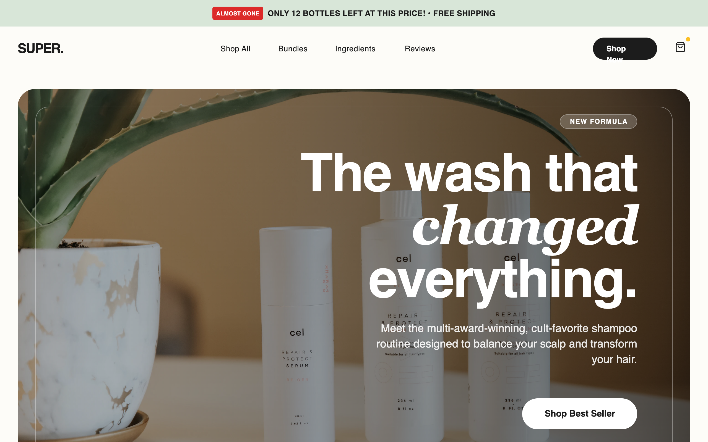

# Super Shampoo - High Conversion LP

A premium, high-conversion e-commerce style guide optimized for D2C beauty and wellness brands. Features a sophisticated 'clinical luxury' aesthetic with a palette of sage green (#E2E8E4), off-white beige (#F5F5F0), and deep charcoal (#1C1C1C). The typography balances bold 'General Sans' headings with clean 'Switzer' body text. Includes specialized conversion elements like scarcity-driven promo bars, trust badge grids, comparison tables, and a sticky mobile 'Add to Cart' bar. Ideal for skincare, haircare, or luxury lifestyle products requiring a mix of editorial imagery and performance-driven UI.



## Prompt

```text
{
  "summary": "High-conversion 'Clinical Luxury' Landing Page featuring urgency markers, professional trust signals, detailed product comparisons, and a seamless mobile-first shopping experience.",
  "style": {
    "description": "The style combines minimalist editorial design with strategic conversion triggers. It uses a neutral 'Earth and Stone' palette with metallic gold accents. Typography pairs a modern sans-serif for impact with a highly readable body font. Layouts use generous padding (32px+ for corners), glassmorphism effects for overlays, and soft shadow depths.",
    "prompt": "Create a design system using a 'Clinical Luxury' theme. **Colors**: Primary Background (#FDFCF8), Deep Charcoal (#1C1C1C) for text and primary buttons, Sage Green (#E2E8E4) for section backgrounds, Muted Gold (#D4AF37) for status icons, and Urgency Red (#DC2626) sparingly for scarcity tags. **Typography**: Use 'General Sans' for headings (weights 600-700, tight tracking -0.02em) and 'Switzer' for body copy (weight 400-500). **Borders**: Component corners should be heavily rounded (border-radius: 32px or 40px). **Effects**: Use backdrop-blur (12px) for sticky navigation and hero overlays. **Animations**: Implement smooth hover transforms (scale: 1.05) and subtle translate-y shifts (-4px) on interactive cards. Include a pulse animation for high-urgency badges."
  },
  "layout_and_structure": {
    "description": "A vertical-scrolling landing page structure designed to build trust before asking for a purchase, ending with a persistent mobile sticky bar.",
    "prompts": [
      {
        "part": "Promo Bar & Navigation",
        "prompt": "Top Bar: 40px height, background #D8E6D8, uppercase text (12px), featuring a pulsing 'Almost Gone' tag in #DC2626. Navigation: Sticky, backdrop-blur(12px), border-b #F3F4F6, height 80px. Logo on left, center-aligned nav links in 14px medium weight, and 'Shop Now' pill button on right."
      },
      {
        "part": "Hero Section",
        "prompt": "Large container with 32px rounded corners and a full-bleed background image. Overlaid with a right-aligned content box featuring a 90px font-size heading using a mix of bold sans and italic serif fonts. Include a horizontal row of glassmorphism-style trust badges at the bottom (e.g., 'Vegan', 'Clinically Proven') with 14px text and gold icons."
      },
      {
        "part": "Trust Signal Bar",
        "prompt": "White background, padding 48px. Features a centered uppercase label 'Trusted by' followed by a grayscale-to-color transition logo grid (Sephora, Vogue, etc.) with 60% opacity."
      },
      {
        "part": "Value Stats Bar",
        "prompt": "Dark mode strip (#1C1C1C) with a 4-column grid. Each column contains a large Gold (#D4AF37) metric (e.g., 50K+) and a muted gray uppercase label. Vertical dividers between columns should be 10% opacity white."
      },
      {
        "part": "Product Spotlight",
        "prompt": "Split layout (50/50). Left: Square product container with a #E8E6E1 background, 40px rounded corners, and a central floating product image with a deep shadow. Right: Detailed copy including a price comparison (strikethrough), 18px body text, and a checkmark list of 3-4 key differentiators. Button: Full-width on mobile, rounded-full, with an arrow icon that translates right on hover."
      },
      {
        "part": "Comparison Section",
        "prompt": "A 3-column grid table with 30px rounded corners. Headers: 'Feature', 'Our Brand', 'Competitors'. Rows use icons (check vs. X) to highlight superiority. Alternating row backgrounds for readability."
      },
      {
        "part": "Social Proof Grid",
        "prompt": "3-column grid of cards. Each card: White background, 1px border (#E2E8E4), 24px padding. Includes user avatar, 'Verified Buyer' badge in green, 5-star rating, and testimonial text. Soft drop shadow on hover."
      },
      {
        "part": "Final CTA & Scarcity",
        "prompt": "Full-width Sage Green (#E2E8E4) section with a 72px heading. Includes a countdown timer component in a monospaced font (#1C1C1C background, 50% opacity) and a large primary action button with a shield-check security icon."
      }
    ]
  },
  "special_ui_components": [
    {
      "component": "Urgency Indicator Tag",
      "description": "A small, high-contrast label used to drive FOMO.",
      "prompt": "Background #DC2626, text white, font-size 10px, font-weight 700, padding 2px 6px, border-radius 4px. Component should pulse slowly (scale 1.0 to 1.05) to draw attention without being disruptive."
    },
    {
      "component": "Benefit Icon Cards",
      "description": "Informational cards that change background color on hover.",
      "prompt": "Vertical layout, 24px padding. Top: 64px square container for icons with pastel backgrounds (Sage, Peach, Lavender). Title 20px bold. On hover, the entire card background transitions from white to #F5F5F0 and the icon container scales 110%."
    },
    {
      "component": "Mobile Sticky Cart",
      "description": "Fixed bottom bar for mobile conversion.",
      "prompt": "Fixed position bottom: 0, width 100%, background white 95% opacity, backdrop-blur 12px. Left side: Price display with strikethrough and a 'Selling Fast' micro-tag. Right side: Full-width CTA button 'Add to Cart'. Box-shadow: 0 -4px 20px rgba(0,0,0,0.05)."
    }
  ]
}
```

**▶ Try it live → [https://superdesign.dev/library/super-shampoo-high-conversion-lp](https://superdesign.dev/library/super-shampoo-high-conversion-lp?utm_source=github&utm_medium=prompt-repo&utm_campaign=prompt-library)**

**Use it in your coding agent:** install the [Superdesign skill](https://github.com/superdesigndev/superdesign-skill), then:

```bash
superdesign get-prompts --slugs "super-shampoo-high-conversion-lp" --json
```

*194 copies · 2,096 tries · ecommerce, shopify, landing page*
