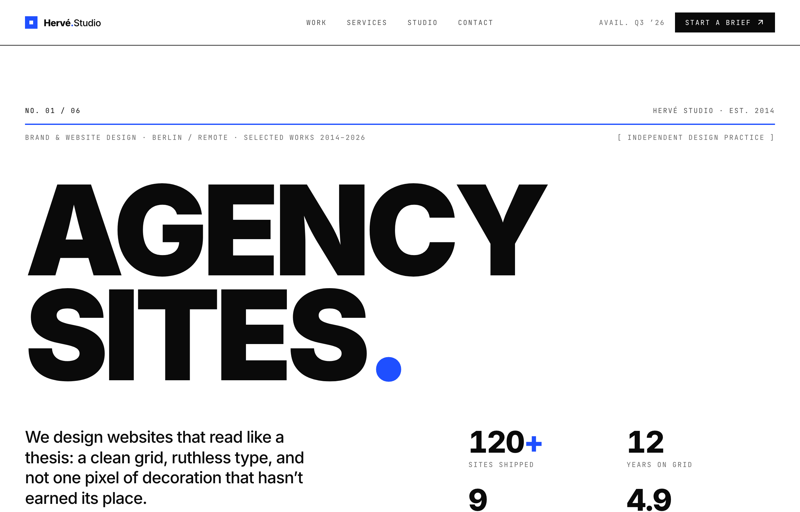

# Swiss Grid Agency Layout

A Swiss / International-Typographic-Style agency homepage on a strict 12-column grid: pure black ink #0a0a0a on paper white #ffffff with one electric cobalt #1f4fff accent, a sticky paper nav with an ink hairline, an editorial index row over a 2px cobalt rule, a giant disciplined 'AGENCY SITES.' display headline (Inter) with a 2x2 stat block, an inverted black auto-scroll marquee of disciplines, a numbered Selected-Work index list with hover-cobalt titles and a nudging out-arrow, a 4-up hairline services grid (4th card inverted to solid cobalt), a large studio statement, a giant mailto contact line, and a 3-up hairline footer. JetBrains Mono micro-labels index every section.



## Prompt

```text
{"summary": "A Swiss / International-Typographic-Style agency homepage built on a strict 12-column grid. A sticky paper-white nav with a hairline ink underline sits above a hero that opens with an editorial 'index' row (No. 01 / 06, studio name + est., a discipline line) over a 2px cobalt rule, then drops a giant disciplined display headline ('AGENCY SITES.') that fills the column at clamp/200px, followed by a sub-grid splitting a tight thesis statement from a 2x2 tabular-nums stat block. Below: an inverting black marquee strip of disciplines (cobalt + paper labels), a numbered indexed Selected-Work list (06 rows on the 12-col grid with hover-cobalt titles and a nudging out-arrow), a 4-up hairline-gap services grid (the 4th card inverted to solid cobalt), a large studio statement, a giant mailto contact line that turns cobalt on hover with a Berlin address block, and a 3-up hairline footer. The signature is the restraint: pure black ink #0a0a0a on paper white #ffffff with one electric cobalt #1f4fff accent, tight Inter for display + body and JetBrains Mono for every uppercase tracked label, hairline ink rules (2px cobalt for primary section breaks), and a relentless 12-column grid that every row snaps to.", "style": {"description": "High-contrast Swiss / International Typographic Style: a pure paper-white page (#ffffff) with pure-black ink (#0a0a0a) and a single electric cobalt accent (#1f4fff), and nothing else. There is no decoration that has not earned its place: structure comes entirely from a strict 12-column grid, hairline rules, and the type itself. Two typefaces only: Inter (300-900) does all the display and body work with negative letter-spacing and tight leading (the giant headline runs leading-[0.84]); JetBrains Mono is reserved exclusively for the uppercase, 0.14em-tracked micro-labels (the 'label' class: 11px, uppercase) that index every section ('No. 01 / 06', column headers, eyebrows, nav items). Section breaks are 1px ink hairlines for quiet divisions and a 2px cobalt rule (.hairline-cobalt) for the primary ones. Cobalt is dosed sparingly: the headline's terminal period, the marquee's alternating labels, the work-row hover state, the inverted 4th service card, the contact-line hover, and the brand mark's square + dot. ::selection is cobalt-on-white. The whole thing reads like a printed editorial spread: disciplined, legible, engineered, zero gradients/shadows/rounded corners.", "prompt": "Swiss / International-Typographic-Style agency site, pure monochrome + one electric cobalt. Exact palette via tailwind.config custom colors: ink #0a0a0a (text + hairlines), paper #ffffff (page bg), cobalt #1f4fff (the single accent). Body is bg-paper text-ink font-sans antialiased with -webkit-font-smoothing:antialiased and text-rendering:optimizeLegibility. The ONLY accent is cobalt #1f4fff: never introduce any other hue. Define a .label utility = font-family 'JetBrains Mono', monospace; font-size 11px; letter-spacing 0.14em; text-transform uppercase (used on every micro-label/eyebrow/nav item/column header). Hairlines: .hairline { border-color:#0a0a0a } for ink rules and .hairline-cobalt { border-color:#1f4fff } used as a border-t-2 for primary section breaks. Display type uses .display { font-feature-settings:'ss01' 1; letter-spacing:-0.04em; line-height:0.86 }. A strict grid utility .grid-12 { display:grid; grid-template-columns:repeat(12, minmax(0,1fr)) } with gap-4 governs every row. Marquee: .marquee-track { animation: marquee 28s linear infinite } with @keyframes marquee { from { transform:translateX(0) } to { transform:translateX(-50%) } } on a doubled label track. Work-row hover: .work-row:hover .work-arrow { transform:translateX(6px); opacity:1 } and .work-row:hover .work-title { color:#1f4fff }. ::selection { background:#1f4fff; color:#fff }. html { scroll-behavior:smooth }. No gradients, no drop shadows, no rounded corners, no border radius anywhere; structure is grid + hairlines + type only. Icons are Iconify material-symbols (the arrow-outward-rounded glyph) in cobalt.", "prompt_typography": "Two fonts only via Google Fonts: Inter (weights 400;500;600;700;800;900) as font-sans with system-ui fallback, and JetBrains Mono (400;500) as font-mono. Display headline H1 uses .display: text-[19vw] -> md:text-[15.5vw] -> lg:text-[200px], leading-[0.84], font-black, with a cobalt terminal period; the contact mailto line is also .display at font-size clamp(26px,6.1vw,76px) font-black leading-[0.92]. Section H2s: text-3xl -> md:text-5xl (Selected Work) and text-4xl -> md:text-6xl font-black leading-[0.95] (services), tracking-tight. The studio statement is text-2xl -> md:text-[40px] leading-[1.18] font-medium tracking-tight with a cobalt closing clause. Hero thesis paragraph: text-xl -> md:text-[26px] leading-[1.25] font-medium tracking-tight. Stat numbers: text-4xl -> md:text-5xl font-extrabold tracking-tight tabular-nums (with a cobalt '+'). Work-row titles: text-2xl -> md:text-[34px] font-bold tracking-tight. Every uppercase micro-label is the .label class (JetBrains Mono 11px, 0.14em tracking, uppercase) in ink or ink/60-70 muted."}, "layout_and_structure": {"description": "A single-column, vertically stacked, frameless responsive editorial agency page where every content section centers inside mx-auto max-w-[1320px] with px-6 -> md:px-10 padding and snaps to a strict 12-column grid (.grid-12 gap-4). Order top to bottom: a sticky paper nav with a bottom ink hairline; a hero (an 'index' meta row over a 2px cobalt rule + a discipline line, then a giant .display headline, then a sub-grid splitting a thesis statement from a 2x2 stat block); a full-bleed inverted (black bg / paper text) auto-scrolling marquee strip bordered top + bottom in ink; a numbered Selected-Work index list (a header row of mono column labels, then 06 hairline-divided rows on the 12-col grid); a 4-up services grid built from gap-px hairlines (the 4th card inverted to solid cobalt); a large studio statement section under a cobalt/ink rule; a contact section (a giant mailto .display line + a right-aligned Berlin address + social labels) opened by a 2px cobalt rule; and a 3-up hairline footer. Reflow: the nav is a 12-col grid (brand col-span-6 -> md:col-span-3, center links col-span-6 hidden below md, CTA col-span-6 -> md:col-span-3); hero meta rows reserve a md-only middle column; the headline scales by viewport (19vw -> 15.5vw -> 200px); the stat block is a 2-col grid; the work list hides its \u2116 index, year column, and discipline-inline layout below md (discipline drops under the title); the services grid goes grid-cols-1 -> md:grid-cols-2 -> lg:grid-cols-4; the contact + footer 12-col rows go right-aligned on md and stack/left-align on mobile. Everything collapses to one column on mobile and the center nav links hide below md.", "prompts": [{"part": "Sticky nav", "prompt": "A sticky top-0 z-50 header with bg-paper/95 backdrop-blur-sm and a 1px bottom border in ink. Inside: mx-auto max-w-[1320px] px-6 -> md:px-10, a .grid-12 items-center gap-4 row at h-16 -> md:h-[72px]. Left brand lockup (col-span-6 -> md:col-span-3, flex items-center gap-2.5): a 5x5 cobalt square containing a centered 1.5x1.5 paper square, beside the wordmark 'Herv\u00e9.Studio' at text-[15px] font-extrabold tracking-tight where the '.' is cobalt and 'Studio' is font-medium. Center nav (hidden md:flex col-span-6 justify-center gap-8, .label text-ink/70): Work / Services / Studio / Contact, each hover:text-cobalt. Right (col-span-6 -> md:col-span-3, flex justify-end items-center gap-4): a 'Avail. Q3 26' .label text-ink/60 hidden below lg, plus a square (no radius) .label CTA pill 'Start a brief' with bg-ink text-paper px-4 py-2 hover:bg-cobalt and a trailing material-symbols:arrow-outward-rounded icon (14px)."}, {"part": "Hero index + discipline rows", "prompt": "Inside the centered max-w-[1320px] container, pt-16 -> md:pt-24. First a .grid-12 items-end gap-4 pb-3 'index' row: left .label 'No. 01 / 06' (col-span-6 -> md:col-span-3), an empty md-only middle (md:col-span-6), and a right-aligned .label text-ink/70 'Herv\u00e9 Studio \u00b7 Est. 2014' (col-span-6 -> md:col-span-3). Then a border-t-2 .hairline-cobalt (the primary 2px cobalt rule). Then a .grid-12 gap-4 pt-3 discipline row: a left .label text-ink/60 'Brand & Website Design \u00b7 Berlin / Remote \u00b7 Selected Works 2014-2026' (col-span-12 -> md:col-span-8) and a right-aligned .label text-ink/60 '[ Independent Design Practice ]' (hidden below md, md:col-span-4)."}, {"part": "Hero display headline", "prompt": "A .grid-12 gap-4 pt-10 -> md:pt-14 row holding a single H1 (col-span-12 -> md:col-span-10) in .display font-black at text-[19vw] -> md:text-[15.5vw] -> lg:text-[200px] leading-[0.84]: 'AGENCY' then a <br /> then 'SITES' immediately followed by a cobalt-colored period '.'. The headline is meant to fill the column edge-to-edge and is the page's single dominant element."}, {"part": "Hero statement + stats", "prompt": "A .grid-12 gap-4 pt-10 -> md:pt-16 pb-16 -> md:pb-24 sub-grid. Left (col-span-12 -> md:col-span-5 md:col-start-1): a tight thesis paragraph 'We design websites that read like a thesis: a clean grid, ruthless type, and not one pixel of decoration that hasn't earned its place.' at text-xl -> md:text-[26px] leading-[1.25] font-medium tracking-tight. An empty md:col-span-2 spacer. Right (col-span-12 -> md:col-span-5, self-end, mt-8 -> md:mt-0): a grid grid-cols-2 gap-y-6 gap-x-4 stat block of four cells, each a number at text-4xl -> md:text-5xl font-extrabold tracking-tight tabular-nums over a .label text-ink/60 caption: '120' with a cobalt '+' / 'Sites shipped', '12' / 'Years on grid', '9' / 'Awwwards', '4.9' / 'Avg. client score'."}, {"part": "Inverted marquee strip", "prompt": "A full-bleed section with border-y border-ink, overflow-hidden, bg-ink text-paper (inverted). Inside, a flex whitespace-nowrap .marquee-track animating translateX(0) -> -50% over 28s linear infinite. The track contains two identical flex shrink-0 items-center gap-10 py-3.5 pr-10 groups (the second aria-hidden) of alternating .label discipline words where every other word is text-cobalt and the rest are paper: Branding / Editorial / Web Design / Art Direction / Type Systems / Identity / Motion / Front-end, repeated to fill the track twice per group."}, {"part": "Selected Work index list", "prompt": "Section id=work, centered max-w-[1320px], pt-20 -> md:pt-28. Header: a .grid-12 items-end gap-4 pb-4 with an H2 'Selected Work' (col-span-6 -> md:col-span-8, text-3xl -> md:text-5xl font-extrabold tracking-tight) and a right-aligned .label text-ink/60 'Index \u2014 06 Projects' (col-span-6 -> md:col-span-4). Then a 1px border-t border-ink. Then a md-only column-header row (hidden md:grid .grid-12 gap-4 py-3 .label text-ink/60 border-b border-ink/20): \u2116 (col-span-1) / Client (col-span-4) / Discipline (col-span-4) / Year (col-span-2) / \u2197 (col-span-1 right). Then 06 .work-row anchors, each block border-b (border-ink/15 for rows 1-5, solid border-ink for row 06) with a .grid-12 gap-4 py-6 -> md:py-7 items-center: a hidden-below-md .label cobalt index (01-06, col-span-1); a .work-title (col-span-9 -> md:col-span-4, text-2xl -> md:text-[34px] font-bold tracking-tight, transition-colors) that turns cobalt on row hover; a .label text-ink/60 discipline (col-span-12 -> md:col-span-4, dropping under the title on mobile); a hidden-below-md .label text-ink/60 tabular-nums year (col-span-2); and a right-justified material-symbols:arrow-outward-rounded .work-arrow in cobalt (26px) at opacity-40 that nudges translateX(6px) to opacity-100 on row hover. Rows: 01 Kessler Editions / Brand System \u00b7 Web / 2026; 02 Form & Field / Editorial \u00b7 Identity / 2025; 03 Nord Atelier / Web \u00b7 Art Direction / 2025; 04 Meridian Type Co. / Type System \u00b7 Web / 2024; 05 Halden Coffee / Brand \u00b7 Packaging \u00b7 Web / 2024; 06 Vaughn Architects / Identity \u00b7 Web \u00b7 Motion / 2023."}, {"part": "Services grid", "prompt": "Section id=services, centered max-w-[1320px], pt-24 -> md:pt-32. A .grid-12 items-end gap-4 pb-3 index row: left .label 'No. 04 / 06' (col-span-6 -> md:col-span-3) and a right-aligned .label text-ink/60 'Capabilities' (col-span-6 -> md:col-span-9). Then a border-t-2 .hairline-cobalt. Then a .grid-12 gap-4 pt-8 -> md:pt-12 header: an H2 'What we do, on a grid.' (col-span-12 -> md:col-span-7, text-4xl -> md:text-6xl font-black tracking-tight leading-[0.95]) and a right-offset paragraph (col-span-12 -> md:col-span-4 md:col-start-9, self-end, text-base -> md:text-lg text-ink/60 leading-relaxed): 'A small senior team, no account managers, no decks for the sake of decks. You talk to the people drawing the lines.' Then a 4-up card grid: grid grid-cols-1 -> md:grid-cols-2 -> lg:grid-cols-4 gap-px on a bg-ink/15 base with a border border-ink/15 (so the 1px gaps read as hairlines), mt-12 -> md:mt-16. Cards 01-03 are bg-paper p-7 -> md:p-8 flex-col min-h-[240px]: a top row with a cobalt .label number + a muted (text-ink/30) Iconify material-symbols icon (grid-view-outline-rounded / web-asset / format-shapes-outline-rounded, 22px), then an mt-auto H3 (text-2xl font-bold tracking-tight) + an mt-3 text-sm text-ink/60 leading-relaxed paragraph. Titles/copy: 01 Brand Systems, 02 Website Design, 03 Art Direction. Card 04 is INVERTED: bg-cobalt text-paper, its number text-paper/80, its icon material-symbols:bolt-rounded text-paper/85, H3 'Type & Motion', paragraph text-paper/80."}, {"part": "Studio statement", "prompt": "Section id=studio, centered max-w-[1320px], pt-24 -> md:pt-32. A .grid-12 items-end gap-4 pb-3 index row: left .label 'No. 05 / 06' (col-span-6 -> md:col-span-3) + right .label text-ink/60 'The Studio' (col-span-6 -> md:col-span-9). Then a 1px border-t border-ink. Then a .grid-12 gap-4 pt-10 -> md:pt-14 pb-4 row with one large statement paragraph (col-span-12 -> md:col-span-9, text-2xl -> md:text-[40px] leading-[1.18] font-medium tracking-tight): 'We believe restraint is a feature. Give us your hardest brief and we will give it back to you as a system, not a poster: legible, aligned, and built to outlast the trend cycle.' followed by a cobalt-colored closing clause 'That is the whole studio.'"}, {"part": "Contact row", "prompt": "Section id=contact, centered max-w-[1320px], pt-20 -> md:pt-28 pb-20 -> md:pb-28. Opened by a border-t-2 .hairline-cobalt. Then a .grid-12 gap-4 pt-10 -> md:pt-14 items-center row. Left (col-span-12 -> md:col-span-8): a .label text-ink/60 mb-4 'No. 06 / 06 \u00b7 Start a brief', then a group mailto:studio@herve.design anchor whose label is a .display block font-black leading-[0.92] whitespace-nowrap at font-size clamp(26px,6.1vw,76px) that turns cobalt on group-hover: 'studio@herve.design'. Right (col-span-12 -> md:col-span-4, md:text-right, mt-8 -> md:mt-0, space-y-2): a .label text-ink/60 'Berlin', 'Torstra\u00dfe 140' (text-lg font-medium), '10119 Berlin, DE' (text-lg font-medium text-ink/60), then a pt-4 flex md:justify-end gap-4 .label text-ink/60 row of three hover:text-cobalt links: Instagram / Are.na / LinkedIn."}, {"part": "Footer", "prompt": "A footer with a 1px border-t border-ink and bg-paper. Inside mx-auto max-w-[1320px] px-6 -> md:px-10 py-10: a .grid-12 gap-4 items-center row. Left (col-span-12 -> md:col-span-4): the same brand lockup as the nav (a 5x5 cobalt square with a 1.5x1.5 paper inner square + 'Herv\u00e9.Studio' wordmark, cobalt '.' and font-medium 'Studio'). Center (col-span-6 -> md:col-span-4, md:text-center, .label text-ink/60): '\u00a9 2026 Herv\u00e9 Studio'. Right (col-span-6 -> md:col-span-4, md:text-right, .label text-ink/60): 'Designed on a 12-column grid'. Bottom blocks stack mt-4 on mobile."}]}, "special_ui_components": [{"component": "Strict 12-column grid system (.grid-12)", "description": "The backbone of the whole page: a literal 12-column CSS grid that every section, every row, the nav, the work list, and the footer snap to, which is what makes it read as Swiss / International Typographic Style rather than a generic stacked landing page.", "prompt": "Define .grid-12 { display:grid; grid-template-columns:repeat(12, minmax(0,1fr)) } and apply it with gap-4 to the nav row, every hero meta/headline/statement row, the work-list header + each row, and the footer. Use explicit col-span-* (and md:col-start-* offsets) so elements align to real grid tracks: e.g. the hero statement is md:col-span-5 / spacer md:col-span-2 / stats md:col-span-5; the services header is md:col-span-7 + a paragraph at md:col-start-9 md:col-span-4. Reserve empty md-only spacer columns to preserve the grid rhythm. Combine with a centered mx-auto max-w-[1320px] px-6 -> md:px-10 container so the grid has consistent gutters."}, {"component": "Mono micro-label index system (.label)", "description": "Every section is indexed and captioned with uppercase JetBrains Mono micro-labels (No. 01 / 06, column headers, eyebrows, nav items, captions) that give the page its editorial, printed-spec-sheet character and carry almost all of the cobalt accenting.", "prompt": "Define .label { font-family:'JetBrains Mono', monospace; font-size:11px; letter-spacing:0.14em; text-transform:uppercase }. Use it for: nav items, the 'No. 0X / 06' section indices, the work-list column headers (\u2116 / Client / Discipline / Year / \u2197) and per-row indices/disciplines/years, all stat captions, the marquee discipline words, the 'Capabilities' / 'The Studio' / 'Index \u2014 06 Projects' eyebrows, the CTA button label, and the footer lines. Tint with text-ink, text-ink/60, or text-ink/70 for hierarchy; selectively color individual labels text-cobalt (work-row indices, every-other marquee word)."}, {"component": "Hairline + 2px-cobalt rule system", "description": "Sections are divided not by colored blocks but by 1px ink hairlines for quiet breaks and a 2px cobalt rule for the primary ones, plus the services grid is literally constructed from gap-px hairlines, giving the page its quiet, engineered restraint.", "prompt": "Use border-t / border-b border-ink (1px ink) for quiet section breaks and the work-list separators (border-ink/15, border-ink/20 for the header). Use a border-t-2 .hairline-cobalt (.hairline-cobalt { border-color:#1f4fff }) as the PRIMARY 2px cobalt rule that opens the hero discipline row, the services section, and the contact section. Build the 4-up services grid as gap-px on a bg-ink/15 base with a surrounding border border-ink/15 so the 1px gaps themselves render as hairline dividers between paper cards. No drop shadows, gradients, or rounded corners anywhere."}, {"component": "Inverted auto-scroll marquee strip", "description": "A full-bleed black band that inverts the page (paper text on ink) and continuously scrolls the studio's disciplines, breaking the white spread with a single dark rhythm element and a second dose of cobalt.", "prompt": "A full-width section: border-y border-ink, overflow-hidden, bg-ink text-paper. Inside, a flex whitespace-nowrap .marquee-track with animation: marquee 28s linear infinite where @keyframes marquee { from { transform:translateX(0) } to { transform:translateX(-50%) } }. Duplicate the content into two identical flex shrink-0 items-center gap-10 py-3.5 pr-10 groups (second aria-hidden=true) so the -50% loop is seamless. Each group is a run of .label discipline words with every alternate word text-cobalt and the rest paper-white (Branding / Editorial / Web Design / Art Direction / Type Systems / Identity / Motion / Front-end), repeated so the group is wide enough to fill the viewport."}, {"component": "Indexed work list with hover-cobalt + nudging arrow", "description": "The portfolio is a numbered, grid-aligned index list (not cards): each row spans the 12-col grid with a mono index, a large client title, discipline, and year, and on hover the title turns cobalt while a cobalt out-arrow slides right and fades in.", "prompt": "Each row is an <a> .work-row block with a hairline bottom border and a .grid-12 gap-4 py-6 -> md:py-7 items-center inner row: cobalt .label index (col-span-1, hidden below md), a .work-title (md:col-span-4, text-[34px] font-bold) that transitions to color #1f4fff via .work-row:hover .work-title, a .label muted discipline (md:col-span-4), a tabular-nums .label muted year (md:col-span-2, hidden below md), and a right material-symbols:arrow-outward-rounded .work-arrow (cobalt, 26px) that starts opacity-40 and animates to transform:translateX(6px); opacity:1 via .work-row:hover .work-arrow. On mobile the index/year hide and the discipline drops below the title."}, {"component": "Inverted cobalt service card", "description": "Within the otherwise paper-white 4-up services grid, the final card flips to solid cobalt with paper text, providing a single punch of color and a focal endpoint to the capability row.", "prompt": "The 4th of four equal min-h-[240px] flex-col cards in the gap-px services grid is bg-cobalt text-paper p-7 -> md:p-8 (the other three are bg-paper). Inside: a top space-between row with a text-paper/80 .label number '04' and a text-paper/85 Iconify material-symbols:bolt-rounded (22px), an mt-auto H3 'Type & Motion' (text-2xl font-bold tracking-tight), and an mt-3 text-paper/80 text-sm leading-relaxed paragraph. It is the only filled-color surface in the section."}], "special_notes": "Frameless, fully responsive Swiss / International-Typographic-Style agency homepage (no browser chrome, no device frame): every content section centers in mx-auto max-w-[1320px] with px-6 -> md:px-10 and snaps to a strict 12-column grid (.grid-12 gap-4); the nav and footer are 12-col rows; the hero scales its .display headline by viewport (19vw -> 15.5vw -> 200px); the work list hides its index/year columns and drops discipline under the title below md; the services grid is grid-cols-1 -> md:grid-cols-2 -> lg:grid-cols-4 built from gap-px hairlines; the contact and footer rows right-align on md and stack on mobile; the center nav links hide below md; the nav is sticky with bg-paper/95 backdrop-blur. Built with Tailwind via CDN plus a small tailwind.config registering the three custom colors (ink #0a0a0a, paper #ffffff, cobalt #1f4fff) and two font families (sans: Inter, mono: JetBrains Mono); Google Fonts loads Inter 400-900 + JetBrains Mono 400/500; icons are Iconify material-symbols glyphs (arrow-outward-rounded, grid-view-outline-rounded, web-asset, format-shapes-outline-rounded, bolt-rounded). Custom CSS provides .label (mono uppercase micro-label), .display (ss01 + tight tracking + 0.86 leading), .hairline / .hairline-cobalt rules, .grid-12, the marquee animation, and the work-row hover transitions; ::selection is cobalt-on-white. All copy and the 'Herv\u00e9 Studio' brand are placeholders meant to be swapped: the transferable value is the Swiss aesthetic itself \u2014 a pure monochrome paper/ink palette with a SINGLE electric cobalt accent (#1f4fff, dosed onto the headline period, the 2px section rules, the marquee, work-row hover, the inverted 4th service card, and the contact-line hover), Inter for display+body with JetBrains Mono for every tracked uppercase label, hairline-only dividers, and a relentless 12-column grid that every row obeys \u2014 NOT the specific agency. Strictly no gradients, drop shadows, or rounded corners; structure is grid + hairlines + type only."}
```

**▶ Try it live → [https://superdesign.dev/library/swiss-grid-agency-layout](https://superdesign.dev/library/swiss-grid-agency-layout?utm_source=github&utm_medium=prompt-repo&utm_campaign=prompt-library)**

**Use it in your coding agent:** install the [Superdesign skill](https://github.com/superdesigndev/superdesign-skill), then:

```bash
superdesign get-prompts --slugs "swiss-grid-agency-layout" --json
```

*1 copies · 2,378 tries · Portfolios · Agency & Studio · agency-website, swiss-grid, international-typographic-style, monochrome*
