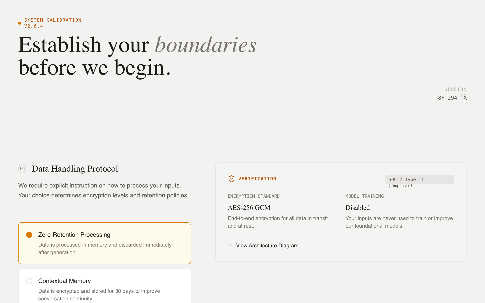

# System Initialization - Trust & Transparency

A high-trust, technical briefing design system for AI onboarding and system initialization. Featuring an editorial typography approach with a warm, neutral color palette (Stone and Amber), it utilizes a two-column grid to balance user configuration with technical evidence. Ideal for fintech, cybersecurity, AI safety, or enterprise SaaS where transparency, data privacy, and ethical alignment are core product values. The layout emphasizes vertical rhythm, semantic depth, and clear decision-making through structured guidance and live-updating evidence cards.



## Prompt

```text
{
  "summary": "A 'Technical Briefing' UI for system initialization and transparency-focused onboarding. It uses a structured two-column layout: the left column facilitates active user choice via custom radios, while the right column provides technical verification (evidence cards) using monospaced metadata, data visualizations, and expandable architecture details. The tone is authoritative, honest, and grounded, avoiding marketing hyperbole in favor of data-driven transparency.",
  "style": {
    "description": "The style is 'Industrial Editorial' - a blend of elegant serif headings, clean sans-serif body text, and monospaced technical labels. The palette is a warm neutral (Stone) with high-contrast dark text and a warm Amber accent for active states. Micro-interactions include smooth vertical expansion for details and pulse animations for live status indicators. A subtle noise texture layer is applied across the background for an organic, paper-like feel.",
    "prompt": "Create a design with a background of #FAFAF9 (Stone-50) and a subtle 0.03 opacity noise texture. Typography: use 'DM Serif Display' for main headings (max-width 2xl, size 4xl to 6xl, leading-tight) with selective italics for emphasis; use 'Inter' for body text (size 1rem, weight 400, color #44403C); use 'JetBrains Mono' for all technical labels and metadata (uppercase, tracking-widest, size 0.75rem). Colors: Primary text #1C1917, secondary text #57534E, border #E7E5E4. Accent: #F59E0B (Amber-500). Animation: Details elements must use a 'sweep' animation (opacity 0 to 1, translate -10px to 0px over 0.3s). Hover states for interactive cards should transition border-color and background subtly over 150ms."
  },
  "layout_and_structure": {
    "description": "The layout follows a modular, section-based grid. Each major configuration topic is a section spanning the full width, divided into a 5-column guidance area (left) and a 7-column evidence/transparency area (right). A sticky bottom bar provides a persistent primary action.",
    "prompts": [
      {
        "part": "Header",
        "prompt": "Full-width header (max-w-7xl) with a bottom border #E7E5E4. Left-side includes a status indicator (0.5rem circle #D97706 with a pulse animation) next to a technical version string in mono. Below, a serif h1 heading with 'boundaries' or keywords italicized. Right-side contains session metadata (ID, timestamp) in a stacked mono layout."
      },
      {
        "part": "Configuration Section",
        "prompt": "Grid layout (lg:grid-cols-12) with vertical padding 6rem. Left side (col-span-5) features a section counter in a mono circle, a serif h2 title, and a list of configuration choices. Right side (col-span-7) features a sticky evidence container (top: 2rem) with background #F5F5F4, 1.5rem padding, and rounded corners (12px)."
      },
      {
        "part": "Evidence Cards",
        "prompt": "Informational panels within the right column. Use monospaced labels for 'Verification' or 'Matrix' headings. Include data visualizations like horizontal progress bars (height 8px, background #E7E5E4, fill #292524). Use card-in-card patterns for code snippets or example outputs with background #FFFBEB and #FBBF24 borders."
      },
      {
        "part": "Bottom Action Bar",
        "prompt": "Fixed-position bar at bottom (100% width) with backdrop-blur-md and background rgba(255, 255, 255, 0.9). Contains a left-aligned help text with icon and a right-aligned primary button. The button is #1C1917 with white text, px-8 py-3, rounded-lg, and a right-arrow icon that translates x-axis on hover."
      }
    ]
  },
  "special_ui_components": [
    {
      "component": "Custom Decision Radio",
      "description": "A high-fidelity radio button replacement for decision-making.",
      "prompt": "Create a container label with 'cursor-pointer' and a hidden radio input. Inside, a div with padding 1.25rem, border #E7E5E4, and background #FFFFFF. On checked: border-color becomes #D97706, background becomes #FFFBEB. It features a radio-indicator (16px circle) that turns solid #D97706 with a 4px white box-shadow inner glow when active."
    },
    {
      "component": "Technical Architecture Details",
      "description": "Expandable accordion for deep-dive technical verification.",
      "prompt": "Use the <details> element with a summary that replaces the default marker with a 'lucide:chevron-right' icon that rotates 90deg on open. Content inside features a 'mini-diagram' using a horizontal flex container, a status bar with three segments (#D6D3D1, #FBBF24 with 20% opacity, and #D6D3D1), and mono-font labels describing data flow."
    }
  ],
  "special_notes": "MUST: Maintain strict vertical alignment between the configuration options on the left and their corresponding evidence on the right. MUST: Use 'JetBrains Mono' for any text related to system IDs, technical specs, or data. MUST NOT: Use vibrant or 'friendly' marketing colors (like neon blues or rounded pill buttons); stick to the industrial/briefing aesthetic. MUST: Use the custom radio indicator (16px circle with a dot that only appears when the parent input is checked)."
}
```

**▶ [Try it live →](https://superdesign.dev/library/system-initialization-trust-and-transparency?utm_source=github&utm_medium=prompt-repo&utm_campaign=prompt-library)**

**Use it in your coding agent:** install the [Superdesign skill](https://github.com/superdesigndev/superdesign-skill), then:

```bash
superdesign get-prompts --slugs "system-initialization-trust-and-transparency" --json
```

*12 copies · 2,327 tries · Onboarding · AI & Tech · onboarding, page, trust-building, high contrast*
