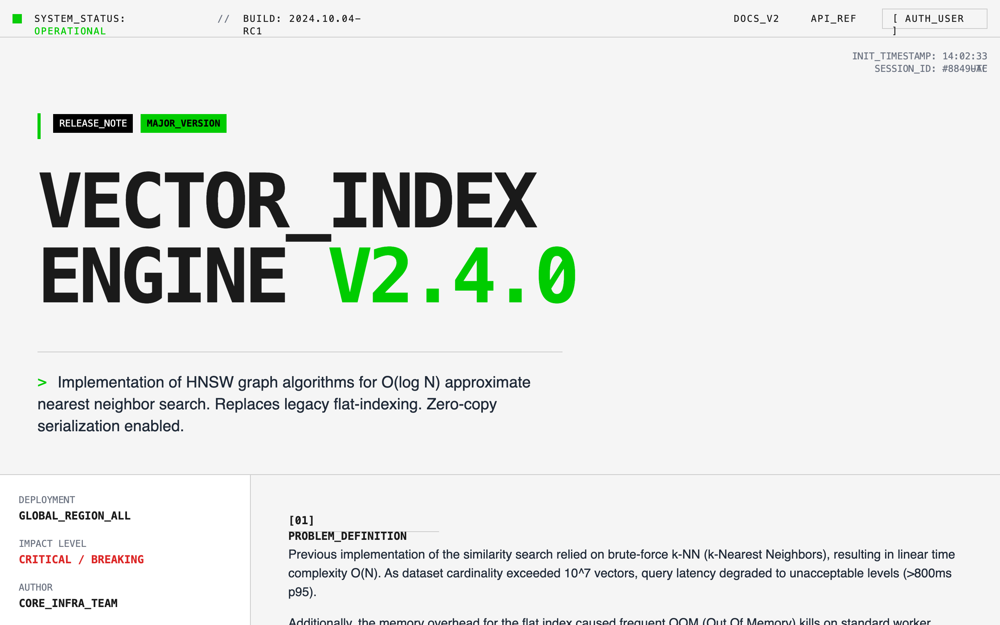

# System Interface Feature Announcement

A brutalist, typography-driven system interface design optimized for technical documentation and feature announcements. Featuring a high-density information layout, rigid grid alignment, and a mechanical aesthetic, it uses JetBrains Mono for a terminal-like feel and Inter for readability. Perfect for developer tools, SaaS infrastructure updates, engineering blogs, and fintech platforms. Key elements include visible 1px borders, a 'system status' header, stepped animations, and a monochrome palette with terminal-green accents.



## Prompt

```text
{
  "summary": "A raw, engineering-first interface design that rejects marketing polish in favor of technical transparency. It uses a high-contrast off-white and dark-gray palette with neon green accents, rigid grid structures, and monospace typography to simulate a command-line or system-level environment.",
  "style": {
    "description": "Brutalist and utilitarian style. Typography combines JetBrains Mono (700 for headings, 400 for technical data) and Inter (400 for body prose). Color palette: Background #F5F5F5, Text #1A1A1A, Accents #00CC00 (Green) and #FFA500 (Amber), Borders #CCCCCC. Animations are 'stepped' and mechanical (no smooth easing), featuring cursor blinks and line-by-line reveals.",
    "prompt": "Create a design system based on 'Technical Brutalism'. \n\n### Colors\n- Primary Background: #F5F5F5\n- Primary Text: #1A1A1A\n- Accent Color (Action/Success): #00CC00 (Terminal Green)\n- Warning Color: #FFA500 (Amber)\n- Border Color: #CCCCCC (Solid 1px)\n- Code Block Background: #EBEBEB\n\n### Typography\n- Technical/Data Font: 'JetBrains Mono', monospace. Use for headers, metadata, and status bars.\n- Prose/Reading Font: 'Inter', sans-serif. Use for long-form explanations.\n- Heading 1: font-weight 700, size 72pt-96pt, tracking-tighter, uppercase, line-height 0.9.\n- Metadata: font-size 10px-12px, uppercase, tracking-widest.\n\n### Effects & Borders\n- Borders: Solid 1px #CCCCCC on all container edges. Use 'divide-x' and 'divide-y' patterns for grids.\n- Shadows: Strictly NO soft shadows. Use hard-offset shadows for interactive elements: 4px 4px 0px 0px #000000.\n- Corners: 0px (No rounding on any element).\n\n### Animation\n- Transitions: Duration 0ms (Instant) or 'steps' timing functions.\n- Text Reveal: Use a typewriter effect with `steps(20, end)` timing.\n- Micro-interactions: Background color flips (Invert) on hover for buttons."
  },
  "layout_and_structure": {
    "description": "The layout follows a strict modular grid where every section is defined by clear 1px horizontal and vertical dividers. It prioritizes vertical stacking with dense, multi-column metadata grids.",
    "prompts": [
      {
        "part": "System Status Bar",
        "prompt": "A fixed top header (height: 48px) with a 1px bottom border. Left side: Pulse animation dot (#00CC00) followed by 'SYSTEM_STATUS: OPERATIONAL'. Right side: Navigation links in monospace, uppercase, wrapped in brackets e.g., '[ AUTH_USER ]'. Background is #F5F5F5."
      },
      {
        "part": "Technical Hero Section",
        "prompt": "Large-scale typography section. Background features a subtle 20px dot-grid pattern. A primary heading in JetBrains Mono (size: 8rem) uses line breaks and text-wrapping. Include a small 'Release Note' tag block with high-contrast colors (#000 background, #FFF text)."
      },
      {
        "part": "Bento Metadata Grid",
        "prompt": "A 4-column grid with 1px borders. One column for vertical metadata (Author, Impact Level, Date) and a 3-column wide span for the 'Problem Statement'. Use high density: 10px labels above 14px bold values."
      },
      {
        "part": "Comparison Audit Log",
        "prompt": "Two-column side-by-side comparison. Left side (Legacy) uses a light gray background (#EBEBEB). Right side (Current) uses a pure white background. Each row contains a label in gray 10px mono and a value with a 2px left-border accent (Red for legacy, Green for current)."
      },
      {
        "part": "System Topology Diagram",
        "prompt": "A CSS-only brutalist flow chart. Rectangular nodes with 1px black borders and 4px hard black shadows. Nodes are connected by 2px solid black lines with 45-degree arrowheads. Inside nodes, display simulated system telemetry (e.g., '> RAM_Usage: 4.2GB')."
      }
    ]
  },
  "special_ui_components": [
    {
      "component": "Hard-Shadow Node",
      "description": "A utilitarian card component for data display.",
      "prompt": "Background #FFF, Border 1px #000, Box-Shadow 4px 4px 0px 0px #000. Header of the card should be a 1px bottom-bordered strip with a status indicator (dot). Content inside uses 12px JetBrains Mono."
    },
    {
      "component": "Terminal Accordion",
      "description": "An FAQ or detail component that feels like a directory expansion.",
      "prompt": "Uses the <details> and <summary> elements. Summary has a '+' sign that rotates 45 degrees when open. Background color inverts from #F5F5F5 to #FFF on open. Content is padded 24px and uses Inter for long-form reading."
    },
    {
      "component": "Monospace CTA",
      "description": "A high-visibility system action button.",
      "prompt": "Large block button, padding 16px 32px. Background #FFF, Text #000. On hover, background becomes #00CC00 instantly. Text begins with a '>' character to simulate a command prompt."
    }
  ]
}
```

**▶ Try it live → [https://superdesign.dev/library/system-interface-feature-announcement](https://superdesign.dev/library/system-interface-feature-announcement?utm_source=github&utm_medium=prompt-repo&utm_campaign=prompt-library)**

**Use it in your coding agent:** install the [Superdesign skill](https://github.com/superdesigndev/superdesign-skill), then:

```bash
superdesign get-prompts --slugs "system-interface-feature-announcement" --json
```

*21 copies · 1,940 tries · Other · AI & Tech · light gray, feature announcement, terminal green accent, high contrast*
