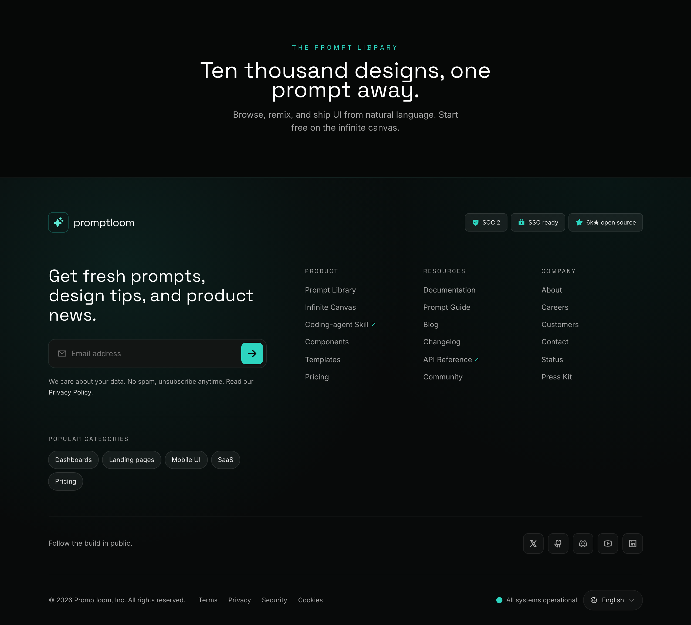

# Teal-on-Ink Newsletter Mega Footer

A dark near-black footer with a teal accent, prominent newsletter capture, three link columns, social row, status pill and language switch, fully responsive.



## Prompt

```text
{"summary":"Build a frameless, full-bleed dark SaaS website footer anchored by a prominent email newsletter capture on the left, three link-navigation columns on the right, a brand row with trust badges, a social row, and a legal bar with a live status pill and language switcher.","style":"Near-black layered palette: page #060807, footer surface ink #080a0a, input panel #121514 (coal #0d0f0f between). Single teal accent ramp: teal-300 #5eead4 (hover/links), teal-400 #2dd4bf (primary CTA, icons, hairline), teal-500 #14b8a6 (deep). Body text neutral-300/neutral-400, headings pure white. Subtle teal radial grain in two corners (top-left rgba(45,212,191,0.10), top-right rgba(20,184,166,0.07)). Fonts via Google Fonts: Space Grotesk (display/headings/eyebrows, 500-700) and Inter (body/sans, 400-600). Mood: technical, calm, premium developer-tool. Accent treatment is restrained: teal used only for the submit button fill (#2dd4bf bg, #080a0a text), the top hairline gradient, small leading icons, a focus glow ring, and link hover. Eyebrows are uppercase with wide 0.18-0.35em tracking. No gradients on text; all hairlines are white/5 dividers.","layout_and_structure":"Frameless full-width footer, content constrained to a max-width 1180px container with px-6 (md px-10) gutters. A 1px top hairline accent spans full width as a transparent->teal-400/40->transparent gradient. Vertical order: (1) brand row, sm horizontal space-between, with sparkle logo lockup on the left and three trust badges on the right; (2) main grid pt-12/16 pb-12; (3) social row across a white/5 top border; (4) legal bar across another white/5 top border. The main grid is lg:grid-cols-12: newsletter block spans col-span-5 (left, pr-8), link columns span col-span-7 as an inner 3-col grid (Product, Resources, Company), gap-x-10. Responsive reflow: desktop (lg) shows newsletter + 3 inline link columns plus a desktop-only 'Popular categories' chip cluster under the newsletter (separated by a white/5 rule); tablet (sm to lg) stacks newsletter on top then a plain always-open 3-column link block with a top border; mobile (<sm) stacks newsletter then collapses the three link groups into native <details> accordions with caret-down chevrons that rotate on open, each row divided by white/5 borders. Legal bar is flex-col-reverse on mobile, md:flex-row space-between.","special_ui_components":"Newsletter capture: a single rounded-xl panel (#121514, ring white/10) holding a leading envelope icon, an email input, and a square teal-400 submit button (40x40, rounded-lg, arrow-right icon, hover teal-300); focus-within turns the ring teal-400/60 and adds a teal box-shadow glow; an inline hidden success line ('You're in. Check your inbox.') reveals on submit, plus a 'No spam, unsubscribe anytime' privacy note with an underlined Privacy Policy link. Trust badges: three pill chips (SOC 2, SSO ready, 6k star open source) on white/[0.06] with white/15 ring and small teal leading icons. Popular-categories chip row (desktop): rounded-full tag links (Dashboards, Landing pages, Mobile UI, SaaS, Pricing) that gain a teal-400/40 ring on hover. Social row: five square 36px icon chips (X, GitHub, Discord, YouTube, LinkedIn) on white/[0.03] with white/10 ring that lift 2px and turn teal on hover, intro'd by 'Follow the build in public.' Legal bar: copyright, an inline Terms/Privacy/Security/Cookies nav, a live status pill ('All systems operational' with a teal dot) and a rounded-full language switch button ('English' with globe + caret-down). Some link rows carry a tiny teal up-right arrow to mark external/highlighted items.","special_notes":"Frameless: no browser chrome, device mockup, or window frame; render the footer section only (a thin contextual CTA strip above is acceptable for spacing). Full-bleed background color edge-to-edge with content centered in the 1180px container. Top hairline is the signature edge detail; dividers between sections are white/5 only. Keep all text WCAG-legible against the dark surfaces (white headings, neutral-300/400 body, teal-300 for hover not body copy). Use the exact teal accent ramp (#5eead4 / #2dd4bf / #14b8a6) and avoid generic indigo/violet AI slop, avoid purple gradients, avoid drop-shadow-heavy cards. Icons are line/duotone (Phosphor-style). Accordion uses real <details>/<summary> with marker hidden for the mobile collapse."}
```

**▶ Try it live → [https://superdesign.dev/library/teal-on-ink-newsletter-mega-footer](https://superdesign.dev/library/teal-on-ink-newsletter-mega-footer?utm_source=github&utm_medium=prompt-repo&utm_campaign=prompt-library)**

**Use it in your coding agent:** install the [Superdesign skill](https://github.com/superdesigndev/superdesign-skill), then:

```bash
superdesign get-prompts --slugs "teal-on-ink-newsletter-mega-footer" --json
```

*0 copies · 2,473 tries · footer, mega-footer, newsletter, dark, teal*
