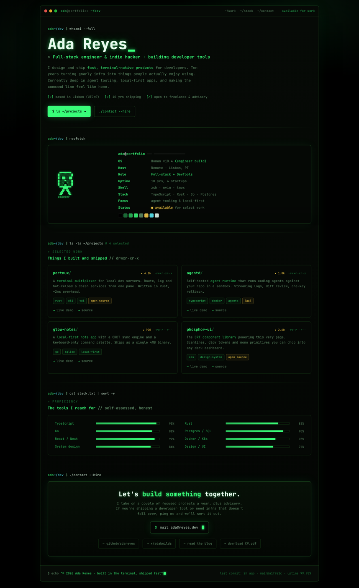

# Terminal Portfolio Website: Retro CRT Phosphor-Green Developer Portfolio

A retro CRT terminal-style developer PORTFOLIO website in phosphor green on a near-black canvas, framed as one fake terminal window with traffic-light dots and a monospace nav. Reads top-to-bottom like a shell session: a `whoami` hero with a big glowing name banner and role line, a neofetch-style identity card (a pixel ASCII avatar plus a key/value list of OS, role, stack, status), an `ls ~/projects` grid of framed project cards with tech tags and live/source links, a `cat stack.txt` block of ASCII skill-bar meters, and a `./contact` CTA with a copyable mail command and social pills. JetBrains Mono everywhere, a fixed CRT scanline overlay, phosphor-green glow text, blinking block cursors, and one disciplined amber accent. Grab this terminal portfolio prompt and swap in your own name, projects, stack and links.

Source: https://superdesign.dev/library/terminal-portfolio-website-retro-crt-phosphor-green-developer-portfolio



## Prompt

```text
{
  "summary": "A retro CRT TERMINAL-STYLE developer PORTFOLIO website (single desktop page, 1440-wide) rendered as one fake terminal window on a pure-black #000000 canvas washed with faint green radial glows, under a fixed CRT scanline overlay. The whole page is monospace (JetBrains Mono + IBM Plex Mono) with phosphor green #39ff7a as the single accent doing all the work via text-shadow glow, over dimmer #2bbf5c / faint #1c7a3c greens and a muted sage #5f8d68 body; one disciplined amber #ffd24a accent marks a live 'available' status and one or two tags. The terminal WINDOW frames everything: a title bar with three traffic-light dots (red/amber/green), a mono path label 'ada@portfolio: ~/dev', right-aligned mono nav links (~/work, ~/stack, ~/contact) and an amber blinking 'available for work' status blip. Inside, the page reads top-to-bottom like a shell session, each section prefixed by a plausible command prompt: (1) a 'whoami --full' HERO with a big ~60px glowing pure-white NAME BANNER (scoped to a class with font-size !important + a green underscore that reads as a cursor), a phosphor-green ROLE line ('> Full-stack engineer & indie hacker'), a muted-sage 2-3 line intro, a wrap of ASCII '[x]' meta checks (location, years, availability), and two command-style CTA buttons (a solid glowing green '$ ls ~/projects ->' and a ghost './contact --hire'); (2) a 'neofetch' IDENTITY CARD panel: a green pixel ASCII avatar on the left and a right-hand key/value list (OS: Human v10.4 (engineer build), Host, Role, Uptime, Shell, Stack, Focus, Status) with green keys + sage values and an amber 'available' status, plus a small terminal color-swatch strip; (3) an 'ls -la ~/projects' WORK GRID of four framed project cards, each with a green filename + trailing slash, a right-aligned star count + file-permission string (-rwxr-xr-x), a one-line description, a row of tech tags (one amber 'open source' or 'SaaS' tag), and 'live demo' / 'source' links with green arrows; (4) a 'cat stack.txt | sort -r' PROFICIENCY block of eight mono skill rows, each a label + a glowing green ASCII bar METER + a percentage; (5) a './contact --hire' CTA panel with a headline, a copyable '$ mail ada@reyes.dev' command box with a blinking green caret, and four social pills (github, x, blog, CV.pdf); (6) a shell-echo FOOTER with a copyright echo line + blinking cursor and a fake git status line ('last commit: 2h ago, main@a1f9e2c, uptime 99.98%'). Signature effects: a fixed full-viewport CRT scanline overlay (repeating faint horizontal lines, multiply blend), phosphor text-shadow glow on the name/role/accents, blinking block cursors, ASCII '[x]' bracket bullets, and green text selection. Strictly a live-console aesthetic, never a glossy marketing page; no stock photos; the only chroma is phosphor green plus the single amber status/tag accent.",
  "style": {
    "description": "A retro CRT phosphor-green TERMINAL aesthetic applied to a personal developer portfolio. A pure-black #000000 canvas is washed with two faint green radial glows (rgba(57,255,122,0.08) top-right, 0.05 left) and covered by a fixed CRT SCANLINE overlay so the whole page reads as a glowing monitor. Phosphor green #39ff7a is the single accent and carries the entire UI via text-shadow glow; supporting greens are dimmer #2bbf5c and faint #1c7a3c, body text is a muted sage #5f8d68, headings/strong ink is near-white #eafff1, and one disciplined amber #ffd24a marks a live 'available' status dot and one or two highlighted tags (a cyan #5cf6ff shows only on the path/prompt glyphs). EVERYTHING is monospace: JetBrains Mono (400-800, primary) + IBM Plex Mono (secondary); hierarchy comes from SIZE + WEIGHT + GLOW, not from a second typeface. The shape language is a flat console: near-black panels (#050805 / #070b07) hairlined in dim green (#143614 / brighter #1f4d1f), 3-8px radii only, ASCII '[x]' bracket bullets instead of icon ticks, blinking block cursors, and a fake-terminal window frame (traffic-light dots + a mono path label) around the whole page. The mood is a live REPL / hacker console, warm and dev-native, never soft, glossy or playful. Absolutely no purple/indigo gradient, no Inter, no emoji headings, no centered-everything blandness (this is left-aligned, command-driven).",
    "prompt": "Design a retro CRT phosphor-green TERMINAL developer PORTFOLIO for a single 1440-wide desktop page, framed as one fake terminal window. Canvas: pure black #000000 washed with two faint green radial glows (rgba(57,255,122,0.08) top-right, rgba(57,255,122,0.05) left); cover the whole viewport with a fixed CRT SCANLINE overlay (a pointer-events-none, high-z-index element painted with a repeating-linear-gradient of faint dark horizontal lines at ~3-4px pitch, mix-blend-mode multiply, opacity ~0.5). Make PHOSPHOR GREEN #39ff7a the single accent doing all the work via a text-shadow glow (0 0 8px rgba(57,255,122,0.45), 0 0 24px rgba(57,255,122,0.18)); support it with dimmer #2bbf5c and faint #1c7a3c greens, a muted sage #5f8d68 for body text, near-white #eafff1 for headings/strong, and ONE disciplined amber #ffd24a for a live 'available' status dot + one or two highlighted tags. Use MONOSPACE everywhere (JetBrains Mono + IBM Plex Mono); build hierarchy from size + weight + glow, never a second typeface. IMPORTANT: scope the big ~60px name banner to a CLASS with explicit font-size !important (preview hosts override bare h1). Panels are near-black #050805 / #070b07 hairlined in dim green #143614 / brighter #1f4d1f, radii 3-8px only. Use terminal furniture throughout: a window title bar with three traffic-light dots + a mono path label + a right-aligned mono nav, a '$' or '>' command prompt introducing every section, ASCII '[x]' bracket bullets, blinking block cursors, green text selection (::selection rgba(57,255,122,0.30)), and a fake git status line in the footer. Keep it a live-console aesthetic, no stock photos, no second color family beyond the amber status accent, absolutely no purple/indigo (that reads as AI slop)."
  },
  "layout_and_structure": {
    "description": "One fake terminal WINDOW frames the entire single-column page (max ~1120px). Title bar: three traffic-light dots + a mono path label 'ada@portfolio: ~/dev' + right-aligned mono nav (~/work, ~/stack, ~/contact) + an amber blinking 'available for work' status. Body reads top-to-bottom like a shell session, each section prefixed by a command prompt: (1) a 'whoami --full' HERO (glowing ~60px name banner + role line + intro + ASCII meta checks + two command-style CTA buttons); (2) a 'neofetch' IDENTITY CARD (pixel ASCII avatar left, key/value identity list right, color-swatch strip); (3) an 'ls -la ~/projects' 2x2 WORK GRID of framed project cards; (4) a 'cat stack.txt' PROFICIENCY block of mono skill-bar meters (two columns of four); (5) a './contact --hire' CTA panel (copyable mail command box + blinking caret + social pills); (6) a shell-echo FOOTER (copyright echo + blinking cursor + fake git status). Thin green gradient rules separate sections. On a narrow viewport the nav collapses, the project grid and skill columns stack to one column, and the neofetch card stacks the avatar above the identity list.",
    "prompts": [
      {
        "part": "Terminal window frame + nav",
        "prompt": "Wrap the whole page in one fake TERMINAL WINDOW: a near-black rounded (~8px) panel with a dim-green hairline border and a soft green outer glow. Title bar (a slightly lifted #070b07 strip, bottom hairline): three traffic-light dots (red #ff5f56, amber #ffbd2e, green #27c93f) at left, then a mono path label with a bright user 'ada' + a sage '@portfolio: ~/dev'; right-aligned, a row of mono nav links (~/work, ~/stack, ~/contact) that brighten to phosphor green on hover, and a status cluster of a blinking AMBER dot + 'available for work'."
      },
      {
        "part": "whoami hero",
        "prompt": "Open the body with a command line: a cyan/green prompt 'ada~/dev $' + a near-white 'whoami --full'. Below it a big NAME BANNER in JetBrains Mono ~60px / weight 800 / near-white #eafff1 with a strong phosphor glow, ending in a green underscore that reads as a cursor (scope it to a class with font-size !important). Then a phosphor-green ~17px ROLE line prefixed with a sage '>' ('Full-stack engineer & indie hacker, building developer tools'), a muted-sage 2-3 line intro (max ~640px) with a couple of green-highlighted phrases, a wrap of ASCII '[x]' meta checks (location + UTC, years shipping, availability), and a CTA row of two command-style buttons: a solid glowing green '$ ls ~/projects ->' and a ghost './contact --hire'."
      },
      {
        "part": "neofetch identity card",
        "prompt": "Prefix with 'ada~/dev $ neofetch'. Render a panel split into a ~230px left column holding a small GREEN PIXEL ASCII AVATAR (a monospace pre block, glowing) with an 'ada@dev' label, and a right column holding a neofetch-style identity block: a bright title row 'ada@portfolio ----------', then a key/value definition list with phosphor-green keys and sage values (OS: Human v10.4 (engineer build); Host: Remote, Lisbon PT; Role: Full-stack + DevTools; Uptime: 10 yrs, 4 startups; Shell: zsh, nvim, tmux; Stack: TypeScript, Rust, Go, Postgres; Focus: agent tooling & local-first; Status: an amber-glow 'available' for select work). Under the list, a small horizontal strip of ~8 terminal color swatches."
      },
      {
        "part": "ls ~/projects work grid",
        "prompt": "Prefix with 'ada~/dev $ ls -la ~/projects  # 4 selected', a wide-tracked '> selected work' label and a heading 'Things I built and shipped // drwxr-xr-x'. Below, a 2x2 grid of framed project CARDS (near-black panel, dim-green hairline, lift + green glow on hover). Each card top row: a green filename with a faint trailing slash (portmux/, agentd/, glow-notes/, phosphor-ui/) at left, and at right a baseline-aligned group of an amber star count (star 4.2k) + a faint file-permission string (-rwxr-xr-x). Then a sage one-line description with a couple of green-highlighted terms, a row of tech tags (mono, dim-green outline pills, with exactly one amber 'open source' or 'SaaS' tag per card), and a links row of 'live demo' / 'source' each led by a green arrow glyph. IMPORTANT: keep the star count and the permission string on ONE baseline-aligned row so they never overlap."
      },
      {
        "part": "cat stack.txt skill meters",
        "prompt": "Prefix with 'ada~/dev $ cat stack.txt | sort -r', a '> proficiency' label and a heading 'The tools I reach for // self-assessed, honest'. Render a panel with two columns of four SKILL ROWS; each row is a sage label (150px) + a thin ASCII BAR METER (a near-black track with a dim-green hairline holding a glowing green fill at the given width) + a right-aligned percentage. Values e.g. TypeScript 95, Rust 82, Go 88, Postgres/SQL 90, React/Next 92, Docker/K8s 78, System design 86, Design/UI 74."
      },
      {
        "part": "contact CTA + footer",
        "prompt": "Prefix with 'ada~/dev $ ./contact --hire'. A centered CTA panel (green-tinted gradient, glowing hairline): a near-white headline with a green highlighted phrase ('Let's build something together.'), a sage sub-line (warm, dev-native, no em-dashes), a copyable COMMAND BOX ('$ mail ada@reyes.dev' in a near-black inset with a dim-green border + green glow + a blinking green block caret), and a row of four social PILLS (github, x, blog, CV.pdf) each led by a green arrow. Then a top-bordered FOOTER strip: a left shell-echo line ('$ echo \"(c) 2026 Ada Reyes, built in the terminal, shipped fast\"' + a small blinking cursor) and a right faint fake git status line ('last commit: 2h ago, main@a1f9e2c, uptime 99.98%')."
      }
    ]
  },
  "special_ui_components": [
    {
      "component": "Fake terminal window frame",
      "description": "One macOS-style terminal window that frames the whole portfolio and instantly signals 'terminal' while staying a recognizable personal site.",
      "prompt": "Wrap the entire page in a rounded (~8px) near-black panel with a dim-green hairline border and a soft green outer glow. Give it a title bar (a slightly lifted #070b07 strip with a bottom hairline): three small traffic-light dots (red #ff5f56, amber #ffbd2e, green #27c93f) at left, a monospace path label ('ada@portfolio: ~/dev' with a brighter 'ada' + '~/dev'), and on the right a row of mono nav links plus a status cluster of a blinking amber dot + 'available for work'. Everything inside the window scrolls as one console session."
    },
    {
      "component": "CRT scanline + phosphor glow system",
      "description": "The recurring retro-monitor treatment that gives the whole page its glowing-CRT terminal feel.",
      "prompt": "Add a fixed, pointer-events-none, high-z-index overlay across the whole viewport painted with a repeating-linear-gradient of faint dark horizontal lines (transparent 0-2px, rgba(0,0,0,0.16) at 3px, transparent 4px), mix-blend-mode multiply, opacity ~0.5, so the page reads as a glowing CRT monitor; optionally add a soft inset vignette. Define a '.glow' text-shadow (0 0 8px rgba(57,255,122,0.45), 0 0 24px rgba(57,255,122,0.18)) and a softer '.glow-soft' for green text, and use them sparingly on the name banner, role line, buttons and accents. Add green text selection (::selection background rgba(57,255,122,0.30))."
    },
    {
      "component": "neofetch identity card",
      "description": "The iconic developer identity block: a pixel ASCII avatar beside a key/value system-info list, which reads instantly as 'this is a developer's personal profile'.",
      "prompt": "Build a panel split into a ~230px left column and a flexible right column. Left: a monospace pre block drawing a small green PIXEL ASCII AVATAR (a little character or logo) with a phosphor glow and an 'ada@dev' label beneath. Right: a neofetch-style identity block, a bright title row ('ada@portfolio ----------') over a two-column definition list with phosphor-green keys and muted-sage values (OS, Host, Role, Uptime, Shell, Stack, Focus, Status), where the Status value is an amber-glow 'available'. Under the list, a small horizontal strip of ~8 color swatches like a terminal palette."
    },
    {
      "component": "ls ~/projects work card",
      "description": "A framed project card styled as a directory listing entry, the portfolio's work/proof section and the most copy-worthy remixable block.",
      "prompt": "Create a near-black panel card with a dim-green hairline that lifts and glows green on hover. Top row: a green filename with a faint trailing slash at left, and at right a baseline-aligned group of an amber star count ('star 4.2k') plus a faint monospace file-permission string ('-rwxr-xr-x'). Body: a muted-sage one-line description with a couple of green-highlighted terms; a row of small monospace tech-tag pills (dim-green outline, with exactly one amber-highlighted 'open source' / 'SaaS' tag); and a links row of 'live demo' / 'source', each led by a green arrow glyph. Keep the star count and permission string on one baseline row so they never overlap. Arrange four of these in a responsive 2x2 grid."
    },
    {
      "component": "ASCII bar skill meter",
      "description": "A monospace proficiency row that shows skills as glowing terminal-style bar graphs instead of generic dots.",
      "prompt": "Build a skill row as a three-part grid: a sage label (~150px) + a thin bar-graph track (a near-black inset with a dim-green hairline, ~9px tall) holding a fill (a linear-gradient from #2bbf5c to phosphor #39ff7a with a green glow) sized to the skill percentage + a right-aligned mono percentage. Stack eight of them in two columns. Keep the fills honest (varied widths), not all maxed."
    },
    {
      "component": "Command-box CTA + blinking cursor",
      "description": "A copyable shell-command contact box with a live blinking caret, the page's primary conversion artifact.",
      "prompt": "Create a near-black inset command box with a dim-green border and a green glow holding a green '$' + a mono command ('mail ada@reyes.dev') followed by a BLINKING GREEN BLOCK CARET (a small green rectangle animated with a step-end 1.1s keyframe toggling opacity). Center it inside a green-tinted CTA panel above a row of outline social pills. Reuse the same blinking block cursor after the hero name banner and the footer echo line to sell the live-terminal feel."
    }
  ]
}
```
