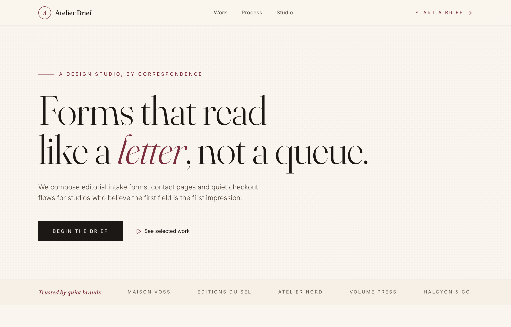

# The Atelier Brief — an editorial intake form, set like a letter

An editorial intake form set like a letter: a warm cream page in Fraunces serif + Inter with a single burgundy accent, borderless underline inputs with serif labels (Name / E-mail, Project / Budget, Message), structured by full-bleed cream/ink/cream bands and hairline rules instead of cards, and a quiet ink 'Submit the brief' button.



## Prompt

```text
{"summary": "An editorial intake form ('The Atelier Brief') for a by-correspondence design studio, built around THE underline-input form set like a letter, not a queue. A warm cream paper ground (#faf6ef) carried by a refined two-typeface system, Fraunces (an optical serif, the editorial voice) for every display word and field label, and Inter (sans) for body and UI text, over near-black ink (#1c1815) with a single burgundy accent (#7b2d3b). A faint dotted 'grain' texture sits over the whole page. A sticky translucent nav, a tall serif hero ('Forms that read like a letter, not a queue.' where 'letter' is italic burgundy), a full-bleed cream trust strip, then the form: a two-column editorial layout pairing a left intro column (chapter eyebrow, serif heading, hairline rule, contact lines) with a right form of borderless underline inputs (Name / E-mail paired, Project type / Budget paired, then a full-width Message textarea), closed by a privacy line and an ink 'Submit the brief' button. Below it, a full-bleed dark ink 'Selected work' band of three numbered articles, a light 'Process' section of three roman-numeral steps, and a cream footer. Quiet, literary, and confident; reflows from two columns / paired fields to a single stacked column on mobile.", "style": {"description": "Editorial, literary form UI that reads like a page in a quiet book. A warm cream paper ground (#faf6ef, deeper panels #f3ecdf) under a faint dotted 'grain' radial-dot texture (rgba(28,24,21,0.025), 4px tile). A near-black warm ink (#1c1815) for primary text and a softer ink (#54493f) for secondary, with a single muted burgundy accent (DEFAULT #7b2d3b, deep #5e1f2b, light #c98a93, bright #e3aab2 for use on dark grounds). A two-typeface system: Fraunces (an optical-size variable serif, weights 300-700, used at large opsz for display and 'opsz' 24 for field labels) is the editorial voice for headlines, labels and accents; Inter (sans, 300-600) carries body copy and small UI text. Generous whitespace, tight negative letter-spacing on the big serif display (tracking -0.01em) and wide uppercase tracking (0.22-0.28em) on eyebrows, links and buttons. No card chrome and almost no borders: structure comes from hairline rules (a 1px center-fading gradient rule), full-bleed color bands (cream / deep-ink / cream) and rhythm, not boxes. Inputs are borderless underline fields (transparent, only a 1px bottom border) that on focus deepen to burgundy with a soft 1px burgundy shadow under the line. Interactions are restrained and typographic: quiet links draw a burgundy underline left-to-right on hover (.link-quiet), the ink submit button darkens to burgundy, lifts 1px and widens its letter-spacing on hover; arrow icons nudge right. Calm, refined, human, unhurried, never busy or sterile.", "prompt": "Design a warm, editorial form UI that reads like a letter set in a quiet book. Palette: cream paper background #faf6ef and a slightly deeper panel cream #f3ecdf; warm near-black ink #1c1815 for primary text and a softer ink #54493f for secondary text; a single muted burgundy accent #7b2d3b (deep #5e1f2b for hovers, light #c98a93 and bright #e3aab2 for accents on dark grounds). Lay a very faint dotted 'grain' texture over the whole body: background-image radial-gradient(rgba(28,24,21,0.025) 1px, transparent 1px) with background-size 4px 4px. Typography is a strict two-typeface system: Fraunces (a variable optical-size serif, weights 300-700, italic available) for every display word, section heading and form label (set big at high optical size with font-variation-settings 'opsz' 144 for the hero clamp and 'opsz' 24 for labels) and Inter (sans, weights 300-600) for body copy and small UI/eyebrow/button text. Use tight negative tracking (-0.01em) on the large serif headlines and wide uppercase tracking (0.22em-0.28em) on eyebrows, nav links, the trust strip and buttons. Avoid cards and visible borders: build structure from generous whitespace, hairline rules (a 1px tall divider that is a horizontal gradient fading to transparent at both ends), and full-bleed horizontal color bands (cream body, a near-black ink 'Selected work' band, cream again). Form inputs are borderless underline fields: transparent background, no border except a 1px bottom border rgba(28,24,21,0.42), no border-radius, a light-weight 16px value and a 300-weight placeholder at rgba(28,24,21,0.42); on :focus the underline turns burgundy #7b2d3b and gains a soft box-shadow 0 1px 0 0 rgba(123,45,59,0.55), no outline. Interactions are quiet and typographic (all CSS): a '.link-quiet' underline animates from width 0 to 100% in burgundy on hover (an ::after 1px bar); the primary button is an ink-filled #1c1815 rectangle with cream text and 0.22em uppercase tracking that on hover goes burgundy-deep #5e1f2b, translateY(-1px) and widens letter-spacing to 0.26em; arrow icons (lucide arrow-right / arrow-up-right) translate-x on hover. Smooth scroll-behavior. Calm, literary, editorial, confident, human, lots of air; never sterile, boxed or busy."}, "layout_and_structure": {"description": "A single editorial page in full-bleed horizontal bands: a sticky translucent nav, a tall serif hero, a full-bleed cream trust strip, THE form section (a two-column editorial layout: a narrow left intro column + a wider right form of underline inputs), a full-bleed near-black ink 'Selected work' band, a light 'Process' section, and a cream footer. The nav / hero / work / process / footer use a wide max-w-6xl column; the form section narrows to max-w-5xl for a more letter-like measure. Everything reflows to a single column on mobile: the nav links hide behind the persistent 'Start a brief' link, the form's two intro/form columns stack and the paired fields (Name/E-mail, Project/Budget) collapse to one-up, the trust strip condenses its brand list, and the work grid goes one-up.", "prompts": [{"part": "Sticky nav", "prompt": "A sticky top header (sticky top-0 z-50) on a translucent cream bg (bg-cream/85 backdrop-blur-md) with a hairline ink/10 bottom border, 64px tall (h-16), inside a max-w-6xl px-6/sm:px-8 row, items-center justify-between. Left = brand: a 32px round outline tile (h-8 w-8 rounded-full border border-burgundy) holding an italic Fraunces 'A' (font-variation-settings 'opsz' 24) in burgundy, then a Fraunces 17px 'Atelier Brief' wordmark in ink. Center (md+ only) = three quiet nav links (Work, Process, Studio) in 13px inksoft with wide tracking, each a .link-quiet that draws a burgundy underline on hover and goes ink. Right = a persistent 'Start a brief' link in 12px uppercase tracking-[0.22em] burgundy with a trailing lucide:arrow-right that translates-x on hover."}, {"part": "Hero", "prompt": "A relative overflow-hidden section inside a max-w-6xl column with tall top/bottom padding (pt-16 sm:pt-28, pb-16 sm:pb-24). Top: an eyebrow row, a 10px burgundy/60 hairline dash + 'A design studio, by correspondence' in 12px uppercase tracking-[0.28em] burgundy. Then a huge Fraunces font-light headline, leading-[0.96], tracking-[-0.01em], size clamp(2.9rem,8vw,6.4rem) with font-variation-settings 'opsz' 144, reading 'Forms that read' / (line break sm+) 'like a' then an italic burgundy 'letter' then ', not a queue.' Below: a max-w-xl 17px inksoft font-light sub-paragraph ('We compose editorial intake forms, contact pages and quiet checkout flows for studios who believe the first field is the first impression.'). Then an actions row: a primary ink button 'Begin the brief' (bg-ink, cream text, px-9 py-4, 12px uppercase tracking-[0.22em], the hover-burgundy/lift/letter-spacing .btn-submit behavior) and a quiet text link 'See selected work' with a small burgundy lucide:play icon."}, {"part": "Trust strip", "prompt": "A full-bleed band (w-full) with top+bottom hairline ink/10 borders on a deeper cream (bg-creamdeep/60). Inside a max-w-6xl row (py-5, flex-wrap, justify-between, gap), a leading Fraunces italic burgundy 15px label 'Trusted by quiet brands' (normal-case) followed by a list of small uppercase tracking-[0.22em] inksoft brand names (Maison Voss, Editions du Sel, Atelier Nord, Volume Press, Halcyon & Co.) that progressively hide at smaller breakpoints (hidden sm:inline / md:inline / lg:inline), with a single condensed mobile line ('Maison Voss · Atelier Nord · Volume Press') shown only on mobile."}, {"part": "The form section (the hero component)", "prompt": "A full-bleed cream section (id=brief) with a max-w-5xl column and tall padding (py-24 sm:py-32), laid out as a two-column grid lg:grid-cols-[0.85fr_1.4fr] with a large gap (gap-14 lg:gap-20). LEFT intro column: a 'Chapter 01 · The Brief' eyebrow (12px uppercase tracking-[0.28em] burgundy), a Fraunces font-light heading 'Tell us what you're making.' (clamp 2.2rem-3.4rem, leading-[1.02]), a hairline .rule divider, a 15px inksoft font-light paragraph ('No drop-downs, no ten-step wizard. Just a few honest lines. We read every word and reply within two working days, by a human.'), and two contact lines with small burgundy lucide icons (mail studio@atelierbrief.co, map-pin 14 Rue Mazarine, Paris). RIGHT form column: see the underline-input form. Below everything, the form ends in an actions row pairing a privacy line and the submit button."}, {"part": "Underline-input form (the reusable heart)", "prompt": "A borderless editorial form (no card). Fields are arranged as: a first paired row (grid sm:grid-cols-2 gap-x-12 gap-y-12) of Name + E-mail; a second paired row of Project type + Budget, roughly; then a full-width Message textarea (rows=3). Each field is a Fraunces 19px label (the .ed-label with 'opsz' 24, mb-3) above a borderless .underline-input: transparent, no border except 1px bottom border rgba(28,24,21,0.42), no radius, full width, pb-3, 16px ink font-light, a 300-weight placeholder at rgba(28,24,21,0.42); the textarea adds resize-none and relaxed leading. Placeholders are literary and concrete ('Jane Mercier', 'jane@studio.co', 'Contact page, intake, checkout…', '$5k to $20k', 'A sentence or two about the work, the audience, the feeling you're after…'). On :focus the underline turns burgundy with the soft 1px burgundy under-shadow. The form closes with an actions row (flex, col-reverse on mobile -> row sm+, justify-between, items-center): a left privacy line ('Your details stay between us.' with a tiny burgundy lucide:lock) and a right ink 'Submit the brief' button (the .btn-submit, full-width on mobile, px-12 py-4, 12px uppercase tracking-[0.22em], a trailing lucide:arrow-up-right)."}, {"part": "Selected work band", "prompt": "A full-bleed near-black ink section (bg-ink text-cream) with a max-w-6xl column and tall padding. Header row (items-end justify-between): left a 'Selected work' eyebrow (cream/80 uppercase tracking-[0.28em]) over a Fraunces font-light heading 'A few we're proud of.' (clamp 2rem-3.2rem); right (sm+) an 'Index' quiet link with a lucide:arrow-right. Body: a three-column grid (md:grid-cols-3) of articles separated by 1px hairline gaps (gap-px on a cream/10 bg so the gaps read as thin lines). Each article (bg-ink, p-8/9) has a Fraunces italic burgundybright number (01/02/03), a Fraunces 22px title (Maison Voss · Enquiry / Editions du Sel · Checkout / Atelier Nord · Contact) and a small cream/55 font-light line."}, {"part": "Process section", "prompt": "A light cream section (max-w-6xl, tall padding) as a grid lg:grid-cols-3. Left (col-span-1): a 'Process' eyebrow (burgundy uppercase tracking-[0.28em]) over a Fraunces font-light heading 'Three letters, then a form.' (clamp 2rem-3rem). Right (col-span-2): a three-up grid (sm:grid-cols-3) of steps, each with a Fraunces italic burgundy roman numeral (i. / ii. / iii.), a Fraunces 19px ink title (Listen / Compose / Ship) and a 14px inksoft font-light line."}, {"part": "Footer", "prompt": "A full-bleed footer (id=studio) with a hairline ink/10 top border on a deeper cream (bg-creamdeep/50), a max-w-6xl column, py-14. Top row (flex col -> row sm+, items-start/end justify-between): left a Fraunces 22px 'Atelier Brief' wordmark over a 13px inksoft font-light line ('An editorial form studio. By correspondence, from Paris.'); right a row of two social icon links (lucide:instagram, lucide:twitter, hover:text-burgundy) and a quiet 'Start a brief' link. Then a full-width .rule hairline divider, then a bottom row (flex col -> row) with a 12px copyright ('© 2026 Atelier Brief. All quiet reserved.') and a Fraunces italic 'Set in Fraunces & Inter.' colophon."}]}, "special_ui_components": [{"component": "Underline input (.underline-input)", "prompt": "A borderless editorial text field with no card and no full border. CSS: background transparent; border 0; border-bottom 1px solid rgba(28,24,21,0.42); border-radius 0; transition border-color .35s ease, box-shadow .35s ease. The placeholder is rgba(28,24,21,0.42) at font-weight 300. On :focus: outline none; border-bottom-color #7b2d3b (burgundy); box-shadow 0 1px 0 0 rgba(123,45,59,0.55) (a soft second line under the underline). Used full width with pb-3 and a 16px font-light ink value; the textarea variant adds resize-none and relaxed leading. Always paired above it with a Fraunces 19px '.ed-label' (font-variation-settings 'opsz' 24)."}, {"component": "Editorial serif label (.ed-label)", "prompt": "A form-field label set in Fraunces serif at 19px with font-variation-settings 'opsz' 24 (so the optical size reads crisp at small display sizes), ink color, mb-3, block. It treats the label as editorial display type rather than a small sans caption, which is what gives the form its 'set like a letter' voice."}, {"component": "Quiet link (.link-quiet)", "prompt": "A text link with an animated underline reveal. The link is position relative; an ::after pseudo-element sits at left 0, bottom -3px, height 1px, width 0, background #7b2d3b (burgundy), transition width .35s ease. On :hover the ::after grows to width 100%, drawing a burgundy underline left-to-right. Used on nav links, the 'See selected work' / 'Index' / 'Start a brief' links."}, {"component": "Ink submit button (.btn-submit)", "prompt": "A solid near-black ink button: bg #1c1815, cream text #faf6ef, rectangular (no radius), generous padding (px-9/px-12 py-4), 12px uppercase letter text at tracking-[0.22em], an optional trailing lucide arrow icon. transition background-color .3s, transform .3s, letter-spacing .3s. On :hover the background goes burgundy-deep #5e1f2b, it translateY(-1px) and the letter-spacing widens to 0.26em, a quiet, confident press that 'opens up' the word."}, {"component": "Hairline rule (.rule)", "prompt": "A 1px-tall horizontal divider that is a linear-gradient(90deg, transparent, rgba(28,24,21,0.18), transparent), so it fades in from both ends to a faint ink center, used instead of a hard full-width border to separate editorial blocks (under the form intro heading and in the footer)."}, {"component": "Grain texture (.grain)", "prompt": "A subtle paper texture applied to the body: background-image radial-gradient(rgba(28,24,21,0.025) 1px, transparent 1px) with background-size 4px 4px, a barely-there dotted field that adds tactile warmth to the cream ground without reading as a visible pattern."}, {"component": "Outline monogram brand mark", "prompt": "A 32px round outline tile (h-8 w-8, rounded-full, 1px burgundy border) centering an italic Fraunces 'A' (15px, font-variation-settings 'opsz' 24) in burgundy, paired with a Fraunces 17px 'Atelier Brief' wordmark in ink; a literary, by-correspondence brand mark rather than a filled logo tile."}], "special_notes": "Built on the Tailwind CDN with a tailwind.config extend: custom colors cream #faf6ef, creamdeep #f3ecdf, ink #1c1815, inksoft #54493f, burgundy #7b2d3b, burgundydeep #5e1f2b, burgundylt #c98a93, burgundybright #e3aab2; fontFamily serif = Fraunces, sans = Inter. Fonts load from Google Fonts (Fraunces ital,opsz 9..144,wght 300..700 + Inter 300-600); icons are Iconify lucide:* via the iconify CDN. The body carries the .grain dotted texture and #faf6ef background with smooth scroll-behavior. The signature move is the borderless underline-input form (.underline-input) set with Fraunces serif labels (.ed-label, 'opsz' 24), structured by full-bleed cream/ink/cream bands, hairline gradient rules (.rule) and whitespace rather than cards or borders, with quiet typographic interactions (the .link-quiet underline reveal, the .btn-submit hover that goes burgundy + lifts + widens letter-spacing). The form is a real, accessible native HTML form (text/email inputs + textarea, real <label for> pairings); onsubmit is no-opped for the static demo. On a single static frame the underline-focus color shift, the .link-quiet underline reveal and the .btn-submit hover only fully show live. 'Atelier Brief', the brand names in the trust strip / selected-work band, and the contact details are illustrative placeholders for a by-correspondence design-studio intake/contact form."}
```

**▶ [Try it live →](https://p.superdesign.dev/draft/0cd0c9b0-8369-44b5-9353-850ea4f992be)**

**Use it in your coding agent:** install the [Superdesign skill](https://github.com/superdesigndev/superdesign-skill), then:

```bash
superdesign get-prompts --slugs "the-atelier-brief-an-editorial-intake-form-set-like-a-letter" --json
```

*0 copies · 2,430 tries · Forms & Contact · General · form, contact-form, intake-form, editorial*
