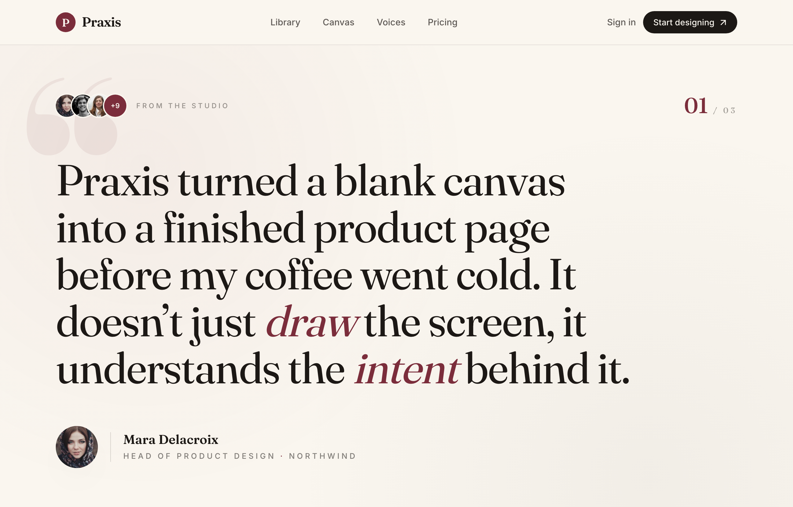

# The Quote, Set in Burgundy

A magazine-style single-slide testimonial on a warm cream canvas: one oversized Fraunces serif pull-quote with burgundy italic emphasis, a ghosted giant quote mark, an avatar trust cluster, a portrait byline, and prev/next carousel chrome with progress dots.



## Prompt

```text
{"summary": "A single, full-viewport editorial testimonial 'slide' for a design-agent product ('Praxis'), built on a warm cream paper canvas with a deep burgundy accent. One large Fraunces serif pull-quote dominates the screen, anchored above by a stacked-avatar trust cluster + a '01 / 03' slide counter and below by a portrait+rule attribution byline, then a prev/next arrow set with progress dots. People copy this for the magazine-style 'one big quote per screen' testimonial pattern: oversized serif quote, ghosted opening quotation mark, and a carousel-style slide chrome rather than a grid of cards.", "style": {"description": "Warm, premium editorial / print-magazine aesthetic. A single cream paper background with near-black 'ink' text and one deep burgundy accent used for emphasis, the logo, the slide number, and italic key words inside the quote. Pairs a high-contrast Fraunces serif (the 'display' voice, used for the quote, logo wordmark, slide counter and name) with Inter for all small UI/labels. Identity comes from typography and restraint, not decoration: a faint two-spot paper grain, a giant translucent burgundy opening quote mark behind the text, hairline ink rules, and uppercase wide-tracked micro-labels. Soft, expensive shadow only on the portrait.", "prompt": "Use a warm cream paper background #faf6ef with a near-black 'ink' text color #1c1815 and a single deep burgundy accent #7b2d3b. Typography is the identity: load 'Fraunces' (an optical serif, weights 300-700) as the display family for the big quote, the logo wordmark, the slide counter and the attributed name, and 'Inter' (400/500/600) for every small label, nav link and button. Set the giant blockquote in Fraunces at a normal/400 weight, very tight leading (~1.08) and slightly negative tracking (-0.02em), and italicize one or two key words inside it in burgundy for emphasis. Keep the palette to just cream + ink + burgundy; express tints by opacity (e.g. text-ink/70 for nav, ink/45-55 for micro-labels, burgundy/8% for the ghost quote mark). Add a faint 'paper-grain' via two soft radial gradients (burgundy at ~5% top-left, ink at ~4% bottom-right). Use uppercase Inter micro-labels with very wide letter-spacing (~0.28em) for eyebrows and roles. Hairline dividers are ink at ~12% opacity. The only real shadow is a soft, far, low-opacity drop shadow on the round portrait (like 0 24px 60px -28px rgba(28,24,21,0.45)). No gradients-as-fills, no cards, no heavy borders, no neon. The mood is calm, confident, literary."}, "layout_and_structure": {"description": "A frameless, fully responsive single 'slide' that fills the viewport height (min-h calc(100vh - nav)) and vertically centers one testimonial. A sticky translucent nav sits on top. Inside a centered max-width column (~1180px): a top meta row (left = overlapping avatar stack + 'From the studio' eyebrow, right = big burgundy '01 / 03' counter), then the oversized serif pull-quote, then a portrait + vertical-rule + name/role byline, then a full-width hairline, then a footer control row (left = round prev/next arrow buttons, right = progress dots). A huge ghosted opening quotation mark is absolutely positioned behind the upper-left of the content. It reads as one slide of a testimonial carousel, not a list of cards.", "prompts": [{"part": "Sticky nav", "prompt": "A sticky top header (z-50, ~72px tall) with a translucent cream background (cream/85) + backdrop-blur and a thin bottom border at ink/10. Centered max-width ~1180px with px-6 (sm: px-10). Left: brand lockup = a small 32px burgundy circle holding a cream Fraunces semibold 'P', next to the wordmark 'Praxis' in Fraunces ~1.35rem semibold, tight tracking. Center (md+ only): Inter medium nav links 'Library / Canvas / Voices / Pricing' in ink/70 with an animated burgundy underline that grows from 0 to full width on hover. Right: a subtle 'Sign in' text link (sm+) in ink/70, and a solid ink pill button 'Start designing' with a lucide arrow-up-right icon, that turns burgundy on hover."}, {"part": "Quote slide stage + ghost quote mark", "prompt": "A full-height section (min-h calc(100vh - 72px)) using flex to vertically center its content, with overflow hidden and the paper-grain background. Place a giant decorative opening curly quote (left double quotation mark) in Fraunces bold, absolutely positioned near the top-left (top ~2rem, left ~3%), colored burgundy at ~8% opacity, sized huge (~26rem on desktop, ~16rem on mobile), pointer-events none / aria-hidden. The real content sits in a relative z-10 centered column (max-w ~1180px) above it."}, {"part": "Top meta row (avatars + slide counter)", "prompt": "A flex row, space-between, baseline/centered. Left group: an overlapping avatar stack (-space-x-2.5) of three ~36px round photos each with a 2px cream ring, followed by a burgundy ~36px circle with cream '+9' text (also cream-ringed); next to it (sm+) an uppercase, very-wide-tracked Inter micro-label 'From the studio' in ink/45. Right group: a Fraunces slide counter showing a large burgundy '01' (~2.2rem, medium) immediately followed by a small uppercase tracked '/ 03' in ink/40."}, {"part": "Oversized pull-quote", "prompt": "A blockquote with a single paragraph, max-width ~940px, set in Fraunces normal weight, ink color, very large and editorial: clamp the size up to ~4.4rem on large screens (~3.6rem sm, ~2.05rem mobile), leading ~1.08, tracking -0.02em. The quote tells a concrete product story (e.g. 'Praxis turned a blank canvas into a finished product page before my coffee went cold...'); italicize one or two pivotal words in burgundy (e.g. *draw*, *intent*) for emphasis. Top margin ~4rem from the meta row."}, {"part": "Attribution byline", "prompt": "Below the quote (~3.5rem gap), a flex row, centered: a round portrait (~68px desktop / 56px mobile) with the soft far drop shadow, then a short vertical hairline rule (1px, ink/15, ~48px tall), then a two-line name/role block. Name in Fraunces ~1.3rem semibold (e.g. 'Mara Delacroix'); role line in uppercase wide-tracked Inter ~0.78rem, ink/55, with the company emphasized in burgundy and a burgundy middot separator (e.g. 'Head of Product Design · Northwind'). On mobile the role wraps and the separator collapses."}, {"part": "Footer controls (arrows + dots)", "prompt": "A full-width hairline divider (1px, ink/12) under the byline, then a flex row, space-between. Left: two round 44px outline buttons (border ink/20, icon ink/60) for previous/next, each holding a lucide arrow-left / arrow-right icon; on hover the border + icon turn burgundy and the button nudges -3px / +3px horizontally. Right: a row of progress dots, each a 6px ink/20 rounded pill, except the active dot which is burgundy and widened to ~22px; transitions are smooth (~300ms)."}]}, "special_ui_components": [{"component": "Ghosted oversized quotation mark", "description": "A giant translucent serif opening-quote glyph behind the text that signals 'this is a quote' without a literal quote-card.", "prompt": "Render a single left double quotation mark in the Fraunces serif at bold weight, line-height 0, sized ~16rem on mobile up to ~26rem on desktop, colored burgundy at ~8% opacity. Absolutely position it near the top-left of the quote stage (top ~1-2rem, left ~2-3%), set pointer-events:none, user-select:none and aria-hidden so it's purely decorative and the real quote text layers above it at z-10."}, {"component": "Slide counter (01 / 03)", "description": "An editorial 'which slide am I on' index that doubles as a strong typographic accent.", "prompt": "Build a baseline-aligned counter in Fraunces: a large current number '01' in burgundy (~2.2rem, medium weight) immediately followed by a small uppercase, wide-tracked '/ 03' total in ink/40. Place it top-right of the slide, balancing the avatar cluster on the left."}, {"component": "Overlapping avatar trust cluster with +N pill", "description": "A stacked group of reviewer photos ending in a burgundy '+9' chip to imply many voices behind this one quote.", "prompt": "Lay three ~36px circular avatar photos in a row with negative horizontal spacing (-space-x-2.5) so they overlap, each wearing a 2px cream ring to separate them. Cap the stack with a burgundy circle of the same size containing cream '+9' text (also cream-ringed). Optionally follow it with a wide-tracked uppercase 'From the studio' micro-label."}, {"component": "Carousel chrome: prev/next arrows + progress dots", "description": "Minimal slider controls that make the single quote feel like one of several, with motion affordances.", "prompt": "Create two 44px round outline buttons (1px ink/20 border, ink/60 icon) with lucide arrow-left and arrow-right icons; on hover, transition the border and icon to burgundy and translate the button -3px (prev) or +3px (next). Pair them with progress dots: small 6px ink/20 rounded pills where the active dot is burgundy and stretched to ~22px wide, all animating smoothly (~300-350ms cubic-bezier)."}, {"component": "Animated burgundy underline nav link", "description": "Nav links draw a thin burgundy underline from left to right on hover.", "prompt": "For each nav link, add an ::after pseudo-element: a 1px burgundy bar pinned to the bottom (bottom:-3px, left:0) with width 0 that transitions to width 100% over ~0.35s on hover, while the link text color shifts from ink/70 to ink."}], "special_notes": "Frameless, fully responsive single-slide web layout (no device chrome). It fills the viewport (min-h calc(100vh - 72px) with the content vertically centered. Responsive reflow: the quote scales fluidly (~2.05rem -> 3.6rem -> 4.4rem), the 'From the studio' eyebrow and 'Sign in' link hide below sm, nav links hide below md, the byline role line wraps and swaps its separator on mobile, and portrait/avatars shrink. Palette is strictly cream #faf6ef + ink #1c1815 + burgundy #7b2d3b, with tints expressed via opacity. Fonts: Fraunces (display/serif) for the quote, logo, counter and name; Inter for all UI/labels. Icons via Iconify lucide set (arrow-up-right, arrow-left, arrow-right). The avatar photos use pravatar placeholders and the copy/brand ('Praxis', 'Mara Delacroix', 'Northwind') is placeholder, swap for the user's real quote, person and company. The prev/next arrows + dots are presentational chrome unless wired to a real multi-slide carousel."}
```

**▶ [Try it live →](https://p.superdesign.dev/draft/94d40563-9479-4a6f-b64a-4cce50119ab4)**

**Use it in your coding agent:** install the [Superdesign skill](https://github.com/superdesigndev/superdesign-skill), then:

```bash
superdesign get-prompts --slugs "the-quote-set-in-burgundy" --json
```

*0 copies · 2,479 tries · Blog & Editorial · General · testimonial, testimonials, single-quote, carousel*
