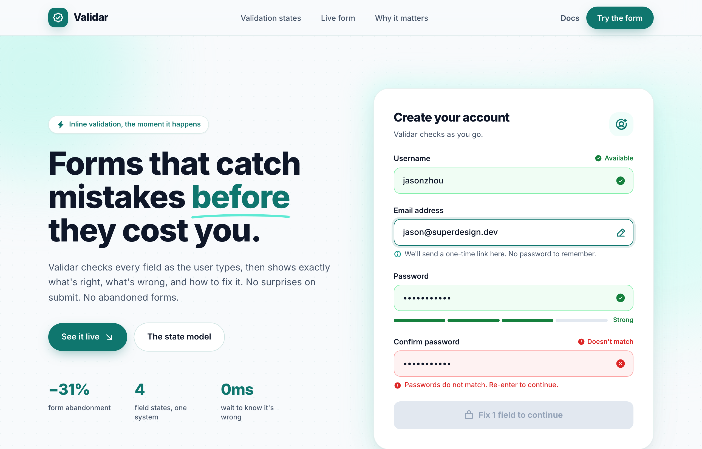

# Validar — Forms that catch mistakes before they cost you

A teal-on-paper SaaS landing page for an inline form-validation tool: a sticky glass nav, a split hero with a live account-creation card showing all four field states (idle, active, valid, error) at once, a four-up state-model band, a dark-teal 'submit unlocks itself' section, a benefit grid, and a footer. Color + icon + plain-words validation, Inter, soft layered shadows.



## Prompt

```text
{"summary": "A teal-on-paper SaaS landing page for an inline form-validation product (Validar). The whole page is built to teach and sell one idea: a form field is always in one of four explicit states (idle, active, valid, error), shown in color + icon + plain words. A sticky glass nav sits over a split hero (left copy + stat row, right a live account-creation card demonstrating all states at once), then a four-card state-model band, a full-bleed dark-teal 'submit unlocks itself' section with a completed all-valid card, a why-it-matters benefit grid, and a slim footer. Clean, confident, product-marketing register; rounded geometry, soft layered shadows, a hand-drawn underline accent.", "style": {"description": "Modern SaaS product-marketing aesthetic in a single teal accent over a near-white paper canvas, dark slate ink for text. Generous whitespace, large extrabold tracking-tight display headings (Inter), rounded-2xl/3xl cards with soft multi-layer shadows, a faint teal dot-grid grain texture, blurred teal radial glows behind cards, and semantic validation colors (green = valid, red = error) used consistently in fills, borders, icons and helper text. Friendly, precise, trustworthy.", "prompt": "Design a modern SaaS product-marketing page using a single teal accent system on a near-white paper background. Typeface: Inter (weights 400/500/600/700/800/900), antialiased, tracking-tight on headings. Palette — paper background #f8fafc; ink (primary text) #0f1729; slatey (secondary text) #475569; teal scale: teal-50 #f0fdfa, teal-100 #ccfbf1, teal-200 #99f6e4, teal-300 #5eead4, teal-400 #2dd4bf, teal-500 #14b8a6, teal-600 #0d9488, teal-700 #0f766e (primary brand), teal-800 #115e59 (hover), teal-900 #134e4a (dark band). Semantic states — valid: text/icon #15803d (good), fill #f0fdf4 (goodbg), border #86efac (goodln); error: text/icon #dc2626 (bad), fill #fef2f2 (badbg), border #fca5a5 (badln); neutral slate-100/slate-200 for idle bars. Use rounded geometry (rounded-full pills, rounded-xl inputs, rounded-2xl/1.75rem cards). Shadows: layered soft card shadow '0 1px 2px rgba(15,23,41,0.04), 0 12px 32px -12px rgba(15,23,41,0.12), 0 40px 80px -40px rgba(15,118,110,0.18)'; focus ring '0 0 0 4px rgba(15,118,110,0.12)'; teal button glow '0 8px 24px -8px rgba(15,118,110,0.55)'. Add a subtle teal dot-grid grain (radial-gradient dots, 22px tile, ~6% teal alpha) and large blurred teal radial glow blobs behind hero/demo cards. Hand-drawn teal SVG underline (#5eead4) under one emphasized word. Phosphor (ph:) bold icons throughout."}, "layout_and_structure": {"description": "Single-column scrolling page, content centered in a max-w-6xl container with px-6 gutters. Order: sticky nav, split hero (copy + live form card), four-up state-model band, full-bleed dark-teal demo section with completed card, why-it-matters two-column benefit grid, slim footer. Hero and demo use a two-column (lg) grid that stacks on mobile; the state cards reflow 1→2→4 columns.", "prompts": [{"part": "Sticky nav", "prompt": "A 64px-tall sticky top header with bottom hairline border (teal-700 at ~10% alpha) and a translucent paper background with backdrop-blur-xl. Inside a max-w-6xl row: left, a brand lockup = a 36px teal-700 rounded-xl tile with a white ph:seal-check-bold icon and softbtn glow, plus 'Validar' in 19px extrabold tracking-tight; center (md+ only), three slatey 14px medium nav links ('Validation states', 'Live form', 'Why it matters') that turn teal-700 on hover; right, a 'Docs' text link (sm+) and a teal-700 rounded-full pill CTA 'Try the form' with the softbtn glow, hover teal-800."}, {"part": "Hero (split)", "prompt": "A full-bleed hero with the dot-grid grain and two blurred teal radial glow blobs, bottom hairline border. Inside max-w-6xl, a lg two-column grid (1.05fr / 1fr) that stacks on mobile. LEFT column: a white rounded-full eyebrow pill with a ph:lightning-fill icon and teal-700 text 'Inline validation, the moment it happens'; a huge extrabold tracking-tight headline (40px mobile → 58px desktop, leading 1.05) reading 'Forms that catch mistakes before they cost you' where 'before' is teal-700 with a hand-drawn teal-300 SVG underline; a 17px slatey subhead; a button row with a primary teal-700 rounded-full CTA 'See it live' (ph:arrow-down-right-bold) and a white outline rounded-full secondary 'The state model'; then a 3-column stat row (<dl>) with extrabold 28px teal-700 figures '−31% / 4 / 0ms' over 12.5px slatey labels ('form abandonment', 'field states, one system', 'wait to know it's wrong'). RIGHT column: the live form card (see special components)."}, {"part": "State-model band", "prompt": "A white full-bleed section (id=states) with hairline borders. Centered intro: a 13px bold uppercase tracking-[0.2em] teal-700 eyebrow 'ONE SYSTEM, FOUR STATES', a 32→40px extrabold heading 'Every field is always in a state', a 16px slatey lede. Below, a responsive grid (1 → md:2 → lg:4) of four state cards, each rounded-2xl p-6 with an 11px rounded-xl icon tile, a 16px bold title, a 13.5px slatey description, and a thin 1.5px state-colored progress bar at the bottom: Idle (slate, ph:circle-dashed-bold, slate-200 bar), Active (teal border + teal-50/50 fill + focus ring, ph:cursor-text-bold, teal-300 bar), Valid (goodln border + goodbg fill + green-100 tile, ph:check-circle-fill, #86efac bar), Error (badln border + badbg fill + red-100 tile, ph:warning-circle-fill, #fca5a5 bar)."}, {"part": "Dark-teal demo band", "prompt": "A full-bleed teal-900 (#134e4a) white-text section (id=demo) with grain at 40% opacity and two blurred teal-500/teal-600 glow blobs. max-w-6xl lg two-column grid. LEFT: a white/10 ring-1 ring-white/20 pill 'The submit unlocks itself' (ph:cursor-click-bold), a 34→44px extrabold heading 'When every field is valid, the button comes alive.', a teal-100 subhead, and a 3-item checklist (ph:check-circle-fill teal-300 bullets) about disabled vs enabled state semantics. RIGHT: a completed all-valid white card (see special components)."}, {"part": "Why-it-matters grid", "prompt": "A paper full-bleed section (id=why) with hairline border. lg two-column grid (0.9fr / 1.1fr), vertically centered. LEFT: teal-700 uppercase eyebrow 'WHY INLINE', a 30→38px extrabold heading 'The error a user sees at the field is the error they fix.', a 16px slatey paragraph, and a teal-700 rounded-full CTA 'Build your first form' (ph:arrow-right-bold). RIGHT: a 2x2 grid of white rounded-2xl benefit cards, each with a 26px teal-700 ph: icon, 16px bold title, 13.5px slatey copy — 'Read at a glance' (ph:eye-bold), 'Words, not codes' (ph:text-aa-bold), 'Accessible by default' (ph:wheelchair-bold), 'Zero-latency feel' (ph:gauge-bold)."}, {"part": "Footer", "prompt": "A white footer, max-w-6xl, flex row (stacks on mobile) with py-10: left the small brand lockup (32px teal-700 rounded-lg tile + ph:seal-check-bold + 'Validar' 16px extrabold), center a 13px slatey tagline 'Forms that tell the truth, field by field.', right three slatey 20px social icons (ph:github-logo-bold, ph:x-logo-bold, ph:book-open-bold) that turn teal-700 on hover."}]}, "special_ui_components": [{"name": "Four-state validated input", "prompt": "The core reusable component: a labeled text input that renders one of four states, each carried by color + a trailing ph: icon + (where relevant) a one-line helper. Base input is rounded-xl with a 1.5px border, px-4 py-3, 15px medium ink text, pr-11 to clear the trailing icon, and an 18s ease transition on border/shadow/background. VALID: goodln (#86efac) border on goodbg (#f0fdf4) fill, a 'Available' label badge (good text + ph:check-circle-fill) and a trailing good ph:check-circle-fill. ACTIVE/FOCUS: solid teal-700 border on white with the 4px teal focus ring (shadow-field) and a trailing teal-700 ph:pencil-simple-line-bold, plus a neutral helper line (ph:info-bold teal-600) 'We'll send a one-time link here.' ERROR: badln (#fca5a5) border on badbg (#fef2f2) fill, a 'Doesn't match' badge (bad text + ph:warning-circle-fill), a trailing bad ph:x-circle-fill, and a bad helper line restating the fix in plain words ('Passwords do not match. Re-enter to continue.')."}, {"name": "Password strength meter", "prompt": "Under a password input, a row with four equal-width 1.5px-tall rounded-full segments and a trailing 11.5px label. Filled segments use the good color (#15803d), the unfilled tail uses slate-200; label reads 'Strong' in good. Communicates strength purely by filled-segment count + color + word."}, {"name": "State-aware submit button", "prompt": "A full-width rounded-xl submit that mirrors form validity. DISABLED state: slate-200 background, slate-400 bold text, cursor-not-allowed, a ph:lock-simple-bold icon and a literal count message 'Fix 1 field to continue' — reads as 'not yet', never 'broken'. ENABLED state: full teal-700 fill, white bold text, softbtn glow, a ph:paper-plane-tilt-fill icon, label 'Create account', hover teal-800, plus a subtle animated sheen ('ribbon' — a moving white-translucent linear-gradient overlay). A 12px slatey caption underneath explains why it's enabled ('Enabled because every field passed validation.')."}, {"name": "Live demo form cards", "prompt": "Two elevated white cards (rounded-1.75rem, p-7→p-9, layered card shadow, sitting over a blurred teal glow). Card A (hero): header 'Create your account' + 'Validar checks as you go.' with a teal-50 rounded-2xl ph:user-circle-plus-bold tile; body shows all four field states at once and ends in the disabled submit. Card B (demo band): header 'All clear / 3 of 3 fields valid' with a teal-50 ph:shield-check-bold tile; body is three compact read-only valid rows (goodln border, goodbg fill, trailing check) and ends in the enabled 'Create account' button."}, {"name": "Eyebrow pill + hand-drawn underline", "prompt": "Reusable section eyebrows in two flavors: a rounded-full bordered white pill with a leading ph: icon and teal-700 12.5px semibold text (hero/demo), and a bare 13px bold uppercase tracking-[0.2em] teal-700 label (state/why bands). One headline word ('before') gets a hand-drawn teal-300 (#5eead4) SVG underline stroke offset just below the baseline."}], "special_notes": "Accessibility is the design thesis: state is never carried by color alone — every state pairs a hue with a matching ph: icon and a plain-language word/helper, and the submit button states are spelled out ('Fix 1 field to continue' vs 'Create account'). Keep the palette monochromatic-teal + neutral, and reserve green/red strictly for valid/error semantics. Reuse the four-state input as the single source of truth; the page narrative (hero card → state cards → demo card) is just that one component shown at different points in its lifecycle. Icons are Phosphor bold (ph:*); body/display font is Inter throughout."}
```

**▶ Try it live → [https://superdesign.dev/library/validar-forms-that-catch-mistakes-before-they-cost-you](https://superdesign.dev/library/validar-forms-that-catch-mistakes-before-they-cost-you?utm_source=github&utm_medium=prompt-repo&utm_campaign=prompt-library)**

**Use it in your coding agent:** install the [Superdesign skill](https://github.com/superdesigndev/superdesign-skill), then:

```bash
superdesign get-prompts --slugs "validar-forms-that-catch-mistakes-before-they-cost-you" --json
```

*0 copies · 2,401 tries · Forms & Contact · SaaS · form, validation, saas, landing-page*
