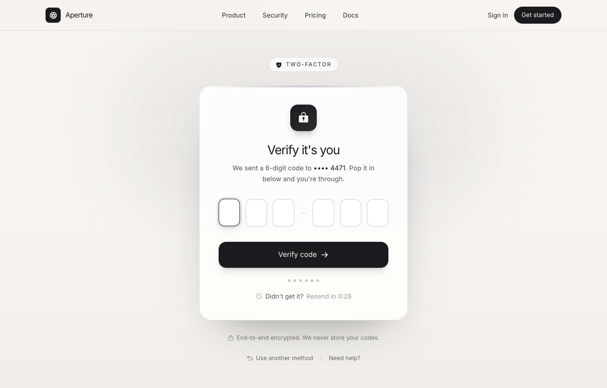

# Verify it's you · Aperture (OTP / 2FA, graphite-platinum)

OTP / two-factor verification screen on warm paper with a graphite + platinum palette: a Two-factor eyebrow pill, a glass card with a lock icon, six single-digit code boxes, progress dots, a live resend countdown and a Verify code button. Inter, light mode, no saturated color.



## Prompt

```text
{"summary": "A full-bleed OTP / two-factor verification screen for a fictional product, 'Aperture', on a warm off-white 'paper' canvas. A sticky translucent nav spans the top, a single centered glass card holds the whole verify-code flow, and a minimal footer closes the page. The card is framed by a 'Two-factor' eyebrow pill above and an end-to-end-encryption reassurance line below; inside, a graphite lock icon, a 'Verify it's you' title, a masked-destination subtitle, a row of six single-digit OTP inputs (split 3 + 3 by a small platinum dash), a full-width graphite 'Verify code' button, a row of six platinum progress dots that fill graphite as digits are entered, and a count-down 'Resend' control. The whole thing sits over a calm ambient backdrop: a soft platinum glow blob top-center over a paper-to-paper2 vertical gradient, plus a faint grain veil.", "style": {"description": "Calm, premium, light-mode security UI built on a graphite + platinum + warm-paper system, with zero saturated color. Canvas is a warm off-white 'paper' (#f6f5f2) deepening to 'paper2' (#efeee9); near-black 'ink' graphite (#1c1c1e) carries text, the lock icon, the primary button and focus states; a cool 'platinum' grey (#c7c7cc, dim #9a9aa0) is the only secondary accent, used for the card accent rail, the OTP separator dash, the progress dots and muted icons. Surfaces are subtle translucent white glass (white at ~85% over paper) with hairline ink/10 borders and very soft, deep, low-opacity shadows. Inter throughout (400-800) with tight tracking on the heading and OpenType features (ss01/cv11/cv05) on. Generous rounded corners (card ~26px, button ~16px, OTP inputs ~12px), an inner-gloss top sheen on the card, and a graphite focus ring on the inputs give it a high-end, trustworthy, almost stationery-like feel.", "prompt": "Design a calm, premium light-mode security/auth aesthetic with NO saturated color. Background: warm off-white 'paper' #f6f5f2 deepening to 'paper2' #efeee9 (use a vertical gradient from-paper via-paper to-paper2). Build an ambient backdrop layer (pointer-events-none, absolute inset-0, -z-10): the paper gradient + a large soft platinum glow blob (h ~420px, w ~820px, bg platinum at ~25% alpha, blur-3xl) top-center; add a faint two-spot 'grain' veil via radial-gradients of ink at 4-5% alpha. Text & primary surfaces in near-black graphite 'ink': ink-900 #1c1c1e, ink-800 #222224, ink-700 #2c2c2e, ink-600 #3a3a3c. The ONLY secondary accent is a cool platinum grey: platinum #c7c7cc, platinum-soft #d6d6db, platinum-dim #9a9aa0 (used for the card top accent rail, the OTP separator dash, progress dots and muted icons). Surfaces are glass: bg white at 70-85% alpha, 1px ink/10 border, big radius (~26px on the card), and a very soft deep shadow (e.g. shadow 0 40px 90px -50px rgba(28,28,30,0.55)) plus a top inner sheen (a 1px hairline gradient transparent->ink/12->transparent) and a platinum accent rail across the very top. Font: 'Inter' everywhere (400/500/600/700/800), tightest tracking (-0.04em) on the h1, font-feature-settings 'ss01','cv11','cv05', antialiased, smooth scroll. Interaction states: OTP input focus = ink border + 4px ink/8 ring + a soft drop shadow + a 1px translateY lift; filled input = ink-700 border + solid white bg; primary button hover = 1px lift + a deep ink-tinted shadow. Keep it minimal, high-contrast-on-light, and reassuring: one graphite, one platinum, lots of breathing room, soft shadows."}, "layout_and_structure": {"description": "A single full-height page centered on one narrow auth column (max-width ~440px). A sticky translucent top nav and a full-bleed paper2 footer bracket a min-h-screen hero/auth main that vertically and horizontally centers the card over the ambient backdrop. Above the card sits an eyebrow 'Two-factor' pill; the card itself stacks the verify flow top to bottom (lock icon -> title -> subtitle -> six OTP inputs -> Verify button -> progress dots -> resend); below it sit an encryption reassurance line and a two-link helper row.", "prompts": [{"part": "Sticky nav", "prompt": "Sticky top nav (top-0, z-50), full width, bg paper at 80% alpha with backdrop-blur-xl, 1px bottom border ink-900/10. Inner row: mx-auto max-w-6xl, px-6 lg:px-8, flex h-16 items-center justify-between. Left = logo lockup: an 8x8 rounded-lg graphite (bg ink-900) tile holding a paper-colored 'ph:aperture-bold' glyph + an 'Aperture' wordmark (Inter 700, ~15px, tightest tracking). Center (md+ only) = a gap-9 row of nav links 'Product' / 'Security' / 'Pricing' / 'Docs' (13.5px, Inter 500, ink-700) each with an animated underline that grows from the left on hover. Right = a 'Sign in' ghost link (sm+ only) + a 'Get started' pill button (rounded-full, bg ink-900, paper text, 13px semibold, hover bg ink-700)."}, {"part": "Hero / auth main", "prompt": "main is relative. Behind it an ambient backdrop (pointer-events-none, absolute inset-0, -z-10, overflow-hidden): a vertical paper->paper2 gradient + a top-center soft platinum glow blob (~420px tall, ~820px wide, platinum at 25% alpha, blur-3xl, translateX -50%). The section is mx-auto max-w-6xl, flex, min-h-[calc(100vh-4rem)], items-center justify-center, px-6 py-14 lg:px-8. The content is one centered column, w-full, max-w-[440px]. Apply a gentle staggered rise-in animation (opacity 0 + 14px translateY -> settle) to the eyebrow, card and footer rows with small animation delays."}, {"part": "Eyebrow + heading", "prompt": "Above the card, centered (mb-7): a small pill 'Two-factor' badge: inline-flex, rounded-full, 1px ink-900/10 border, bg white/70, px-3.5 py-1.5, 11.5px uppercase semibold, wide letter-spacing (~0.16em), ink-700 text, soft shadow, with a leading graphite 'ph:shield-check-fill' icon. The title and subtitle live INSIDE the card (see Verify card)."}, {"part": "Verify card", "prompt": "A glass card: relative, overflow-hidden, rounded-[26px], 1px ink-900/10 border, bg white/85, p-8 sm:p-10, a big soft shadow (0 40px 90px -50px rgba(28,28,30,0.55)), backdrop-blur-sm. Decorations: a top platinum accent rail (absolute inset-x-0 top-0, h-[3px], gradient transparent->platinum->transparent) and just under it a 1px inner sheen hairline (gradient transparent->ink/12->transparent). Contents, top to bottom: (1) a centered 14x14 rounded-2xl graphite icon tile (gradient ink-900->ink-700, paper-colored 'ph:lock-key-fill' ~26px, soft ink shadow); (2) an h1 'Verify it's you' (Inter 800, ~26px, leading-tight, tightest tracking, ink-900, centered); (3) a subtitle (centered, max-w ~19rem, 14px, ink-700/80): 'We sent a 6-digit code to <strong>•••• 4471</strong>. Pop it in below and you're through.'; (4) the OTP row (see OTP inputs); (5) the primary Verify button (see below); (6) the progress dots (see below); (7) the resend row (see below)."}, {"part": "OTP inputs", "prompt": "A horizontally centered group (role=group, aria-label 'One-time passcode'), flex items-center justify-center gap-2.5 sm:gap-3, mt-8. Six single-digit inputs: each is an h-[58px] w-[44px] sm:w-[50px] rounded-xl input, 1px ink-900/20 border, bg white/70, center-aligned, 22px Inter 700 ink-900, inputmode=numeric, maxlength 1, with an inset 1px white top highlight. Between the 3rd and 4th input place a small platinum separator: a tiny mx-0.5 h-px w-3 platinum bar. Focus state: ink border + 4px ink/8 ring + a soft drop shadow + a 1px upward lift. Filled state ('.filled'): ink-700 border + solid white bg. First input autofocuses."}, {"part": "Verify button + progress dots + resend", "prompt": "(a) PRIMARY button, mt-8, full-width, rounded-2xl, bg ink-900, paper text, py-4, 15px semibold, soft ink/15 shadow, with a trailing 'ph:arrow-right-bold' icon; label 'Verify code'; hover = 1px lift + deeper ink-tinted shadow. (b) Progress dots: mt-6, a centered gap-1.5 row of six 1.5x1.5 rounded-full dots, default bg platinum, each turning bg ink-900 as its corresponding OTP digit is filled. (c) Resend row: mt-5, centered gap-1.5, 13.5px ink-700/80, a leading platinum-dim 'ph:clock-countdown' icon + \"Didn't get it?\" + a 'Resend' button (semibold ink-900, hover underline) showing a live countdown 'Resend in 0:30' that, on reaching zero, becomes an enabled 'Resend code'; disabled state is platinum-dim, no underline."}, {"part": "Reassurance + helper links + footer", "prompt": "Below the card: (1) mt-7, a centered gap-1.5 reassurance line, 12.5px ink-700/60, with a leading 'ph:lock-simple' icon: 'End-to-end encrypted. We never store your codes.'; (2) mt-6, a centered gap-4 helper row, 12.5px ink-700/70: a 'Use another method' link (leading 'ph:arrow-u-up-left' icon, animated underline) + a thin vertical ink/15 divider + a 'Need help?' link. (3) A full-bleed footer: 1px top border ink-900/10, bg paper2/60; inner mx-auto max-w-6xl, px-6 py-7 lg:px-8, flex-col on mobile -> sm:flex-row, items-center justify-between, gap-4: left = a graphite 'ph:aperture-bold' icon + '© 2026 Aperture Labs' (12.5px ink-700/70); right = a gap-6 row of 'Privacy' / 'Terms' / 'Status' text links (each with the animated underline)."}]}, "special_ui_components": ["Six-box OTP / one-time-passcode input row, split 3 + 3 by a small platinum dash, with per-box focus (ink border + 4px ink ring + lift) and filled states, plus full keyboard + paste handling (auto-advance, backspace-to-previous, paste distributes 6 digits).", "Progress dots tied to the OTP: six platinum dots that fill graphite one-by-one as each digit is entered, mirroring code completion.", "Live resend countdown: a 'Resend in 0:30' control that ticks down and flips to an enabled 'Resend code' at zero (disabled = platinum-dim, no underline).", "Two-factor eyebrow pill: a small white/70 rounded-full badge with a shield-check icon and wide uppercase 'Two-factor' label, sitting above the card.", "Graphite icon tile: a 14x14 rounded-2xl ink-gradient tile holding a paper-colored lock-key glyph, anchoring the card.", "Glass verify card with a top platinum accent rail + inner sheen hairline and a big soft drop shadow.", "Encryption reassurance line: a lock-icon strip ('End-to-end encrypted. We never store your codes.') framing the card with trust.", "Calm ambient backdrop: a top-center platinum glow blob over a paper->paper2 gradient plus a faint two-spot grain veil.", "Translucent sticky nav with backdrop blur, an ink logo tile, hover-underline links and a graphite 'Get started' pill.", "Staggered rise-in entrance animation on the eyebrow, card and footer rows."], "special_notes": "Color tokens (exact): ink-900 #1c1c1e, ink-800 #222224, ink-700 #2c2c2e, ink-600 #3a3a3c; platinum DEFAULT #c7c7cc, platinum-soft #d6d6db, platinum-dim #9a9aa0; paper #f6f5f2, paper2 #efeee9. Two-tone system: graphite (ink) for text/CTA/focus, platinum as the ONLY secondary accent (rail, OTP dash, dots, muted icons) — NO saturated color anywhere. Font: 'Inter' everywhere (weights 400/500/600/700/800) via Google Fonts, with font-feature-settings 'ss01','cv11','cv05' and a custom letterSpacing 'tightest' = -0.04em. Built on Tailwind (CDN) with a custom theme (ink/platinum/paper scales) and a small CSS layer for the .otp input states (focus = ink border + 4px ink/8 ring + lift, .filled state), the .verify-btn hover lift, the .hairline sheen, the .nav-link grow-from-left underline, the .grain veil and a @keyframes floatUp 'rise' entrance. Icons via Iconify (phosphor 'ph:*' set: aperture-bold, shield-check-fill, lock-key-fill, arrow-right-bold, clock-countdown, lock-simple, arrow-u-up-left). OTP JS handles auto-advance, backspace, numeric-only (blocks 'e'), paste-to-fill, dot syncing and a 30s resend countdown. The masked destination ('•••• 4471'), the 'Aperture' brand and the copy are illustrative placeholders. Fully responsive: the narrow 440px card recenters on all widths; OTP boxes widen 44px->50px at sm; nav center links hide below md and 'Sign in' hides below sm; the footer row stacks on mobile. Light mode, antialiased, smooth scroll."}
```

**▶ Try it live → [https://superdesign.dev/library/verify-its-you-aperture-otp-2fa-graphite-platinum](https://superdesign.dev/library/verify-its-you-aperture-otp-2fa-graphite-platinum?utm_source=github&utm_medium=prompt-repo&utm_campaign=prompt-library)**

**Use it in your coding agent:** install the [Superdesign skill](https://github.com/superdesigndev/superdesign-skill), then:

```bash
superdesign get-prompts --slugs "verify-its-you-aperture-otp-2fa-graphite-platinum" --json
```

*4 copies · 2,176 tries · Auth & Login · SaaS · login, otp, 2fa, two-factor*
