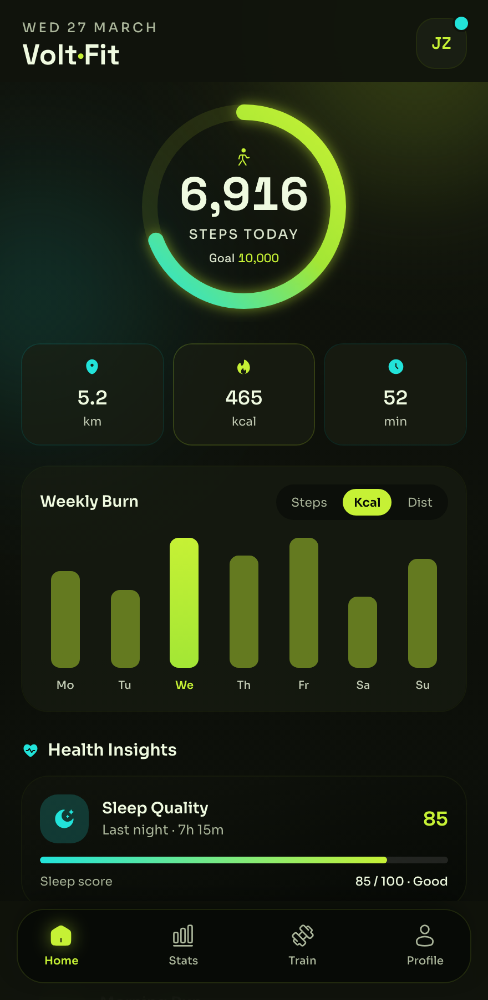

# Volt — Electric-Lime Fitness Dashboard

An electric-lime fitness/health dashboard on near-black: a big animated step-progress ring, stat chips, a weekly-activity bar chart, health insights, a workouts list, a challenge card, and an achievements grid with a bottom nav.



## Prompt

```text
{
  "summary": "A high-energy fitness / health tracker home dashboard on a near-black charcoal base with an ELECTRIC-LIME accent: a large animated circular step-progress ring (steps vs goal), a row of stat chips (distance / calories / minutes), a weekly-activity bar chart with a Steps/Cal/Dist toggle, a health-insights (sleep) card, a 'Today's Workouts' list, a weekly-challenge card with progress, an achievements grid (locked + unlocked), and a bottom tab nav. Sporty, high-contrast, decidedly NOT warm-orange.",
  "style": {
    "description": "Electric sport: near-black charcoal with electric-lime primary + cyan secondary; high-energy, high-contrast.",
    "prompt": "Near-black charcoal base (ink #070A06 / #10130C / #191E13) with ELECTRIC LIME #C6F135 (#A3E635) as the high-energy primary accent (ring, active bar, CTA, active nav) and cyan #22E3DA as secondary; ice text #EFFAE0, plus a brighter grey label token (#C4CDB6) for small labels so they clear 4.5:1. Subtle ambient lime/cyan glow blobs. Fonts: Space Grotesk (display + tabular numerals) + Sora (body). NO warm orange, NO indigo/violet/blue."
  },
  "layout_and_structure": {
    "description": "Single mobile dashboard, vertical: status bar, header, step ring, stat chips, weekly chart, insights card, workouts list, challenge card, achievements grid, bottom nav.",
    "prompts": [
      {"part": "Header", "prompt": "Status bar; a date eyebrow + bold app/user name on the left, a circular avatar on the right."},
      {"part": "Step ring (hero)", "prompt": "A large circular progress ring (lime gradient on a dark track) with the big step count centered, a 'STEPS TODAY' label, and a 'Goal 10,000' sub-label."},
      {"part": "Stat chips", "prompt": "A 3-up row of bordered stat chips: distance (km), calories (kcal), active minutes — each with a small cyan/lime icon + value + unit."},
      {"part": "Weekly chart", "prompt": "A 'Weekly Burn' card with a Steps/Cal/Dist segmented toggle and a 7-bar weekday chart; the current day's bar is bright lime, the rest a readable olive."},
      {"part": "Health insights", "prompt": "A 'Health Insights' sleep-quality card with a score + a thin progress bar."},
      {"part": "Workouts list", "prompt": "A 'Today's Workouts' list: rows with an icon tile, title, duration/calories, chevron; plus an 'Add Workout' row."},
      {"part": "Challenge card", "prompt": "A 'Weekly Challenge' card with a '3 days left' pill, a progress bar (e.g. 3/5), and a lime 'View Challenge' button."},
      {"part": "Achievements + nav", "prompt": "A 3-column achievements grid (unlocked = lime/cyan glyph, locked = dimmed with a lock); a bottom tab bar (Home active in lime, Stats, Train, Profile)."}
    ]
  },
  "special_ui_components": [
    {"component": "Lime progress ring", "description": "The hero metric.", "prompt": "A circular SVG progress ring with a lime gradient stroke on a dark track, big numeral + labels centered."},
    {"component": "Segmented chart toggle", "description": "Metric switch.", "prompt": "A small segmented control (Steps/Cal/Dist) above a weekday bar chart; active segment is a lime pill."}
  ],
  "special_notes": "Keep small labels ≥4.5:1 on the dark base (the glow lifts the local bg). Lime is the energy accent, cyan secondary; never warm orange or slop-purple. Real mobile proportions; reflow at 360/768."
}
```

**▶ [Try it live →](https://p.superdesign.dev/draft/f5e210d4-dea0-4eed-8598-773d56fae06e)**

**Use it in your coding agent:** install the [Superdesign skill](https://github.com/superdesigndev/superdesign-skill), then:

```bash
superdesign get-prompts --slugs "volt-electric-lime-fitness-dashboard-a7544c" --json
```

*5 copies · 2,343 tries · Dashboards · Health & Wellness · mobile app, fitness, health, dashboard*
