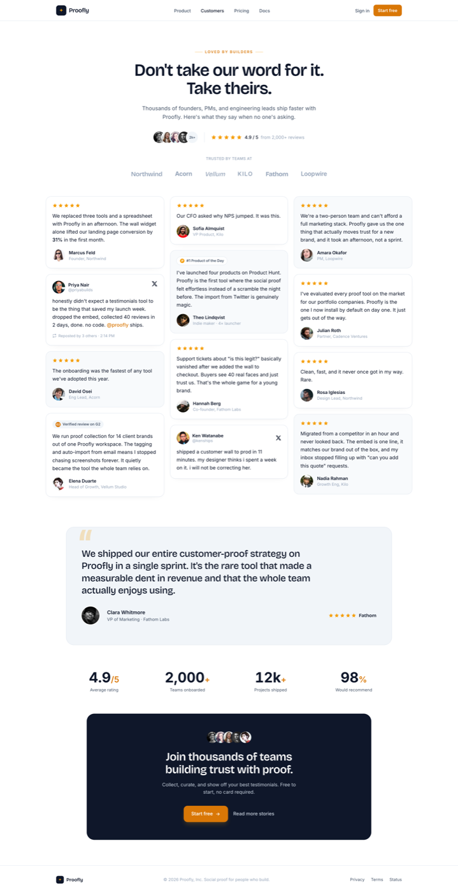

# Wall of Love Testimonial Section (Amber Star Masonry)

A clean modern-SaaS "wall of love" testimonial / social-proof section on a crisp white cool-neutral canvas with ONE warm amber accent (no gradient). A characterful Bricolage Grotesque display headline ("Don't take our word for it. Take theirs.") sits over a rating summary cluster (stacked avatars + five amber stars + "4.9 / 5 from 2,000+ reviews") and a monochrome logo trust strip; the centerpiece is a responsive MASONRY wall of quote cards of varying height that mixes plain star cards, soft-tinted cards, native X / tweet cards, and review-source badge cards (G2 "Verified review", Product Hunt "#1 Product of the Day"), each with a real avatar + name + role. A full-width SPOTLIGHT quote (an oversized quotation-mark glyph + a big Bricolage quote + a large avatar), a four-up stat band, and a dark ink closing CTA finish it. Amber lives only in the star glyphs, source badges, CTA, and stat units; everything structural stays cool slate-neutral. Reusable for any SaaS, indie, or agency site that wants a credible, remixable social-proof section with real faces, star ratings, and source badges.



## Prompt

```text
{
  "summary": "A clean modern-SaaS 'WALL OF LOVE' TESTIMONIAL / social-proof SECTION for a desktop marketing page, built so a SINGLE warm amber accent (#f59e0b fill / #d97706 deep) is the entire chroma against a crisp white ground (#ffffff), cool wash sections (#f8fafc / #f1f5f9), slate ink (#0f172a), body slate (#475569), muted (#94a3b8) and a #e2e8f0 hairline. Type is two faces carrying hierarchy from FAMILY CONTRAST + size + weight: a characterful DISPLAY GROTESK (Bricolage Grotesque) for the section headline and the spotlight quote (the anti-slop taste signal, NOT Inter-only), and a grotesk sans (Inter) for quote text, names, roles, badges and buttons. STRUCTURE top to bottom: (1) a slim STICKY top nav (white/85 + backdrop-blur, hairline bottom): a dark amber-marked 'Proofly' wordmark left, center links (Product, Customers, Pricing, Docs), a 'Sign in' link + a small amber #d97706 'Start free' pill right. (2) a centered HEADER block: a small amber uppercase eyebrow flanked by short rules ('LOVED BY BUILDERS'), a big Bricolage headline on 2 lines ('Don''t take our word for it. Take theirs.') at ~54px / 600 / tight tracking in slate #0f172a, a muted subhead (~17px, max ~36rem), and a RATING CLUSTER (a -space-x row of 4 avatar chips + a '2k+' chip, a vertical divider, five amber stars, '4.9 / 5', 'from 2,000+ reviews'). (3) a 'TRUSTED BY TEAMS AT' monochrome LOGO STRIP of 6 wordmarks in mixed weights/styles at slate-400. (4) THE WALL: a responsive MASONRY (columns-1 md:columns-2 lg:columns-3, gap-5, each card break-inside-avoid mb-5) of 12 quote cards of VARYING height and length, in mixed treatments so no two read alike: (a) plain white star cards (a row of five 16px amber stars, then the quote in slate ink #0f172a ~15.5px/1.62, then an avatar + bold name + muted role/company), some long, some a single line; (b) soft #f8fafc-tinted ring cards (same anatomy, no drop shadow); (c) native X / TWEET cards (avatar + name + @handle + a black X bird glyph top-right, a lowercase conversational quote, and a small 'Reposted by 3 others - 2:14 PM' meta with a repost glyph); (d) a G2 badge card (a pill: an amber 'G2' disc + 'Verified review on G2') ; (e) a Product Hunt badge card (a pill: an amber PH disc + '#1 Product of the Day'). Cards carry a subtle two-layer shadow (0 1px 2px + 0 8px 24px -16px slate) on white, none on tinted. (5) a full-width SPOTLIGHT band: a rounded-3xl #f1f5f9 ring card with a faint OVERSIZED amber quotation-mark glyph top-left, a big Bricolage 30px/500 quote, and a footer row (a 56px avatar + 'Clara Whitmore' / 'VP of Marketing - Fathom Labs' + five amber stars + a 'Fathom' wordmark). (6) a four-up STAT BAND (grid-cols-2 lg:grid-cols-4): big bold tabular ink numerals with an amber unit ('4.9/5' Average rating, '2,000+' Teams onboarded, '12k+' Projects shipped, '98%' Would recommend). (7) a dark ink #0f172a CLOSING CTA card: a row of stacked avatars, a white Bricolage 'Join thousands of teams building trust with proof.', a muted line, an amber 'Start free' button (arrow) + a 'Read more stories' text link. (8) a slim footer. The ONLY saturated color is amber, in the star glyphs, the source badges, the 'Start free' pills/button, and the stat units; every other element is slate ink, body slate, muted, hairline, white, or a cool wash. No gradient, no second hue, no glow. Real human avatars throughout (a wall of love needs real faces). Fully responsive: the masonry steps 3 -> 2 -> 1 column, the nav collapses its center links, the rating cluster and stat band + logo strip wrap, no horizontal overflow at 390px.",
  "style": {
    "description": "A clean, confident modern-SaaS aesthetic for a social-proof surface - the opposite of a busy or default-indigo testimonials block. A crisp WHITE #ffffff ground with cool wash sections (#f8fafc / #f1f5f9) carries slate ink #0f172a, body slate #475569, muted #94a3b8 and a #e2e8f0 hairline. The single saturated element is a warm AMBER accent (#f59e0b fill / #d97706 deep), held to exactly the places social proof lives: the five-star glyphs, the review-source badges (G2 / Product Hunt), the 'Start free' pills + button, and the stat units. Everything else is strictly cool-neutral, so the warm gold reads as 'ratings' and never as decoration. Type is two faces where hierarchy comes from FAMILY CONTRAST, size and weight rather than color: a characterful DISPLAY GROTESK (Bricolage Grotesque) for the section headline and the spotlight quote is the deliberate taste move (a real designer reaches for a display grotesk; an AI defaults to Inter-only), with a grotesk sans (Inter) for quote body, names, roles, badges and buttons. The shape language is soft and modern: rounded-2xl cards with a hairline ring and a restrained two-layer shadow on white (none on tinted cards), rounded-full real-photo avatars, and small pill badges. The signature is the WALL itself: a masonry of varying-height cards in mixed treatments (plain star / tinted / native tweet / G2 / Product Hunt) so the grid reads as a real, heterogeneous stream of proof rather than a uniform template, anchored by one oversized spotlight quote. No gradient anywhere, no second accent hue, no glow - clean, credible, warm-but-restrained, conversion-first.",
    "prompt": "Design a clean modern-SaaS 'WALL OF LOVE' testimonial / social-proof SECTION for a desktop marketing page on a crisp WHITE #ffffff ground with cool wash sections (#f8fafc / #f1f5f9), making ONE warm AMBER accent (#f59e0b fill / #d97706 deep) the entire chroma against strictly cool-neutral slate (ink #0f172a, body #475569, muted #94a3b8, hairline #e2e8f0). Build a two-typeface system where hierarchy comes from FAMILY CONTRAST + size + weight: a characterful DISPLAY GROTESK (Bricolage Grotesque) for the section headline (~54px / 600 / tight tracking) and the spotlight quote (this display face is the anti-slop signal - do NOT set everything in Inter), and a grotesk sans (Inter) for the quote body, names, roles, badges and buttons. Confine the amber to exactly where social proof lives - the five-star glyphs, the review-source badges (G2 / Product Hunt), the 'Start free' pills + button, and the stat units - and keep every other element strictly cool-neutral. Make the centerpiece a responsive MASONRY of quote cards of VARYING height in MIXED treatments (plain white star cards with a two-layer shadow, soft #f8fafc-tinted ring cards with none, native X / tweet cards with @handle + a black X bird + a 'reposted' meta, a G2 'Verified review' badge card, a Product Hunt '#1 Product of the Day' badge card) so it reads as a real heterogeneous stream of proof, each card carrying a rounded-full real-photo avatar + a bold name + a muted role/company. Anchor the wall with a rating summary cluster (stacked avatars + five amber stars + '4.9 / 5 from 2,000+ reviews'), a monochrome logo trust strip, one full-width SPOTLIGHT quote (an oversized faint amber quotation-mark + a big Bricolage quote + a large avatar), a four-up stat band, and a dark ink closing CTA. Use real human avatars throughout. NO gradient, NO second accent hue, NO glow - clean, credible, warm-but-restrained, conversion-first. Make it fully responsive: the masonry steps 3 -> 2 -> 1 column, the nav collapses, the rating cluster + stat band + logo strip wrap, no horizontal overflow at 390px.",
    "keywords": ["testimonial", "wall-of-love", "social-proof", "clean-saas", "amber", "star-rating", "masonry", "source-badges", "spotlight-quote", "bricolage-grotesque"]
  },
  "layout_and_structure": {
    "description": "A vertical scroll on white, centered and conversion-first: (1) a slim STICKY top nav (wordmark + center links + an amber 'Start free' pill); (2) a centered HEADER block (an amber uppercase eyebrow, a two-line Bricolage headline, a muted subhead, and a rating cluster of stacked avatars + five amber stars + '4.9 / 5 from 2,000+ reviews'); (3) a monochrome 'Trusted by teams at' LOGO STRIP; (4) THE WALL - a responsive MASONRY (3 cols desktop / 2 md / 1 mobile, each card break-inside-avoid) of 12 varying-height quote cards in mixed treatments (plain white star, soft-tinted, native tweet, G2 badge, Product Hunt badge), each with an avatar + name + role; (5) a full-width SPOTLIGHT quote band (an oversized amber quote-mark + a big Bricolage quote + a large avatar + role + five stars); (6) a four-up STAT BAND (big tabular ink numerals with amber units); (7) a dark ink CLOSING CTA (stacked avatars + a white Bricolage headline + an amber 'Start free' button + a 'Read more stories' link); (8) a slim footer. On a narrow viewport the nav center links hide, the masonry collapses to one column, the rating cluster stacks, the stat band goes 2-up, and the logo strip wraps.",
    "prompts": [
      {
        "part": "Sticky nav + header + rating cluster",
        "prompt": "Top the page with a slim STICKY nav (white/85 + backdrop-blur, hairline bottom border, h-16, max-w-6xl): a dark rounded-lg mark with a small amber sparkle + a Bricolage 'Proofly' wordmark left; center Inter 14px links (Product, Customers active in ink, Pricing, Docs) hidden below md; a 'Sign in' link + a small amber #d97706 'Start free' pill right. Below it, a centered HEADER (max-w-3xl): a small amber #d97706 uppercase eyebrow flanked by two short amber rules ('LOVED BY BUILDERS'), a Bricolage headline at 38->54px / 600 / line-height 1.06 / -0.02em tracking in slate #0f172a on two lines ('Don''t take our word for it. Take theirs.'), a muted subhead (~17px / 1.6 / max-w-xl), and a RATING CLUSTER: a -space-x-2.5 row of four rounded-full ring-2 ring-white avatars + a '2k+' chip, a vertical hairline divider (hidden on mobile), five 18px amber stars, a '4.9 / 5' in ink, and 'from 2,000+ reviews' in muted."
      },
      {
        "part": "Logo trust strip",
        "prompt": "Under the header, a centered 'TRUSTED BY TEAMS AT' uppercase muted label over a flex-wrap row of six wordmarks (Northwind, Acorn, Vellum, Kilo, Fathom, Loopwire) at slate-400, in DELIBERATELY MIXED type (some Bricolage some Inter, some bold, one italic, one uppercase tracked) so they read as distinct brands. Wraps to multiple rows on a narrow viewport."
      },
      {
        "part": "The wall - masonry of mixed quote cards",
        "prompt": "The centerpiece: a max-w-6xl MASONRY via CSS columns (columns-1 md:columns-2 lg:columns-3, gap-5), each card a figure with break-inside-avoid + mb-5, rounded-2xl, ring-1 ring-#e2e8f0, p-5, of VARYING height and quote length. Mix five treatments so no two read alike: (a) PLAIN WHITE STAR cards - a row of five 16px amber stars, a quote in slate ink #0f172a at 15.5px / line-height 1.62, then a figcaption (a 40px rounded-full avatar + a bold 14px name + a muted 12.5px role/company); write some long (3-4 lines) and some a single line for masonry rhythm; give white cards a two-layer shadow (0 1px 2px rgba(15,23,42,.04), 0 8px 24px -16px rgba(15,23,42,.12)). (b) SOFT-TINTED cards - same anatomy on a bg-#f8fafc fill with NO drop shadow. (c) NATIVE X / TWEET cards - a top row of avatar + name + a muted @handle and a black X bird glyph top-right, a lowercase conversational quote (one accented @mention in amber), and a small muted 'Reposted by 3 others - 2:14 PM' meta with a repost glyph; one tweet card omits the caption entirely and is just the quote. (d) a G2 badge card - a rounded-full pill (a small amber 'G2' disc + 'Verified review on G2') above the quote + figcaption. (e) a Product Hunt badge card - a pill (a small amber PH disc + '#1 Product of the Day') on a tinted card. Use real i.pravatar.cc avatars with varied img numbers; real-sounding names + roles (Founder, Eng Lead, VP Product, Indie maker, Partner, Growth Eng)."
      },
      {
        "part": "Spotlight quote band",
        "prompt": "Below the wall, a full-width SPOTLIGHT: a max-w-5xl rounded-3xl bg-#f1f5f9 ring-1 card, px-12 py-16, position-relative overflow-hidden. Place a faint OVERSIZED amber (25% opacity) quotation-mark glyph absolutely at the top-left, behind the text (pointer-events-none, select-none). Over it: a Bricolage blockquote at 24->30px / 500 / line-height 1.28 / -0.01em in slate ink, max-w-3xl. Then a footer row (flex, wraps on mobile): a 56px rounded-full ring-2 ring-white avatar, a bold 16px 'Clara Whitmore' + a 13.5px body 'VP of Marketing - Fathom Labs', and on the right five 16px amber stars + a Bricolage 'Fathom' wordmark."
      },
      {
        "part": "Stat band + dark closing CTA + footer",
        "prompt": "A four-up STAT BAND (max-w-5xl, grid-cols-2 lg:grid-cols-4, centered): each cell a big bold tabular-nums ink numeral at ~44px with an amber #d97706 unit (4.9/5 'Average rating', 2,000+ 'Teams onboarded', 12k+ 'Projects shipped', 98% 'Would recommend') over a 13px body label. Then a dark ink #0f172a CLOSING CTA (max-w-4xl, rounded-3xl, px-12 py-14, centered): a -space-x row of five stacked avatars ring-2 ring-ink, a white Bricolage headline at 28->36px ('Join thousands of teams building trust with proof.'), a slate-300 subline, and a button row: an amber #d97706 'Start free' pill (white text + an arrow glyph, a soft amber shadow) + a slate-300 'Read more stories' text link. Close with a slim hairline-top footer: the mark + wordmark, a muted copyright, and Privacy / Terms / Status links."
      },
      {
        "part": "Responsive + build constraints",
        "prompt": "Pure CSS + inline SVG, NO JavaScript (freeze-safe + template-faithful). Every star / badge / X bird is an inline SVG with a viewBox. No h-screen / overflow-hidden app-shell wrapper - the page grows to natural height. Fully responsive at mobile 390px and desktop 1440px with no horizontal overflow: the masonry steps columns-3 -> columns-2 -> columns-1 with break-inside-avoid, the nav center links hide below md, the rating cluster stacks, the stat band goes 2-up, and the logo strip wraps. Use fluid max-widths (max-w-6xl / 5xl / 4xl / 3xl mx-auto with sm:px padding), never fixed px widths on top-level containers."
      }
    ]
  },
  "special_ui_components": [
    {
      "component": "Mixed-treatment quote-card masonry (the wall)",
      "description": "The signature move - a masonry of varying-height cards in five treatments so the grid reads as a real heterogeneous stream of proof, not a uniform template.",
      "prompt": "Lay quote cards into a CSS-columns masonry (columns-1 md:columns-2 lg:columns-3, gap-5), each card break-inside-avoid + mb-5, rounded-2xl ring-1 ring-hairline p-5. Author FIVE card treatments and interleave them: a plain white star card (five amber stars + ink quote + avatar/name/role, two-layer soft shadow), a soft-tinted card (same, bg wash, no shadow), a native X / tweet card (avatar + @handle + X bird + conversational quote + a 'reposted' meta), a G2 'Verified review' badge card, and a Product Hunt '#1 Product of the Day' badge card. Vary quote LENGTH deliberately (some one line, some four) so the columns interlock with even bottoms. Real photo avatars, real-sounding names + roles."
    },
    {
      "component": "Single-accent amber discipline (gold = ratings)",
      "description": "The restraint engine - exactly one warm hue, placed only where social proof lives, so gold reads as 'ratings' not decoration.",
      "prompt": "Pick ONE warm accent (amber #f59e0b fill / #d97706 for text-on-white contrast) and use it ONLY in the star-rating glyphs, the review-source badges (G2 / Product Hunt discs), the 'Start free' pills + button, and the stat units. Never introduce a second hue, a gradient, or a glow; keep every structural element cool-neutral (slate ink #0f172a, body #475569, muted #94a3b8, hairline #e2e8f0, white / #f8fafc / #f1f5f9 surfaces). Because the only warm color is the stars and badges, the palette itself signals 'this is ratings and reviews.'"
    },
    {
      "component": "Review-source badge chips (X / G2 / Product Hunt)",
      "description": "Small provenance pills that make each quote read as a real captured review from a named platform, not a hand-written blurb.",
      "prompt": "Give some cards a small rounded-full source badge above the quote: a G2 chip (a 16px amber disc with a white 'G2' + 'Verified review on G2'), a Product Hunt chip (a 15px amber circle with the PH 'P' mark + '#1 Product of the Day'), and on tweet cards a black X bird glyph top-right with a muted 'Reposted by N others - h:mm' meta. Keep the chips small (11.5px semibold body text) so they add credibility without competing with the quote."
    },
    {
      "component": "Spotlight quote band",
      "description": "One oversized featured quote that anchors the wall and gives the section a hierarchy peak.",
      "prompt": "Set one quote apart as a full-width rounded-3xl cool-wash band with a faint OVERSIZED amber quotation-mark glyph at the top-left behind the text. Render the quote in the display grotesk at ~30px / 500 (larger than every card), then a footer row with a big avatar, a bold name + a role - company line, five amber stars, and the company wordmark. It should visually outweigh the masonry cards so the eye lands on it."
    },
    {
      "component": "Rating summary + stat band",
      "description": "Aggregate proof that frames the individual quotes - a header rating cluster and a closing four-up stat row.",
      "prompt": "Under the headline, a rating cluster: a -space-x row of overlapping avatars + a '2k+' count chip, a divider, five amber stars, a bold 'X.X / 5' and a muted 'from N+ reviews'. Near the foot, a four-up stat band of big tabular ink numerals with amber units (average rating, teams, projects shipped, would-recommend %) over small labels. Keep the two aggregates non-identical so the closing stats add fresh proof rather than restate the header."
    }
  ]
}
```
