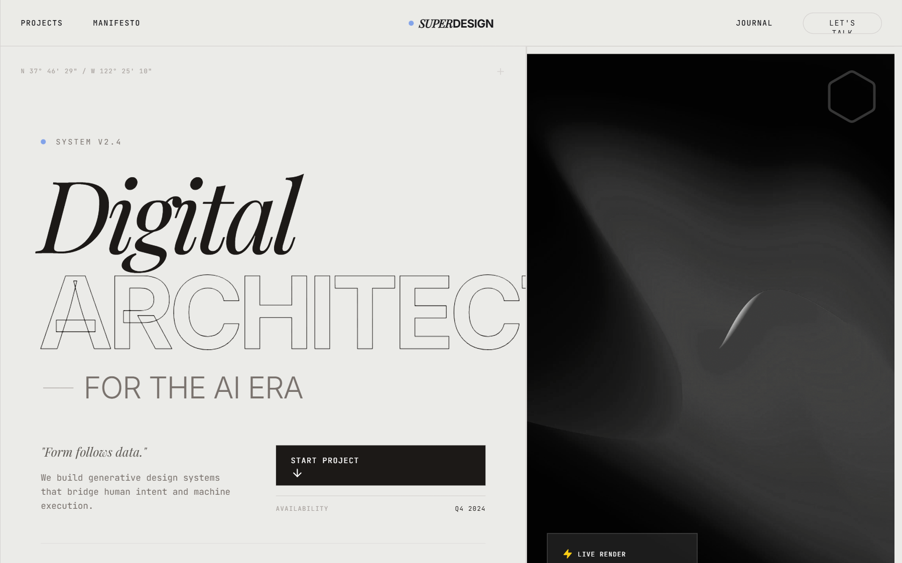

# Warm Industrial Gray Style

A sophisticated warm industrial aesthetic that blends brutalist grid structures with editorial typography. Featuring a primary palette of warm concrete gray and rich charcoal accented by electric blue, this style is ideal for AI startups, creative technology studios, fintech platforms, and architecture portfolios. It utilizes a high-contrast pairing of heavy grotesque sans-serifs and elegant serif italics, layered over a subtle film grain noise texture. Key features include scroll-triggered reveals, magnetic hover states, and structural grid-line overlays that emphasize a 'form follows function' technical philosophy.



## Prompt

```text
{
  "summary": "An industrial-chic design system centered on structural grids, warm gray tones, and high-impact editorial typography with technical 'readout' accents.",
  "style": {
    "description": "The style is defined by its 'Warm Industrial' palette (#EBEBE8 background) and technical precision. It uses 'Inter' for structural UI and 'Playfair Display' for editorial flair. Animation is characterized by smooth, high-inertia transitions (cubic-bezier(0.16, 1, 0.3, 1)) and clip-path reveals. A constant 4% opacity fractal noise overlay provides a tactile, analog feel to the digital interface.",
    "prompt": "Apply a 'Warm Industrial' aesthetic. Colors: Background #EBEBE8, Foreground #18181B, Accent Blue #0066FF, Borders #D4D4D8 (Zinc-300). Typography: Primary font 'Inter' (weights 400, 700, 900), Secondary font 'Playfair Display' (Italic, weight 400). Use 10px bold uppercase tracking (0.2em - 0.3em) for all labels and small UI elements. Hero headings should be 8xl to 10xl (128px-160px) with -0.05em tracking. Implement a global noise texture overlay using a fractal noise SVG at 0.04 opacity. Borders should be 1px solid Zinc-300. Use a 12-column structural grid marked by thin vertical lines across the entire page height. Interactive elements should use a custom cubic-bezier(0.16, 1, 0.3, 1) timing function for all transforms and clip-paths."
  },
  "layout_and_structure": {
    "description": "The layout is built on a rigid 12-column grid system, where sections are divided by explicit 1px horizontal and vertical lines. It follows a vertical stack of high-impact sections: Navigation -> Split Hero -> Marquee -> Interactive Project List -> Philosophical Parallax -> Technical Journal -> Massive Footer.",
    "prompts": [
      {
        "part": "Structural Grid",
        "prompt": "Create a fixed, full-page background layer consisting of 12 vertical grid lines (#18181B at 0.1 opacity) evenly spaced across a max-width of 1600px, centered. These lines should persist behind all content."
      },
      {
        "part": "Sticky Header",
        "prompt": "Height: 80px. Background: #EBEBE8 at 0.8 opacity with 10px backdrop-blur. 1px bottom border. Layout: Left-aligned nav links (tiny caps), absolute centered logo (Serif Italic 'SUPER' + Bold Sans 'DESIGN'), right-aligned CTA button (rounded-full, 1px border, 10px caps)."
      },
      {
        "part": "Hero Section",
        "prompt": "Split 12-column layout. Left (7 cols): Vertical stack with 'Available' status indicator, massive 3-line heading using stroke-text and serif italics, technical readout labels (10px mono), and a large rectangular 'Start' button with a hover-rotating arrow icon. Right (5 cols): Full-height grayscale image with a 20px internal frame and a glassmorphism UI card overlay containing 'system status' bars and mono identifiers."
      },
      {
        "part": "Marquee Ticker",
        "prompt": "Full-width ribbon, height 120px, bg #F4F4F5. Content: Rapidly scrolling text in 7xl font, alternating between heavy sans-serif stroke-text and italic serif text, separated by electric blue (#0066FF) star icons."
      },
      {
        "part": "Project List",
        "prompt": "Vertical stack of rows. Each row: 300px height, 1px border-bottom. On hover, the text shifts to italic and a large grayscale image is revealed from the right using a clip-path animation (inset 0 0 0 100% to 0 0 0 0). A floating 'View' circle with an arrow follows the cursor or appears on the right."
      },
      {
        "part": "Footer",
        "prompt": "Background #18181B, Text #EBEBE8. Large-scale contact link (4xl) with a bottom-border hover effect. Bottom contains a massive 'background marquee' at 0.1 opacity with text sized at 20vw. Final row includes a green 'System Operational' pulse indicator and copyright text in 10px tracking."
      }
    ]
  },
  "special_ui_components": [
    {
      "component": "Stroke Text Effect",
      "description": "High-impact display text that uses thin outlines instead of solid fills.",
      "prompt": "Implement text with `-webkit-text-stroke: 1px #18181B; color: transparent;`. This should be used for massive headings to create visual lightness despite large scale."
    },
    {
      "component": "Clip-Path Project Reveal",
      "description": "An image reveal interaction for list items.",
      "prompt": "Project images should be hidden by default using `clip-path: inset(0 0 0 100%)`. On parent row hover, transition to `clip-path: inset(0 0 0 0)` over 0.6s using cubic-bezier(0.16, 1, 0.3, 1). Add a grayscale(1) filter to the image with a subtle #0066FF/20 mix-blend-multiply overlay."
    },
    {
      "component": "Status Pulse",
      "description": "A technical 'live' indicator.",
      "prompt": "Create a 6px circle with background #22C55E (Green-500) and an outer pulse animation using `box-shadow` or `scale` to indicate real-time availability or system status."
    }
  ],
  "special_notes": "MUST: Maintain the #EBEBE8 background color throughout to preserve the 'warm industrial' feel. MUST: Use strict grid alignment—text and boxes should align perfectly with the 12-column background lines. DO NOT: Use rounded corners on anything except the main CTA buttons and small status badges; keep the layout sharp and rectangular. MUST: Keep the noise texture visible but subtle to avoid making the UI look 'dirty'."
}
```

**▶ Try it live → [https://superdesign.dev/library/warm-industrial-gray-style](https://superdesign.dev/library/warm-industrial-gray-style?utm_source=github&utm_medium=prompt-repo&utm_campaign=prompt-library)**

**Use it in your coding agent:** install the [Superdesign skill](https://github.com/superdesigndev/superdesign-skill), then:

```bash
superdesign get-prompts --slugs "warm-industrial-gray-style" --json
```

*594 copies · 1,534 tries · page, landing page, style*
