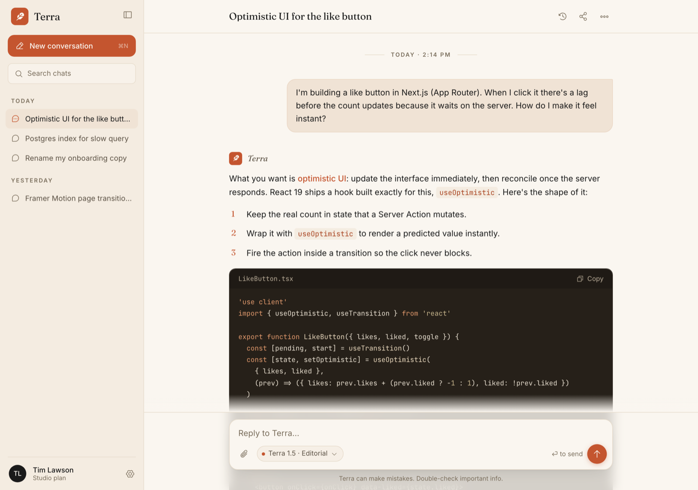

# Warm Terracotta AI Chat Interface

A warm, editorial AI chat interface (chatbot UI) that ditches the default dark-purple AI look for a cream-paper canvas, near-black ink, and a single terracotta accent. A collapsible left sidebar holds a terracotta "New conversation" button, a search field, and date-grouped chat history (Today / Yesterday) with an active-item pill and a user account row. The main column is a single scroll container: a sticky glass top bar with the conversation title in an editorial serif, a centered max-width message thread, and a sticky bottom composer. User turns are right-aligned soft-terracotta cards; assistant turns are left-aligned, frameless, with a serif-italic "Terra" name, editorial paragraphs, a serif-numeral ordered list, a dark warm code block with a filename + Copy header, a check-icon bullet list, and a hover action row. The composer is a rounded card with an auto-grow textarea, an attach button, a model chip ("Terra 1.5 · Editorial"), a "return to send" hint, and a round terracotta send button. Fraunces serif display + Inter body + JetBrains Mono code, warm cream + ink + terracotta only, frameless and responsive (the sidebar collapses to a hamburger on mobile). Reusable for any AI assistant, chatbot, LLM playground, or conversational product.

Source: https://dribbble.com/shots/26274219-AI-Assistant-Sidebar-Interaction



## Prompt

```text
{
  "summary": "A warm, editorial AI chat interface for an AI assistant / chatbot named 'Terra'. Two columns. LEFT: a 264px sidebar on a paper background (hidden below md, collapses to a hamburger toggle) with a terracotta feather brand mark + serif 'Terra' wordmark, a full-width terracotta 'New conversation' button (with a ⌘N hint), a search field, a scrollable chat history grouped by date (Today / Yesterday) where the active conversation is a soft-terracotta pill with a terracotta chat icon, and a bottom account row (ink initial avatar + name + plan + a gear). RIGHT: a single scroll container holding (1) a sticky top bar (glass) with the current conversation title in an editorial serif on the left and history / share / more icons on the right over a hairline, (2) a centered max-width (~760px) message thread that opens with a small 'TODAY · 2:14 PM' date separator, and (3) a sticky bottom composer (glass). A user turn is a right-aligned soft-terracotta card (rounded, with a small tail, max ~85% width). An assistant turn is left-aligned and frameless (no bubble): a small terracotta mark + serif-italic 'Terra' name above editorial paragraphs, a serif-terracotta-numeral ordered list, a dark warm code block (filename + Copy in its header, syntax-toned tokens), a check-icon bullet list, and a subtle hover action row (copy / thumbs / regenerate). A three-dot terracotta typing indicator covers the loading state. The composer is a rounded bordered card on cream with an auto-grow 'Reply to Terra…' textarea and a bottom row: an attach (paperclip) button, a model chip (terracotta dot · 'Terra 1.5 · Editorial' · caret), a '⏎ to send' hint, and a round terracotta send button; a centered 'Terra can make mistakes. Double-check important info.' disclaimer sits below.",
  "style": {
    "description": "Warm terracotta editorial, the deliberate opposite of the default dark-indigo/violet AI-chat cliché. A cream/paper canvas (#FAF6F0) with near-black ink (#1A1A1A) and ONE warm accent, terracotta (#C4552F, deep #A8421F on hover / inline code), used sparingly for the brand mark, active states, links, list numerals, and the send button. Three typefaces with clear jobs: Fraunces (serif display, some italic) for the brand wordmark, conversation title, assistant name, and list numerals; Inter for all body and UI; JetBrains Mono for code. Hairline dividers (#E7DCCC), soft paper surfaces (#F4ECE1) for the sidebar and inline code, and soft-terracotta (#F0E3D5, border #EAD6C4) for the user bubble and active history pill. The code block is a warm charcoal (#262019, header #1F1A15) with muted syntax tones (keyword #E39B6E, string #C9B78E, comment #8A7E6C, function #EAD9BE), not neon. Generous whitespace and an editorial, restrained rhythm rather than a dense dashboard. Light mode; frameless (a real full-viewport app screen, no browser or device chrome).",
    "prompt": "Design a warm, editorial AI chat interface. Canvas is cream #FAF6F0, text near-black #1A1A1A, with ONE accent, terracotta #C4552F (deep #A8421F for hover and inline code), used sparingly. Use Fraunces (serif, some italic) for the brand wordmark, conversation title, assistant name, and ordered-list numerals; Inter for all body and UI; JetBrains Mono for code. Sidebar and inline-code surfaces are paper #F4ECE1; the user bubble and active history item are soft-terracotta #F0E3D5 with a #EAD6C4 border; dividers are hairline #E7DCCC. The code block is warm charcoal #262019 with muted syntax tones, never neon. Keep it light-mode, frameless (the app screen fills the viewport, no browser/device frame), with generous whitespace and an editorial rhythm. Do NOT use any purple / indigo / violet, do NOT use a dark background for the whole app, and do NOT center everything."
  },
  "layout_and_structure": {
    "description": "A classic two-pane chat app: a fixed 264px left conversation sidebar and a flex main column. The main column is a single scroll container with a sticky top bar, a centered ~760px message thread, and a sticky bottom composer, so content scrolls between two pinned chrome bars. On mobile the sidebar collapses behind a hamburger and the thread + composer go full-width.",
    "prompts": [
      {
        "part": "Sidebar",
        "prompt": "A 264px left column on paper (#F4ECE1) with a right hairline; hidden below md and toggled by a hamburger. Top: a terracotta feather/brand mark + serif 'Terra' wordmark, then a full-width terracotta 'New conversation' button with a right-aligned ⌘N hint, then a search field ('Search chats'). Middle: a scrollable history grouped by tracked-caps date headers ('TODAY', 'YESTERDAY'); each row is a chat icon + truncated title; the active row is a soft-terracotta (#F0E3D5) pill with a terracotta icon. Bottom: an account row pinned to the base, an ink initial avatar ('TL') + name + plan label + a gear icon."
      },
      {
        "part": "Top bar",
        "prompt": "A sticky (top-0) glass bar over the thread: the current conversation title on the left in Fraunces serif (~18px), and history / share / more (three-dot) icon buttons on the right, all over a bottom hairline. A sidebar-toggle icon appears on the left below md."
      },
      {
        "part": "Message thread",
        "prompt": "A centered max-width ~760px column. Open with a small centered 'TODAY · 2:14 PM' date separator flanked by hairlines. A USER turn is a right-aligned soft-terracotta card (#F0E3D5, #EAD6C4 border, rounded-2xl with a rounded-tr-sm tail, max ~85% width). An ASSISTANT turn is left-aligned and frameless (no bubble): a small terracotta mark + serif-italic 'Terra' name, then editorial paragraphs (Inter ~15px / 1.68), a serif-terracotta-numeral ordered list, a code block, and a check-icon bullet list, with a subtle hover action row (copy / thumbs-up / thumbs-down / regenerate) beneath. Inline code is paper-chip #F4ECE1 with terracotta text."
      },
      {
        "part": "Code block",
        "prompt": "Inside an assistant turn, a warm-charcoal (#262019) rounded code block with a header strip (#1F1A15) showing the filename on the left ('LikeButton.tsx') and a 'Copy' affordance on the right, then syntax-toned JetBrains Mono code (~12.5px) with muted keyword/string/comment/function colors."
      },
      {
        "part": "Composer",
        "prompt": "A sticky (bottom-0) glass footer holding a rounded-2xl bordered card on cream with a soft shadow: an auto-grow 'Reply to Terra…' textarea, and a bottom row with an attach (paperclip) button on the left, a model chip pill (a terracotta dot · 'Terra 1.5 · Editorial' · caret), a '⏎ to send' hint, and a round terracotta send button (arrow-up) on the right. A centered muted 'Terra can make mistakes. Double-check important info.' line sits below the card."
      }
    ]
  },
  "special_ui_components": [
    {
      "component": "Frameless message thread (user card + frameless assistant)",
      "description": "Asymmetric turn treatment that reads instantly without heavy bubbles.",
      "prompt": "Right-align the user turn as a soft-terracotta card (#F0E3D5, #EAD6C4 border, rounded-2xl with a rounded-tr-sm tail, max ~85%). Left-align the assistant turn with NO bubble: a small terracotta mark + serif-italic name over editorial paragraphs, so the assistant reads as flat editorial text on the canvas."
    },
    {
      "component": "Model chip in the composer",
      "description": "An inline model selector that names the assistant + mode.",
      "prompt": "In the composer's bottom row, a pill button: a small terracotta dot, a label 'Terra 1.5 · Editorial', and a caret. It reads as the active model / mode and opens a picker on click."
    },
    {
      "component": "Warm code block with filename + Copy header",
      "description": "A syntax-highlighted code block that matches the warm palette instead of a neon IDE theme.",
      "prompt": "A warm-charcoal #262019 code block with a #1F1A15 header strip: filename left, a Copy button right, then JetBrains Mono code with muted keyword #E39B6E / string #C9B78E / comment #8A7E6C / function #EAD9BE tones."
    },
    {
      "component": "Date-grouped chat history with active pill",
      "description": "A scannable sidebar history grouped by day.",
      "prompt": "Group conversation rows under tracked-caps date headers ('TODAY', 'YESTERDAY'); each row is a chat icon + truncated title; the current conversation is a soft-terracotta (#F0E3D5) pill with a terracotta icon."
    },
    {
      "component": "Serif-numeral ordered list",
      "description": "Editorial ordered-list styling that reinforces the brand's serif voice.",
      "prompt": "Render ordered-list numerals in Fraunces serif, colored terracotta, set slightly apart from the Inter body text of each step, so numbered answers feel typeset rather than default-bulleted."
    },
    {
      "component": "Terracotta typing indicator",
      "description": "A loading state for the assistant turn.",
      "prompt": "While the assistant is generating, show three small terracotta dots bouncing in sequence in place of the assistant text."
    }
  ]
}
```

**▶ [Try it live →](https://superdesign.dev/library/warm-terracotta-ai-chat-interface?utm_source=github&utm_medium=prompt-repo&utm_campaign=prompt-library)**

**Use it in your coding agent:** install the [Superdesign skill](https://github.com/superdesigndev/superdesign-skill), then:

```bash
superdesign get-prompts --slugs "warm-terracotta-ai-chat-interface" --json
```

*0 copies · 0 tries · AI Chat · AI & Tech · ai-chat, chatbot-ui, chat-interface, chat-ui*
