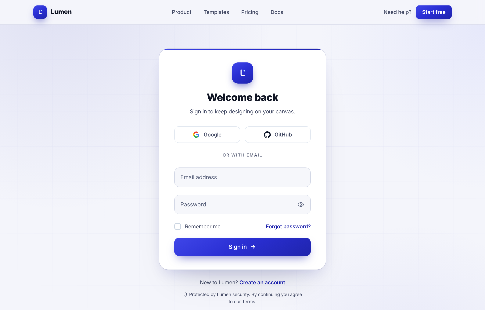

# Welcome back · Lumen — centered-card (true cobalt)

A clean centered-card sign-in page on a soft off-white canvas with a single true-cobalt accent: sticky nav, a white rounded-3xl auth card (Google + GitHub social, floating-label email/password with a show/hide toggle, remember-me + forgot, gradient Sign in CTA), and ambient cobalt glows.



## Prompt

```text
{"summary": "A full-bleed, single-column 'centered-card' sign-in page on a soft off-white canvas. A sticky translucent top nav (Lumen 'L' monogram logo, Product / Templates / Pricing / Docs links, a 'Need help?' link and a cobalt 'Start free' button) sits above a centered auth section. The center holds one max-w-[440px] white rounded-3xl card with a thin cobalt accent rail at the top: a cobalt logo tile, an extrabold 'Welcome back' heading and sub, a 2-up Google + GitHub social row, an 'or with email' divider, floating-label email + password fields (the password has a show/hide eye toggle), a 'Remember me' checkbox with a 'Forgot password?' link, and a full-width cobalt 'Sign in' CTA. Below the card sit a 'Create an account' link and a small security/Terms reassurance line. The background carries faint cobalt radial glows and a center-masked grid.", "style": {"description": "Clean, modern SaaS auth aesthetic built on a single true-cobalt accent (a pigment-rich, violet-leaning blue, NOT stock Tailwind blue) over a soft off-white canvas and slate-grey neutrals. Inter throughout with tight tracking, generous rounding (rounded-3xl card, rounded-xl controls), and a layered, mixed cobalt gradient (not flat) for the logo tiles, the top accent rail and the primary button. Depth comes from a multi-stop card shadow, a glowing button shadow with an inset top highlight, faint cobalt radial background glows, and a center-masked faint grid. Inputs are bordered, filled shells with floating labels that animate up and turn cobalt on focus, plus a 4px cobalt focus ring.", "prompt": "Use a clean modern SaaS authentication aesthetic anchored on a single TRUE-COBALT accent: a pigment-rich, violet-leaning blue (NOT #2563eb stock Tailwind blue), built as a cobalt ramp 50 #eef0ff, 100 #dde2ff, 200 #c2caff, 300 #9aa6ff, 400 #6b78f6, 500 #3f46e8, 600 #2a2fd4, 700 #1f24ad, 800 #1a2289, 900 #171f6b, 950 #0e1347. Page background is soft off-white #f4f5fb; body ink is #101524, secondary/label text 'slatey' #454c66, and muted placeholder text 'mute' #5e667f. Typeface is Inter (weights 400-800) loaded from Google Fonts, antialiased with text-rendering optimizeLegibility, font-feature-settings 'cv11','ss01' and letter-spacing -0.011em; headings are extrabold with tight tracking. The signature brand fill is a mixed (not flat) cobalt gradient: background-color #2a2fd4 with linear-gradient(150deg, #3f46e8 0%, #2a2fd4 46%, #1f24ad 100%), used on the logo tiles, the thin top accent rail and the primary button. Shadows: card = '0 1px 2px rgba(16,21,36,0.04), 0 18px 40px -16px rgba(31,36,173,0.20), 0 48px 90px -48px rgba(16,21,36,0.22)'; button = '0 12px 26px -10px rgba(31,36,173,0.62), inset 0 1px 0 rgba(255,255,255,0.16)'; logo = '0 10px 20px -6px rgba(31,36,173,0.62), inset 0 1px 0 rgba(255,255,255,0.18)'. The card is white, rounded-3xl, with a 1px ring of cobalt-900/10. Form inputs use an 'ifield' shell: #f6f7fb fill, 1.5px solid #d3d8e6 border, 14px radius, hover border #b9c0d6; on focus the border becomes #2a2fd4 with a white fill and a 4px rgba(42,47,212,0.12) ring. Floating labels lift (translateY(-1.55rem) scale .80) and turn #1f24ad semibold on focus or when filled. The background carries faint cobalt radial glows (rgba(31,36,173,0.10), rgba(107,120,246,0.10), rgba(42,47,212,0.07)) plus a 46px cobalt line grid (rgba(31,36,173,0.05)) masked by a radial fade at 50% 44%. Text selection is rgba(42,47,212,0.20). Buttons and links use smooth cubic-bezier transitions (CTA lifts -1px and brightens on hover; nav links get an animated 2px cobalt underline)."}, "layout_and_structure": {"description": "A sticky full-bleed top nav above a single full-bleed auth main that vertically centers one card. The main is min-h-[calc(100vh-4rem)], grain background with the masked grid, and an inner max-w-6xl wrapper. The card itself is max-w-[440px], centered, with a header block (top accent rail, logo, heading, sub) over a body block (social row, divider, form). A footer sign-up link and a security/Terms line sit below the card. The layout reflows cleanly to a narrow single column on mobile (nav links and the 'Need help?' link hide; the card and its paddings shrink).", "prompts": [{"part": "Sticky nav (full-bleed)", "prompt": "A sticky top header (z-50, h-16) spanning full width: off-white #f4f5fb at 85% opacity with backdrop-blur and a 1px cobalt-900/10 bottom border. Inner row is max-w-6xl, px-6, items spaced between. Left: a 36px cobalt-gradient rounded-[11px] logo tile (shadow-logo) holding a white 'L' monogram SVG mark (an L stroke with a small light-blue #bfeaff dot), next to a 17px extrabold 'Lumen' wordmark in ink. Center (hidden below md): ghost nav links Product / Templates / Pricing / Docs in 14px medium slatey, each with an animated 2px cobalt underline on hover. Right: a 'Need help?' text link (hidden on small screens) and a cobalt-gradient rounded-lg 'Start free' button (px-4 py-2, semibold white, shadow-btn, lifts on hover)."}, {"part": "Auth section (full-bleed, centered)", "prompt": "A relative full-bleed main, min-h-[calc(100vh-4rem)], flex items-center, overflow-hidden, with the 'grain' background (three faint cobalt radial glows) and a pointer-events-none absolute layer drawing a 46px cobalt line grid masked by a radial-gradient fade (62% 60% at 50% 44%). Inside, a relative mx-auto max-w-6xl wrapper, px-6, py-12 (sm:py-16), flex-col items-center, centering the card."}, {"part": "Card header", "prompt": "A white rounded-3xl card, max-w-[440px], overflow-hidden, ring-1 ring cobalt-900/10, shadow-card. Header: relative, px-8 (sm:px-10), pt-9 pb-7, text-center, with a thin full-width cobalt-gradient accent rail (h-1) pinned to the top edge. Centered inside: a 56px cobalt-gradient rounded-2xl logo tile (shadow-logo) with the white 'L' monogram, then a 27px extrabold tight-tracking 'Welcome back' heading in ink, and a 14.5px slatey sub 'Sign in to keep designing on your canvas.'"}, {"part": "Social auth row", "prompt": "Inside the card body (px-8 sm:px-10, pb-9): a two-column gap-3 grid of social buttons, each h-11, rounded-xl, 1px slate-200 border on white, 14px semibold slatey, with a 'social' hover (border #bcc3da, bg #f6f7fb, soft cobalt shadow). Left button 'Google' with the multicolor Google G SVG; right button 'GitHub' with the GitHub mark SVG in #0f172a."}, {"part": "Divider", "prompt": "An 'or with email' divider with my-6 spacing: two flex-1 slate-200 hairlines flanking centered 11px semibold uppercase slatey text with 0.14em letter-spacing."}, {"part": "Email + password form (floating labels)", "prompt": "A vertical form (space-y-5). Each field is a relative 'field' wrapper holding a borderless transparent input (h-[52px], px-4, 15px ink) layered over an absolute 'ifield' shell (#f6f7fb fill, 1.5px #d3d8e6 border, 14px radius) and a floating label that sits inside the field at rest and animates up (scale .80, color #1f24ad, semibold) on focus or when filled. Email field labelled 'Email address'. Password field labelled 'Password' with right padding for a trailing eye reveal toggle button (an eye SVG that swaps to an eye-off path when toggled, showing/hiding the password). On focus-within each field shell gets a #2a2fd4 border, white fill and a 4px rgba(42,47,212,0.12) ring."}, {"part": "Remember + forgot row", "prompt": "A row spaced between, pt-0.5: on the left a custom checkbox 'Remember me' (an 18px rounded-[6px] 2px slate-300 white tile that turns cobalt-600 with a white check SVG when checked, driven by JS) in 14px slatey; on the right a 14px semibold cobalt-700 'Forgot password?' link (hover cobalt-800)."}, {"part": "Primary CTA", "prompt": "A full-width primary submit button: cobalt-gradient fill, h-12, rounded-xl, 15px semibold white text 'Sign in' with a trailing arrow SVG, shadow-btn (cobalt glow + inset top highlight). On hover it lifts -1px and brightens; on active it settles back."}, {"part": "Footer (below card)", "prompt": "Below the card: a centered 14px slatey line 'New to Lumen?' with a semibold cobalt-700 'Create an account' link, then a smaller centered max-w-[20rem] 12px slatey reassurance line led by a shield SVG: 'Protected by Lumen security. By continuing you agree to our Terms.' with 'Terms' underlined (slate-300 decoration)."}]}, "special_ui_components": ["Sticky translucent full-bleed nav (off-white #f4f5fb/85 + backdrop-blur, cobalt-900/10 bottom border) with animated 2px cobalt underline nav links and a cobalt 'Start free' button.", "Cobalt-gradient logo tile (background #2a2fd4 + linear-gradient(150deg, #3f46e8, #2a2fd4, #1f24ad)) carrying a custom white 'L' monogram SVG with a light-blue #bfeaff dot, used in nav and card.", "Single centered white rounded-3xl auth card (max-w-[440px]) with a thin cobalt accent rail pinned to its top edge and a multi-stop card shadow.", "Floating-label 'field' input pattern: a borderless input over an 'ifield' shell (#f6f7fb fill, 1.5px #d3d8e6 border, 14px radius); on focus the label lifts and turns #1f24ad and the shell gets a #2a2fd4 border + white fill + 4px rgba(42,47,212,0.12) ring.", "Password field with a JS-driven eye / eye-off reveal toggle that switches input type and SVG.", "2-up social auth row (multicolor Google G + GitHub mark) with a 'social' hover (border #bcc3da, bg #f6f7fb, soft cobalt shadow).", "Custom 'Remember me' checkbox: an 18px rounded tile that turns cobalt-600 with a white check when toggled via JS.", "Cobalt-gradient 'Sign in' CTA with a glow shadow (0 12px 26px -10px rgba(31,36,173,0.62)) + inset top highlight and a trailing arrow, lifting on hover.", "Ambient background: three faint cobalt radial glows plus a 46px cobalt line grid masked by a center radial fade.", "Inline SVG icons throughout (Google, GitHub, eye/eye-off, check, arrow, shield) and Inter loaded from Google Fonts; Tailwind via CDN with a custom cobalt theme."], "special_notes": "Single TRUE-COBALT accent only (the cobalt ramp), a pigment-rich violet-leaning blue, NOT stock Tailwind blue (#2563eb). Keep the brand fill as the mixed gradient (background #2a2fd4 + linear-gradient(150deg, #3f46e8, #2a2fd4, #1f24ad)), not a flat color. This is a single centered-card layout (no split panel) on a full-bleed grain background with a sticky nav above. Preserve the exact field focus treatment (#2a2fd4 border + 4px rgba(42,47,212,0.12) ring + floating cobalt label) and the named shadows (card/btn/logo). Inter throughout, rounded-3xl card / rounded-xl controls / 14px-radius fields. The page reflows to a clean narrow single column on mobile (nav links + 'Need help?' hide). No em-dashes in copy."}
```

**▶ Try it live → [https://superdesign.dev/library/welcome-back-lumen-centered-card-true-cobalt](https://superdesign.dev/library/welcome-back-lumen-centered-card-true-cobalt?utm_source=github&utm_medium=prompt-repo&utm_campaign=prompt-library)**

**Use it in your coding agent:** install the [Superdesign skill](https://github.com/superdesigndev/superdesign-skill), then:

```bash
superdesign get-prompts --slugs "welcome-back-lumen-centered-card-true-cobalt" --json
```

*1 copies · 2,335 tries · Auth & Login · SaaS · login, sign-in, auth, authentication*
