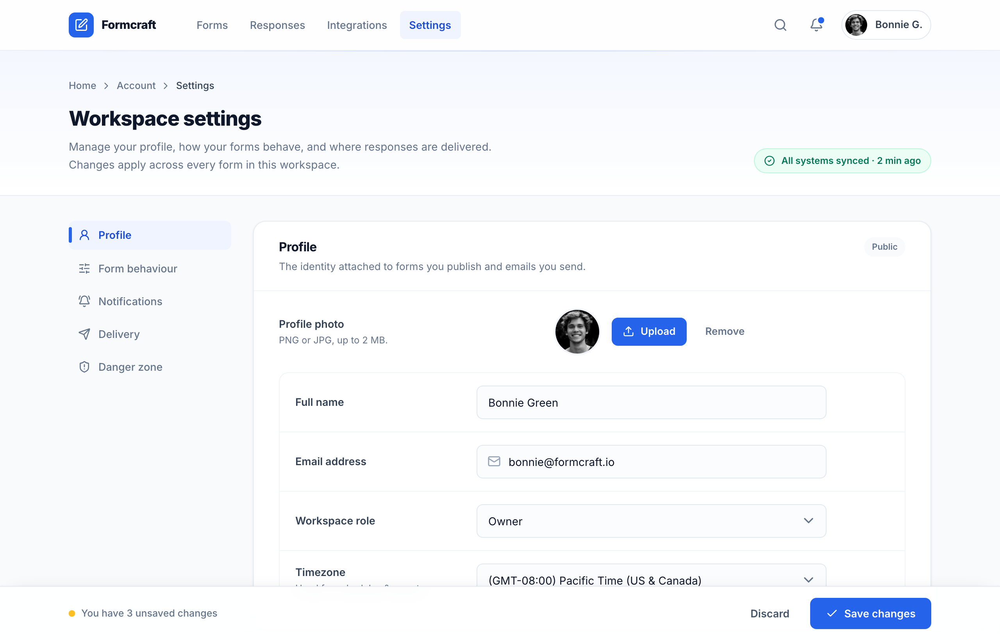

# Workspace Settings · Formcraft (two-column, cobalt)

Light SaaS workspace-settings page (form builder): sticky app-bar, tinted header, sticky left section nav + stacked white settings cards, toggles, segmented control and a sticky save bar, on a single cobalt accent over a slate neutral system.



## Prompt

```text
{"summary": "A clean, light SaaS workspace-settings page for a form builder (Formcraft). A sticky top app-bar sits above a tinted page header, then a two-column body: a sticky in-page section nav on the left and a stack of white settings cards on the right (Profile, Form behaviour, Notifications, Response delivery, Danger zone). A sticky bottom save bar tracks unsaved changes. Cobalt-blue is the single accent on a slate/ink neutral system; Inter throughout; generous spacing, soft 1px card borders, rounded-2xl cards, and labeled left / control-right form rows that reflow to stacked on mobile.", "style": {"description": "Light, calm, professional product-settings aesthetic. Single cobalt-blue accent on a cool slate (ink) neutral scale; near-white app background, pure-white cards. Soft hairline borders and very subtle card shadows instead of heavy elevation. Inter font, tight tracking on headings, bold section titles with muted sub-descriptions. Rounded corners (lg on controls, 2xl on cards, full on pills/toggles/avatars). Lucide line icons sized 14-18px. Restrained color: green only for the success status pill, rose only for the danger zone, amber only for the unsaved-changes dot.", "prompt": "Design a light, modern SaaS settings page using Inter (weights 400/500/600/700/800), antialiased. Use a single cobalt-blue accent scale (primary #2563eb, hover #1d4ed8, light tint #eff4ff, mid #dbe6fe / #93b4fd) on a cool slate 'ink' neutral scale (page bg #f8fafc, white cards #ffffff, borders #e2e8f0 and hairlines #f1f5f9/#e2e8f0 at ~70-80% opacity, body text #64748b, headings #0f172a, strong labels #334155, secondary labels #475569, muted #94a3b8). Reserve color strictly: emerald (#ecfdf5 bg / #047857 text / #a7f3d0 border) only for a success status pill, rose (#fecdd3 border / #e11d48 + #be123c text) only for a destructive 'Danger zone', amber (#fbbf24) only for the pulsing unsaved-changes dot. Cards are rounded-2xl with a 1px ink-200/80 border and a very soft two-layer shadow (0 1px 2px rgba(15,23,42,.04), 0 1px 3px rgba(15,23,42,.06)); inputs/buttons rounded-lg, pills/avatars/toggles fully rounded. Inputs sit on a faint ink-50/60 fill, turn white on focus with a cobalt border and a 4px rgba(37,99,235,.12) focus ring. Headings tracking-tight; section titles 16px bold #0f172a with a 13px #64748b sub-line. Keep elevation low and whitespace generous."}, "layout_and_structure": {"description": "Top-to-bottom: (1) sticky translucent app-bar; (2) tinted page header with breadcrumb, title and a status pill; (3) a max-w-6xl two-column grid — a 208px sticky section nav on the left and a vertical stack of settings cards on the right; (4) a sticky bottom save bar. Inside cards, settings are labeled-left / control-right rows separated by hairline dividers (row-divide), reflowing to stacked label-over-control on mobile.", "prompts": [{"part": "Sticky app-bar", "prompt": "A sticky top header (h-16, z-40) on a white/85 backdrop-blur with a bottom ink-200/70 hairline. Left: brand lockup = an 8x8 rounded-lg cobalt-600 tile holding a white lucide:square-pen icon, plus the extrabold 15px wordmark 'Formcraft'. Then a horizontal nav (Forms, Responses, Integrations, Settings) of 13.5px medium ink-500 links with rounded-md hover (ink-50 bg) and the active item filled cobalt-50 with cobalt-700 semibold text; hidden below md. Right cluster: a 9x9 search and bell icon-button (the bell has a cobalt-600 notification dot ringed in white), then a pill-shaped account chip (rounded-full, ink-200 border) with a 28px avatar and the name 'Bonnie G.'."}, {"part": "Page header band", "prompt": "A header section with a bottom hairline and a subtle vertical gradient from cobalt-50/50 to white, plus a 1px cobalt-200 gradient line pinned to the very top edge. Inside max-w-6xl: a breadcrumb (Home › Account › Settings, 12.5px medium, chevron-right separators, last crumb ink-700), then a flex row with the page title 'Workspace settings' (26px extrabold tracking-tight #0f172a) and a one-line muted description on the left, and on the right an emerald success pill (rounded-full, emerald-50 bg, emerald-200/70 border, lucide:check-circle-2) reading 'All systems synced · 2 min ago'. Reflows column on mobile."}, {"part": "Two-column body grid", "prompt": "A max-w-6xl main region, grid-cols-1 on mobile and lg:grid-cols-[208px_minmax(0,1fr)] with gap-7. Left aside is an in-page section nav, sticky at top-24 on desktop; right column is a flex-col gap-7 stack of cards."}, {"part": "Sticky section nav (left)", "prompt": "A vertical nav of 13.5px medium links: Profile, Form behaviour, Notifications, Delivery, Danger zone, each a rounded-lg row with a leading 16px lucide icon (user-round, sliders-horizontal, bell-ring, send, shield-alert). The active item ('Profile') is filled cobalt-50 with cobalt-700 semibold text and a 5px tall cobalt-600 indicator bar pinned to its left edge; inactive items are ink-500 and hover to white bg / ink-900 text. On mobile it becomes a horizontal scrolling row."}, {"part": "Profile card", "prompt": "A white rounded-2xl card. Header strip (border-b ink-100): title 'Profile' (16px bold) + 13px muted sub-line, with a small 'Public' status chip (rounded-full ink-50 bg, 11px semibold) on the right. Body: an avatar row (label 'Profile photo' + helper 'PNG or JPG, up to 2 MB' on a 208px left column; a 56px ringed avatar, a solid cobalt-600 'Upload' button with lucide:upload, and a ghost 'Remove' button). Below, a rounded-xl ink-100-bordered group of label-left/control-right rows separated by hairline dividers: Full name (text input), Email address (input with a leading lucide:mail icon), Workspace role (select), Timezone (select with a helper sub-line). Inputs are full-width within an sm:max-w-md control column on a faint ink-50/60 fill."}, {"part": "Form behaviour card", "prompt": "A white rounded-2xl card with header 'Form behaviour' + muted sub-line. Body is a hairline-divided list of rows, each a left title (13.5px semibold ink-800) + smaller muted description and a right control. Three rows use a pill toggle switch (custom checkbox, h-6 w-11, off=ink-300 track, on=cobalt-600 track with a white knob that slides right): 'Smart spam filtering' (on), 'Save partial responses' (on), 'Custom thank-you redirect' (off). A fourth row 'Submission limit' uses a segmented control: an ink-100 rounded-lg track holding pills None/100/500/Custom where the active pill is white with a soft shadow and ink-800 text."}, {"part": "Notifications card", "prompt": "A white rounded-2xl card, header 'Notifications' + muted sub-line with a cobalt-600 'Select all' text button on the right. Body: hairline-divided rows, each with a leading 36px rounded-lg cobalt-50 tile holding a cobalt-600 lucide icon (inbox, bar-chart-3, megaphone), a title + muted description, and a right pill toggle: 'New submissions' (on), 'Weekly summary' (on), 'Product news' (off). A final label-left row 'Deliver alerts to' with a select (Email only / Email + Slack / Slack only)."}, {"part": "Response delivery card", "prompt": "A white rounded-2xl card, header 'Response delivery' + muted sub-line. Body: a 2-up grid of selectable destination tiles (rounded-xl, gap-3.5 inner). The selected tile has a 2px cobalt-600 border on a cobalt-50/50 fill, a white icon tile (lucide:table-2), label 'Google Sheets' + 'Connected · 2 forms', and a trailing cobalt check-circle-2. The other tile has a 2px ink-200 border, an ink-50 icon tile (lucide:webhook), label 'Webhook' + 'Not connected', and a trailing cobalt 'Connect' link. Below, a rounded-xl ink-100 group: a 'Reply-to address' input row and an 'Attach file uploads' toggle row (on)."}, {"part": "Danger zone card", "prompt": "A white rounded-2xl card with a rose-200 border (not the neutral border). A single flex row: title 'Delete workspace' (15px bold rose-700) + a muted description of the irreversible consequence, and a right outlined destructive button (white bg, rose-200 border, rose-600 text, lucide:trash-2, hover rose-50) reading 'Delete'."}, {"part": "Sticky save bar", "prompt": "A sticky bottom bar (z-40) on white/90 backdrop-blur with a top ink-200/80 hairline and an upward soft shadow. Inside max-w-6xl: on the left an unsaved-changes indicator = a pulsing amber dot (a static amber dot with an animate-ping amber halo) plus 12.5px medium ink-500 text 'You have 3 unsaved changes'. On the right a ghost 'Discard' button and a solid cobalt-600 'Save changes' button with a leading lucide:check icon."}]}, "special_ui_components": ["Custom pill toggle switch: appearance-none checkbox, h-6 w-11 fully-rounded track (off #cbd5e1 / ink-300, on #2563eb / cobalt-600) with a 2px-inset white knob (subtle shadow) that translateX(100%) when checked; focus-visible shows a 2px #93b4fd ring offset 2px.", "Segmented control: ink-100 rounded-lg p-1 track of equal pills; active pill is white with a 0 1px 2px rgba(15,23,42,.10) shadow and ink-800 text; inactive pills are ink-500 hovering to ink-700.", "Labeled-left / control-right form row that reflows to stacked label-over-control under sm; controls capped to sm:max-w-md, labels fixed to a 208px (sm:w-52) column.", "Custom select: appearance-none with an inline SVG chevron-down (stroke #64748b) positioned right, extra right padding; shares the .fld focus treatment (cobalt border + 4px cobalt/12% ring, white fill).", "Input affordances: leading icon inputs (e.g. lucide:mail) with the field padded-left; faint ink-50/60 resting fill that turns white on focus.", "Selectable destination card: 2px-border radio-style tile, selected = cobalt border + cobalt-50/50 fill + trailing check-circle-2; unselected = ink border + 'Connect' link.", "Pulsing status dot: a static colored dot with an absolutely-positioned animate-ping halo of the same color at reduced opacity.", "Status pills: rounded-full chips reused in two tones — emerald success ('All systems synced') in the header and a neutral ink 'Public' chip on the Profile card."], "special_notes": "Color discipline is the heart of this design: cobalt is the only brand accent and everything else lives on the slate/ink neutral scale; emerald, rose, and amber appear exactly once each (success status, danger zone, unsaved dot) so they read as meaningful state, not decoration. Hierarchy comes from weight and spacing rather than dividers or boxes: bold tracking-tight section titles over 12.5-13px muted descriptions, hairline (#f1f5f9) row dividers, and rounded-xl ink-100 sub-groups that quietly cluster related fields. Elevation is deliberately low (1-3px soft shadows) so the page feels flat and trustworthy. Layout is fully responsive: the two-column body collapses to one column, the left section nav turns into a horizontal scroller, and every labeled form row reflows from label-left to label-over-control under the sm breakpoint. Both the top app-bar and the bottom save bar are sticky with backdrop-blur so navigation and the save action stay reachable while scrolling a long settings page. Icons are Lucide line icons; the type is Inter throughout."}
```

**▶ [Try it live →](https://p.superdesign.dev/draft/e7ec15e8-44c6-499d-a711-25578a88b421)**

**Use it in your coding agent:** install the [Superdesign skill](https://github.com/superdesigndev/superdesign-skill), then:

```bash
superdesign get-prompts --slugs "workspace-settings-formcraft-two-column-cobalt" --json
```

*0 copies · 1,929 tries · Dashboards · SaaS · form, settings, saas, dashboard*
